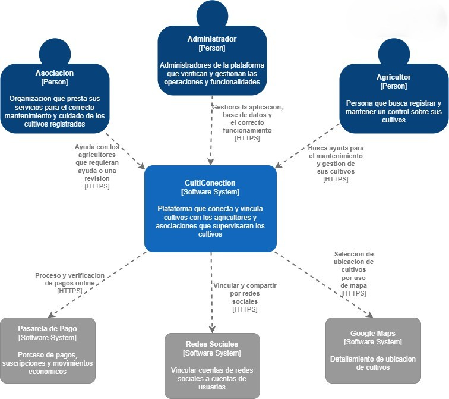
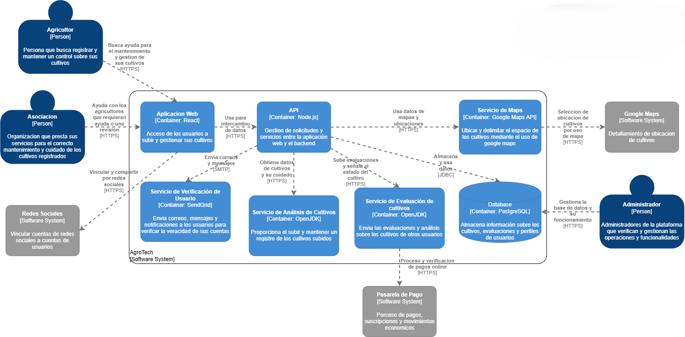
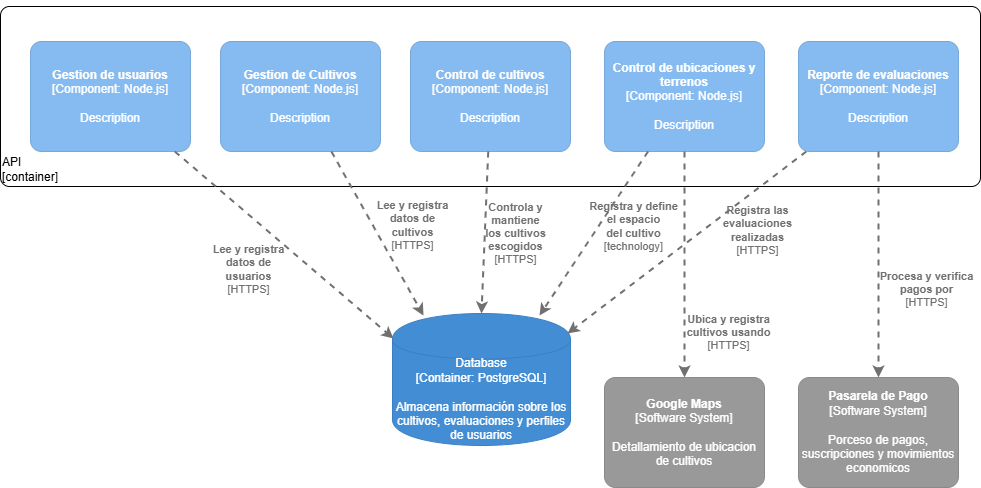
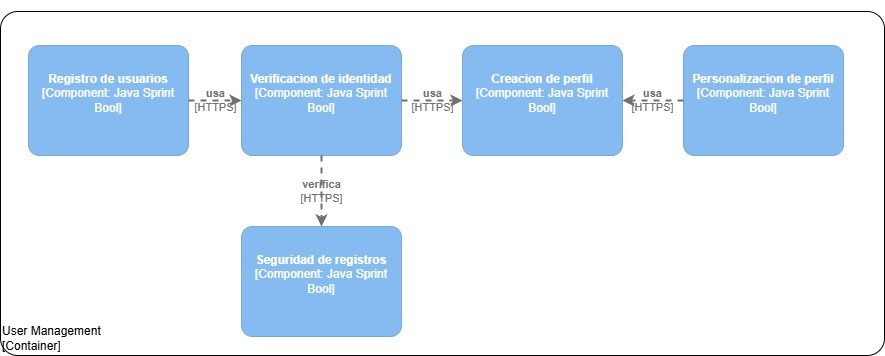
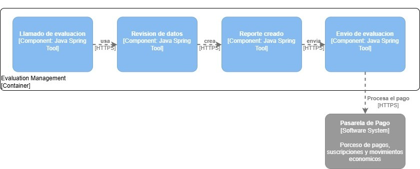
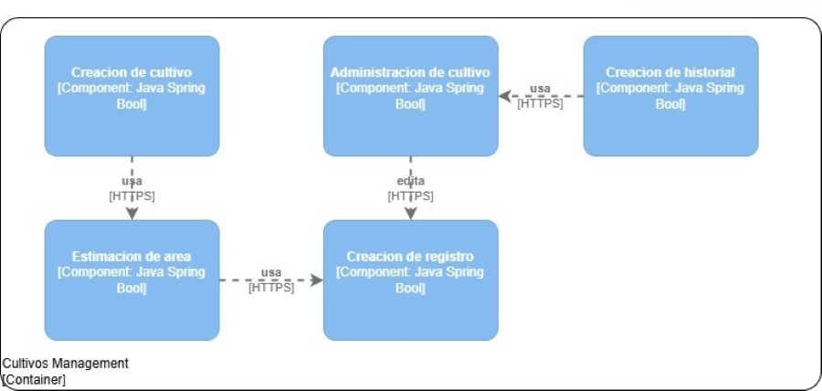
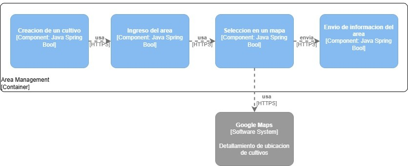
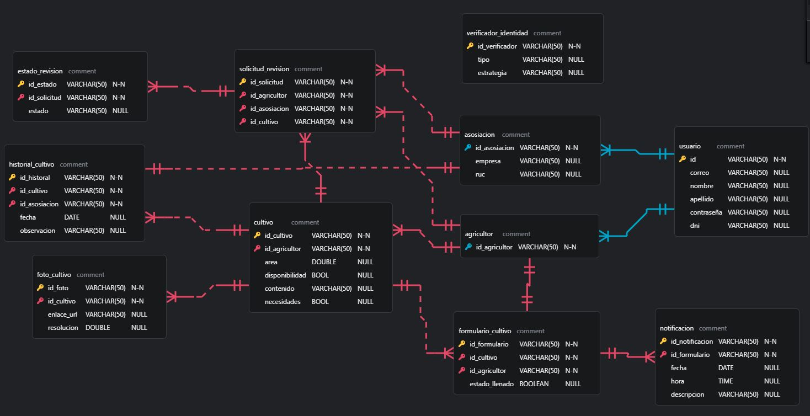

<div align="center">
   <div>

# <center>Informe del Trabajo Final</center>

   <br>
   <center>Universidad Peruana de Ciencias Aplicadas</center>

   <br>
   <center></center>

   <br>
   <center><b>Ingeniería de software</b></center>
   <br>

   <center><b>1ASI0729 Aplicaciones Web</b></center>

   <br>
   <center><b>NRC:</b> 7452</center>
   <br>

   <center><b>Profesor:</b> Hugo Allan Mori Paiva </center>

   <br>
   <center><b>Nombre del StartUp:</b>CultiConection</center>
   <br>

   <center><b>Nombre del Producto:</b> Frutech</center>

   </div>

   <br>

   <div align="center">

   <table style="margin-left: auto; margin-right: auto;">
   <tr>
   <th>Nombre</th>
   <th>Código</th>
   </tr>
   <tr>
   <td>Landa Ortiz, Sergio Javier</td>
   <td>U202311086</td>
   </tr>
   <tr>
   <td>Solis Campos, Estefano Sebastian</td>
   <td>U202314354</td>
   </tr>
   <tr>
   <td>ALUMNO 3</td>
   <td>A</td>
   </tr>
   <tr>
   <td>Via Luna, Bruce </td>
   <td>U202313403</td>
   </tr>
   <tr>
   <td>ALUMNO 5</td>
   <td>A</td>
   </tr>

   </table>
   </div>

   <br>
   <center><b>Ciclo 2025-20</b></center>
   <br>

</div>

# Registro de Versiones del Informe

<div>

| Version | Fecha | Autor | Descripción de modificación |
| ------- | ----- | ----- | --------------------------- |

</div>

# Project Report Collaboration Insights


**TB1**

Para el desarrollo del informe perteneciente a la entrega del TB1, se dividió la implementación de secciones de la siguiente forma para cada integrante del equipo:

| Integrantes         | Tareas Asignadas |
| ------------------- | ---------------- |
|          |                  |
|        |                  |
|   |                  |
|             |                  |
|           |                  |

# Contenido

1. [Capítulo I: Introducción](#capítulo-i-introducción)<br>
   1.1. [Startup Profile](#11-startup-profile)<br>
   1.1.1. [Descripción de la Startup](#111-descripción-de-la-startup)<br>
   1.1.2. [Perfiles de integrantes del equipo](#112-perfiles-de-integrantes-del-equipo)<br>
   1.2. [Solution Profile](#12-solution-profile)<br>
   1.2.1 [Antecedentes y problemática](#121-antecedentes-y-problemática)<br>
   1.2.2 [Lean UX Process](#122-lean-ux-process)<br>
   1.2.2.1. [Lean UX Problem Statements](#1221-lean-ux-problem-statements)<br>
   1.2.2.2. [Lean UX Assumptions](#1222-lean-ux-assumptions)<br>
   1.2.2.3. [Lean UX Hypothesis Statements](#1223-lean-ux-hypothesis-statements)<br>
   1.2.2.4. [Lean UX Canvas](#1224-lean-ux-canvas)<br>
   1.3. [Segmentos objetivo](#13-segmentos-objetivo)<br>
2. [Capítulo II: Requirements Elicitation & Analysis](#capítulo-ii-requirements-elicitation--analysis)<br>
   2.1. [Competidores](#21-competidores)<br>
   2.1.1. [Análisis competitivo](#211-análisis-competitivo)<br>
   2.1.2. [Estrategias y tácticas frente a competidores](#212-estrategias-y-tácticas-frente-a-competidores)<br>
   2.2. [Entrevistas](#22-entrevistas)<br>
   2.2.1. [Diseño de entrevistas](#221-diseño-de-entrevistas)<br>
   2.2.2. [Registro de entrevistas](#222-registro-de-entrevistas)<br>
   2.2.3. [Análisis de entrevistas](#223-análisis-de-entrevistas)<br>
   2.3. [Needfinding](#23-needfinding)<br>
   2.3.1. [User Personas](#231-user-personas)<br>
   2.3.2. [User Task Matrix](#232-user-task-matrix)<br>
   2.3.3. [User Journey Mapping](#232-user-task-matrix)<br>
   2.3.4. [Empathy Mapping](#234-empathy-mapping)<br>
   2.4. [Big Picture Event Storming](#24-big-picture-event-storming)<br>
   2.5. [Ubiquitous Language](#25-ubiquitous-language)<br>
3. [Capítulo III: Requirements Specification](#capítulo-iii-requirements-specification)<br>
   3.1. [To-Be Scenario Mapping](#31-to-be-scenario-mapping)<br>
   3.2. [User Stories](#32-user-stories)<br>
   3.3. [Impact Mapping](#33-impact-mapping)<br>
   3.4. [Product Backlog](#34-product-backlog)<br>
4. [Capítulo IV: Product Design](#capítulo-iv-product-design)<br>
   4.1. [Style Guidelines](#41-style-guidelines)<br>
   4.1.1. [General Style Guidelines](#411-general-style-guidelines)<br>
   4.1.2. [Web Style Guidelines](#412-web-style-guidelines)<br>
   4.2. [Information Architecture](#42-information-architecture)<br>
   4.2.1. [Organization Systems](#421-organization-systems)<br>
   4.2.2. [Labeling Systems](#422-labeling-systems)<br>
   4.2.3. [SEO Tags and Meta Tags](#423-seo-tags-and-meta-tags)<br>
   4.2.4. [Searching Systems](#424-searching-systems)<br>
   4.2.5. [Navigation Systems](#425-navigation-systems)<br>
   4.3. [Landing Page UI Design](#43-landing-page-ui-design)<br>
   4.3.1. [Landing Page Wireframe](#431-landing-page-wireframe)<br>
   4.3.2. [Landing Page Mock-up](#432-landing-page-mock-up)<br>
   4.4. [Web Applications UX/UI Design](#44-web-applications-uxui-design)<br>
   4.4.1. [Web Applications Wireframes](#441-web-applications-wireframes)<br>
   4.4.2. [Web Applications Wireflow Diagrams](#442-web-applications-wireflow-diagrams)<br>
   4.4.2. [Web Applications Mock-ups](#442-web-applications-mock-ups)<br>
   4.4.3. [Web Applications User Flow Diagrams](#443-web-applications-user-flow-diagrams)<br>
   4.5. [Web Applications Prototyping](#45-web-applications-prototyping)<br>
   4.6. [Domain-Driven Software Architecture](#46-domain-driven-software-architecture)<br>
   4.6.1. [Design-Level Event Storming](#461-design-level-event-storming)<br>
   4.6.2. [Software Architecture Context Diagram](#462-software-architecture-context-diagram)<br>
   4.6.3. [Software Architecture Container Diagrams](#463-software-architecture-container-diagrams)<br>
   4.6.4. [Software Architecture Components Diagrams](#464-software-architecture-components-diagrams)<br>
   4.7. [Software Object-Oriented Design](#47-software-object-oriented-design)<br>
   4.7.1. [Class Diagrams](#471-class-diagrams)<br>
   4.7.2. [Class Dictionary](#472-class-dictionary)<br>
   4.8. [Database Design](#48-database-design)<br>
   4.8.1. [Database Diagram](#481-database-diagram)<br>
5. [Capítulo V: Product Implementation, Validation & Deployment](#capítulo-v-product-implementation-validation--deployment)<br>
   5.1. [Software Configuration Management](#51-software-configuration-management)<br>
   5.1.1. [Software Development Environment Configuration](#511-software-development-environment-configuration)<br>
   5.1.2. [Source Code Management](#512-source-code-management)<br>
   5.1.3. [Source Code Style Guide & Conventions](#513-source-code-style-guide--conventions)<br>
   5.1.4. [Software Deployment Configuration](#514-software-deployment-configuration)<br>
   5.2. [Landing Page, Services & Applications Implementation](#52-landing-page-services--applications-implementation)<br>
   5.2.1. [Sprint 1](#521-sprint-1)<br>
   5.2.1.1. [Sprint Planning 1](#5211-sprint-planning-1)<br>
   5.2.1.2. [Aspect Leaders and Collaborators](#5212-aspect-leaders-and-collaborators)<br>
   5.2.1.3. [Sprint Backlog 1](#5213-sprint-backlog-1)<br>
   5.2.1.4. [Development Evidence for Sprint Review](#5214-development-evidence-for-sprint-review)<br>
   5.2.1.5. [Execution Evidence for Sprint Review](#5215-execution-evidence-for-sprint-review)<br>
   5.2.1.6. [Services Documentation Evidence for Sprint Review](#5216-services-documentation-evidence-for-sprint-review)<br>
   5.2.1.7. [Software Deployment Evidence for Sprint Review](#5217-software-deployment-evidence-for-sprint-review)<br>
   5.2.1.8. [Team Collaboration Insights during Sprint](#5218-team-collaboration-insights-during-sprint)<br>
6. [Conclusiones](#conclusiones)<br>
   6.1 [Conclusiones y recomendaciones](#61-conclusiones-y-recomendaciones)<br>
7. [Bibliografía](#bibliografía)<br>
8. [Anexos](#anexos)<br>


# Capítulo IV: Product Design

## 4.1. Style Guidelines.

### 4.1.1. General Style Guidelines.

<h3>Branding</h3>

El logo de CultivApp refleja de manera elegante y minimalista la propuesta de valor de la marca en el sector agrícola. Su diseño, basado en una tipografía negra sobre fondo blanco, transmite sobriedad, confianza y profesionalismo, garantizando una excelente legibilidad en cualquier soporte, ya sea digital o físico.

En la parte superior, la figura estilizada de una planta representa la innovación y sostenibilidad, valores fundamentales de la experiencia que CultivApp busca ofrecer.

La composición mantiene un equilibrio armonioso entre modernidad y simplicidad, ideal para una plataforma tecnológica orientada a conectar personas con soluciones agrícolas accesibles, rápidas y ecológicas. La elección de una paleta monocromática refuerza la seriedad de la propuesta.

Con este logo, CultivApp se posiciona como una marca confiable, eficiente y comprometida con la transformación del sector agrícola, adaptándose a las necesidades de estudiantes, profesionales y empresas.

***Logo original***


<h3>Typography</h3>

La tipografía de nuestra app  refleja dinamismo, innovación y accesibilidad, alineándose con los valores de sostenibilidad y movilidad inteligente que representamos.

La fuente principal será "Montserrat", que por su diseño minimalista y esbelto permite que los usuarios puedan consultar información rápida mientras se desplazan.

Para lograr una jerarquía visual clara, los títulos y subtítulos tendrán un tamaño más prominente que el cuerpo del texto. Los títulos (H1, H2) enfatizan energía y movimiento, mientras que los textos secundarios mantienen un tono amigable y sencillo.

El cuerpo del texto usará un tamaño base adaptable, que garantice lectura sin esfuerzo tanto en pantallas pequeñas (smartphones) como en tablets. Se mantendrá un interlineado aireado y márgenes equilibrados para no saturar la interfaz.

El lenguaje será directo y motivador, usando un tono casual que inspire confianza y fomente la adopción de alternativas de transporte sostenible.

<h3>Colors</h3>

La paleta de colores de nuestra app  fue diseñada para reforzar el impacto visual del logo y proyectar dinamismo, sostenibilidad y confianza. El blanco se mantiene como base, representando simplicidad, limpieza y espacios abiertos, facilitando que los elementos clave destaquen sin saturar la vista.

El negro profundo del logo se utiliza en tipografía principal y elementos estructurales, comunicando seriedad y profesionalismo. Para transmitir energía y movimiento, incorporamos un verde lima brillante (#18FA3A) como color de acento, ideal para botones de acción (reservar, iniciar viaje) y mensajes de confirmación. Este tono evoca sostenibilidad y vitalidad, conectando con la misión de promover transporte limpio.

Un gris color (#EEEEEE) complementa la paleta y refuerza la percepción tecnológica de la plataforma, utilizado en íconos interactivos y estados activos. Además, tonos gris claro (#EAEAEA) y gris oscuro (#4F4F4F) equilibran la interfaz, mejorando la legibilidad y jerarquizando la información.

---

#### Paleta de colores - CultivApp

| **Color**        | **Uso**                                                                 | **Código Hex** |
|------------------|-------------------------------------------------------------------------|---------------|
| Blanco           | Fondo principal de la interfaz, espacios vacíos, sensación de limpieza y orden. | `#FFFFFF`     |
| Negro profundo   | Logo, textos principales, íconos y elementos estructurales.              | `#000000`     |
| Verde energía    | Botones de acción (reservar, iniciar viaje), confirmaciones y mensajes de éxito. | `#18FA3A`     |
| Gris claro       | Fondos secundarios, separadores, tarjetas de información.                | `#D9D9D9`     |
| Gris medio       | Texto secundario, íconos inactivos, descripciones y estados deshabilitados. | `#A6A6A6`     |


### 4.1.2. Web Style Guidelines.

## 4.2. Information Architecture.

### 4.2.1. Organization Systems.

Para la **landing page** de CultivApp, se ha optado por una estructura jerárquica para ambos segmentos de usuarios, ya que se cuenta con una barra de navegación superior que dirige a diferentes secciones, cada una encapsulando información relevante y relacionada.

Para el proceso de inicio de sesión o creación de cuenta, se utiliza una organización lineal, permitiendo que el usuario avance paso a paso a medida que completa los datos requeridos hasta finalizar el registro o acceso.

Dentro de la aplicación principal, se mantiene una organización jerárquica para separar y encapsular las distintas funcionalidades, independientemente del tipo de usuario. Esto asegura que, aunque los usuarios tengan diferentes necesidades y accesos, la estructura de la aplicación sea coherente y fácil de navegar.

#### Agricultor:
Para los **agricultores**, la funcionalidad principal es la gestión de cultivos y parcelas. Por ello, la organización jerárquica permite agrupar subfuncionalidades como ***el registro de nuevos cultivos, monitoreo de parcelas, historial de actividades y notificaciones***, todas relacionadas con la gestión agrícola.

#### Asociación o Empresa:
En el caso de **asociaciones o empresas agrícolas**, también se emplea una organización jerárquica para gestionar múltiples parcelas, usuarios y reportes. Además, se pueden acceder a funcionalidades específicas como ***la supervisión de cultivos, generación de informes y administración de usuarios asociados***.

Finalmente, para funcionalidades comunes como la edición de perfil, gestión de notificaciones o cierre de sesión, se mantiene la organización jerárquica, asegurando que todas estas opciones estén claramente segmentadas y accesibles para todos los usuarios.

### 4.2.2. Labeling Systems.

### 4.2.3. SEO Tags and Meta Tags

**Titulo:**
```html
<title>CultivApp</title>
```

**Codificación de carácteres:**
```html
<meta charset="utf-8">
```

**Descripción:**
```html
<meta name="description" content="CultivApp is a web application focused on Advanced IoT technology for smart crop monitoring.">
```

**Autor y Derechos de Autor:**
```html
<meta name="author" content="CultiConection">
<meta name="copyright" content="Copyright CultiConection team" />
```


### 4.2.4. Searching Systems.

El sistema integral de CultivApp contará con un **módulo de búsqueda y localización en tiempo real**, que permitirá a los usuarios identificar la ubicación y el estado de sus cultivos, parcelas y recursos agrícolas de manera eficiente. Este sistema se basa en las siguientes características:

**Geolocalización en tiempo real:**  
Cada parcela o cultivo podrá estar asociada a dispositivos GPS o sensores IoT, que enviarán información actualizada sobre su ubicación y condiciones directamente a la plataforma central.

**Mapa interactivo en la aplicación web y móvil:**  
La aplicación mostrará un mapa donde los usuarios podrán visualizar la ubicación exacta de sus cultivos, áreas de riego, sensores y otros recursos, diferenciados por tipo y estado.

**Filtros de búsqueda avanzada:**  
Los usuarios podrán buscar y filtrar información según:

- Tipo de cultivo o recurso.
- Estado de crecimiento o condición del cultivo.
- Ubicación geográfica dentro del terreno.
- Necesidades específicas (riego, fertilización, cosecha, etc.).

**Acciones inmediatas:**  
Una vez identificado un cultivo o recurso, el usuario podrá acceder rápidamente a su ficha técnica, registrar actividades (riego, fertilización, monitoreo), o programar alertas y recordatorios.

**Optimización para asociaciones y empresas agrícolas:**  
En el caso de usuarios corporativos, el sistema de búsqueda permitirá visualizar y gestionar múltiples parcelas o cultivos distribuidos en diferentes ubicaciones, facilitando la supervisión y toma de decisiones a gran escala.

Con este enfoque, el sistema de búsqueda de CultivApp se convierte en un **componente esencial para la experiencia del usuario**, asegurando eficiencia en la gestión agrícola y optimizando el uso de los recursos disponibles.

### 4.2.5. Navigation Systems.

El sistema integral de CultivApp contará con un **módulo de navegación inteligente** que facilitará a los usuarios la gestión y supervisión de sus cultivos, parcelas y recursos agrícolas, optimizando el monitoreo y la toma de decisiones en campo. Este módulo se estructura en las siguientes funciones:

**Guía hacia la parcela o recurso seleccionado:**  
Una vez seleccionado un cultivo, parcela o recurso en la aplicación, el sistema mostrará la ruta más eficiente desde la ubicación actual del usuario hasta el destino dentro del terreno agrícola, utilizando mapas interactivos en tiempo real.

**Navegación durante el recorrido:**  
El sistema proporcionará indicaciones para que el usuario se desplace de manera eficiente dentro de la finca o campo, evitando zonas restringidas o de difícil acceso. Para ello, se integrarán APIs de mapas inteligentes como ***Google Maps o Mapbox***, adaptadas a entornos agrícolas.

**Seguridad y recomendaciones en la navegación:**  
- Alertas sobre zonas de riesgo, áreas en mantenimiento o condiciones adversas (por ejemplo, inundaciones o suelos inestables).
- Recomendaciones de rutas seguras y óptimas para maquinaria agrícola, personal o vehículos de campo.
- Opciones de personalización (ruta más corta, más segura o que pase por puntos de interés como sensores o estaciones de riego).

**Gestión de puntos clave y recursos:**  
La navegación incluirá la localización de puntos estratégicos como almacenes, estaciones de riego, sensores IoT, áreas de carga y descarga, o zonas de acopio, facilitando la logística y el control de recursos.

**Soporte para asociaciones y empresas agrícolas:**  
En el caso de usuarios corporativos, el sistema de navegación permitirá sugerir rutas entre diferentes parcelas, campos o instalaciones, optimizando la supervisión y el desplazamiento del personal.

En conjunto, este módulo no solo ofrece orientación geográfica en tiempo real, sino que también optimiza la experiencia de gestión agrícola, mejorando la seguridad y eficiencia de las operaciones en campo y reduciendo la incertidumbre en la toma de decisiones.

## 4.3. Landing Page UI Design.


### 4.3.1. Landing Page Wireframe.

- Navbar  

- Hero  

- About Us Section.  

- Features Section.  

- Pricing Section.

- Sponsors Section.

- Footer Section.  

  

### 4.3.2. Landing Page Mock-up.

- Navbar  

- Hero  

- About Us Section.  

- Features Section.  

- Pricing Section.

- Sponsors Section.

- Footer Section.  


## 4.4. Web Applications UX/UI Design.

### 4.4.1. Web Applications Wireframes.

Diseño para visualizar la edición de perfil y cuentas de usuario.


Servicios de la aplicación.


### 4.4.2. Web Applications Wireflow Diagrams.

### 4.4.2. Web Applications Mock-ups.


### 4.4.3. Web Applications User Flow Diagrams.

## 4.5. Web Applications Prototyping.

Web Applications Prototyping es una metodología esencial en el desarrollo de aplicaciones web, que implica la creación de bocetos visuales o modelos preliminares de una aplicación antes de su implementación completa. 

## 4.6. Domain-Driven Software Architecture.

Esta parte se expone la arquitectura de software del proyecto CultiConection. La propuesta fue elaborada con un enfoque orientado al dominio, de manera que los elementos más relevantes de la plataforma estén correctamente representados y respondan a los requerimientos de los usuarios. Seguidamente, se incluyen diagramas esenciales que ilustran la interacción entre los distintos componentes del sistema y los actores externos.

### 4.6.1. Design-Level Event Storming.

En esta sección, presentamos el Design Level Event Storming desarrollado para nuestro proyecto CultiConection. Esta actividad nos permitió profundizar en los detalles del dominio, definiendo de manera clara los eventos, comandos, agregados y políticas que guían el comportamiento del sistema. El objetivo fue transformar la visión general en un diseño más estructurado, asegurando que los límites contextuales y las interacciones entre componentes quedaran bien definidos

- Bounded Context User Management 


- Bounded Context Cultivos Management


- Bounded Context Area Management


- Bounded Context Evaluation Management


### 4.6.2. Software Architecture Context Diagram.

El diagrama de contexto de CultiConection ofrece una visión global de las interacciones principales entre el sistema central y los actores externos que lo rodean. La plataforma está orientada a simplificar la gestión y supervisión de cultivos por parte de los usuarios. En este nivel, se identifican actores clave como el Agricultor, encargado de registrar y administrar sus cultivos, y la Asociación, que envía las evaluaciones correspondientes. Asimismo, se muestran las integraciones externas más relevantes: la Pasarela de Pago para procesar transacciones con las asociaciones, el Servicio de Mapas para visualizar la ubicación de los cultivos y las Redes Sociales para compartir información de manera pública. Esta representación de alto nivel permite entender de manera clara cómo CultiConection se relaciona y coopera con su ecosistema digital y humano.



### 4.6.3. Software Architecture Container Diagrams.

El diagrama de contenedores detalla la organización interna de CultiConection, mostrando cómo los diferentes componentes de software trabajan en conjunto para brindar la funcionalidad de la plataforma. La Aplicación Web, implementada en React, sirve como punto de interacción donde los usuarios pueden registrar y gestionar sus cultivos. Esta interfaz se conecta con una API en Node.js, que cumple el rol de enlace entre la capa de presentación y los servicios del backend. La información esencial de usuarios, cultivos, registros, evaluaciones y pagos se almacena en una Base de Datos PostgreSQL. Asimismo, se integran contenedores adicionales como el Servicio de Mapas (basado en Google Maps API) para la visualización de ubicaciones y la Pasarela de Pago (Stripe), destinada a la gestión de transacciones. En conjunto, este nivel del modelo permite comprender cómo se estructuran y comunican las partes técnicas del sistema.



### 4.6.4. Software Architecture Components Diagrams.

El diagrama de componentes pone el foco en la arquitectura interna de la API de CultiConection, encargada de coordinar la lógica de negocio central de la plataforma. Esta API, desarrollada en Node.js, se organiza en distintos componentes especializados, cada uno orientado a un dominio concreto. El Componente de Gestión de Usuarios administra la autenticación y los perfiles; Gestión de Cultivos permite realizar operaciones sobre los cultivos registrados; Control de Cultivos abarca el ciclo completo de cuidado de cada cultivo; Ubicaciones y Terrenos gestiona la localización de los cultivos registrados; y Reporte de Evaluaciones procesa tanto los informes como los pagos asociados a dichas evaluaciones. La interacción entre estos módulos sigue un flujo funcional definido: los agricultores administran cultivos, estos se asocian a cuentas y pueden ser evaluados. Esta separación de responsabilidades refleja un diseño guiado por el dominio, donde cada componente encapsula una función específica y colabora con los demás para dar soporte integral a la plataforma junto a los Bounded Countext desarrollados que explicacion de forma aun mas detallada la funcionalidad de cada componente existente de la plataforma CultiConection.











## 4.7. Software Object-Oriented Design.

El diagrama de clases nos ayuda a definir la funcionalidad de el producto de CultiConection mediante los atributos y funcionalidades de las clases de nuestras entidades relacionadas al funcionamiento del producto, desde interfaces, clases y atributos.

### 4.7.1. Class Diagrams.


## 4.8. Database Design.

El diagrama de base de datos nos ayudara a la correcta definicion de entidades dentro de la base de datos funcional de CultiConection, definiendo que entidades se vinculan mediante las id's principales para la correcta organizacion y manejo de informacion.

### 4.8.1. Database Diagrams.

