<div align="center">
   <div>

# <center>Informe del Trabajo Final</center>

   <br>
   <center>Universidad Peruana de Ciencias Aplicadas</center>

   <br>
   <center></center>

   <br>
   <center><b>Ingeniería de software</b></center>
   <br>

   <center><b>1ASI0729 Aplicaciones Web</b></center>

   <br>
   <center><b>NRC:</b> 7452</center>
   <br>

   <center><b>Profesor:</b> Hugo Allan Mori Paiva </center>

   <br>
   <center><b>Nombre del StartUp:</b>CultiConection</center>
   <br>

   <center><b>Nombre del Producto:</b> Frutech</center>

   </div>

   <br>

   <div align="center">

   <table style="margin-left: auto; margin-right: auto;">
   <tr>
   <th>Nombre</th>
   <th>Código</th>
   </tr>
   <tr>
   <td>Landa Ortiz, Sergio Javier</td>
   <td>U202311086</td>
   </tr>
   <tr>
   <td>Solis Campos, Estefano Sebastian</td>
   <td>U202314354</td>
   </tr>
   <tr>
   <td>ALUMNO 3</td>
   <td>A</td>
   </tr>
   <tr>
   <td>Via Luna, Bruce </td>
   <td>U202313403</td>
   </tr>
   <tr>
   <td>ALUMNO 5</td>
   <td>A</td>
   </tr>

   </table>
   </div>

   <br>
   <center><b>Ciclo 2025-20</b></center>
   <br>

</div>

# Registro de Versiones del Informe

<div>

| Version | Fecha | Autor | Descripción de modificación |
| ------- | ----- | ----- | --------------------------- |

</div>

# Project Report Collaboration Insights


**TB1**

Para el desarrollo del informe perteneciente a la entrega del TB1, se dividió la implementación de secciones de la siguiente forma para cada integrante del equipo:

| Integrantes         | Tareas Asignadas |
| ------------------- | ---------------- |
|          |                  |
|        |                  |
|   |                  |
|             |                  |
|           |                  |

# Contenido

1. [Capítulo I: Introducción](#capítulo-i-introducción)<br>
   1.1. [Startup Profile](#11-startup-profile)<br>
   1.1.1. [Descripción de la Startup](#111-descripción-de-la-startup)<br>
   1.1.2. [Perfiles de integrantes del equipo](#112-perfiles-de-integrantes-del-equipo)<br>
   1.2. [Solution Profile](#12-solution-profile)<br>
   1.2.1 [Antecedentes y problemática](#121-antecedentes-y-problemática)<br>
   1.2.2 [Lean UX Process](#122-lean-ux-process)<br>
   1.2.2.1. [Lean UX Problem Statements](#1221-lean-ux-problem-statements)<br>
   1.2.2.2. [Lean UX Assumptions](#1222-lean-ux-assumptions)<br>
   1.2.2.3. [Lean UX Hypothesis Statements](#1223-lean-ux-hypothesis-statements)<br>
   1.2.2.4. [Lean UX Canvas](#1224-lean-ux-canvas)<br>
   1.3. [Segmentos objetivo](#13-segmentos-objetivo)<br>
2. [Capítulo II: Requirements Elicitation & Analysis](#capítulo-ii-requirements-elicitation--analysis)<br>
   2.1. [Competidores](#21-competidores)<br>
   2.1.1. [Análisis competitivo](#211-análisis-competitivo)<br>
   2.1.2. [Estrategias y tácticas frente a competidores](#212-estrategias-y-tácticas-frente-a-competidores)<br>
   2.2. [Entrevistas](#22-entrevistas)<br>
   2.2.1. [Diseño de entrevistas](#221-diseño-de-entrevistas)<br>
   2.2.2. [Registro de entrevistas](#222-registro-de-entrevistas)<br>
   2.2.3. [Análisis de entrevistas](#223-análisis-de-entrevistas)<br>
   2.3. [Needfinding](#23-needfinding)<br>
   2.3.1. [User Personas](#231-user-personas)<br>
   2.3.2. [User Task Matrix](#232-user-task-matrix)<br>
   2.3.3. [User Journey Mapping](#232-user-task-matrix)<br>
   2.3.4. [Empathy Mapping](#234-empathy-mapping)<br>
   2.4. [Big Picture Event Storming](#24-big-picture-event-storming)<br>
   2.5. [Ubiquitous Language](#25-ubiquitous-language)<br>
3. [Capítulo III: Requirements Specification](#capítulo-iii-requirements-specification)<br>
   3.1. [To-Be Scenario Mapping](#31-to-be-scenario-mapping)<br>
   3.2. [User Stories](#32-user-stories)<br>
   3.3. [Impact Mapping](#33-impact-mapping)<br>
   3.4. [Product Backlog](#34-product-backlog)<br>
4. [Capítulo IV: Product Design](#capítulo-iv-product-design)<br>
   4.1. [Style Guidelines](#41-style-guidelines)<br>
   4.1.1. [General Style Guidelines](#411-general-style-guidelines)<br>
   4.1.2. [Web Style Guidelines](#412-web-style-guidelines)<br>
   4.2. [Information Architecture](#42-information-architecture)<br>
   4.2.1. [Organization Systems](#421-organization-systems)<br>
   4.2.2. [Labeling Systems](#422-labeling-systems)<br>
   4.2.3. [SEO Tags and Meta Tags](#423-seo-tags-and-meta-tags)<br>
   4.2.4. [Searching Systems](#424-searching-systems)<br>
   4.2.5. [Navigation Systems](#425-navigation-systems)<br>
   4.3. [Landing Page UI Design](#43-landing-page-ui-design)<br>
   4.3.1. [Landing Page Wireframe](#431-landing-page-wireframe)<br>
   4.3.2. [Landing Page Mock-up](#432-landing-page-mock-up)<br>
   4.4. [Web Applications UX/UI Design](#44-web-applications-uxui-design)<br>
   4.4.1. [Web Applications Wireframes](#441-web-applications-wireframes)<br>
   4.4.2. [Web Applications Wireflow Diagrams](#442-web-applications-wireflow-diagrams)<br>
   4.4.2. [Web Applications Mock-ups](#442-web-applications-mock-ups)<br>
   4.4.3. [Web Applications User Flow Diagrams](#443-web-applications-user-flow-diagrams)<br>
   4.5. [Web Applications Prototyping](#45-web-applications-prototyping)<br>
   4.6. [Domain-Driven Software Architecture](#46-domain-driven-software-architecture)<br>
   4.6.1. [Design-Level Event Storming](#461-design-level-event-storming)<br>
   4.6.2. [Software Architecture Context Diagram](#462-software-architecture-context-diagram)<br>
   4.6.3. [Software Architecture Container Diagrams](#463-software-architecture-container-diagrams)<br>
   4.6.4. [Software Architecture Components Diagrams](#464-software-architecture-components-diagrams)<br>
   4.7. [Software Object-Oriented Design](#47-software-object-oriented-design)<br>
   4.7.1. [Class Diagrams](#471-class-diagrams)<br>
   4.7.2. [Class Dictionary](#472-class-dictionary)<br>
   4.8. [Database Design](#48-database-design)<br>
   4.8.1. [Database Diagram](#481-database-diagram)<br>
5. [Capítulo V: Product Implementation, Validation & Deployment](#capítulo-v-product-implementation-validation--deployment)<br>
   5.1. [Software Configuration Management](#51-software-configuration-management)<br>
   5.1.1. [Software Development Environment Configuration](#511-software-development-environment-configuration)<br>
   5.1.2. [Source Code Management](#512-source-code-management)<br>
   5.1.3. [Source Code Style Guide & Conventions](#513-source-code-style-guide--conventions)<br>
   5.1.4. [Software Deployment Configuration](#514-software-deployment-configuration)<br>
   5.2. [Landing Page, Services & Applications Implementation](#52-landing-page-services--applications-implementation)<br>
   5.2.1. [Sprint 1](#521-sprint-1)<br>
   5.2.1.1. [Sprint Planning 1](#5211-sprint-planning-1)<br>
   5.2.1.2. [Aspect Leaders and Collaborators](#5212-aspect-leaders-and-collaborators)<br>
   5.2.1.3. [Sprint Backlog 1](#5213-sprint-backlog-1)<br>
   5.2.1.4. [Development Evidence for Sprint Review](#5214-development-evidence-for-sprint-review)<br>
   5.2.1.5. [Execution Evidence for Sprint Review](#5215-execution-evidence-for-sprint-review)<br>
   5.2.1.6. [Services Documentation Evidence for Sprint Review](#5216-services-documentation-evidence-for-sprint-review)<br>
   5.2.1.7. [Software Deployment Evidence for Sprint Review](#5217-software-deployment-evidence-for-sprint-review)<br>
   5.2.1.8. [Team Collaboration Insights during Sprint](#5218-team-collaboration-insights-during-sprint)<br>
6. [Conclusiones](#conclusiones)<br>
   6.1 [Conclusiones y recomendaciones](#61-conclusiones-y-recomendaciones)<br>
7. [Bibliografía](#bibliografía)<br>
8. [Anexos](#anexos)<br>

# Capítulo I: Introducción

## 1.1. Startup Profile: FruTech

### 1.1.1. Descripción de la Startup

**FruTech es una startup de base tecnológica (AgriTech) de origen peruano, concebida para abordar los** desafíos estructurales que enfrenta el sector agrícola del país. Fundada por un equipo multidisciplinario de estudiantes universitarios, FruTech nace de la convicción de que la tecnología puede y debe ser un catalizador para el desarrollo sostenible, especialmente para los pequeños y medianos agricultores que constituyen la columna vertebral de la seguridad alimentaria nacional. La propuesta de valor de FruTech se centra en la democratización del acceso a herramientas de agricultura de precisión, transformando datos complejos en decisiones simples y accionables.

El producto insignia de la startup, CultivApp, es una plataforma integral de software y hardware (IoT) diseñada para optimizar el manejo de cultivos. A través de sensores de humedad y actuadores de riego inteligentes, la aplicación web permite a los agricultores monitorear sus parcelas en tiempo real, automatizar el riego y acceder a recomendaciones personalizadas, todo desde un dispositivo móvil. Este enfoque no solo busca mejorar la eficiencia en el uso de recursos críticos como el agua, sino también aumentar la rentabilidad y resiliencia de las operaciones agrícolas frente a la incertidumbre climática y económica.

**Misión:** Impulsar la transformación digital del sector agrícola brindando a los agricultores herramientas tecnológicas accesibles e inteligentes, que les permitan optimizar el rendimiento de sus cultivos mediante recomendaciones personalizadas, integración con IoT y un enfoque sostenible orientado a mejorar su calidad de vida.

**Visión:** Ser la plataforma líder en soluciones digitales agrícolas en Latinoamérica, reconocida por democratizar el acceso a la tecnología en el campo y contribuir a la seguridad alimentaria a través de la innovación, la sostenibilidad y el fortalecimiento de los pequeños y medianos agricultores.

### 1.1.2. Perfiles de integrantes del equipo

| Foto de integrantes | Nombre y Apellidos | Código de estudiante | Conocimiento técnicos y habilidades |
|---------------------|--------------------|----------------------|-------------------------------------|
|      |    Landa Ortiz, Sergio Javier                |        u202311086              |   Soy un estudiante de software, cursando actualmente el 5to ciclo, la carrera me interesa mucho ya que siempre aprendo cosas nuevas cada dia, las tecnologias son tantas que nunca te aburres, me considero una persona responsable y me gusta trabajar en equipo.                                  |
|                     |    Solis Campos, Estefano Sebastian                |      u202314354                |       Soy un estudiante apasionado de la carrera de Ingeniería de Software, actualmente en el quinto ciclo. Me entusiasma aplicar mis conocimientos en el desarrollo de soluciones innovadoras y estoy siempre buscando nuevas oportunidades para aprender y crecer en el mundo de la tecnología.                              |
|  |Via Luna, Bruce|U20231403|Mi nombre es Bruce Via, tengo 20 años y soy estudiante de la carrera de ingenieria de Software. Me considero uan persona que muestra un interes desmedido cuando lo que hago resulta agradable, dispuesto a aprender nuevos conocimientos incluso si no es necesario, ademas de siempre intentar mejorar en lo que hago demostrando iniciativo|
|                     |   Castro Pariona, Jefferson Ernesto                 |    u201822823                    |    Estudiante de la carrera de Ingeniería de Software y me gustaría trabajar para grandes empresas y tener mi propio negocio. Soy motivador y me gusta trabajar en equipo.                               |
|                     |   Bonifacio Jaramillo, Samuel Jesus       |   u202317269     |       ingeniero de software actualmente en 5to ciclo. experiencia desarrollando aplicaciones en javascript, c++, typescript, react entre otros. me apasiona la inteligencia artificial, ajedrez y la música                              |

## 1.2. Solution Profile

### 1.2.1. Antecedentes y problemática

El sector agrícola peruano, a pesar de su resiliencia y crecimiento en agroexportaciones, enfrenta profundos desafíos estructurales que afectan desproporcionadamente a los pequeños y medianos productores. Estos agricultores, que son responsables de más del 70% del abastecimiento de alimentos para las ciudades, operan en un entorno de alta vulnerabilidad marcado por la ineficiencia en el uso de recursos, la falta de acceso a tecnología y la creciente presión del cambio climático. Para comprender la magnitud del problema y delimitar el alcance de la solución, se ha aplicado el marco de análisis de las 5 W's y 2 H's.

- **What (Qué) - ¿Cuál es el problema?**  
  El problema central es la gestión ineficiente y precaria de los recursos hídricos en la agricultura de pequeña y mediana escala en el Perú. Esta ineficiencia se manifiesta en el riego por inundación o por turnos, basado en la intuición o en calendarios fijos que no responden a las necesidades reales del cultivo ni a las condiciones del suelo. Como consecuencia, se produce un desperdicio masivo de agua —se estima que hasta un 45% del agua se pierde por canales en mal estado y técnicas inadecuadas— y se generan condiciones de estrés hídrico en los cultivos (exceso o déficit), lo que reduce directamente la productividad, la calidad de la cosecha y la rentabilidad del agricultor.

- **Who (Quién) - ¿Quiénes son los afectados?**  
  Los principales afectados son dos segmentos de agricultores peruanos:

  1. **Agricultores de pequeña escala (subsistencia):** Con terrenos menores a 5 hectáreas, que constituyen el 66.3% de las unidades agropecuarias del país. Su principal objetivo es la seguridad alimentaria de sus familias y la venta de excedentes en mercados locales.
  2. **Agricultores de mediana escala (comercial):** Con terrenos de 5 a 20 hectáreas, orientados a mercados regionales y cadenas de supermercados. Su objetivo es la rentabilidad y la competitividad.

  Ambos grupos carecen de acceso a las herramientas de agricultura de precisión que les permitirían optimizar sus procesos y competir en mejores condiciones.

- **Where (Dónde) - ¿Dónde surge el problema?**  
  El problema es endémico en todo el territorio agrícola peruano, pero se agudiza en zonas con alta dependencia del riego. En la costa, donde se concentra la agricultura comercial, la escasez de agua es crítica. En la sierra, a pesar de la presencia de lluvias estacionales, la falta de infraestructura de riego adecuada (el 64% de la superficie agrícola del país carece de ella) limita la producción a una sola campaña anual, perpetuando la vulnerabilidad.

- **When (Cuando) - ¿Cuándo sucede el problema?**  
  El problema ocurre de forma continua durante todo el ciclo de cultivo. Los momentos más críticos son durante las etapas de crecimiento vegetativo y floración, cuando el estrés hídrico puede causar daños irreversibles en el rendimiento. La incertidumbre se agrava por la variabilidad climática, con sequías cada vez más frecuentes e intensas que hacen que las prácticas tradicionales de riego sean insuficientes y riesgosas.

- **Why (Por qué) - ¿Cuál es la causa del problema?**  
  Las causas son multifactoriales y estructurales:

  - **Brecha de infraestructura:** La infraestructura de riego es obsoleta o inexistente en gran parte del país.
  - **Falta de acceso a capital:** Los pequeños agricultores carecen de acceso a financiamiento para invertir en tecnología, como sistemas de riego tecnificado.
  - **Limitada asistencia técnica:** Existe una escasez de programas de capacitación que enseñen prácticas de riego eficiente y el uso de nuevas tecnologías.
  - **Baja adopción tecnológica:** Aunque existen tecnologías como sensores y drones, su adopción se concentra en la gran agroindustria debido a su alto costo y complejidad, dejando fuera a la mayoría de los productores.

- **How (Cómo) - ¿Cómo se utilizará el producto?**  
  CultivApp será una plataforma web accesible desde cualquier smartphone, que se conectará a un kit de hardware de bajo costo (sensor de humedad y actuador de riego) instalado en la parcela del agricultor. El agricultor utilizará la aplicación para:

  - Visualizar en tiempo real y de forma sencilla (con gráficos e iconos) la humedad de su suelo.
  - Recibir alertas y notificaciones cuando el cultivo necesite agua.
  - Activar el riego de forma remota con un solo botón (modo manual) o programar riegos automáticos basados en umbrales de humedad óptimos para su tipo de cultivo (modo automatizado).
  - Consultar un historial de riegos y datos de humedad para entender mejor el comportamiento de su cultivo.

- **How Much (Cuánto) - ¿Cuánto costará implementar la solución?**  
  El desarrollo inicial de la solución (MVP) se estima con un presupuesto enfocado en la accesibilidad, siguiendo un modelo similar al presentado en los informes de referencia.

  - **Desarrollo de Software:**
    - Diseño y desarrollo de la aplicación web: S/ 8,000 - S/ 12,000
    - Backend y API RESTful para IoT: S/ 6,000 - S/ 10,000
    - Dominio y hosting en la nube (anual): S/ 1,500 - S/ 2,500

  - **Desarrollo de Hardware (Prototipos):**
    - Compra de sensores, microcontroladores y actuadores: S/ 3,000 - S/ 5,000

  - **Marketing y Lanzamiento Piloto:**
    - Campañas digitales y talleres con cooperativas: S/ 2,000 - S/ 4,000
    - **Total Estimado: S/ 20,500 - S/ 33,500**

### 1.2.2. Lean UX Process

Para traducir la problemática identificada en una solución viable y centrada en el usuario, se ha aplicado el Lean UX Process. Este enfoque iterativo permite validar supuestos y construir un producto que realmente resuelva las necesidades del mercado.

#### 1.2.2.1. Lean UX Problem Statements

El propósito de CultivApp es empoderar a los pequeños y medianos agricultores del Perú con una herramienta de agricultura de precisión asequible y fácil de usar, que transforme la gestión del riego de una práctica basada en la intuición y la incertidumbre a una decisión basada en datos concretos y en tiempo real.

El problema se manifiesta cuando los agricultores, debido a la falta de información precisa sobre la humedad del suelo y las necesidades hídricas de sus cultivos, toman decisiones de riego subóptimas. Actualmente, dependen de métodos tradicionales (observación visual, tacto del suelo) o calendarios fijos que no se adaptan a las variaciones climáticas ni a las especificidades de cada parcela.

Hemos observado que esta situación conduce a un ciclo vicioso: el riego ineficiente no solo desperdicia un recurso escaso y costoso como el agua, sino que también limita el potencial de rendimiento de los cultivos, afectando directamente los ingresos del agricultor. Esta baja rentabilidad, a su vez, les impide invertir en tecnologías que podrían romper dicho ciclo. Ante esta problemática, surge la pregunta: ¿Cómo podríamos proporcionar a los agricultores una forma sencilla y **económica de saber exactamente cuándo y cuánto regar, permitiéndoles tomar el control de uno de los factores más críticos para el éxito de su cosecha?**

- **Domain:** Agricultura de Precisión (Precision Agriculture), AgriTech, Internet de las Cosas (IoT).
- **Customer Segments:** Agricultores de pequeña y mediana escala en el Perú.
- **Pain Points:** Desperdicio de agua, altos costos de energía para bombeo, baja productividad de cultivos, incertidumbre y estrés por factores climáticos, falta de acceso a tecnología.
- **Gap:** No existe en el mercado peruano una solución integral de hardware y software para el monitoreo y automatización del riego que esté diseñada específicamente para ser accesible, asequible y fácil de usar por agricultores con recursos limitados y baja alfabetización digital.
- **Vision/Strategy:** Crear un ecosistema tecnológico que democratice el acceso a la agricultura de precisión, comenzando con la optimización del riego, para mejorar la sostenibilidad y rentabilidad de la agricultura familiar en el Perú.
- **Initial Segment:** Agricultores de mediana escala en la costa peruana (ej. valles de Ica y La Libertad), ya que tienen una mayor orientación al mercado y una mayor disposición a adoptar tecnología para mejorar su productividad.

#### 1.2.2.2. Lean UX Assumptions

**Business Assumptions:**

1. Creemos que existe una necesidad insatisfecha en los agricultores peruanos de soluciones tecnológicas para optimizar el riego.
2. Creemos que los agricultores estarán dispuestos a pagar una suscripción mensual por el servicio si el ahorro en agua y el aumento en la producción superan el costo de la misma.
3. Nuestros clientes iniciales serán agricultores de cultivos de alto valor (ej. uva, palta) que son más sensibles a la gestión del riego.
4. El valor más importante que un cliente quiere de nuestro servicio es la tranquilidad y el control sobre su producción.
5. Adquiriremos a nuestros primeros clientes a través de alianzas con cooperativas agrícolas y distribuidores de insumos.
6. Nuestra principal ventaja competitiva será un modelo de negocio de bajo costo (hardware subsidiado por la suscripción) y una interfaz de usuario radicalmente simple.
7. El mayor riesgo del negocio es la barrera cultural y la desconfianza hacia la tecnología en el sector rural.

**User Assumptions:**

1. **¿Quién es el usuario?** Un agricultor de entre 30 y 55 años, con experiencia en el campo pero con limitada familiaridad con aplicaciones digitales complejas. Valora la practicidad y los resultados tangibles.
2. **¿Dónde encaja nuestro producto en su vida?** Se integra en su rutina diaria de trabajo en el campo, convirtiéndose en una herramienta de consulta rápida antes de tomar decisiones de riego.
3. **¿Qué problemas resuelve nuestro producto?** Elimina la duda de "cuándo regar", reduce el trabajo manual de verificar el campo y ayuda a prevenir pérdidas de cosecha por mal riego.
4. **¿Cuándo y cómo se usa nuestro producto?** Lo usará principalmente en las mañanas para revisar el estado de sus parcelas y en cualquier momento que reciba una alerta de la aplicación en su smartphone.
5. **¿Qué características son importantes?** La visualización del nivel de humedad, el botón para activar/desactivar el riego y las notificaciones de alerta.
6. **¿Cómo debería lucir y comportarse el producto?** Debe ser visual, con iconos grandes, pocos textos, y colores intuitivos (verde para "bien", rojo para "alerta"). La navegación debe ser mínima y directa.

**Feature Assumptions:**

1. Creemos que una interfaz con un único indicador visual del estado de humedad por parcela será suficiente para la toma de decisiones.
2. Creemos que las notificaciones push son el canal más efectivo para alertar a los agricultores.
3. Creemos que la capacidad de activar el riego remotamente es una funcionalidad de alto valor percibido.
4. Creemos que un historial simple de riegos será útil para que el agricultor observe patrones a lo largo del tiempo.

#### 1.2.2.3. Lean UX Hypothesis Statements

1. **Hypothesis Statement 01:** Creemos que al proporcionar a los agricultores de mediana escala acceso a datos de humedad del suelo en tiempo real, lograremos que reduzcan su consumo de agua en al menos un 25%. Sabremos que hemos tenido éxito cuando, tras una campaña agrícola, las métricas de nuestra plataforma y las entrevistas con los usuarios confirmen este nivel de ahorro.

2. **Hypothesis Statement 02:** Creemos que una interfaz diseñada con iconos grandes y un flujo de un solo clic para activar el riego será adoptada por el 90% de nuestros usuarios iniciales, independientemente de su nivel de alfabetización digital. Sabremos que hemos tenido éxito si la tasa de uso diario de la función de riego manual se mantiene por encima del 75% durante el primer mes.

3. **Hypothesis Statement 03:** Creemos que al ofrecer un kit de IoT a un costo inicial bajo (modelo de suscripción), superaremos la barrera de entrada económica para la adopción de tecnología. **Sabremos que hemos tenido éxito si alcanzamos nuestra meta de 100 agricultores suscritos en los primeros 6 meses del piloto.**

#### 1.2.2.4. Lean UX Canvas

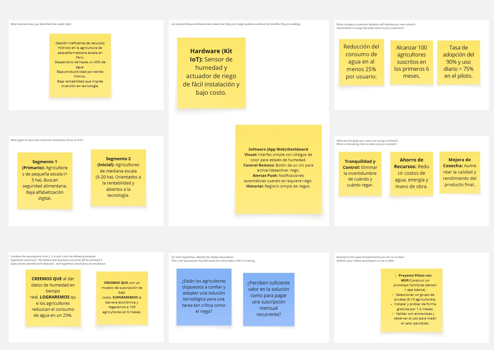

## 1.3. Segmentos objetivo

La solución CultivApp está diseñada para atender las necesidades específicas de dos grupos fundamentales del sector agrícola peruano. La caracterización detallada de estos segmentos es crucial para el diseño de un producto relevante y efectivo.

### Segmento objetivo #1: Agricultores de pequeña escala (subsistencia y autoconsumo)

Agricultores con terrenos menores a 5 hectáreas, generalmente familiares, que producen para autoconsumo y venta local en mercados. Este grupo representa la base de la agricultura familiar en el Perú, constituyendo el 66.3% de todas las unidades agropecuarias del país. A pesar de su importancia para el abastecimiento local, enfrentan severas limitaciones de acceso a recursos y tecnología.

- **Aspectos Demográficos:**
  - Rango de edad: 22 a 50 años.
  - Sexo: Hombres y mujeres (con ligera predominancia masculina en roles de decisión en zonas rurales).
  - Nivel socioeconómico: Bajo y medio-bajo. Sus ingresos dependen directamente de la variabilidad de sus cosechas y los precios en mercados locales.

- **Aspectos Geográficos:**
  - Nacionalidad: Peruana.
  - Zona geográfica de residencia: Rural y periurbana.
  - Departamento: Principalmente en la Sierra (Ayacucho, Cusco, Cajamarca, Puno) y en zonas de la Selva (San Martín, Ucayali).

- **Aspectos Psicográficos:**
  - Valoración de la tierra como principal fuente de sustento y herencia familiar.
  - Orientados al autoconsumo y a la venta en ferias o mercados locales.
  - Limitada experiencia en el uso de aplicaciones digitales; la confianza en la tecnología es baja y debe ser construida a través de resultados demostrables.
  - Buscan soluciones prácticas, fáciles de entender, de bajo costo y alta durabilidad. La aversión al riesgo es alta debido a sus limitados márgenes económicos.
  - **Uso tecnológico:** Acceso limitado a smartphones de gama media y conectividad 3G/4G, a menudo intermitente.

### Segmento objetivo #2: Agricultores de mediana escala (producción comercial local y regional)

Agricultores con terrenos entre 5 y 20 hectáreas que producen cultivos para abastecer mercados regionales o cadenas de supermercados. Este segmento, aunque más pequeño en número, tiene un impacto significativo en la cadena de suministro formal y muestra una mayor tendencia hacia la modernización para mantener la competitividad.

#### Aspectos Demográficos:
- **Rango de edad:** 30 a 55 años.
- **Sexo:** Hombres y mujeres, con tendencia masculina en roles de decisión.
- **Nivel socioeconómico:** Medio y medio-alto dentro del sector agrícola.

#### Aspectos Geográficos:
- **Nacionalidad:** Peruana.
- **Zona geográfica de residencia:** Zonas rurales y valles interandinos con acceso a mercados regionales.
- **Departamento:** Principalmente en la Costa (La Libertad, Ica, Lambayeque, Piura) y valles de la Sierra (Arequipa, Junín), donde se concentra la agricultura comercial.

#### Aspectos Psicográficos:
- Mayor orientación a la productividad, la eficiencia y el mercado.
- Buscan activamente optimizar el rendimiento de sus cultivos y reducir pérdidas para maximizar la rentabilidad.
- Tienen más apertura al uso de aplicaciones y tecnología digital como una inversión para mejorar su negocio.
- Interés en herramientas que les permitan organizar datos y tomar decisiones basadas en información precisa, no solo en la intuición.
- **Uso tecnológico:** Mayor acceso a dispositivos móviles modernos y disposición a usar aplicaciones para mejorar la productividad. Existe una conciencia creciente sobre los beneficios de la AgriTech.

# Capítulo II: Requirements Elicitation & Analysis

## 2.1. Competidores

Para posicionar a FruTech y su producto CultivApp de manera efectiva, es imperativo realizar un análisis exhaustivo del entorno competitivo. Si bien el mercado de AgriTech en Perú para pequeños agricultores es incipiente, existen actores relevantes en Latinoamérica cuyas soluciones, estrategias y modelos de negocio ofrecen valiosas lecciones. El objetivo de este análisis es identificar un nicho de mercado desatendido y definir una propuesta de valor única y diferenciada.

### 2.1.1. Análisis competitivo

Se ha desarrollado un "Competitive Analysis Landscape" para contrastar a CultivApp con tres competidores clave en la región: Space AG (Perú), SIMA (Argentina) y InstaCrops (Chile).

| | FruTech (CultivApp) | Space AG (Perú) | SIMA (Argentina) | InstaCrops (Chile) |
| :--- | :--- | :--- | :--- | :--- |
| **Overview** | Plataforma web y hardware IoT de bajo costo enfocada en el monitoreo y automatización del riego para pequeños y medianos agricultores en Perú. | Software modular para la digitalización de operaciones agrícolas en cultivos de alto valor, integrando datos de drones, sensores y satélites. | Sistema de agricultura inteligente que permite monitorear lotes, geolocalizar datos y generar órdenes de aplicación desde un smartphone. Fuerte enfoque en la recolección de datos en campo. | Asesor agrícola virtual que combina sensores IoT, IA y datos satelitales para dar recomendaciones en tiempo real sobre riego, nutrición y plagas. |
| **Ventaja competitiva** | **Hiper-accesibilidad:** Modelo de negocio y tecnología diseñados para ser radicalmente asequibles y fáciles de usar por agricultores con bajos recursos y limitada alfabetización digital. | **Especialización en Agroexportación:** Soluciones robustas y personalizadas para grandes empresas agrícolas con cultivos de alto valor como arándanos y paltos. | **Comunidad y Datos en Campo:** Fuerte capacidad de recolección de datos offline y una comunidad de usuarios que genera inteligencia colectiva sobre adversidades en el campo. | **Inteligencia Artificial para Riego:** Potente asistente de IA (InstaDrop AI) que convierte datos complejos de sensores en recomendaciones de riego conversacionales y simples. |
| **Mercado Objetivo** | Agricultores de pequeña y mediana escala en Perú (subsistencia y mercado local/regional). | Grandes empresas agroexportadoras en Latinoamérica, enfocadas en la optimización de operaciones complejas. | Productores y asesores agrícolas en Latinoamérica que buscan digitalizar el monitoreo de sus campos de manera detallada. | Agricultores tecnificados en Latinoamérica que buscan maximizar la eficiencia en el uso de agua y recursos a través de la IA. |
| **Estrategias de Marketing**| Alianzas con cooperativas locales, programas gubernamentales (Agroideas) y marketing de base comunitaria. | Marketing B2B, casos de éxito con grandes corporaciones, alianzas estratégicas con empresas de tecnología (ej. Netafim). | Modelo freemium (10 lotes gratis), presencia en app stores, alianzas con empresas de insumos y software agrícola. | Fuerte presencia en medios, participación en eventos de startups (TechCrunch), marketing de contenidos enfocado en el ahorro y la eficiencia. |
| **Productos & Servicios** | - Monitoreo de humedad del suelo.<br>- Control de riego remoto (manual/automático).<br>- Alertas y notificaciones.<br>- Historial de riego. | - Módulos de Fitosanidad, Riego, Trabajadores, Packing y Fenología.<br>- Digitalización de formularios en campo.<br>- Reportes automáticos y KPIs. | - Monitoreo de plagas/malezas.<br>- Geolocalización de datos (waypoints).<br>- Imágenes satelitales (NDVI).<br>- Control de siembra y cosecha.<br>- App con funcionalidad offline. | - Asistente de riego por IA (InstaDrop).<br>- Predicción de rendimiento (InstaYield).<br>- Monitoreo de frutas (FruitTracker).<br>- Plataforma integral de sensores. |
| **Precios & Costos** | Modelo de suscripción mensual de bajo costo que subsidia el hardware inicial. | Cuota de implementación única + licencia mensual recurrente. El precio varía según módulos, hectáreas y usuarios. | Modelo freemium con 10 lotes gratis. Precios por licencia que incluye usuarios ilimitados, contactando a ventas para cotizar. | Modelo de suscripción. Ofrecen una prueba antes de suscribirse. El precio se basa en "zonas" de cultivo. |
| **Análisis SWOT** | **F:** Enfoque de nicho, bajo costo, simplicidad.<br>**D:** Marca no reconocida, menor cantidad de funcionalidades.<br>**O:** Gran mercado desatendido en Perú, programas de apoyo gubernamental.<br>**T:** Desconfianza tecnológica, baja conectividad rural. | **F:** Fuerte posicionamiento en el mercado de exportación, tecnología robusta.<br>**D:** Alto costo, alta complejidad, no apto para pequeños productores.<br>**O:** Expansión a nuevos cultivos de alto valor.<br>**T:** Nuevos competidores con soluciones más ágiles. | **F:** Excelente app móvil, funcionalidad offline, comunidad.<br>**D:** Menor enfoque en la automatización de acciones (más monitoreo).<br>**O:** Integrar IA para recomendaciones proactivas.<br>**T:** Competidores que ofrecen soluciones más integrales (monitoreo + acción). | **F:** Liderazgo en IA para riego, interfaz conversacional innovadora.<br>**D:** Alta dependencia de la conectividad de sensores.<br>**O:** Expandir su IA a otras áreas como fertilización y control de plagas.<br>**T:** El costo de la IA puede ser una barrera para mercados menos tecnificados. |

### 2.1.2. Estrategias y tácticas frente a competidores

El análisis competitivo revela una clara oportunidad de mercado: mientras los competidores se enfocan en la cúspide de la pirámide agrícola con soluciones complejas y costosas, la base compuesta por millones de pequeños y medianos agricultores permanece en gran medida desatendida. La estrategia de FruTech no será competir en funcionalidades, sino en accesibilidad y simplicidad.

**Afrontando las fortalezas de los competidores:**

-   **Fortalezas de competidores:** Tecnología avanzada (IA, drones), robustez de datos, fuerte posicionamiento en el segmento agroexportador.
-   **Nuestras fortalezas:** Enfoque de nicho, diseño centrado en la simplicidad, modelo de negocio de bajo costo.
-   **Estrategia:** Diferenciación por enfoque. En lugar de ofrecer una docena de módulos complejos, CultivApp se especializará en resolver un único problema de manera excepcional: el riego. Nos posicionaremos como la herramienta más fácil y rentable para empezar a digitalizar el campo.
-   **Tácticas:**
    1.  **Comunicación Directa:** El marketing no hablará de "KPIs" o "NDVI", sino de "ahorrar agua" y "no perder la cosecha".
    2.  **Producto Mínimo Viable (MVP) Enfocado:** El desarrollo inicial se centrará exclusivamente en el monitoreo de humedad y el control del riego, asegurando que esta funcionalidad sea impecable y fácil de entender.

**Aprovechando las debilidades de los competidores:**

-   **Debilidades de competidores:** Alto costo de entrada, complejidad de uso que requiere capacitación, modelo de negocio no adaptado a la economía de la agricultura familiar.
-   **Nuestras oportunidades:** El 66.3% de las unidades agrícolas en Perú son menores a 5 hectáreas, un mercado que los competidores actuales no pueden atender de manera rentable con su modelo actual.
-   **Estrategia:** Liderazgo en costos y usabilidad. Romper la barrera de entrada económica y cognitiva que impide la adopción tecnológica en el segmento masivo.
-   **Tácticas:**
    1.  **Modelo Hardware-as-a-Service (HaaS):** Ofrecer el kit de sensores y actuadores sin costo inicial, integrando su valor en una suscripción mensual asequible. Esto elimina el principal obstáculo financiero para el agricultor.
    2.  **Diseño Inclusivo:** Desarrollar una interfaz que pueda ser operada por personas con baja alfabetización digital, utilizando iconos universales, códigos de color y un mínimo de texto.
    3.  **Canales de Distribución Locales:** Forjar alianzas con cooperativas agrarias y tiendas de insumos locales, que son canales de confianza para los agricultores, para la distribución y el soporte técnico de primer nivel. Esto aprovecha las redes existentes y genera confianza, un factor clave que la tecnología por sí sola no puede resolver.

## 2.2. Entrevistas

Para validar los supuestos y profundizar en las necesidades reales de los segmentos objetivo, se diseñó y ejecutó un proceso de entrevistas cualitativas.

### 2.2.1. Diseño de entrevistas

Para validar nuestras suposiciones y profundizar en las necesidades reales de nuestros segmentos objetivo, se diseñaron dos guiones de entrevista semi-estructurados.

**Preguntas para el Segmento 1: Agricultores de pequeña escala**
1.  Cuénteme sobre su chacra, ¿qué cultiva principalmente y desde cuándo se dedica a esto?
2.  ¿Cómo decide cuándo es el momento de regar sus cultivos? ¿Qué señales busca en la tierra o en la planta?
3.  ¿Cuál es el mayor desafío que enfrenta con el agua? ¿Le preocupa la falta de lluvia o el costo del riego?
4.  ¿Alguna vez ha perdido parte de su cosecha por problemas con el riego (mucha o poca agua)?
5.  ¿Usa un celular? ¿Para qué lo usa más en su día a día? (Llamadas, WhatsApp, Facebook, etc.)
6.  Si existiera una aplicación en su celular que le mostrara con un color (verde, amarillo o rojo) si su tierra está húmeda o seca, ¿le parecería útil? ¿Por qué?
7.  ¿Qué pensaría si con esa misma aplicación pudiera abrir y cerrar la llave de su riego sin tener que caminar hasta la parcela?
8.  ¿Cuánto cree que estaría dispuesto a pagar al mes por un servicio así, si le ayudara a ahorrar agua y a no preocuparse tanto?

**Preguntas para el Segmento 2: Agricultores de mediana escala**
1.  Describa su operación agrícola. ¿Cuáles son sus principales cultivos y a qué mercados se dirige?
2.  ¿Cómo gestiona actualmente el riego en sus diferentes parcelas? ¿Utiliza algún tipo de programación o es manual?
3.  ¿Cuáles son sus mayores costos operativos relacionados con el riego (agua, energía, mano de obra)?
4.  ¿Cómo mide la efectividad de su estrategia de riego? ¿Qué impacto tiene en la calidad y el rendimiento de su producto?
5.  ¿Qué tecnologías utiliza actualmente en su gestión agrícola (software, sensores, etc.)?
6.  Le presento una solución que le permite monitorear la humedad del suelo en tiempo real y automatizar el riego desde una app. ¿Qué ventajas inmediatas ve en esto?
7.  ¿Qué tipo de información o datos le gustaría ver en un tablero de control para tomar mejores decisiones de riego?
8.  Nuestro modelo de negocio se basa en una suscripción mensual que incluye el hardware. ¿Qué opina de este enfoque en comparación con una gran inversión inicial?

### 2.2.2. Registro de entrevistas

#### Segmento objetivo #1: Agricultores de pequeña escala (subsistencia y autoconsumo)

##### Datos del Entrevistado #1

- *Nombre completo:* Noelia Gómez Sánchez
- *Segmento Objetivo:* Agricultores de pequeña escala
- *Edad:* 25
- *Distrito:* Pueblo Libre, Perú
- *Inicio de la entrevista:* 0:15 min
- *Duración:* 30:01 min
- *Screenshot del cuadro de video:* 
- *URL del video (Microsoft Stream):* [Entrevista 01](https://upcedupe-my.sharepoint.com/:v:/g/personal/u202313403_upc_edu_pe/EYJ9HNEKkORGu9bfnF3PP6QBGpWIi2ykmNP2pVXSh6mstw)

*Resumen:*

- Noelia Gómez Sánchez, de 25 años, estudiante de la Universidad Agraria, relata su experiencia en la chacra de su familia, donde cultivan hortalizas. Explica que decide el momento del riego de forma visual, observando la sequedad de la tierra o las hojas de las plantas, y que su mayor desafío es la presión inconstante del agua del canal, lo que le ha causado pérdidas de cosecha en el pasado. Le parece muy útil la idea de una aplicación que indique la humedad del suelo para saber el momento exacto en que debe regar, y considera que poder controlar el riego a distancia desde el celular sería increíble para ahorrarle tiempo, por lo cual estaría dispuesta a pagar entre 30 y 50 soles al mes.

##### Datos del Entrevistado #2

- *Nombre completo:* Carmen Díaz
- *Segmento Objetivo:* Agricultores de pequeña escala
- *Edad:* 28 años
- *Distrito:* Cercado de Lima, Perú
- *Inicio de la entrevista:* 3:37 min
- *Duración:* 30:01 min
- *Screenshot del cuadro de video:* 
- *URL del video (Microsoft Stream):* [Entrevista 02](https://upcedupe-my.sharepoint.com/:v:/g/personal/u202313403_upc_edu_pe/EYJ9HNEKkORGu9bfnF3PP6QBGpWIi2ykmNP2pVXSh6mstw)

*Resumen:*

- Carmen Díaz, de 28 años, cuenta como quiere mejorar su salud incluyendo alimentos cultivados por ella misma a su dieta diaria. Mencionacomo mucha de la informacion que usa es de internet pero que no esta segura si se adapta al entorno de su ciudad. Nunca antes habia practicado la agricultura, pensando que solo era a gran escala en cultivos de hectarias de longitud, le interesa que la aplicacion le proporcione ayudas como fechas de regado o cambios de productos para un mejor cuidado y una cosecha mas productiva a futuro.

##### Datos del Entrevistado #3

- *Nombre completo:* Alejandro Jacinto
- *Segmento Objetivo:* Agricultores de pequeña escala
- *Edad:* 25 años
- *Distrito:* Puente Piedra, Lima
- *Inicio de la entrevista:* 8:14 min
- *Duración:* 30:01 min
- *Screenshot del cuadro de video:* 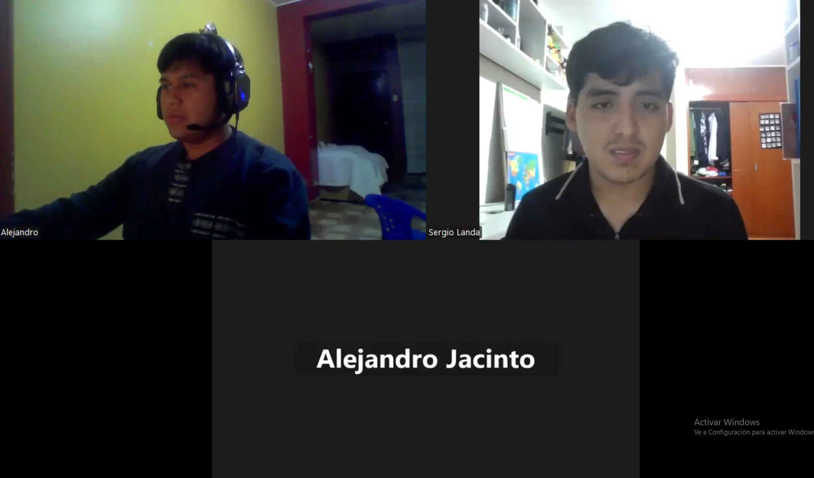
- *URL del video (Microsoft Stream):* [Entrevista 03](https://upcedupe-my.sharepoint.com/:v:/g/personal/u202313403_upc_edu_pe/EYJ9HNEKkORGu9bfnF3PP6QBGpWIi2ykmNP2pVXSh6mstw)

*Resumen:*

Alejandro, un joven aficionado a la agricultura y residente cerca de Lima, comentó que cultiva principalmente maíz, papa y algunas hortalizas como lechuga y tomate para el consumo familiar. Explicó que el riego lo realiza de forma intuitiva, observando la tierra y el estado de las hojas, mientras que la fertilización la maneja con compost casero preparado con restos de comida y hojas secas, aplicándolo de manera esporádica. Entre las principales dificultades que enfrenta mencionó la falta de agua y la presencia de plagas como pulgones y hormigas. Mostró interés en una aplicación que le brinde recomendaciones basadas en datos como tipo de suelo, agua o luz solar, además de recibir alertas prácticas sobre riego o nutrientes y recordatorios, ya que suele olvidar algunas tareas de cuidado. Finalmente, señaló que aunque no es experto en tecnología, se siente cómodo usando aplicaciones sencillas como WhatsApp, Facebook o Instagram, y que estaría dispuesto a dedicar solo unos minutos al día para registrar información sobre sus cultivos.


### Segmento objetivo #2: Agricultores de mediana escala (producción comercial local y regional)

##### Datos del Entrevistado #1

- *Nombre completo:* Walter Sanchez
- *Segmento Objetivo:* Agricultor de mediana escala
- *Edad:* 52 años
- *Distrito:* Caraz, Ancash, Perú
- *Inicio de la entrevista:* 12:03 min
- *Duración:* 30:01 min
- *Screenshot del cuadro de video:* 
- *URL del video (Microsoft Stream):* [Entrevista 01](https://upcedupe-my.sharepoint.com/:v:/g/personal/u202313403_upc_edu_pe/EYJ9HNEKkORGu9bfnF3PP6QBGpWIi2ykmNP2pVXSh6mstw)

*Resumen:*

- Walter Sanchez, de 52 años, ingeniero agronomo al cuidado de diferentes cultivos de diferentes empresas, principalmente productoras de arandanos y sugar pees, menciona como su mayor problema es que mantener un registro de los diferentes cultivos en diferentes fechas resulta complicado debido a que no se suele manejar registros organizados, siendo muchas veces registros porco ortodoxos o informales lo cual desemboca en cosechas menos productivas. Sobre todo menciona como quisiera que esta posible aplicacion sea facil e intuitiva de usar para los agricultores, ya que un problema de trabajar en provincia, en sus palabras, es que la automatizacion resulta dificil debido a la falta de profesionales.

##### Datos del Entrevistado #2

- *Nombre completo:* Georgette Revolledo
- *Segmento Objetivo:* Agricultor de mediana escala
- *Edad:* 35 años
- *Distrito:* Caraz, Ancash, Perú
- *Inicio de la entrevista:* 18:35 min
- *Duración:* 30:01 min
- *Screenshot del cuadro de video:* 
- *URL del video (Microsoft Stream):* [Entrevista 02](https://upcedupe-my.sharepoint.com/:v:/g/personal/u202313403_upc_edu_pe/EYJ9HNEKkORGu9bfnF3PP6QBGpWIi2ykmNP2pVXSh6mstw)

*Resumen:* Georgette Revolledo, de 35 años, administradora de las parcelas agrícolas de su familia, cultiva hortalizas de ciclo corto como lechugas, espinacas y fresas. Explica que el riego en sus parcelas es completamente manual y se decide basado en la experiencia y la observación directa en el campo, siendo su mayor costo operativo la mano de obra necesaria para esta supervisión. Considera que una solución para automatizar el riego le permitiría optimizar costos y tiempo, y le parece fundamental poder recibir alertas de humedad en su celular. En lugar de una gran inversión inicial, ve el modelo de suscripción mensual como una opción "mucho más adecuada y moderna".


##### Datos del Entrevistado #3

- *Nombre completo:* Javier Leon
- *Segmento Objetivo:* Agricultor de mediana escala
- *Edad:* 50 años
- *Distrito:* Caraz, Ancash, Perú
- *Inicio de la entrevista:* 23:30
- *Duración:* 30:01 min
- *Screenshot del cuadro de video:* 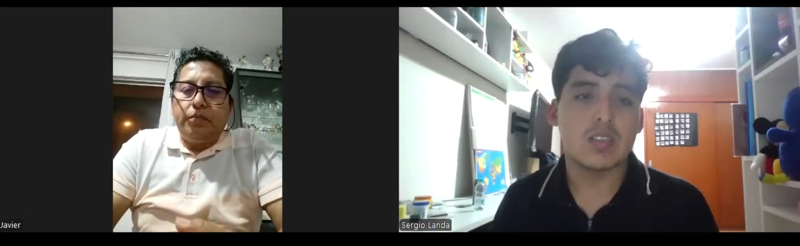
- *URL del video (Microsoft Stream):* [Entrevista 03](https://upcedupe-my.sharepoint.com/:v:/g/personal/u202313403_upc_edu_pe/EYJ9HNEKkORGu9bfnF3PP6QBGpWIi2ykmNP2pVXSh6mstw)

*Resumen:* Javier León, un agricultor de 50 años dedicado a la producción comercial en una extensión de aproximadamente 3,000 metros cuadrados en la que cultiva yuca, plátano, manzana, palta y algunos cítricos, explicó que actualmente controla el riego y los nutrientes basándose en la memoria, ajustando la frecuencia según el clima, y utilizando fertilizantes o abono cada 15 días o un mes. Para registrar la información recurre únicamente a su memoria o a una pizarra en el campo, lo que en ocasiones le genera problemas al olvidar fechas importantes de riego o fertilización. Entre las principales dificultades señaló la falta de un sistema confiable para llevar el control de sus labores agrícolas. Manifestó que le sería de gran utilidad recibir recomendaciones clasificadas por riesgo, generar reportes básicos de consumo de agua o rendimiento esperado, y contar con alertas preventivas que le recuerden tareas como riego, fertilización o fumigación. Indicó que estaría dispuesto a ingresar datos en la aplicación de forma interdiaria, valorando especialmente la inclusión de un calendario de tareas agrícolas. Finalmente, expresó que consideraría pagar una suscripción para acceder a reportes y recomendaciones avanzadas, ya que la tecnología le permitiría estar más ordenado y planificar mejor el manejo de sus cultivos.


### 2.2.3. Análisis de entrevistas

**Análisis del Segmento 1 (Pequeña Escala):**

**Hallazgos:**

El 100% de los entrevistados basa sus decisiones de riego en métodos visuales y tradicionales, mostrando una alta dependencia de factores externos incontrolables (clima, turnos de agua). El principal punto de dolor es el riesgo de pérdida de cosecha y los costos directos (combustible, agua comprada). Existe un 100% de escepticismo inicial hacia la tecnología, combinado con curiosidad. La barrera principal es el costo percibido y la durabilidad del equipo. La simplicidad no es un deseo, es un requisito indispensable. La propuesta de valor más resonante es la reducción del riesgo y el ahorro directo.

**Análisis del Segmento 2 (Mediana Escala):**

**Hallazgos:**s
El 100% de los entrevistados ya utiliza alguna forma de riego tecnificado, pero carece de herramientas de monitoreo y automatización de datos. Los puntos de dolor clave son la optimización de costos (mano de obra, energía) y la mejora de la calidad del producto final para cumplir con los estándares del mercado. Hay un 100% de apertura a la tecnología como una inversión estratégica. Valoran los datos, los reportes y la capacidad de gestionar la operación de forma más eficiente y remota. La propuesta de valor más atractiva es la optimización de la rentabilidad y la eficiencia operativa. El modelo de suscripción es bien recibido.

## 2.3. Needfinding

A partir del análisis de las entrevistas, se procede a la construcción de artefactos centrados en el usuario para guiar el diseño del producto.

### 2.3.1. User Personas

Se han desarrollado dos arquetipos que representan a los usuarios clave de CultivApp.

#### User Persona 1: Javier Quispe, Agricultor de Subsistencia

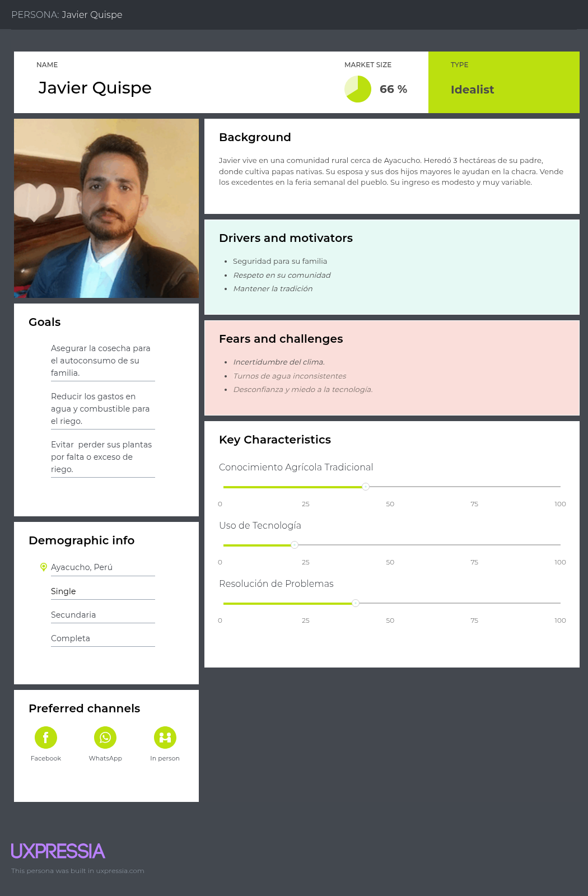

#### User Persona 2: Mariela Vargas, Agricultora Comercial

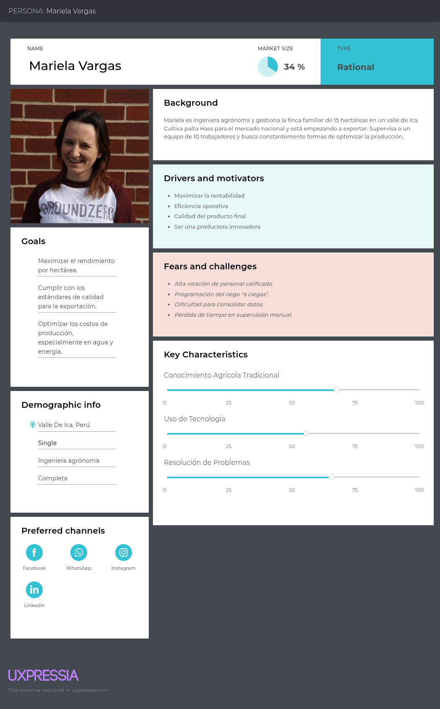

### 2.3.2. User Task Matrix

En este apartado se realizará la User Task Matrix tomando en cuenta los dos segmentos definidos y relacionados a nuestras User Personas: Javier Quispe, un agricultor de subsistencia con recursos limitados, y Mariela Vargas, una agricultora comercial enfocada en la optimización y la exportación.

| TASK | FREQUENCY (Javier Quispe) | IMPORTANCE (Javier Quispe) | FREQUENCY (Mariela Vargas) | IMPORTANCE (Mariela Vargas) |
| :--- | :--- | :--- | :--- | :--- |
| **Consultar estado de humedad del suelo** | Often | High | Often | High |
| **Recibir alertas de riego necesario** | Sometimes | High | Sometimes | High |
| **Activar o detener el riego manualmente** | Often | High | Sometimes | Medium |
| **Programar o ajustar riegos automáticos** | Rarely | Low | Often | High |
| **Revisar el historial de riegos** | Rarely | Medium | Often | High |
| **Analizar datos y comparar parcelas** | Never | Low | Often | High |
| **Descargar reportes de consumo o costos** | Never | Low | Sometimes | High |
| **Configurar nuevas parcelas o sensores** | Rarely | Medium | Sometimes | Medium |

Tomando en cuenta este recuadro podemos apreciar ciertos detalles sobre las actividades de nuestros User Personas:

-   Tanto Javier (agricultor de subsistencia) como Mariela (agricultora comercial) consideran fundamental consultar el estado de la humedad y recibir alertas. Estas son las tareas más importantes para ambos, ya que les permiten conocer la necesidad principal de sus cultivos.
-   Mientras que Javier enfoca su uso en acciones inmediatas y de alto impacto para su supervivencia, como activar el riego manualmente para salvar su cosecha, Mariela emplea su tiempo en actividades de gestión y optimización.
-   Para ella, tareas como programar riegos automáticos, analizar datos y descargar reportes son cruciales para mejorar la eficiencia y rentabilidad de su negocio, actividades que no son prioritarias para el agricultor de subsistencia.

### 2.3.3. User Journey Mapping

En esta sección se elaboran los User Journey Maps para cada User Persona definido en el proyecto: Javier Quispe (Agricultor de Subsistencia) y Mariela Vargas (Agricultora Comercial). Estos mapas ilustran el recorrido de extremo a extremo que cada usuario experimenta en la situación actual (As-Is), es decir, sin la existencia de la solución 'CultivApp'. El objetivo es visualizar sus acciones, pensamientos y emociones para identificar los puntos de dolor más críticos y las oportunidades de mejora.

#### User Journey Map: Javier Quispe (As-Is)

Este mapa de recorrido está vinculado al User Persona Javier Quispe.
**Escenario:** "Enfrentando una semana sin lluvia"

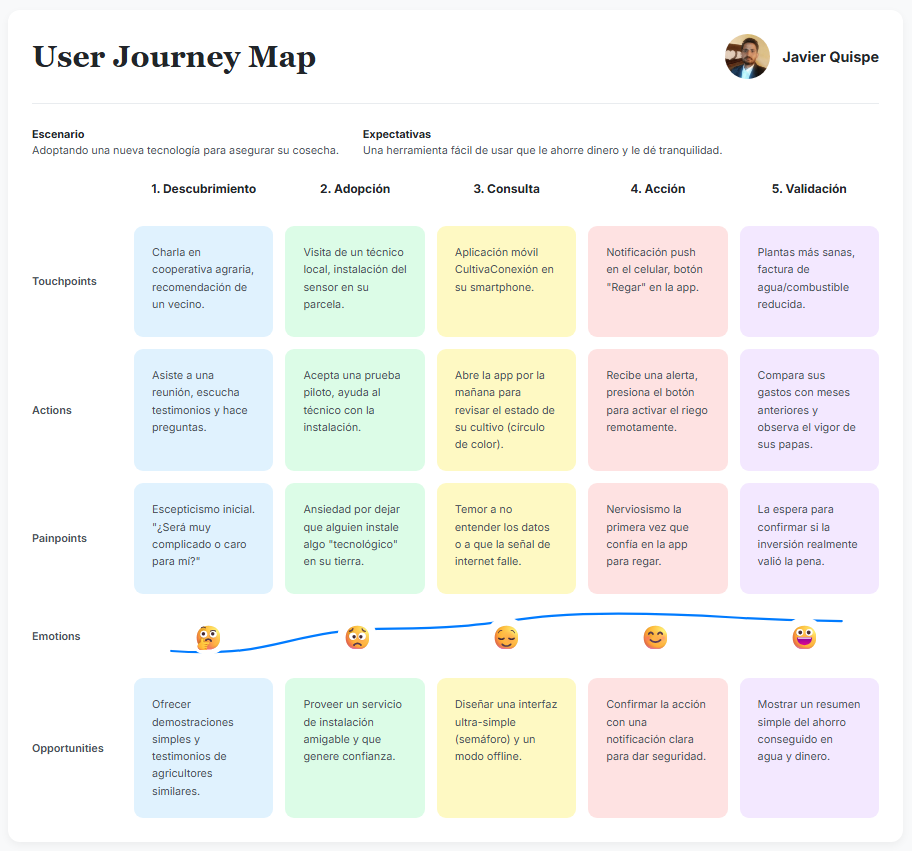

**Resumen del Recorrido:**
-   **Fases:** El viaje de Javier se divide en cinco fases emocionales y de acción: Preocupación, Verificación Manual, Decisión Difícil, Riego Costoso e Incertidumbre.
-   **Acciones:** Sus acciones son puramente físicas y reactivas, desde mirar el cielo y caminar a la chacra hasta comprar combustible y operar una motobomba.
-   **Pensamientos:** Sus pensamientos reflejan una profunda incertidumbre y estrés financiero: "¿Lloverá?", "¿Me alcanzará el dinero?", "¿Habré regado lo suficiente?".
-   **Sentimientos:** La montaña rusa emocional de Javier va desde la ansiedad y el cansancio hasta la duda y una frágil esperanza.
-   **Oportunidad para CultivApp:** Existe una clara oportunidad para proporcionar datos objetivos que eliminen la duda, permitan un uso más eficiente de recursos costosos (agua, combustible) y, sobre todo, brinden tranquilidad al agricultor.

#### User Journey Map: Mariela Vargas (As-Is)

Este mapa de recorrido está vinculado al User Persona Mariela Vargas.
**Escenario:** "Programando el riego semanal"

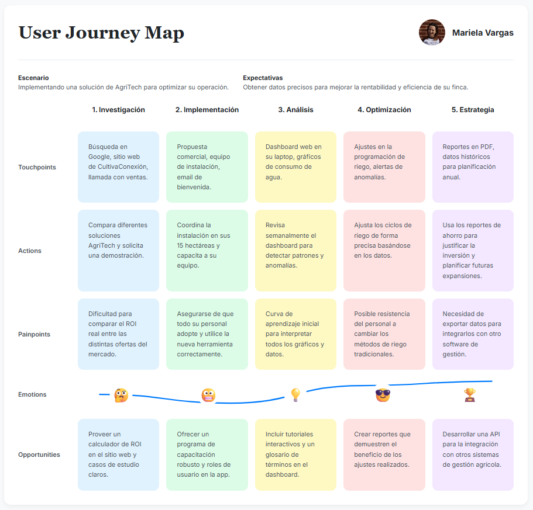


**Resumen del Recorrido:**
-   **Fases:** El recorrido de Mariela es un ciclo de gestión: Planificación, Delegación, Supervisión, Verificación y Ajuste.
-   **Acciones:** Sus acciones combinan herramientas digitales básicas (Excel) con una intensa supervisión manual y comunicación constante (llamadas, visitas a las parcelas).
-   **Pensamientos:** Sus pensamientos están centrados en la eficiencia y el riesgo: "¿Se entendieron las instrucciones?", "¿Por qué esta parcela necesita más agua?", "Este error me costará en calidad", "Pierdo demasiado tiempo en esto".
-   **Sentimientos:** Su estado emocional fluctúa desde la confianza inicial hasta la frustración y la preocupación al detectar ineficiencias, terminando con una sensación de resolución.
-   **Oportunidad para CultivApp:** La oportunidad clave es automatizar los ciclos de delegación y supervisión, proporcionando datos precisos por parcela para permitir ajustes en tiempo real y liberar su tiempo para tareas más estratégicas y de mayor valor.

### 2.3.4. Empathy Mapping

#### Empathy Map: Javier Quispe

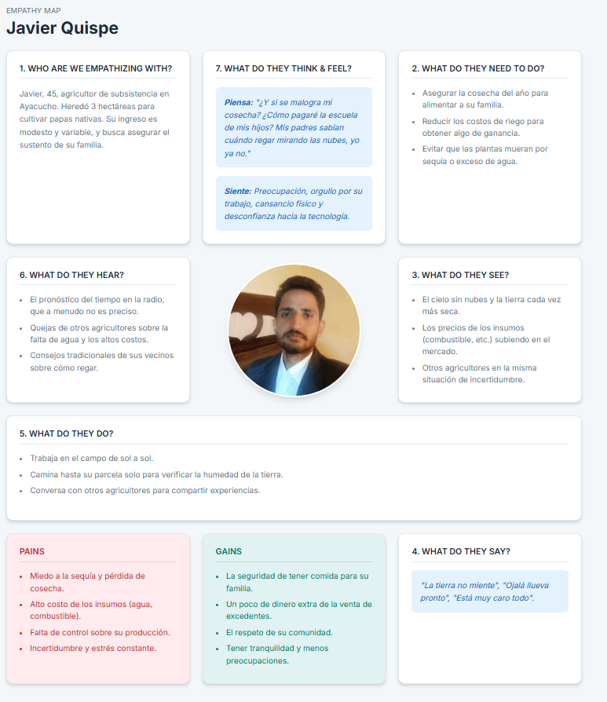

#### Empathy Map: Mariela Vargas

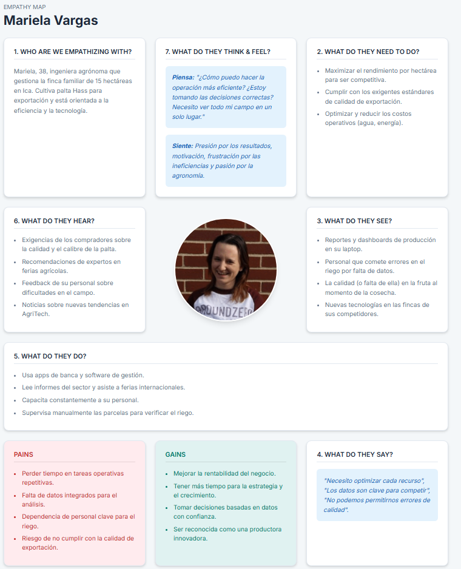

## 2.4. Big Picture EventStorming

En una sesión colaborativa, el equipo mapeó los eventos clave del dominio agrícola desde la perspectiva del agricultor para visualizar el flujo de trabajo completo e identificar los puntos de dolor y las oportunidades de intervención.


Este ejercicio visual confirmó que el ciclo de detección de necesidad de riego y ejecución es un subdominio crítico, repetitivo y lleno de incertidumbre, validando que es el punto de partida ideal para la solución CultiConection.


## 2.5. Ubiquitous Language

Para asegurar una comunicación clara y sin ambigüedades entre los desarrolladores, los stakeholders y, eventualmente, los usuarios, se establece el siguiente glosario de términos del dominio.

<table>
  <thead>
    <tr>
      <th> Término (Ingles)</th>
      <th> Término (Español)</th>
      <th> Descripción (Español)</th>
    </tr>
  </thead>
  <tbody>
    <tr>
      <th> Farmers</th>
      <th> Agricultores </th>
      <th> Persona que se dedica o trabaja en el ambito de plantar, cuidar y cultivar alimentos </th>
    </tr>
    <tr>
      <th> Crop</th>
      <th> Cultivo </th>
      <th> Area de trabajo de los agricultores donde realizan su labor de plantar y cosechar sus alimentos </th>
    </tr>
    <tr>
      <th> Cultivation cycle</th>
      <th> Ciclo de Cultivo </th>
      <th> Eventos durante del proceso de un cultivo desde la siembra hasta la cosecha de este mismo </th>
    </tr>
    <tr>
      <th> Organizations</th>
      <th> Organizaciones </th>
      <th> Empresas interesadas en brindar sus servicios dentro de la aplicacion teniendo una paga de por medio. </th>
    </tr>
    <tr>
      <th> Harvest</th>
      <th> Cosecha </th>
      <th> Producto de extraccion de un cultivo en el momento indicado. </th>
    </tr>
    <tr>
      <th> Sustainability</th>
      <th> Sostenibilidad </th>
      <th> Capacidad de gastar menos recursos de los que se generan para el bien ambiental del cultivo. </th>
    </tr>
    <tr>
      <th> Cultivation history</th>
      <th> Historial de cultivo </th>
      <th> Registro actualizado que guarda la informacion de los estados y cuidados del cultivo. </th>
    </tr>
    <tr>
      <th> Adviser</th>
      <th> Asesor </th>
      <th> Persona enviada por la empresa a evaluar los cultivos registrado en el momento que es necesario. </th>
    </tr>
    <tr>
      <th> Payment gateway</th>
      <th> Pasarela de pago </th>
      <th> Proceso de verificacion que presta su servicio para transacciones dentro de la aplicacion. </th>
    </tr>
    <tr>
      <th> Platform</th>
      <th> Plataforma </th>
      <th> Sistema digital donde los agricultores y asesores interactúan y  comparten información. </th>
    </tr>
    <tr>
      <th> Alert system</th>
      <th> Sistema de alertas </th>
      <th> Mecanismo digital de notificaciones que recuerdan el estado y necesidades del cultivo. </th>
    </tr>
    <tr>
      <th> Cultivation status</th>
      <th> Estado de cultivo </th>
      <th> Mecanismo digital de notificaciones que recuerdan el estado y necesidades del cultivo. </th>
    </tr>
    <tr>
      <th> Resources</th>
      <th> Recursos </th>
      <th> Medios fisicos que sirven para el mantenimiento correcto de un cultivo. </th>
    </tr>
    <tr>
      <th> Crop evaluation</th>
      <th> Evaluacion de cultivo </th>
      <th> Evaluacion de expertos que muestra el estado del cultivo y si es necesario modificar sus caracteristicas. </th>
    </tr>
    <tr>
      <th> Irrigation schedule</th>
      <th> Calendario de riego </th>
      <th> Recordatorio apropiado de la cantidad de dias que faltan para que un cultivo sea regado. </th>
    </tr>
    <tr>
      <th> Cultivation area </th>
      <th> Area de cultivo </th>
      <th> Limites medidos del cultivo para su evaluacion y delimitacion.</th>
    </tr>
    <tr>
      <th> Performance reports</th>
      <th> Reportes de rendimiento</th>
      <th> Analisis documentados de todo la cosecha del cultivo y como puede mejorar. </th>
    </tr>
    <tr>
      <th> Digital Profile</th>
      <th> Perfil digital</th>
      <th> Perfil publico en la aplicacion con la informacion del agricultor, caracteristicas, fotos, cultivos registrados visibles para los usuarios. </th>
    </tr>
  </tbody>
</table>

# Capítulo III: Requirements Specification

## 3.1. To-Be Scenario Mapping

**To-Be Scenario Mapping segmento objetivo 1**

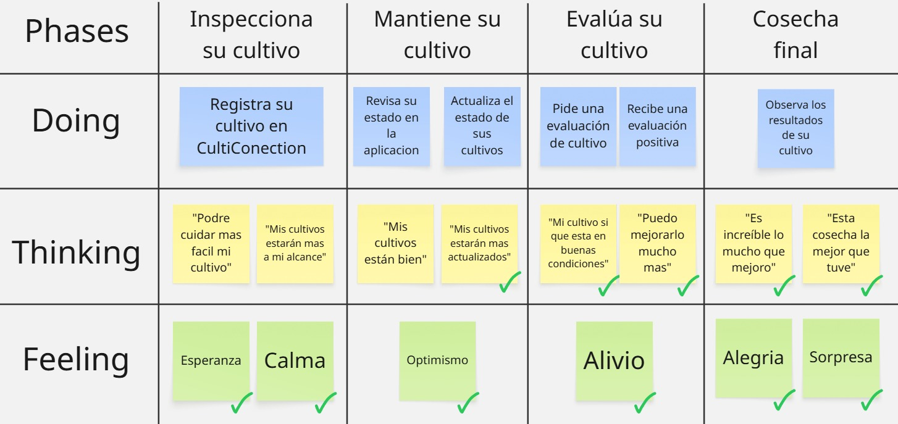

**To-Be Scenario Mapping segmento objetivo 2**

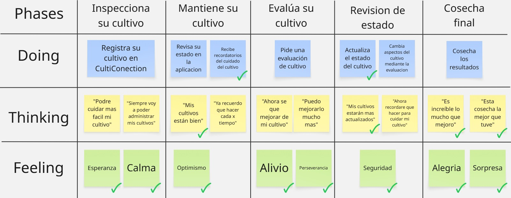

## 3.2. User Stories

**Epicas para CultiConection**

<table>
  <thead>
    <tr>
      <th> EPIC (ID)</th>
      <th> Titulo</th>
      <th> Descripción</th>
    </tr>
  </thead>
  <tbody>
    <tr>
      <th> 01</th>
      <th> Gestion de usuarios </th>
      <th> Como usuario de CultiConection, quiero crear un perfil, modificarlo, abrir y cerrar sension en cualquier dispositivo y recuperar la contraseña de mi cuenta para crear mi identidad dentro de la aplicacion y acceder a sus funcionalidades. </th>
    </tr>
    <tr>
      <th> 02</th>
      <th> Publicacion de Cultivos </th>
      <th> Como usuario de CultiConection, quier crear, eliminar y editar cultivos para tener un control de ellos en tiempo real y actualizado usando las funcionalidades de CultiConection.  </th>
    </tr>
    <tr>
      <th> 03</th>
      <th> Evaluaciones de cultivos </th>
      <th> Como usuario a CultiConection, quiero pedir y recibir evaluaciones de los cultivos que sienta que puedan mejorar para evitar perdidas o una posible muerte de los cultivos por un mal cuidado del que no sepa. </th>
    </tr>
    <tr>
      <th> 04</th>
      <th> Mantenimiento de cultivos </th>
      <th> Como usuario de CultiConection, quiero señalar y recibir señales de datos que necesiten mantenimiento en mi cultivo para asi enfocarme en mejorar y revisar evitando perdidas. </th>
    </tr>
    <tr>
      <th> 05</th>
      <th> Notificaciones de estado del cultivo</th>
      <th> Como usuario de CultiConection, quiero recibir notificaciones personalizadas y adaptadas a mis cultivos para no olvidar los cuidados o si muchos de sus datos estan desactualizados antes de perdir una evaluacion. </th>
    </tr>
    <tr>
      <th> 06</th>
      <th> Seguridad de informacion </th>
      <th> Como administrador de CultiConection, quiero gestionar y cuidar el perfil de mis usuario, para asegurar su estadia dentro de la aplicacion y no sientan un riesgo de ssu datos al navegar dentro de ella. </th>
    </tr>
    <tr>
      <th> 07</th>
      <th> Historial de cultivo </th>
      <th> Como usuario de CultiConection, quiero tener un historial actualizado de los cambios y modificaciones que pueda hacerle a mi cultivo, para saber en que paso pudo cambiar el rendimiento de mi cultivo. </th>
    </tr>
    <tr>
      <th> 08</th>
      <th> Verificacion de identidad </th>
      <th> Como administrador de CultiConection, quiero un sistema de verificacion de identidades de mis usuarios, para asegurarme de que no existan cuentas duplicadas o falsificadores de identidad. </th>
    </tr>
    <tr>
      <th> 09</th>
      <th> Accesibilidad  </th>
      <th> Como usuario de CultiConection, quiero funcionalidades que ayuden a que la aplicacion sea mas accesible en aspectos como color, configuracion y optimizacion para no tener problemas durante su uso. </th>
    </tr>
    <tr>
      <th> 10</th>
      <th> User Experience en la Landing Page </th>
      <th> Como usuario de CultiConection, quiero navegar por una Landing Page con una experiencia de usuario fluida y agil, para verificar y experimentar sus funcionalidades y el acceso a la informacion util del producto. </th>
    </tr>
  </tbody>
</table>

**Historias de Usuario para CultiConection**


<table>
  <thead>
    <tr>
      <th> Storie ID</th>
      <th> Titulo</th>
      <th> Descripción</th>
      <th> Acceptance Criteria</th> 
      <th> Epic ID</th>
    </tr>
  </thead>
  <tbody>
    <tr>
      <th> 01</th>
      <th> Registro de cuenta </th>
      <th> Como usuario, quiero registrarme en la aplicacion, para acceder a sus funciones</th>
      <th> Scenario 1: Registro correcto <br>
      Given el usuario ha ingresado los datos <br>
      When el usuario presiona el boton "Create Account" <br>
      Then la cuenta es creada exitosamente y se accede a la aplicacion <br>
      <br>
      Scenario 2: Registro incorrecto<br>
      Given el usuario no ha ingresado ningun dato <br>
      When el usuario presiona el boton "Create Account" <br>
      Then el sistema muestra un mensaje de campos incompletos <br> 
      </th>
      <th>01</th>
    </tr>
    <tr>
      <th> 02</th>
      <th> Inicio de Sesión </th>
      <th> Como usuario, quiero iniciar sesion, para acceder a mi cuenta</th>
      <th> Scenario 1: Login Exitoso <br>
      Given el usuario ingrese sus datos de cuenta correctamente<br>
      When el usuario presione el boton "Iniciar Sesión" <br>
      Then el sistema abrira la sesion del usuario con sus datos <br>
      <br>
      Scenario 2: Login Fallido <br>
      Given el usuario ingrese datos incorrectos <br>
      When el usuario presione el boton "Inciar Sesion"<br>
      Then el sistema negara el acceso e indicara un mensaje de datos erroneos<br><br>
      Scenario 3: Cerrar sesion<br>
      Given el usuario ingrese a su perfil<br>
      When el usuario presione el boton "Cerrar Sesion"<br>
      Then el sistema cerrar la sesion del usuario
      <th>01</th>
      </th>
    </tr>
    <tr>
      <th> 03</th>
      <th> Recuperar Contraseña </th>
      <th> Como usuario, quiero recuperar la contraseña de mi cuenta, para recuperar el acceso a ella en caso se me olvide </th>
      <th>Scenario 1: Pedir contraseña <br>
      Given el usuario no recuerde la contraseña de su cuenta<br>
      When el usuario presione el boton de "Recuperar contraseña"<br>
      Then el sustema iniciaria el proceso para recuperar o reemplazar su anterior contraseña<br>
      </th>
      <th>01</th>
    </tr>
    <tr>
      <th> 04</th>
      <th> Editar perfil </th>
      <th> Como usuario, quiero modificar mi perfil, para mantenerlo actualizado todo el tiempo </th>
      <th>Scenario 1: Acceso a la ediion<br>
      Given el usuario esta en al seccion "Mi Perfil"<br>
      When el usuario presione el boton "Editar Perfil"<br>
      Then el sistema iniciara el formulario de datos editables del perfil de usuario<br><br>
      Scenario 2: Edicion de Perfil<br>
      Given el usuario esta en el formulario de editar perfil<br>
      When el usuario modifique los datos que desee<br>
      Then el sistema lo actualizara y su perfil mostrara los nuevos datos<br>
      </th>
      <th>01</th>
    </tr>
    <tr>
      <th> 05</th>
      <th> Registrar cultivos</th>
      <th> Como agricultor, quiero registrar diferentes cultivos, para mantener un registro a mi alcance </th>
      <th>Scenario 1: Registrar cultivo<br>
      Given el agricultor quiere registrar un ultivo en la aplicacion <br>
      When el agricultor seleccione el boton "Agregar Cultivo"<br>
      Then el sistema abrira un formulario para llenar con los datos de su cultivo<br>
      </th>
      <th>02</th>
    </tr>
    <tr>
      <th> 06</th>
      <th> Eliminar cultivos</th>
      <th> Como agricultor, quiero eliminar los cultivos que desee, para mantener un registro actualizado </th>
      <th>Scenario 1: Eliminar cultivo<br>
      Given el agricultor desee eliminar un ultivo previamente registrado <br>
      When el agricultor este en el cultivo que desee eliminar<br>
      When el agricultor presione el boton "Elimar Cultivo"<br>
      Then el sistema eliminara el registro del cultivo con toda su informacion<br>
      </th>
      <th>02</th>
    <tr>
      <th> 07</th>
      <th> Editar cultivos</th>
      <th> Como agricultor, quiero editar los cultivos que tenga registrados, para asegurarme que siempre esten actualizados </th>
      <th>Scenario 1: Formulario de edicion<br>
      Given el agricultor se encuentre en el registro del cultivo deseado <br>
      When el agricultor presione el boton "Editar Cultivo"<br>
      Then el sistema abrira un registro para editar datos del cultivo<br>
      <br>
      Scenario 2: Edicion de cultivo
      Given el agricultor se encuentre en el formulario de edicion <br>
      When el agricultor cambie los datos que desee<br>
      When el agricultor presione el boton "Actualizar Cultivo"
      Then el sistema actualizara los datos<br>
      </th>
      <th>02</th>
    </tr>
    <tr>
      <th> 08</th>
      <th> Peticion de evaluacion </th>
      <th> Como agricultor, quiero pedir una revision, para comprobar si el estado de mis cultivos es el adecuado </th>
      <th>Scenario 1: Llamado de evaluacion<br>
      Given el agricultor este en el cultivo que desee pedir una revision<br>
      When el agricultor presione el boton "Pedir Revision"<br>
      Then el sistema iniciara una proceso de evaluacion con un asesor
      </th>
      <th>03</th>
    <tr>
      <th> 09</th>
      <th> Recepción de evaluación </th>
      <th> Como agricultor, quiero recibir una evaluacion de mi cultivo, para identificar problemas de mi cultivo</th>
      <th>Scenario 1: Llegada de evaluación<br>
      Given el usuario pidio una evaluacion de forma previa<br>
      When el sistema envie una evaluaion acorde al cultivo que el agricultor haya seleccionado<br>
      Then el usuario podra ver la evaluacion <br>
      </th>
      <th>03</th>
    </tr>
    <tr>
      <th>10</th>
      <th> Pago por evaluaciones </th>
      <th> Como usuario, quiero pagar por una evaluacion de mi cultivo para asegurar un trabajo de calidad </th>
      <th>Scenario 1: Pago realizado<br>
      Given el usuario pidio una evaluacion previamente<br>
      When el sistema informe que la evaluacion ya esta lista<br>
      Then el sistema mostrara metodos de pago para recibir la evaluacion<br>
      </th>
      <th>03</th>
    </tr>
    <tr>
      <th> 11</th>
      <th> Señalaciones </th>
      <th> Como agricultor, quiero ver la señalaciones en mis cultivos, para saber si algo puede estar mal</th>
      <th>Scenario 1: Visualizacion de señales<br>
      Given el usuario ya recibio una evaluacion de su cultivo<br>
      When el usuario acceda a su cultivo<br>
      Then el sistema mostrara señalaciones en partes de su registro que puedan necesitar cambios
      </th>
      <th>04</th>
    </tr>
    <tr>
      <th> 12</th>
      <th> Datos adicionales </th>
      <th> Como agricultor, quiero señalar si mi cultivo tiene caracteristias adicionales, para recibir mejor informacion </th>
      <th>Scenario 1: Señalar datos <br>
      Given el agricultor esta registrando su cultivo<br>
      When el agriculto presione el boton "Cuidados Adicionales"<br>
      Then el sistema abrira una formulario que permita señalar nuevos datos<br>
      <br>
      Scenario 2: Eleccion de datos<br>
      Given el agriculto señalo la opcion "Cuidados adicionales"<br>
      When el sistema muestre formularios adiionales<br>
      Then el agriultor podra señalar que cuidados necesitara<br>
      </th>
      <th>04</th>
    </tr>
    <tr>
      <th> 13</th>
      <th> Notificacion de riego </th>
      <th> Como agricultor, quiero recibir recordatorios en forma de mensajes, para saber cuando regar mis cultivos </th>
      <th>Scenario 1: Activar recordatorios<br>
      Given el agricultor registro en los datos los dias de cultivo<br>
      When el sistema detecte el dia de riego<br>
      Then el sistema mandara recordatorios mediante señalando el dia de riego<br>
      <br>
      Scenario 2: Desactivar recordatorios<br>
      Given el agricultor registro en los datos los dias de cultivo<br>
      When el usuario no quiera recibir recordatorios<br>
      And el usuario marque la opcion "No recibir recordatorio"<br>
      Then el sistema no enviara recordatorios<br>
      </th>
      <th>05</th>
    </tr>
    <tr>
      <th> 14</th>
      <th> Recordatorio de datos del cultivo</th>
      <th> Como agricultor, quiero recibir recordatorios de los datos de mi cultivo, en caso necesite actualizarlos </th>
      <th>Scenario 1: Recordatorio de datos<br>
      Given el usuario ya registro su cultivo<br>
      When el sistema detecte que ha pasado demasiado tiempo<br>
      Then el sistema enviara un recordatorio sobre los datos del cultivo en caso necesiten un cambio<br>
      </th>
      <th>05</th>
    </tr>
    <tr>
      <th> 15</th>
      <th> Gestionar usuarios </th>
      <th> Como administrador, quiero verifiar y gestionar a los usuarios registrados, para una correcta administracion de la aplicacion </th>
      <th>Scenario 1: Acceso a gestion<br>
      Given el adminitrador ingrese al sistema <br>
      And el administrador inicie la sesion<br>
      When el administrador entre al modulo de gestion de usuarios<br>
      Then el sistema mostrara una lista de todos los usuarios registrados<br>
      </th>
      <th>06</th>
    </tr>
    <tr>
      <th> 16</th>
      <th> Bloqueo de cuenta </th>
      <th> Como administrador, quiero asegurar el acceso al perfil de los usuarios, para mantener su informacion segura </th>
      <th>Scenario 1: Acceso bloqueado<br>
      Given el sistema detecta un ingreso fallido a una cuenta<br>
      When el sistema detecte mas de 10 intentos fallidos de aeder a una cuenta<br>
      Then el sistema bloqueara el acceso a la cuenta por un tiempo definido<br>
      </th>
      <th>06</th>
    </tr>
    <tr>
      <th> 17</th>
      <th> Creacion de historial </th>
      <th> Como agricultor, quiero acceder a un historial de los cambios del cultivo para mantener un registro detallado </th>
      <th>Scenario 1: Historial creado<br>
      Given el agricultor realizo una edicion de su cultivo en la aplicacion<br>
      When el agricultor este por guardar el cambio <br>
      Then el sistema creara un historial y lo enviara al agricultor
      </th>
      <th>07</th>
    </tr>
    <tr>
      <th> 18</th>
      <th> Atajos sencillos </th>
      <th> Como usuario, quiero tener acceso a atajos de organización para
      una mejor navegación dentro de la aplicacion </th>
      <th>Scenario 1: Regreso al inicio<br>
      Given el usuario quiere regresar a la sección de “Inicio”<br>
      When el usuario presione el logo del producto<br>
      Then se regresará a la sección de “Inicio” nuevamente cargada<br>
      </th>
      <th>09</th>
    </tr>
    <tr>
      <th> 19</th>
      <th> Disponibilidad de sistema </th>
      <th> Como usuario, quiero un sistema que esté disponible en cualquier
      hora para acceder cuando quiero sin problema de disponibilidad o
      mantenimiento</th>
      <th>Scenario 1: Uso del sistema<br>
      Given el usuario necesite usar el sistema<br>
      When el usuario ingrese a la página del producto<br>
      Then entrara con normalidad sin problemas de coneccion o
      soporte<br>
      </th>
      <th>09</th>
    </tr>
    <tr>
      <th> 20</th>
      <th> Visualizar página de inicio </th>
      <th> Como usuario, quiero visualizar una página de inicio clara para
      comprender rápidamente de qué trata CultiConection. </th>
      <th>Scenario 1: Acceso a la página principal<br>
      Given  el usuario accede al landing page de CultiConection<br>
      When el sistema cargue la página <br>
      Then el sistema mostrara el nombre del producto, una descripción
      breve y una pagina correctamente diseñada.<br>
      </th>
      <th>10</th>
    </tr>
    <tr>
      <th> 21</th>
      <th> Navegación desde el footer </th>
      <th> Como usuario, quiero acceder a enlaces de navegación en el footer
      para moverme entre secciones fácilmente </th>
      <th>Scenario 1: Acceso a secciones desde el footer<br>
      Given el usuario está visualizando el footer<br>
      When haga clic en un enlace de sección (Inicio, Características, etc)<br>
      Then será desplazado automáticamente a la sección correspondiente del landing.
      </th>
      <th>10</th>
    </tr>
  </tbody>
</table>

## 3.3. Impact Mapping.

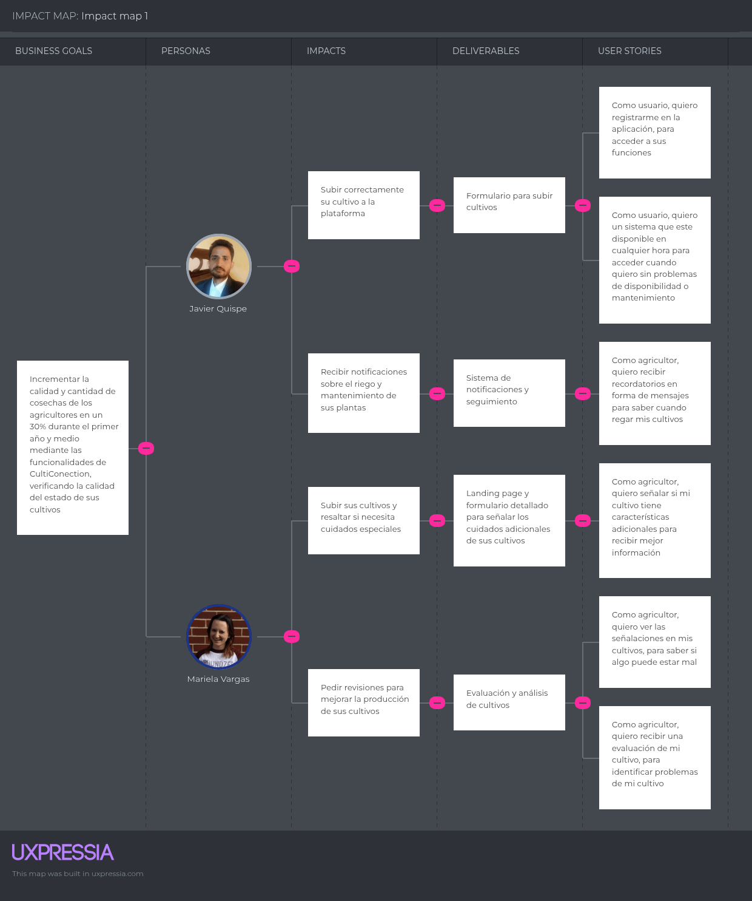

## 3.4. Product Backlog.

<table>
  <thead>
    <tr>
      <th> #Orden</th>
      <th> User Story ID</th>
      <th> Título</th>
      <th> Descripción</th>
      <th> Story Points (1/2/3/5/8)</th>
      <th> Epic ID</th>
    </tr>
  </thead>
  <tbody>
    <tr>
      <th> EP01</th>
      <th> Gestion de usuarios </th>
      <th></th>
      <th>Como usuario de CultiConection, quiero crear un perfil, modificarlo, abrir y cerrar sension en cualquier dispositivo y recuperar la contraseña de mi cuenta para crear mi identidad dentro de la aplicacion y acceder a sus funcionalidades.</th>
      <th></th>
      <th>01</th>
    </tr>
    <tr>
      <th> 1</th>
      <th> US01 </th>
      <th>Registro de cuenta</th>
      <th>Como usuario, quiero registrarme en la aplicacion, para acceder a sus funciones</th>
      <th>2</th>
      <th>01</th>
    </tr>
    <tr>
      <th> 2</th>
      <th> US02 </th>
      <th>Inicio de Sesión</th>
      <th>Como usuario, quiero iniciar sesion, para acceder a mi cuenta</th>
      <th>1</th>
      <th>01</th>
    </tr>
    <tr>
      <th> 3</th>
      <th> US03 </th>
      <th>Recuperar Contraseña</th>
      <th>Como usuario, quiero recuperar la contraseña de mi cuenta, para recuperar el acceso a ella en caso se me olvide</th>
      <th>3</th>
      <th>01</th>
    </tr>
    <tr>
      <th> 4</th>
      <th> US04 </th>
      <th>Editar perfil</th>
      <th>Como usuario, quiero modificar mi perfil, para mantenerlo actualizado todo el tiempo</th>
      <th>1</th>
      <th>01</th>
    </tr>
    <tr>
      <th> EP02</th>
      <th> Publicacion de Cultivos </th>
      <th></th>
      <th> Como usuario de CultiConection, quier crear, eliminar y editar cultivos para tener un control de ellos en tiempo real y actualizado usando las funcionalidades de CultiConection.  </th>
      <th></th>
      <th>02</th>
    </tr>
    <tr>
      <th> 5</th>
      <th> US05 </th>
      <th>Registrar cultivos</th>
      <th>Como agricultor, quiero registrar diferentes cultivos, para mantener un registro a mi alcance</th>
      <th>3</th>
      <th>02</th>
    </tr>
    <tr>
      <th> 6</th>
      <th> US06 </th>
      <th>Eliminar cultivos</th>
      <th>Como agricultor, quiero eliminar los cultivos que desee, para mantener un registro actualizado</th>
      <th>2</th>
      <th>02</th>
    </tr>
    <tr>
      <th> 7</th>
      <th> US07 </th>
      <th>Editar cultivos</th>
      <th>Como agricultor, quiero editar los cultivos que tenga registrados, para asegurarme que siempre esten actualizados</th>
      <th>1</th>
      <th>02</th>
    </tr>
    <tr>
      <th> EP03</th>
      <th> Evaluaciones de cultivos </th>
      <th></th>
      <th> Como usuario a CultiConection, quiero pedir y recibir evaluaciones de los cultivos que sienta que puedan mejorar para evitar perdidas o una posible muerte de los cultivos por un mal cuidado del que no sepa. </th>
      <th></th>
      <th>03</th>
    </tr>
    <tr>
      <th> 8</th>
      <th> US08 </th>
      <th>Peticion de evaluacion</th>
      <th>Como agricultor, quiero pedir una revision, para comprobar si el estado de mis cultivos es el adecuado</th>
      <th>3</th>
      <th>03</th>
    </tr>
    <tr>
      <th> 9</th>
      <th> US09 </th>
      <th>Recepción de evaluación</th>
      <th>Como agricultor, quiero reibir una evaluacion de mi cultivo, para identificar problemas de mi cultivo</th>
      <th>5</th>
      <th>03</th>
    </tr>
    <tr>
      <th> 10</th>
      <th> US10 </th>
      <th>Pago por evaluaciones</th>
      <th>Como usuario, quiero pagar por una evaluacion de mi cultivo para asegurar un trabajo de calidad</th>
      <th>5</th>
      <th>03</th>
    </tr>
    <tr>
      <th> EP04</th>
      <th> Mantenimiento de cultivos </th>
      <th></th>
      <th> Como usuario de CultiConection, quiero señalar y recibir señales de datos que necesiten mantenimiento en mi cultivo para asi enfocarme en mejorar y revisar evitando perdidas. </th>
      <th></th>
      <th>04</th>
    </tr>
    <tr>
      <th> 11</th>
      <th> US11 </th>
      <th>Señalaciones</th>
      <th>Como agricultor, quiero ver la señalaciones en mis cultivos, para saber si algo puede estar mal</th>
      <th>2</th>
      <th>04</th>
    </tr>
      <th> 12</th>
      <th> US12 </th>
      <th>Datos adicionales</th>
      <th>Como agricultor, quiero señalar si mi cultivo tiene características adicionales, para recibir mejor informacion</th>
      <th>2</th>
      <th>04</th>
    </tr>
    <tr>
      <th> EP05</th>
      <th> Notificaciones de estado del cultivo</th>
      <th></th>
      <th> Como usuario de CultiConection, quiero recibir notificaciones personalizadas y adaptadas a mis cultivos para no olvidar los cuidados o si muchos de sus datos estan desactualizados antes de perdir una evaluacion. </th>
      <th></th>
      <th>05</th>
    </tr>
    </tr>
      <th> 13</th>
      <th> US13 </th>
      <th>Notificacion de riego</th>
      <th>Como agriultor, quiero reibir recordatorios en forma de mensajes, para saber cuando regar mis cultivos</th>
      <th>1</th>
      <th>05</th>
    </tr>
    </tr>
      <th> 14</th>
      <th> US14 </th>
      <th>Recordatorio de datos del cultivo</th>
      <th>Como agricultor, quiero recibir recordatios de los datos de mi cultivo, en caso necesite actualizarlos</th>
      <th>2</th>
      <th>05</th>
    </tr>
    <tr>
      <th> EP06</th>
      <th> Seguridad de informacion </th>
      <th></th>
      <th> Como administrador de CultiConection, quiero gestionar y cuidar el perfil de mis usuario, para asegurar su estadia dentro de la aplicacion y no sientan un riesgo de ssu datos al navegar dentro de ella. </th>
      <th></th>
      <th>06</th>
    </tr>
    </tr>
      <th> 15</th>
      <th> US15 </th>
      <th>Gestionar usuarios</th>
      <th>Como administrador, quiero verificar y gestionar a los usuarios registrados, para una correcta administracion de la aplicacion</th>
      <th>5</th>
      <th>06</th>
    </tr>
    </tr>
      <th> 16</th>
      <th> US16 </th>
      <th>Bloqueo de cuenta</th>
      <th>Como administrador, quiero asegurar el acceso al perfil de los usuarios, para mantener su informacion segura</th>
      <th>3</th>
      <th>06</th>
    </tr>
    <tr>
      <th> EP07</th>
      <th> Historial de cultivo </th>
      <th></th>
      <th> Como usuario de CultiConection, quiero tener un historial actualizado de los cambios y modificaciones que pueda hacerle a mi cultivo, para saber en que paso pudo cambiar el rendimiento de mi cultivo. </th>
      <th></th>
      <th>07</th>
    </tr>
    </tr>
      <th> 17</th>
      <th> US17 </th>
      <th>Creacion de historial</th>
      <th>Como agricultor, quiero acceder a un historial de los cambios del cultivo para mantener un registro detallado</th>
      <th>3</th>
      <th>07</th>
    </tr>
    <tr>
      <th> EP09</th>
      <th> Accesibilidad  </th>
      <th></th>
      <th> Como usuario de CultiConection, quiero funcionalidades que ayuden a que la aplicacion sea mas accesible en aspectos como color, configuracion y optimizacion para no tener problemas durante su uso. </th>
      <th></th>
      <th>09</th>
    </tr>
    </tr>
      <th> 18</th>
      <th> US18 </th>
      <th>Atajos sencillos</th>
      <th>Como usuario, quiero tener acceso a atajos de organización para
      una mejor navegación dentro de la aplicacion</th>
      <th>2</th>
      <th>09</th>
    </tr>
    </tr>
      <th> 19</th>
      <th> US19 </th>
      <th>Disponibilidad de sistema</th>
      <th>Como usuario, quiero un sistema que esté disponible en cualquier
      hora para acceder cuando quiero sin problema de disponibilidad o
      mantenimiento</th>
      <th>1</th>
      <th>09</th>
    </tr>
    <tr>
      <th> EP10</th>
      <th> User Experience en la Landing Page </th>
      <th></th>
      <th> Como usuario de CultiConection, quiero navegar por una Landing Page con una experiencia de usuario fluida y agil, para verificar y experimentar sus funcionalidades y el acceso a la informacion util del producto. </th>
      <th></th>
      <th>10</th>
    </tr>
    </tr>
      <th> 20</th>
      <th> US20 </th>
      <th>Visualizar página de inicio</th>
      <th>Como usuario, quiero visualizar una página de inicio clara para
      comprender rápidamente de qué trata CultiConection</th>
      <th>3</th>
      <th>10</th>
    </tr>
    </tr>
      <th> 21</th>
      <th> US21 </th>
      <th>Navegación desde el footer</th>
      <th>Como usuario, quiero acceder a enlaces de navegación en el footer
      para moverme entre secciones fácilmente</th>
      <th>2</th>
      <th>10</th>
    </tr>
  </tbody>
</table>

# Capítulo IV: Product Design

## 4.1. Style Guidelines.

### 4.1.1. General Style Guidelines.

<h3>Branding</h3>

El logo de CultivApp refleja de manera elegante y minimalista la propuesta de valor de la marca en el sector agrícola. Su diseño, basado en una tipografía negra sobre fondo blanco, transmite sobriedad, confianza y profesionalismo, garantizando una excelente legibilidad en cualquier soporte, ya sea digital o físico.

En la parte superior, la figura estilizada de una planta representa la innovación y sostenibilidad, valores fundamentales de la experiencia que CultivApp busca ofrecer.

La composición mantiene un equilibrio armonioso entre modernidad y simplicidad, ideal para una plataforma tecnológica orientada a conectar personas con soluciones agrícolas accesibles, rápidas y ecológicas. La elección de una paleta monocromática refuerza la seriedad de la propuesta.

Con este logo, CultivApp se posiciona como una marca confiable, eficiente y comprometida con la transformación del sector agrícola, adaptándose a las necesidades de estudiantes, profesionales y empresas.

***Logo original***


<h3>Typography</h3>

La tipografía de nuestra app  refleja dinamismo, innovación y accesibilidad, alineándose con los valores de sostenibilidad y movilidad inteligente que representamos.

La fuente principal será "Montserrat", que por su diseño minimalista y esbelto permite que los usuarios puedan consultar información rápida mientras se desplazan.

Para lograr una jerarquía visual clara, los títulos y subtítulos tendrán un tamaño más prominente que el cuerpo del texto. Los títulos (H1, H2) enfatizan energía y movimiento, mientras que los textos secundarios mantienen un tono amigable y sencillo.

El cuerpo del texto usará un tamaño base adaptable, que garantice lectura sin esfuerzo tanto en pantallas pequeñas (smartphones) como en tablets. Se mantendrá un interlineado aireado y márgenes equilibrados para no saturar la interfaz.

El lenguaje será directo y motivador, usando un tono casual que inspire confianza y fomente la adopción de alternativas de transporte sostenible.

<h3>Colors</h3>

La paleta de colores de nuestra app  fue diseñada para reforzar el impacto visual del logo y proyectar dinamismo, sostenibilidad y confianza. El blanco se mantiene como base, representando simplicidad, limpieza y espacios abiertos, facilitando que los elementos clave destaquen sin saturar la vista.

El negro profundo del logo se utiliza en tipografía principal y elementos estructurales, comunicando seriedad y profesionalismo. Para transmitir energía y movimiento, incorporamos un verde lima brillante (#18FA3A) como color de acento, ideal para botones de acción (reservar, iniciar viaje) y mensajes de confirmación. Este tono evoca sostenibilidad y vitalidad, conectando con la misión de promover transporte limpio.

Un gris color (#EEEEEE) complementa la paleta y refuerza la percepción tecnológica de la plataforma, utilizado en íconos interactivos y estados activos. Además, tonos gris claro (#EAEAEA) y gris oscuro (#4F4F4F) equilibran la interfaz, mejorando la legibilidad y jerarquizando la información.

---

#### Paleta de colores - CultivApp

| **Color**        | **Uso**                                                                 | **Código Hex** |
|------------------|-------------------------------------------------------------------------|---------------|
| Blanco           | Fondo principal de la interfaz, espacios vacíos, sensación de limpieza y orden. | `#FFFFFF`     |
| Negro profundo   | Logo, textos principales, íconos y elementos estructurales.              | `#000000`     |
| Verde energía    | Botones de acción (reservar, iniciar viaje), confirmaciones y mensajes de éxito. | `#18FA3A`     |
| Gris claro       | Fondos secundarios, separadores, tarjetas de información.                | `#D9D9D9`     |
| Gris medio       | Texto secundario, íconos inactivos, descripciones y estados deshabilitados. | `#A6A6A6`     |


### 4.1.2. Web Style Guidelines.

## 4.2. Information Architecture.

### 4.2.1. Organization Systems.

Para la **landing page** de CultivApp, se ha optado por una estructura jerárquica para ambos segmentos de usuarios, ya que se cuenta con una barra de navegación superior que dirige a diferentes secciones, cada una encapsulando información relevante y relacionada.

Para el proceso de inicio de sesión o creación de cuenta, se utiliza una organización lineal, permitiendo que el usuario avance paso a paso a medida que completa los datos requeridos hasta finalizar el registro o acceso.

Dentro de la aplicación principal, se mantiene una organización jerárquica para separar y encapsular las distintas funcionalidades, independientemente del tipo de usuario. Esto asegura que, aunque los usuarios tengan diferentes necesidades y accesos, la estructura de la aplicación sea coherente y fácil de navegar.

#### Agricultor:
Para los **agricultores**, la funcionalidad principal es la gestión de cultivos y parcelas. Por ello, la organización jerárquica permite agrupar subfuncionalidades como ***el registro de nuevos cultivos, monitoreo de parcelas, historial de actividades y notificaciones***, todas relacionadas con la gestión agrícola.

#### Asociación o Empresa:
En el caso de **asociaciones o empresas agrícolas**, también se emplea una organización jerárquica para gestionar múltiples parcelas, usuarios y reportes. Además, se pueden acceder a funcionalidades específicas como ***la supervisión de cultivos, generación de informes y administración de usuarios asociados***.

Finalmente, para funcionalidades comunes como la edición de perfil, gestión de notificaciones o cierre de sesión, se mantiene la organización jerárquica, asegurando que todas estas opciones estén claramente segmentadas y accesibles para todos los usuarios.

### 4.2.2. Labeling Systems.

### 4.2.3. SEO Tags and Meta Tags

**Titulo:**
```html
<title>CultivApp</title>
```

**Codificación de carácteres:**
```html
<meta charset="utf-8">
```

**Descripción:**
```html
<meta name="description" content="CultivApp is a web application focused on Advanced IoT technology for smart crop monitoring.">
```

**Autor y Derechos de Autor:**
```html
<meta name="author" content="CultiConection">
<meta name="copyright" content="Copyright CultiConection team" />
```


### 4.2.4. Searching Systems.

El sistema integral de CultivApp contará con un **módulo de búsqueda y localización en tiempo real**, que permitirá a los usuarios identificar la ubicación y el estado de sus cultivos, parcelas y recursos agrícolas de manera eficiente. Este sistema se basa en las siguientes características:

**Geolocalización en tiempo real:**  
Cada parcela o cultivo podrá estar asociada a dispositivos GPS o sensores IoT, que enviarán información actualizada sobre su ubicación y condiciones directamente a la plataforma central.

**Mapa interactivo en la aplicación web y móvil:**  
La aplicación mostrará un mapa donde los usuarios podrán visualizar la ubicación exacta de sus cultivos, áreas de riego, sensores y otros recursos, diferenciados por tipo y estado.

**Filtros de búsqueda avanzada:**  
Los usuarios podrán buscar y filtrar información según:

- Tipo de cultivo o recurso.
- Estado de crecimiento o condición del cultivo.
- Ubicación geográfica dentro del terreno.
- Necesidades específicas (riego, fertilización, cosecha, etc.).

**Acciones inmediatas:**  
Una vez identificado un cultivo o recurso, el usuario podrá acceder rápidamente a su ficha técnica, registrar actividades (riego, fertilización, monitoreo), o programar alertas y recordatorios.

**Optimización para asociaciones y empresas agrícolas:**  
En el caso de usuarios corporativos, el sistema de búsqueda permitirá visualizar y gestionar múltiples parcelas o cultivos distribuidos en diferentes ubicaciones, facilitando la supervisión y toma de decisiones a gran escala.

Con este enfoque, el sistema de búsqueda de CultivApp se convierte en un **componente esencial para la experiencia del usuario**, asegurando eficiencia en la gestión agrícola y optimizando el uso de los recursos disponibles.

### 4.2.5. Navigation Systems.

El sistema integral de CultivApp contará con un **módulo de navegación inteligente** que facilitará a los usuarios la gestión y supervisión de sus cultivos, parcelas y recursos agrícolas, optimizando el monitoreo y la toma de decisiones en campo. Este módulo se estructura en las siguientes funciones:

**Guía hacia la parcela o recurso seleccionado:**  
Una vez seleccionado un cultivo, parcela o recurso en la aplicación, el sistema mostrará la ruta más eficiente desde la ubicación actual del usuario hasta el destino dentro del terreno agrícola, utilizando mapas interactivos en tiempo real.

**Navegación durante el recorrido:**  
El sistema proporcionará indicaciones para que el usuario se desplace de manera eficiente dentro de la finca o campo, evitando zonas restringidas o de difícil acceso. Para ello, se integrarán APIs de mapas inteligentes como ***Google Maps o Mapbox***, adaptadas a entornos agrícolas.

**Seguridad y recomendaciones en la navegación:**  
- Alertas sobre zonas de riesgo, áreas en mantenimiento o condiciones adversas (por ejemplo, inundaciones o suelos inestables).
- Recomendaciones de rutas seguras y óptimas para maquinaria agrícola, personal o vehículos de campo.
- Opciones de personalización (ruta más corta, más segura o que pase por puntos de interés como sensores o estaciones de riego).

**Gestión de puntos clave y recursos:**  
La navegación incluirá la localización de puntos estratégicos como almacenes, estaciones de riego, sensores IoT, áreas de carga y descarga, o zonas de acopio, facilitando la logística y el control de recursos.

**Soporte para asociaciones y empresas agrícolas:**  
En el caso de usuarios corporativos, el sistema de navegación permitirá sugerir rutas entre diferentes parcelas, campos o instalaciones, optimizando la supervisión y el desplazamiento del personal.

En conjunto, este módulo no solo ofrece orientación geográfica en tiempo real, sino que también optimiza la experiencia de gestión agrícola, mejorando la seguridad y eficiencia de las operaciones en campo y reduciendo la incertidumbre en la toma de decisiones.

## 4.3. Landing Page UI Design.


### 4.3.1. Landing Page Wireframe.

- Navbar  

- Hero  

- About Us Section.  

- Features Section.  

- Pricing Section.

- Sponsors Section.

- Footer Section.  

  

### 4.3.2. Landing Page Mock-up.

- Navbar  

- Hero  

- About Us Section.  

- Features Section.  

- Pricing Section.

- Sponsors Section.

- Footer Section.  


## 4.4. Web Applications UX/UI Design.

### 4.4.1. Web Applications Wireframes.

Diseño para visualizar la edición de perfil y cuentas de usuario.


Servicios de la aplicación.


### 4.4.2. Web Applications Wireflow Diagrams.

### 4.4.2. Web Applications Mock-ups.


### 4.4.3. Web Applications User Flow Diagrams.

These are diagrams that visually represent the path a user takes within a web application — from the first interaction to completing a specific goal (for example, signing up, purchasing, or submitting a form).


## 4.5. Web Applications Prototyping.

Web Applications Prototyping es una metodología esencial en el desarrollo de aplicaciones web, que implica la creación de bocetos visuales o modelos preliminares de una aplicación antes de su implementación completa. 

[Ver video de Landing Page en Google Drive](https://drive.google.com/file/d/1qCTM9e2YOJkWyPt9eAu8up6ohTb8QGHl/view?usp=sharing)

## 4.6. Domain-Driven Software Architecture.

Esta parte se expone la arquitectura de software del proyecto CultiConection. La propuesta fue elaborada con un enfoque orientado al dominio, de manera que los elementos más relevantes de la plataforma estén correctamente representados y respondan a los requerimientos de los usuarios. Seguidamente, se incluyen diagramas esenciales que ilustran la interacción entre los distintos componentes del sistema y los actores externos.

### 4.6.1. Design-Level Event Storming.

En esta sección, presentamos el Design Level Event Storming desarrollado para nuestro proyecto CultiConection. Esta actividad nos permitió profundizar en los detalles del dominio, definiendo de manera clara los eventos, comandos, agregados y políticas que guían el comportamiento del sistema. El objetivo fue transformar la visión general en un diseño más estructurado, asegurando que los límites contextuales y las interacciones entre componentes quedaran bien definidos

- Bounded Context User Management 


- Bounded Context Cultivos Management


- Bounded Context Area Management


- Bounded Context Evaluation Management


### 4.6.2. Software Architecture Context Diagram.

El diagrama de contexto de CultiConection ofrece una visión global de las interacciones principales entre el sistema central y los actores externos que lo rodean. La plataforma está orientada a simplificar la gestión y supervisión de cultivos por parte de los usuarios. En este nivel, se identifican actores clave como el Agricultor, encargado de registrar y administrar sus cultivos, y la Asociación, que envía las evaluaciones correspondientes. Asimismo, se muestran las integraciones externas más relevantes: la Pasarela de Pago para procesar transacciones con las asociaciones, el Servicio de Mapas para visualizar la ubicación de los cultivos y las Redes Sociales para compartir información de manera pública. Esta representación de alto nivel permite entender de manera clara cómo CultiConection se relaciona y coopera con su ecosistema digital y humano.


### 4.6.3. Software Architecture Container Diagrams.

El diagrama de contenedores detalla la organización interna de CultiConection, mostrando cómo los diferentes componentes de software trabajan en conjunto para brindar la funcionalidad de la plataforma. La Aplicación Web, implementada en React, sirve como punto de interacción donde los usuarios pueden registrar y gestionar sus cultivos. Esta interfaz se conecta con una API en Node.js, que cumple el rol de enlace entre la capa de presentación y los servicios del backend. La información esencial de usuarios, cultivos, registros, evaluaciones y pagos se almacena en una Base de Datos PostgreSQL. Asimismo, se integran contenedores adicionales como el Servicio de Mapas (basado en Google Maps API) para la visualización de ubicaciones y la Pasarela de Pago (Stripe), destinada a la gestión de transacciones. En conjunto, este nivel del modelo permite comprender cómo se estructuran y comunican las partes técnicas del sistema.


### 4.6.4. Software Architecture Components Diagrams.

El diagrama de componentes pone el foco en la arquitectura interna de la API de CultiConection, encargada de coordinar la lógica de negocio central de la plataforma. Esta API, desarrollada en Node.js, se organiza en distintos componentes especializados, cada uno orientado a un dominio concreto. El Componente de Gestión de Usuarios administra la autenticación y los perfiles; Gestión de Cultivos permite realizar operaciones sobre los cultivos registrados; Control de Cultivos abarca el ciclo completo de cuidado de cada cultivo; Ubicaciones y Terrenos gestiona la localización de los cultivos registrados; y Reporte de Evaluaciones procesa tanto los informes como los pagos asociados a dichas evaluaciones. La interacción entre estos módulos sigue un flujo funcional definido: los agricultores administran cultivos, estos se asocian a cuentas y pueden ser evaluados. Esta separación de responsabilidades refleja un diseño guiado por el dominio, donde cada componente encapsula una función específica y colabora con los demás para dar soporte integral a la plataforma junto a los Bounded Countext desarrollados que explicacion de forma aun mas detallada la funcionalidad de cada componente existente de la plataforma CultiConection.


## 4.7. Software Object-Oriented Design.

El diagrama de clases nos ayuda a definir la funcionalidad de el producto de CultiConection mediante los atributos y funcionalidades de las clases de nuestras entidades relacionadas al funcionamiento del producto, desde interfaces, clases y atributos.

### 4.7.1. Class Diagrams.


## 4.8. Database Design.

El diagrama de base de datos nos ayudara a la correcta definicion de entidades dentro de la base de datos funcional de CultiConection, definiendo que entidades se vinculan mediante las id's principales para la correcta organizacion y manejo de informacion.

### 4.8.1. Database Diagrams.


# Bibliografía

# Anexos
