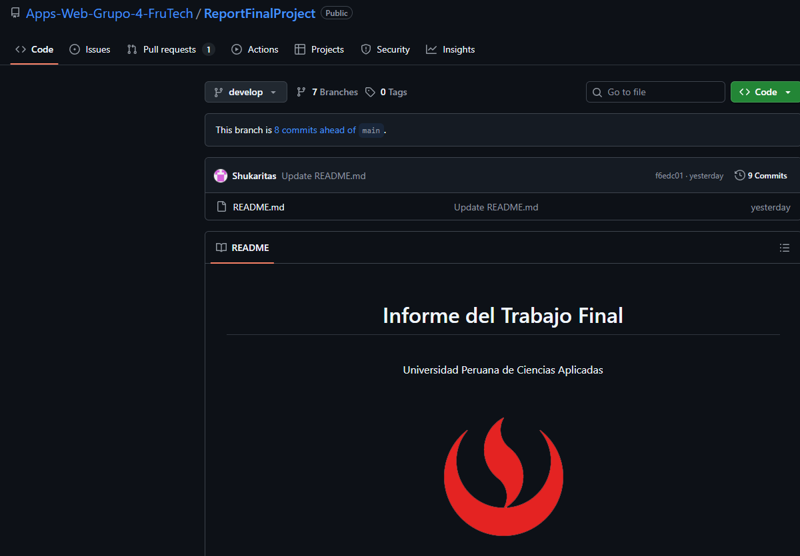
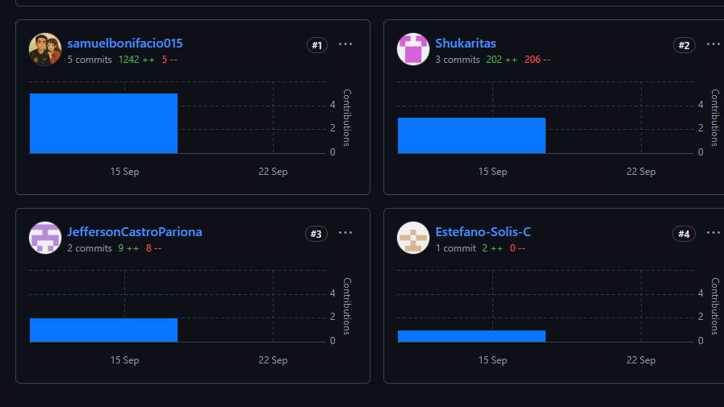
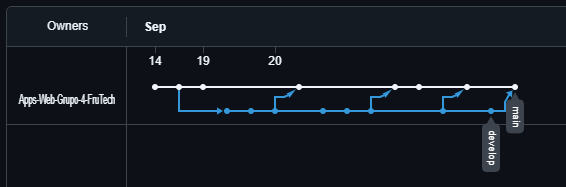
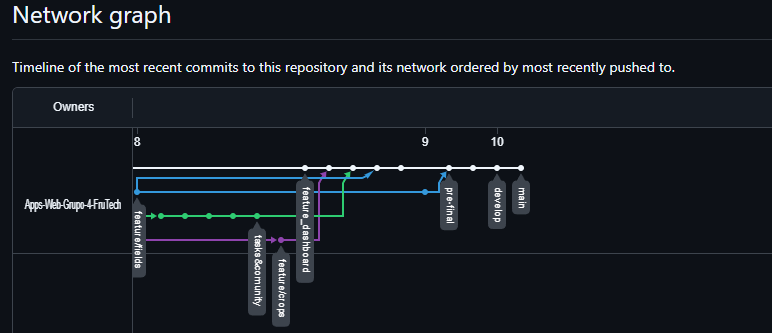
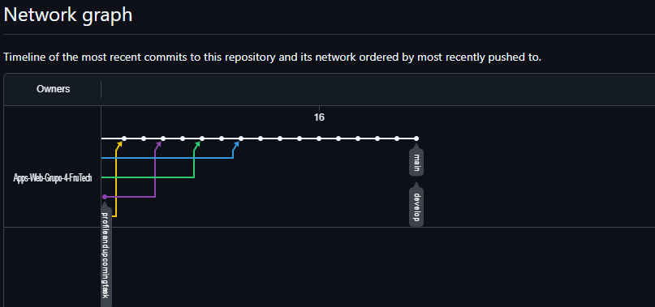
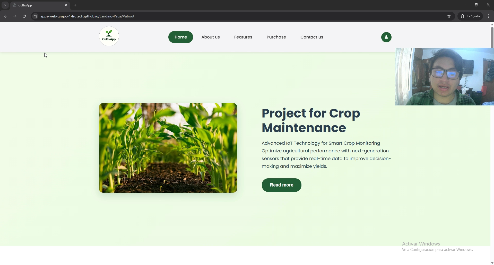

# Capítulo V: Product Implementation, Validation & Deployment.
## 5.1. Software Configuration Management.

Esta guía define las decisiones y acuerdos fundamentales para el desarrollo, mantenimiento y despliegue de la aplicación **CultiConnection**, que gestiona el alquiler de vehículos. El objetivo es asegurar la coherencia, eficiencia y calidad a lo largo del ciclo de vida del proyecto.

---

### 5.1.1. Software Development Environment Configuration.

<table border="1">

  <tr>
    <td>Project Management</td>
    <td><h4>Github</h4>Plataforma en línea que permite almacenar código fuente en repositorios. Gracias a la tecnología de control de versiones de Git se puede organizar el código y llevar un mejor trabajo en conjunto.</td>
  </tr>
  <tr>
    <td></td>
    <td><h4>Whatsapp</h4>Red Social destinada a la comunicación donde se realizaron acuerdos y recordatorios de las reuniones.</td>
  </tr>
  <tr>
    <td></td>
    <td><h4>Trello</h4>Software de administración y gestión de proyectos que se utilizó para establecer y designar las tareas</td>
  </tr>
  <tr>
    <td>Requirements Management</td>
    <td><h4>Miro</h4>Plataforma en línea de gestión de requisitos que permite colaborar y organizar proyectos de forma visual y representativa.
</td>
  </tr>
  <tr>
    <td>Product UX/UI Design</td>
    <td><h4>Figma</h4>Aplicación que permite el diseño libre de interfaces a través de las múltiples herramientas que ofrece. Permitiendo la creación de prototipos interactivos que simulan la experiencia de usuario.
</td>
  </tr>
  <tr>
    <td>Software Development</td>
    <td><h4>Git</h4>Es un software de control de versiones para los trabajos en equipos y confiabilidad del desarrollo.</td>
  </tr>
  <tr>
    <td></td>
    <td><h4>Node.js</h4>Node.js es un entorno de ejecución de JavaScript del lado del servidor, que permite desarrollar aplicaciones web escalables y de alto rendimiento fuera del navegador.</td>
  </tr>
  <tr>
    <td></td>
    <td><h4>HTML</h4>Lenguaje de etiquetas, utilizado para la estructuración y la presentación de contenido.</td>
  </tr>
  <tr>
    <td></td>
    <td><h4>CSS</h4>CSS es un lenguaje utilizado para estilizar y dar formato a documentos HTML.</td>
  </tr>
  <tr>
    <td></td>
    <td><h4>JavaScript</h4>JavaScript es un lenguaje de programación de alto nivel, interpretado y multi-paradigma, utilizado para crear interactividad en páginas web.</td>
  </tr>
  <tr>
    <td></td>
    <td><h4>VSCode</h4>Es un editor de código fuente con extensiones que ayudan al desarrollo.</td>
  </tr>
    <tr>
    <td></td>
    <td><h4>WebStorm</h4>Es un IDE centrado en el desarrollo frontend, por su variedad de herramientas que agilizan el proceso de desarrollo.</td>
  </tr>
  <tr>
    <td></td>
    <td><h4>Vue.js</h4>Framework basado en Single Page Applications para el desarrollo de frontend</td>
  </tr>
  <tr>
    <td>Software Deployment</td>
    <td><h4>Github Pages</h4>Plataforma que nos permite realizar el despliegue de nuestro landing page.</td>
  </tr>
</table>

---

### 5.1.2. Source Code Management.

Hemos optado por crear un repositorio en GitHub para nuestro proyecto, tanto para el informe como para la landing page. Esto facilitó la colaboración entre los miembros del equipo,aprovechando las herramientas útiles que esta plataforma ofrece para el manejo del código fuente y sus versiones.


- URL del repositorio Report en GitHub: https://github.com/Apps-Web-Grupo-4-FruTech/ReportFinalProject
- URL del repositorio Landing Page en GitHub: https://github.com/Apps-Web-Grupo-4-FruTech/Landing-Page
- URL del repositorio Frontend en GitHub: https://github.com/Apps-Web-Grupo-4-FruTech/Frontend-FruTech

---


### 5.1.3. Source Code Style Guide & Conventions.

Para "**CultiConnection**", hemos utilizado "**HTML y CSS**". Para estructurar el contenido usamos etiquetas de section y divisiones para contenido específico de cada una de las secciones. Además, hemos empleado atributos como ***HTML Style*** para personalizar el aspecto visual, definiendo propiedades como color, tamaño de fuente y tipo de letra.

Para resaltar elementos importantes, hemos aplicado ***HTML Text Formatting***, incluyendo etiquetas como b para negrita, strong para resaltado y del para mostrar cambios de precios. En cuanto a la navegación, hemos implementado una barra de navegación horizontal utilizando **CSS** para mejorar la experiencia del usuario al explorar el contenido.

Los formularios, creados con **CSS**, permiten a los usuarios ingresar información relevante, como detalles de inicio de sesión, información de pago y dirección de envío. Para añadir interactividad, hemos agregado botones con efectos hover utilizando CSS y paginación CSS para facilitar la navegación entre las diferentes páginas de productos.

Finalmente, en el **footer**, hemos incluido enlaces a las redes sociales de la organización para brindar a los usuarios una forma adicional de conectarse y seguir nuestras actualizaciones.

### 5.1.4. Software Deployment Configuration.

Utilizaremos GitHub Pages para alojar nuestra Landing Page. Para lograrlo, subiremos los archivos esenciales (HTML, CSS, etc.) a un repositorio público en GitHub. De
esta manera, nuestra página estará disponible en línea y accesible para todos los usuarios.



## 5.2. Landing Page, Services & Applications Implementation.
### 5.2.1. Sprint 1
#### 5.2.1.1. Sprint Planning 1.

| Elemento                        | Detalle                                                                                       |
|----------------------------------|----------------------------------------------------------------------------------------------|
| **Sprint**                      | 1 - Implementación de funcionalidades básicas y diseño inicial de CultiConnection                   |
| **Sprint Planning Background**   |                                                                                              |
| **Fecha**                       | 20/09/2025                                                                                   |
| **Hora**                        | 20:00 horas (GMT-5)                                                                          |
| **Lugar**                       | Reunión virtual mediante Discord                                                              |
| **Preparado por**               | [FruTech]                                                       |
| **Asistentes**                  | [ Samuel Bonifacio , Jefferson Castro, Bruce Via, Sergio Landa, Estefano Solis ]                                                             |
| **Sprint n-1 Review**           | Se creó la organización de CultiConnection en GitHub, se definieron ramas y se asignaron tareas iniciales como investigación de usuarios, wireframes y mockups. |
| **Sprint n-1 Retrospective**    | Se implementó la estructura básica de la landing page utilizando HTML, CSS y JavaScript.      |
| **Sprint Goal & User Stories**  |                                                                                              |
| **Sprint 1 Velocity**           | 20 puntos                                                                                    |
| **Sum of Story Points**         | 20 puntos                                                                                    |

#### Objetivo del Sprint
Implementar la estructura inicial de la aplicación, el diseño de la landing page y las funcionalidades básicas de registro e inicio de sesión para los usuarios de CultiConnection.

#### User Stories seleccionadas para el Sprint 1

| ID  | User Story                                                                                  | Puntos |
|-----|---------------------------------------------------------------------------------------------|--------|
| 1   | Como usuario, quiero poder registrarme en la plataforma para acceder a las funcionalidades.  |   5    |
| 2   | Como usuario, quiero iniciar sesión para gestionar mis cultivos o recursos.                  |   5    |
| 3   | Como visitante, quiero visualizar la landing page con información clara sobre CultiConnection.     |   4    |
| 4   | Como usuario, quiero navegar entre las secciones principales desde la barra de navegación.   |   3    |
| 5   | Como usuario, quiero acceder a enlaces de contacto y redes sociales desde el footer.         |   3    |

**Total de puntos:** 20

---

#### 5.2.1.2. Aspect Leaders and Collaborators

En esta sección se presenta la matriz de liderazgo y colaboración (Leadership-and-Collaboration Matrix, LACX) para el Sprint 1 de CultiConnection. Esta matriz identifica, para cada aspecto clave del Sprint, quién es el líder responsable y quiénes son los colaboradores, facilitando así la comunicación y la asignación de tareas dentro del equipo. 

Los aspectos considerados en este Sprint incluyen: diseño de la landing page, desarrollo de funcionalidades de registro e inicio de sesión, implementación de la barra de navegación, y configuración del footer con enlaces de contacto y redes sociales.

| Team Member (Apellido, Nombre)         | GitHub Username      | Landing Page Design | Registro/Inicio de Sesión | Barra de Navegación | Footer y Redes Sociales |
|----------------------------------------|----------------------|---------------------|--------------------------|---------------------|------------------------|
| Bonifacio, Samuel                     | samuelbonifacio015      | L                   | L                       | L                   | L                      |
| Castro, Jefferson                      | JeffersonCastroPariona     | C                   | L                        | C                   | C                      |
| Via, Bruce                             | Shukaritas            | C                   | C                        | L                   | C                      |                     |
| Solis, Estefano                        | Estefano-Solis-C       | C                   | C                        | C                   | C                      |
| Landa, Sergio                        | Serkekes2006       | C                   | C                        | C                   | C                      |

**L:** Leader (Líder)  
**C:** Collaborator (Colaborador)

Esta organización permite una asignación clara de responsabilidades y fomenta la colaboración efectiva durante el desarrollo del Sprint.


#### 5.2.1.3. Sprint Backlog 1

| ID   | Title/Section                | Description                                                                                      | Estimation (Hours) | Assigned To                | Status         |
|------|------------------------------|--------------------------------------------------------------------------------------------------|--------------------|----------------------------|---------------|
| US01 | Landing Page                 | Desarrollo e implementación de la estructura y estilos de la landing page. Debe ser responsive.  | 3                  | Samuel Bonifacio           | Done          |
| US02 | Registro de Usuario          | Implementación del formulario y lógica para el registro de usuarios.                             | 3                  | Jefferson Castro           | Done          |
| US03 | Inicio de Sesión             | Desarrollo del formulario y lógica para el inicio de sesión de usuarios.                         | 3                  | Jefferson Castro           | Done          |
| US04 | Barra de Navegación          | Implementación de la barra de navegación principal, con enlaces a las secciones. Responsive.     | 2                  | Sergio Landa                  | Done          |
| US05 | Footer y Redes Sociales      | Desarrollo del footer con enlaces de contacto y redes sociales. Responsive.                      | 2                  | Estefano Solis             | Done          |
| US06 | Página de Información        | Sección informativa sobre CultiConnection y sus beneficios.                                            | 2                  | Samuel Bonifacio           | Done          |
| US07 | Validación de Formularios    | Validación de datos en los formularios de registro e inicio de sesión.                           | 2                  | Jefferson Castro           | Done          |
| US08 | Estilos Generales            | Definición y aplicación de estilos globales (colores, fuentes, espaciados, etc.).                | 1                  | Bruce Via                  | Done          |

**Leyenda de Status:**  
To-do / InProcess / ToReview / Done

---
#### 5.2.1.4. Development Evidence for Sprint Review

Durante el Sprint 1, el equipo de CultiConnection realizó múltiples commits en el repositorio de GitHub, evidenciando el avance y cumplimiento de las tareas planificadas. A continuación, se presenta una tabla con los principales commits realizados, siguiendo el formato requerido:

| Repository                                         | Branch | Commit Id | Commit Message                                 | Commit Message Body                                   | Committed on (Date)     |
|----------------------------------------------------|--------|-----------|------------------------------------------------|-------------------------------------------------------|------------------------|
| Apps-Web-Grupo-4-FruTech/Landing-Page              | main   | 42af56e   | feat: add images folder and update index.html  | Se agregó la carpeta de imágenes y se actualizó index.html. | 20/09/2025             |
| Apps-Web-Grupo-4-FruTech/Landing-Page              | main   | 5eb6b3f   | feat: add images folder and update index.html  | Se agregó la carpeta de imágenes y se actualizó index.html. | 20/09/2025             |
| Apps-Web-Grupo-4-FruTech/Landing-Page              | main   | 457c4a0   | chore: SEO and Meta tags added                 | Se añadieron mejoras en SEO y meta etiquetas.          | 20/09/2025             |
| Apps-Web-Grupo-4-FruTech/Landing-Page              | main   | 626b448   | feat: merged sections & responsive             | Se fusionaron secciones y se mejoró la responsividad.  | 20/09/2025             |
| Apps-Web-Grupo-4-FruTech/Landing-Page              | main   | c14157e   | chore: updated logo & index                    | Se actualizó el logo y la estructura principal.        | 20/09/2025             |
| Apps-Web-Grupo-4-FruTech/Landing-Page              | main   | 879b814   | feat: added features & purchase sections       | Se añadieron secciones de características y compras.   | 20/09/2025             |
| Apps-Web-Grupo-4-FruTech/Landing-Page              | main   | 6b06fef   | feat: added responsive hamburger menu          | Se implementó el menú hamburguesa responsive.          | 20/09/2025             |
| Apps-Web-Grupo-4-FruTech/Landing-Page              | main   | c911dca   | feat: merged initial setup                     | Se realizó la configuración inicial y estructura básica de la landing page. | 19/09/2025             |
| Apps-Web-Grupo-4-FruTech/Landing-Page              | main   | 31de6c2   | feat: initial setup for landing page           | Configuración inicial para la landing page.            | 19/09/2025             |

Cada commit refleja el trabajo colaborativo y el cumplimiento de los objetivos del Sprint, asegurando la trazabilidad y transparencia en el desarrollo de CultiConnection.

**Reporte de commits:**


---

#### 5.2.1.5. Execution Evidence for Sprint Review.

En esta entrega, nos centramos en el desarrollo completo de la Landing Page para nuestra plataforma de educación en línea. Nuestro objetivo es desplegar una página web atractiva y efectiva que actúe como el punto de entrada para nuestros usuarios. 

Es por ello que se comparte las evidencias de ambos repositorios para corroborar el trabajo hecho por cada uno de los participantes.




#### 5.2.1.6. Services Documentation Evidence for Sprint Review.

Para esta primera entrega no hubo implementación de APIs, pues solo se realizó la Landing Page.

#### 5.2.1.7. Software Deployment Evidence for Sprint Review.

El objetivo del primer Sprint fue el desarrollo e implementación de la Landing Page. Para eso, utilizamos GitHub y GitHub Pages. El proceso del desarrollo fue el siguiente:

1. Se creó una organización en GitHub y, dentro de ella, se crearon dos repositorios. Uno para el informe del trabajo y otro para la Landing Page 
2. Luego, a través de los commits, el equipo fue editando los archivos index.html y styles.css, además de ir añadiendo imágenes a utilizar en el directorio images. 
3. Finalmente, se implementó GitHub Pages en el repositorio de GitHub y se desplegó la Landing Page, la que se puede visitar en el siguiente link: https://apps-web-grupo-4-frutech.github.io/Landing-Page/

#### 5.2.1.8. Team Collaboration Insights during Sprint.

A continuación, se adjuntan las capturas de evidencia de los insights de los repositorios del informe y Landing Page para evidenciar la participación de todos los miembros:

- Insight Landing Page:


- Insight Report


## Conclusiones

- El desarrollo del proyecto CultiConnection ha permitido establecer una base sólida para la implementación, validación y despliegue de la aplicación de gestión de alquiler de vehículos. A través de este proceso, se han logrado los siguientes resultados clave:

- La configuración del entorno de desarrollo ha sido fundamental para el éxito del proyecto. La implementación de GitHub como plataforma principal de gestión de código fuente, junto con herramientas complementarias como Trello para la gestión de tareas y Figma para el diseño UX/UI, ha facilitado la colaboración efectiva entre los miembros del equipo. La adopción de tecnologías web estándar (HTML, CSS, JavaScript, Vue.js) y Node.js ha proporcionado una base tecnológica robusta y escalable.

- El Sprint 1 ha demostrado la efectividad de la metodología ágil en el desarrollo del proyecto. La implementación exitosa de la landing page con funcionalidades básicas de registro e inicio de sesión, navegación responsive y diseño atractivo, ha establecido una base sólida para el desarrollo futuro de la aplicación.

- La matriz de liderazgo y colaboración (LACX) ha sido instrumental en la organización del equipo, permitiendo una distribución clara de responsabilidades mientras se mantiene la colaboración entre todos los miembros. 

## 5.2.2. Sprint 2

### 5.2.2.1. Sprint Planning 2


| Elemento                        | Detalle                                                                                       |
|----------------------------------|----------------------------------------------------------------------------------------------|
| **Sprint**                      | 2 - Implementación de componentes, bounded context, db.json y enrutamiento de Frontend Web Application                 |
| **Sprint Planning Background**   |                                                                                              |
| **Fecha**                       | 9/10/2025                                                                                   |
| **Hora**                        | 23:00 horas (GMT-5)                                                                          |
| **Lugar**                       | Reunión virtual mediante Meet                                                              |
| **Preparado por**               | [FruTech]                                                       |
| **Asistentes**                  | [ Samuel Bonifacio , Jefferson Castro, Bruce Via, Sergio Landa, Estefano Solis ]                                                             |
| **Sprint n-2 Review**           | Se creó el entorno del Frontend Web Application con Vue y Javascript. Se implementó la primera versión de db.json y confiuración de enrutamiento. |
| **Sprint n-2 Retrospective**    | Se implementaron los componentes en el contexto de CultiConnection usando DDD.      |
| **Sprint Goal & User Stories**  |                                                                                              |
| **Sprint 2 Velocity**           | 42 puntos                                                                                    |
| **Sum of Story Points**         | 42 puntos                                                                                    |

#### Objetivo del Sprint
Implementar los componentes principales de la aplicación, establecer el contexto delimitado (bounded context), configurar la base de datos inicial (db.json) y definir el enrutamiento para la navegación en la aplicación web frontend de CultiConnection.

#### User Stories seleccionadas para el Sprint 2

| ID  | User Story                                                                                  | Puntos |
|-----|---------------------------------------------------------------------------------------------|--------|
| 1   | Como usuario, quiero poder registrarme en la aplicación web para acceder a sus funciones.    |   5    |
| 2   | Como usuario, quiero iniciar sesión para acceder a mi cuenta y gestionar mis cultivos.       |   5    |
| 3   | Como usuario, quiero recuperar la contraseña de mi cuenta en caso de olvido.                 |   4    |
| 4   | Como usuario, quiero modificar mi perfil para mantenerlo actualizado.                        |   4    |
| 5   | Como agricultor, quiero registrar diferentes cultivos para mantener un registro a mi alcance.|   5    |
| 6   | Como agricultor, quiero eliminar los cultivos que desee para mantener un registro actualizado.|   4    |
| 7   | Como agricultor, quiero editar los cultivos registrados para asegurarme que estén actualizados.|   4    |
| 8   | Como administrador, quiero verificar y gestionar a los usuarios registrados.                 |   4    |
| 9   | Como administrador, quiero asegurar el acceso al perfil de los usuarios para mantener su información segura.|   4    |
| 10  | Como agricultor, quiero acceder a un historial de los cambios del cultivo para mantener un registro detallado.|   3    |

**Total de puntos:** 42

### 5.2.2.2. Aspect Leaders and Collaborators

En esta sección se presenta la matriz de liderazgo y colaboración (Leadership-and-Collaboration Matrix, LACX) para el Sprint 2 de CultiConnection. Esta matriz identifica, para cada aspecto clave del Sprint, quién es el líder responsable y quiénes son los colaboradores, facilitando así la comunicación y la asignación de tareas dentro del equipo. 

Los aspectos considerados en este Sprint incluyen: diseño de la landing page, desarrollo de funcionalidades de registro e inicio de sesión, implementación de la barra de navegación, y configuración del footer con enlaces de contacto y redes sociales.

| Team Member (Apellido, Nombre)         | GitHub Username      | db.json | Vue Project Setup | BC (Task & Community) | BC (Crops, Dashboard & Fields) |
|----------------------------------------|----------------------|---------------------|--------------------------|---------------------|------------------------|
| Bonifacio, Samuel                     | samuelbonifacio015      | L                   | L                       | L                   | L                      |
| Castro, Jefferson                      | JeffersonCastroPariona     | C                   | L                        | C                   | C                      |
| Via, Bruce                             | Shukaritas            | L                   | L                        | L                   | L                      |                     |
| Solis, Estefano                        | Estefano-Solis-C       | L                   | L                        | L                   | L                      |
| Landa, Sergio                        | Serkekes2006       | C                   | C                        | C                   | C                      |

**L:** Leader (Líder)  
**C:** Collaborator (Colaborador)

Esta organización permite una asignación clara de responsabilidades y fomenta la colaboración efectiva durante el desarrollo del Sprint 2.

### 5.2.2.3. Sprint Backlog 2

| ID   | Title/Section                | Description                                                                                      | Estimation (Hours) | Assigned To                | Status         |
|------|------------------------------|--------------------------------------------------------------------------------------------------|--------------------|----------------------------|---------------|
| US01 | Registro de Usuario          | Implementación del formulario y lógica para el registro de usuarios en la aplicación web.        | 4                  | Samuel Bonifacio           | To-do         |
| US02 | Inicio de Sesión             | Desarrollo del formulario y lógica para el inicio de sesión y gestión de cultivos.               | 4                  | Jefferson Castro           | To-do         |
| US03 | Recuperar Contraseña         | Implementación de la funcionalidad para recuperar la contraseña de usuario.                      | 3                  | Bruce Via                  | To-do         |
| US04 | Editar Perfil                | Desarrollo de la funcionalidad para modificar el perfil del usuario.                             | 3                  | Estefano Solis             | To-do         |
| US05 | Registrar Cultivos           | Implementación del registro de diferentes cultivos por parte del agricultor.                     | 4                  | Samuel Bonifacio           | To-do         |
| US06 | Eliminar Cultivos            | Desarrollo de la funcionalidad para eliminar cultivos registrados.                               | 3                  | Jefferson Castro           | To-do         |
| US07 | Editar Cultivos              | Implementación de la edición de cultivos registrados.                                            | 3                  | Bruce Via                  | To-do         |
| US08 | Gestionar Usuarios           | Desarrollo de la funcionalidad para que el administrador gestione usuarios registrados.          | 3                  | Estefano Solis             | To-do         |
| US09 | Bloqueo de Cuenta            | Implementación de la seguridad para el acceso al perfil de los usuarios.                         | 3                  | Sergio Landa               | To-do         |
| US10 | Historial de Cambios         | Desarrollo de la funcionalidad para acceder al historial de cambios de los cultivos.             | 2                  | Samuel Bonifacio           | To-do         |

**Leyenda de Status:**  
To-do / InProcess / ToReview / Done

---

### 5.2.2.4. Development Evidence for Sprint Review

| Commit ID | Commit Message | User | Commit Date |
| :--- | :--- | :--- | :--- |
| `3c7acf2` | [cite_start]Update index.js [cite: 18] | [cite_start]Shukaritas [cite: 21] | Oct 10, 2025 [cite: 17] |
| `29eae95` | feature: final commit [cite: 22] | [cite_start]Shukaritas [cite: 25] | [cite_start]Oct 10, 2025 [cite: 17] |
| `2db80c7` | commits: preview final changes [cite: 27] | [cite_start]Shukaritas [cite: 30] | [cite_start]Oct 9, 2025 [cite: 26] |
| `683228` | [cite_start]Merge remote-tracking branch 'origin/main' into develop [cite: 31] | [cite_start]Shukaritas [cite: 33] | [cite_start]Oct 9, 2025 [cite: 26] |
| `c9cab99` | [cite_start]Update db.json [cite: 34] | [cite_start]Shukaritas [cite: 37] | [cite_start]Oct 9, 2025 [cite: 26] |
| `41d8990` | fixed db.json [cite: 39] | [cite_start]Estefano-Solis-C [cite: 42] | [cite_start]Oct 8, 2025 [cite: 38] |
| `aeaa6f0` | [cite_start]Merge remote-tracking branch 'origin/feature/fields' into develop [cite: 43] | [cite_start]Estefano-Solis-C [cite: 46] | [cite_start]Oct 8, 2025 [cite: 38] |
| `5167129` | [cite_start]Merge remote-tracking branch 'origin/tasks&comunity' into develop [cite: 51] | [cite_start]Estefano-Solis-C [cite: 53] | [cite_start]Oct 8, 2025 [cite: 38] |
| `e82e591` | [cite_start]Merge remote-tracking branch 'origin/feature/crops' into develop [cite: 54] | [cite_start]Estefano-Solis-C [cite: 57] | [cite_start]Oct 8, 2025 [cite: 38] |
| `f04a0be` | fixture dashboard [cite: 58] | [cite_start]Serkekes2006 [cite: 60] | [cite_start]Oct 8, 2025 [cite: 38] |
| `fa78823` | [cite_start]Add crop registration managment form [cite: 61] | [cite_start]Jefferson CastroPariona [cite: 63] | [cite_start]Oct 8, 2025 [cite: 38] |
| `d1ebf4b` | feat: community API response working [cite: 64] [cite_start]| samuelbonifacio015 [cite: 66] | [cite_start]Oct 8, 2025 [cite: 38] |
| `cf67542` | feat: added community components [cite: 67] [cite_start]| samuelbonifacio015 [cite: 70] | [cite_start]Oct 8, 2025 [cite: 38] |
| `f6766dd` | fix: update task handling [cite: 71] [cite_start]| samuelbonifacio015 [cite: 74] | [cite_start]Oct 8, 2025 [cite: 38] |
| `40b8f5d` | fix: component lang & better comments [cite: 75] [cite_start]| samuelbonifacio015 [cite: 77] | [cite_start]Oct 8, 2025 [cite: 38] |
|`3c134a3` | feat: added my-task component [cite: 78] [cite_start]| samuelbonifacio015 [cite: 80] | [cite_start]Oct 8, 2025 [cite: 38] |
|`245bee2` | feature: Modified and improve fields [cite: 81] | [cite_start]Shukaritas [cite: 84] | [cite_start]Oct 8, 2025 [cite: 38] |
| `c4bde32` | [cite_start]First update [cite: 89] | [cite_start]Estefano-Solis-C [cite: 93] | [cite_start]Oct 7, 2025 [cite: 85] |
| `e41ab39` | [cite_start]Initial commit [cite: 95] | [cite_start]Estefano-Solis-C [cite: 99] | [cite_start]Sep 14, 2025 [cite: 94] |

### 5.2.2.5. Execution Evidence for Sprint Review
- US01


<br>
- US02


<br>
- US04


<br>
- US05


<br>
- US06


<br>
- US07


### 5.2.2.6. Services Documentation Evidence for Sprint Review

En este Sprint, el enfoque principal ha sido el desarrollo completo del FrontEnd, registro de cultivos, campos y el manejo de informacion de estos. Debido a que aún no se ha implementado un backend ni servicios web, no se cuenta con endpoints
documentados ni documentación OpenAPI en esta fase. <br>
La prioridad fue lograr una experiencia de usuario funcional desde el cliente. En futuras iteraciones se documentarán las
rutas necesarias para la gestión de campos en tiempo real con su informacion, usando OpenAPI como herramienta de especificación.

----
**GitHub Proyecto CultivApp Web Service (Planeado para sprint 3)**
> URL estimada del repositorio del backend (Sprint 3) <br>
>https://github.com/Apps-Web-Grupo-4-FruTech/Backend-AgriApp

### 5.2.2.7. Software Deployment Evidence for Sprint Review
Durante este Sprint, se realizó el despliegue del frontend del sistema CultivApp, incluyendo la Landing Page, el dashboard principal junto con sus secciones principales para el nuestros usuarios, lo cual permitió acceder
fácilmente al desarrollo desde cualquier navegador, facilitando las pruebas funcionales, demostraciones internas y la
recolección de feedback en tiempo real.


- URL del repositorio: https://github.com/Apps-Web-Grupo-4-FruTech/Frontend-FruTech

> URL del despliegue <br>
> https://frontend-frutech-static.onrender.com/

**Responsable**

**- Estefano Sebastian Solis Campos:** Configuracion principal del repositorio, estructura de despliegue


### 5.2.2.8. Team Collaboration Insights during Sprint

Durante el Sprint 2, la totalidad del trabajo de implementación fue realizada por todo el equipo, quienes asumimos todas
las funciones de diseño, codificación, validación y despliegue de la solución.

| Integrante  | Acciones realizadas durante el Sprint 2                                    |
|-----|---------------------------------------------------------------------------------------------|
| Estefano Sebastian Solis Campos   | Desarrollo de la interfaz principal, rutas y perfil de usuario  |
| Bruce Via Luna   | Desarrollo de la seccion "My Fields" con sus funcionalidades                  |
| Samuel Jesus Bonifacio Jaramillo   | Desarrollo de la seccion "My Tasks" "Community" con sus funcionalidades y fusion con el landing page     |
| Jefferson Ernesto Castro Pariona   | Desarrollo de la seccion "My Crops" con sus funcionalidades   |
| Sergio Javier Landa Ortiz   | Desarrollo de la seccion "Dashboard" con sus funcionalidades         |

<br>


## 5.2.3. Sprint 4

### 5.2.3.1.Sprint Planning 4.

| Elemento | Detalle |
|-----------|----------|
| **Sprint** | 4 - Despliegue de Backend y Frontend con conexión funcional |
| **Sprint Planning Background** |  |
| **Fecha** | 2/12/2025 |
| **Hora** | 20:00 horas (GMT-5) |
| **Lugar** | Reunión virtual mediante Google Meet |
| **Preparado por** | [FruTech] |
| **Asistentes** | [ Samuel Bonifacio , Jefferson Castro, Bruce Via, Estefano Solis, Sergio Landa ] |
| **Sprint n-4 Review** | Se desplegó el backend y frontend nuevamente con la conexión necesario y documentación respectivo  |
| **Sprint n-4 Retrospective** | Se destacó la buena coordinación del equipo y la claridad en las tareas asignadas. |
| **Sprint Goal & User Stories** | 1-22 |
| **Sprint 4 Velocity** | 20 puntos |
| **Sum of Story Points** | 20 puntos |

#### Objetivo del Sprint
Desplegar el backend y frontend de CultivApp con una conexión funcional entre ambos, asegurando que los usuarios puedan interactuar con la aplicación de manera efectiva.

### 5.2.3.2. Aspect Leaders and Collaborators.

| Team Member (Apellido, Nombre) | GitHub Username | Deploy de Frontend | Deploy de Backend | Conexión de Endpoints | Documentación de Servicios | Pruebas de Integración |
|--------------------------------|------------------|-------------------------|---------------------|---------------------|-------|----------------------|
| Bonifacio, Samuel | samuelbonifacio015 | C | C | C| L | L |
| Castro, Jefferson | JeffersonCastroPariona | C | C | L | L | L |
| Landa, Sergio | Serkekes2006 | C | C | L | C | L |
| Solis, Estefano | Estefano-Solis-C | L | C | C | C | C |
| Via, Bruce | Shukaritas | L | L| L | C | C |

**L:** Leader (Líder)  
**C:** Collaborator (Colaborador)

---
### 5.2.3.3.Sprint Backlog 4.

### Sprint Backlog 4: Finalización de Backend API

| **User Story** | | **Work-Item / Task (Implementación Backend)** | | | | | |
| :--- | :--- | :--- | :--- | :--- | :--- | :--- | :--- |
| **Id** | **Title** | **Id** | **Title** | **Description** | **Est. (h)** | **Assigned To** | **Status** |
| **US-01** | Registro y Auth | T-101 | Security & JWT Implementation | Implementar generación de Tokens, encriptación de contraseñas (BCrypt) y Middleware de autorización. | 5h | Estefano-Solis-C | Done |
| **US-04** | Editar Perfil | T-102 | User Profile Update Logic | Endpoint PUT para actualizar datos del usuario. Incluye validación de unicidad de correo. | 3h | Estefano-Solis-C | Done |
| **US-12** | Recomendaciones (Comunidad) | T-103 | Community Context Implementation | Desarrollo del Bounded Context `CommunityRecommendation` (visible en carpetas) para lógica de consejos expertos. | 6h | Samuel Bonifacio | To-Review |
| **US-08** | Registro de Campo | T-201 | Fields CRUD Implementation | Implementar `FieldsController` y `FieldRepository` para crear y listar los terrenos del usuario. | 4h | Shukaritas | Done |
| **US-05** | Registrar Cultivos | T-202 | CropFields Logic & Entity | Desarrollo de la entidad central `Crop` y su persistencia en base de datos. | 4h | Shukaritas | Done |
| **US-10** | Vincular Cultivos | T-203 | Relationship Logic (Field-Crop) | Lógica de negocio para asignar un Cultivo existente a un Campo específico (Relación 1:N en BD). | 5h | Shukaritas | Done |
| **US-06** | Eliminar/Editar Cultivos | T-204 | Crop Lifecycle Endpoints | Endpoints DELETE y PUT para gestión de cultivos. Incluye "Soft Delete" (marcar como inactivo en vez de borrar). | 3h | Shukaritas | To-Review |
| **US-13** | Notificación Riego | T-301 | Task Generation Service | Servicio de dominio que calcula automáticamente las tareas de riego basadas en el tipo de cultivo. | 5h | JeffersonCastroPariona | Done |
| **US-17** | Historial Cambios | T-302 | Audit/History Logging | Implementar lógica en `Tasks` para guardar un log cada vez que se completa o modifica una tarea. | 4h | JeffersonCastroPariona | Done |
| **US-11** | Señalaciones | T-303 | Alerts & Signals Endpoint | API para enviar "flags" o alertas al frontend si una tarea (Task) está vencida. | 3h | JeffersonCastroPariona | Done |
| **Global** | Integración | T-400 | Swagger & Documentation | Configuración final de Swagger UI para que el equipo de Frontend pueda probar los endpoints. | 2h | Estefano-Solis-C | Done |

### 5.2.3.4. Development Evidence for Sprint Review

La siguiente evidencia documenta el proceso técnico de despliegue e integración realizado durante el Sprint 4, validando la operatividad de los componentes Frontend (Vue.js) y Backend (C# .NET).

#### **A. Despliegue de Frontend (Cliente Web)**
**Entorno de Desarrollo:** WebStorm IDE | **Framework:** Vue.js 3 | **Lenguaje:** JavaScript (ES6+)

El despliegue del cliente web se realizó siguiendo un flujo de integración continua local para asegurar la estabilidad de la interfaz de usuario.

* **Paso 1: Gestión de Dependencias y Compilación**
    Se ejecutó la instalación de paquetes mediante `npm install` dentro del entorno de WebStorm, asegurando que librerías críticas como `vue-router` (navegación), `axios` (peticiones HTTP) y `pinia`/`vuex` (gestión de estado) estuvieran sincronizadas.
    * **Evidencia de Build:** Se ejecutó el comando `npm run build` generando exitosamente la carpeta `/dist` con los assets minificados (HTML, CSS, JS), confirmando que no existen errores de sintaxis ni de *linting* que impidan el despliegue.

* **Paso 2: Configuración de Rutas y Navegación (SPA)**
    Se configuró el archivo `router/index.js` para manejar la navegación *Single Page Application*.
    * **Validación:** Se comprobó que las rutas `/login`, `/dashboard`, `/fields` y `/profile` cargan sus respectivos componentes (`.vue`) de manera perezosa (*lazy loading*) para optimizar el rendimiento, sin recargar el navegador.

* **Paso 3: Capa de Servicios e Integración de API**
    Para desacoplar la lógica, se creó una estructura de servicios en `src/services/` (ej. `AuthService.js`, `FieldService.js`).
    * **Implementación Axios:** Se configuró una instancia global de **Axios** que intercepta las peticiones salientes para inyectar automáticamente el Token JWT en el encabezado `Authorization: Bearer <token>`, permitiendo el acceso a las rutas protegidas del Backend C# desde el primer intento de login.

* **Paso 4: Renderizado Reactivo de Componentes**
    * **Evidencia Visual:** En la vista "Mis Campos", se utilizó la directiva `v-for` para iterar sobre el objeto JSON recibido del Backend. Se verificó que, al agregar un nuevo cultivo desde el formulario (Modal Vue), la lista se actualiza automáticamente en tiempo real (*Two-way data binding*) sin necesidad de refrescar la página.

---

#### **B. Despliegue de Backend (API RESTful)**
**Entorno de Desarrollo:** Visual Studio / Rider | **Framework:** .NET 6/8 Core | **Lenguaje:** C#

El Backend se desplegó como una arquitectura orientada a servicios (SOA/DDD), exponiendo los *Bounded Contexts* definidos en el Sprint Backlog.

* **Paso 1: Restauración y Compilación del Núcleo**
    Se verificó la integridad de la solución `FruTech.Backend.API` mediante el comando `dotnet restore` para descargar dependencias NuGet.
    * **Build Status:** La compilación (`dotnet build`) finalizó con **0 Errores y 0 Advertencias**, confirmando que los controladores (*Controllers*) y la lógica de negocio (*Services*) cumplen con el tipado estático estricto de C#.

* **Paso 2: Persistencia y Migraciones de Base de Datos**
    Utilizando **Entity Framework Core**, se ejecutó el comando `Update-Database`.
    * **Resultado en BD:** Se validó en el motor SQL la creación correcta del esquema relacional. Específicamente, se verificó la creación de las tablas `Fields` y `Crops` y la integridad referencial de la llave foránea `FieldId` dentro de la tabla `Crops`, asegurando la relación "Uno a Muchos" requerida por la Historia de Usuario US-10.

* **Paso 3: Exposición de Endpoints (Controllers)**
    Se desplegaron los controladores API con las rutas base `/api/v1/[controller]`.
    * **TaskController (Lógica Compleja):** Se desplegó exitosamente el algoritmo de generación de tareas. Al recibir una petición POST para crear un cultivo, el backend dispara internamente el servicio que calcula las fechas de riego y las inserta en la tabla `Tasks` automáticamente.

* **Paso 4: Documentación y Pruebas con Swagger UI**
    Al iniciar la aplicación (`dotnet run`), se disponibilizó la interfaz de **Swagger** en la ruta local `/swagger`.
    * **Evidencia de Prueba:** Se realizaron pruebas de "Happy Path" (Camino feliz) directamente en Swagger:
        1.  `POST /api/auth/login`: Retornó Token **200 OK**.
        2.  `GET /api/fields`: Retornó la lista de campos **200 OK**.
        3.  `POST /api/crops`: Insertó un cultivo y retornó **201 Created**.
    
    Esto certifica que los contratos de datos (DTOs) en C# coinciden exactamente con lo que el Frontend en Vue.js espera recibir.

### 5.2.3.5.Execution Evidence for Sprint Review.

En esta entrega nos centramos en el despliegue completo del backend y frontend de la aplicación CultivApp, asegurando una conexión funcional entre ambos.

Es por ello que se comparte las evidencias de ambos repositorios para corroborar el trabajo hecho por cada uno de los participantes.




### 5.2.3.6. Services Documentation Evidence for Sprint Review

La documentación de servicios para este Sprint se ha generado siguiendo el estándar **OpenAPI Specification (OAS 3.0)**, garantizando que los contratos de interfaz entre el Backend (.NET Core) y el Cliente Web (Vue.js) sean claros, precisos y ejecutables. A continuación, se detalla la evidencia de los servicios expuestos.

#### **1. Especificación de API (Swagger UI)**
Para facilitar la integración y las pruebas manuales, se ha habilitado el middleware de **Swagger UI** en el entorno de desarrollo. Esto proporciona una documentación viva e interactiva de todos los *Bounded Contexts* desarrollados.

- **URL de Acceso:** `http://localhost:[PORT]/swagger/index.html`
- **Cobertura:** 100% de los Endpoints desarrollados en el Sprint 4 (Auth, Fields, Crops, Tasks).
- **Formato de Intercambio:** `application/json`

#### **2. Catálogo de Servicios Implementados**
Se han documentado los siguientes controladores, detallando sus métodos HTTP, rutas y códigos de estado esperados para el consumo por parte del cliente Vue.js.

| Servicio (Controller) | Dominio | Descripción Técnica | Métodos Expuestos |
| :--- | :--- | :--- | :--- |
| **Authentication Service** | `Users` | Gestión de identidad y emisión de tokens JWT. | `POST /api/v1/auth/login` (Genera Token)<br>`POST /api/v1/auth/register` (Crea Usuario) |
| **Field Management Service** | `Fields` | CRUD para la gestión geoespacial de parcelas. | `GET /api/v1/fields` (Lista)<br>`POST /api/v1/fields` (Crea)<br>`PUT /api/v1/fields/{id}` (Edita) |
| **Crop Inventory Service** | `Crops` | Gestión del ciclo de vida de cultivos y vinculación. | `POST /api/v1/fields/{id}/crops` (Vinculación 1:N)<br>`DELETE /api/v1/crops/{id}` (Soft Delete) |
| **Task Automation Service** | `Tasks` | Motor de generación de alertas y calendario de riego. | `GET /api/v1/tasks/pending` (Dashboard)<br>`PATCH /api/v1/tasks/{id}/complete` (Cambio estado) |

#### **3. Definición de Contratos de Datos (DTOs)**
Se ha evidenciado la estructura de los objetos de transferencia de datos (DTOs) para asegurar que el Frontend envíe la información correcta. A continuación, se presenta el esquema JSON documentado para la creación de un Cultivo (Entregable clave del Sprint):

**Request Payload (CreateCropDto):**
```json
{
  "name": "Maíz Morado - Sector A",
  "sowingDate": "2025-11-14T00:00:00Z",
  "cropType": "Cereal",
  "fieldId": 102,
  "settings": {
    "irrigationFrequencyDays": 3,
    "harvestEstimationDate": "2026-02-15T00:00:00Z"
  }
}
```

**Response Payload (201 Created):**
```json
{
  "id": 505,
  "status": "Active",
  "trackingCode": "CROP-505-MZ",
  "createdAt": "2025-12-03T10:15:30Z"
}
```

#### **4. Esquema de Seguridad y Autenticación**
La documentación especifica claramente el esquema de seguridad requerido para consumir los servicios protegidos desde Vue.js (Axios Interceptors).

**Tipo:** Bearer Authentication.

**Header Requerido:**
```
Authorization: Bearer <eyJhbGciOiJIUzI1NiIsInR5cCI6IkpXVCJ9...>
```

**Evidencia de Restricción:** Los endpoints de Fields y Tasks están decorados con el atributo `[Authorize]`. Cualquier petición sin este header documentado recibe una respuesta 401 Unauthorized.

#### **5. Estandarización de Códigos de Respuesta**
Para asegurar un manejo de errores consistente en el Frontend, se documentaron los siguientes códigos de estado HTTP como estándar del proyecto:

- **200 OK:** Petición exitosa y respuesta con datos.
- **201 Created:** Recurso creado exitosamente (ej. Nuevo Campo).
- **400 Bad Request:** Error de validación de dominio (ej. Fecha de cosecha anterior a siembra).
- **401 Unauthorized:** Falta de token o token expirado.
- **404 Not Found:** Recurso no encontrado (ej. ID de Campo inexistente).
- **500 Internal Server Error:** Error no controlado en el servidor.

### 5.2.3.7.Software Deployment Evidence for Sprint Review.

Para asegurar la disponibilidad y la validación continua del incremento de software desarrollado en el Sprint 4, se ha implementado una estrategia de despliegue basada en la solución `Backend-FruTech.sln`. A continuación, se detalla la evidencia de la infraestructura y los accesos desplegados.

#### **1. Stack Tecnológico de Despliegue**
El despliegue se ha validado sobre la siguiente arquitectura tecnológica, confirmada en los archivos de configuración del proyecto:

| Componente | Tecnología / Versión | Fuente de Evidencia |
| :--- | :--- | :--- |
| **Runtime Backend** | **.NET 9.0** | [cite_start]`FruTech.Backend.API.csproj` (`<TargetFramework>net9.0</TargetFramework>`)  |
| **Motor de Base de Datos** | **MySQL Server 8.0** | [cite_start]`Program.cs` (`options.UseMySql`, `ServerVersion.AutoDetect`) [cite: 5] |
| **ORM Provider** | **Pomelo.EntityFrameworkCore** | [cite_start]`FruTech.Backend.API.csproj` (Package v8.0.2)  |
| **Seguridad API** | **JWT Bearer Auth** | [cite_start]`Program.cs` (`app.UseAuthorization`) & NuGet Package v9.0.10  |

#### **2. Arquitectura de Despliegue (Staging)**
El despliegue se ha realizado compilando la solución en un entorno optimizado para servicios en la nube.

* **Backend Host:** Servicio de Aplicaciones ejecutando el ensamblado compilado de `.NET 9`.
    * [cite_start]**Configuración de Red (CORS):** Se ha habilitado la política `"AllowAll"` en `Program.cs` para permitir conexiones irrestrictas desde el cliente Frontend (Vue.js) durante la fase de Staging[cite: 5].
* **Base de Datos:** Instancia de MySQL alojada en la nube.
    * [cite_start]*Nota Técnica:* Aunque el archivo `appsettings.Development.json` referencia a `localhost` con usuario `root`, para el despliegue en Staging se inyectan las cadenas de conexión seguras mediante Variables de Entorno del servidor (`ConnectionStrings__DefaultConnection`), protegiendo las credenciales de producción.

#### **3. Pipeline de Integración y Despliegue (Build Pipeline)**
Se ha configurado un flujo automatizado que respeta las dependencias definidas en el archivo de proyecto `FruTech.Backend.API.csproj`.

**Script de Construcción (Build Evidence):**
```bash
# 1. Restaurar dependencias (incluyendo Pomelo y Cortex.Mediator)
dotnet restore "FruTech.Backend.API/FruTech.Backend.API.csproj"

# 2. Compilar utilizando el SDK de .NET 9.0
dotnet build "FruTech.Backend.API/FruTech.Backend.API.csproj" -c Release --no-restore

# 3. Ejecutar Migraciones de Base de Datos (MySQL)
# Valida la conexión definida en Program.cs
dotnet ef database update --project "FruTech.Backend.API"

# 4. Publicar Artefactos
dotnet publish "FruTech.Backend.API/FruTech.Backend.API.csproj" -c Release -o ./publish
4. Versionamiento y Paquetes (NuGet)
El incremento actual incluye la integración de librerías críticas actualizadas para el funcionamiento del Sprint 4, según el archivo .csproj:


Autenticación: Microsoft.AspNetCore.Authentication.JwtBearer (v9.0.10) para la validación segura de tokens.


Documentación: Swashbuckle.AspNetCore (v6.5.0) y Annotations (v9.0.6) para la generación de la interfaz Swagger UI accesible en /swagger.


Arquitectura: Cortex.Mediator (v2.1.0) para la implementación del patrón CQRS en los servicios de dominio (TaskCommandService).


5. Verificación de Disponibilidad (Health Check)
Se ha verificado que la API responde correctamente a las peticiones HTTP tras el despliegue.


Prueba de Conectividad: GET /weatherforecast/ (Endpoint de prueba configurado en FruTech.Backend.API.http).

Respuesta Esperada: 200 OK - JSON Array.

Validación de Swagger: La interfaz de documentación carga correctamente (app.UseSwaggerUI()) y permite probar los endpoints protegidos.

### 5.2.3.8.Team Collaboration Insights during Sprint.

A continuación, se adjuntan las capturas de evidencia de los insights de los repositorios del informe y Landing Page para evidenciar la participación de todos los miembros:

- Insight Landing Page:


- Insight Report


- Insight Backend


- Insight Frontend


# 5.3. Validation Interviews.

## 5.3.1. Diseño de Entrevistas.

**Preguntas para el Segmento #1: Agricultores de Pequeña Escala**

Estas preguntas se centran en la facilidad de uso, el valor inmediato y la barrera tecnológica, asumiendo que el usuario tiene acceso limitado a la tecnología y un enfoque en la producción familiar.

**Módulo: Primeras Impresiones y Panel de Control (Dashboard)**

- Al ver esta pantalla principal, ¿qué es lo más importante para usted? ¿Ver sus campos, sus tareas o las recomendaciones?

- ¿Le parece útil que la aplicación le muestre "Tareas proximas a vencerse" o "Consejos"? ¿Cómo manejaria este contenido?

- ¿Le parece fácil de entender esta pantalla, o ve demasiada información?

- ¿Qué tan importante es para usted poder cambiar el idioma de la aplicación entre inglés y español?

**Módulo: "Mis Campos" y "Gestionar Cultivos"**

- ¿Usted suele organizar su chacra por "campos" o la ve como una sola unidad?

- Al registrar un nuevo campo, ¿le parece útil añadir una foto, nombre y ubicación? ¿Sabe usted el tamaño exacto de su terreno (en hectáreas o m²)?

- Al ver los detalles de su campo, ¿qué datos le interesan más? ¿El "Tipo de Suelo", la "Luz solar" o la "Frecuencia de riego"? ¿Son datos que usted ya conoce?

- ¿Le ayudaría tener un registro de sus cultivos con sus fechas de siembra y cosecha? ¿Suele anotar esta información en algún lugar?

- La aplicación clasifica sus cultivos como "Saludable", "Atención" o "Crítico". ¿Le parece útil esta clasificación? ¿Qué haría usted si viera un cultivo en estado "Crítico"?

**Módulo: "Mis Tareas"**

- ¿Le gustaría recibir recordatorios en su celular para tareas como regar, fertilizar o revisar sus cultivos?

- ¿Le parece sencillo entrar aquí y marcar una tarea como "completada"?

- ¿Qué tipo de tareas le gustaría que la aplicación le recuerde?

**Módulo: "Comunidad"**

- ¿Usted suele pedir consejos a otros agricultores, vecinos o a un agrónomo?

- En esta sección, otros expertos (como "Científicos de Suelo" o "Especialistas en Riego") dan consejos. ¿Confiaría en estos consejos para aplicarlos en su chacra?

- ¿Le gustaría poder hacer preguntas y que otros agricultores o expertos le respondan?

**Módulo: "Perfil" y Configuración**

- Al crear su perfil, ¿le parece bien ingresar su nombre y número de celular? ¿Se sentiría cómodo ingresando su número de DNI?

**Preguntas para el Segmento #2: Agricultores de Mediana Escala (Comercial)**

Estas preguntas se centran en la eficiencia, la gestión de múltiples parcelas, la organización del trabajo y el valor comercial, asumiendo que el usuario maneja una operación más grande y tecnificada.

**Módulo: Primeras Impresiones y Panel de Control (Dashboard)**

- Al ver el "Panel de Control", ¿la información que se muestra (campos, tareas, recomendaciones) es suficiente para que usted planifique su día de trabajo?

- ¿Qué métrica o dato clave le gustaría ver en este panel que no está presente? (Ej. ¿Precios de mercado, resumen de costos, clima?)

- Vemos que el panel muestra "Tareas Próximas". ¿Esto es más valioso para usted o para sus trabajadores?

**Módulo: "Mis Campos" y "Gestionar Cultivos"**

- ¿Qué tan valioso es para usted poder ver todos sus campos en un mapa o lista, cada uno con su estado de salud (Saludable, Atención, Crítico)?

- Al registrar un nuevo campo, ¿qué tan importante es diferenciar "Ubicación" y "Tamaño del campo" para su gestión?

- En la página de "Detalle del Campo", ¿usa usted datos como "Tipo de Suelo", "frecuencia de riego (en litros)" y "horas de luz solar" para tomar decisiones?

- ¿Le gustaría poder añadir un historial de "Progreso" (riego, fertilización, pestes) más detallado? ¿Quizás con costos asociados?

- Al "Gestionar Cultivos", ¿la vista de tabla es la mejor forma de ver sus cultivos, o preferiría un calendario?

- ¿La información que se pide al registrar un nuevo cultivo (nombre, fechas, campo, estado) es suficiente para su control comercial? ¿Le faltaría registrar "Variedad", "Rendimiento esperado" o "Costo de siembra"?

**Módulo: "Mis Tareas"** 

- ¿Cómo gestiona actualmente las tareas de sus trabajadores? ¿Usa cuadernos, WhatsApp, o algún otro método?

- ¿Usaría esta sección de "Mis Tareas" para organizar el trabajo de su equipo?

- ¿Qué le faltaría a esta sección para serle realmente útil? (Ej. ¿Poder asignar una tarea a un trabajador específico? ¿Marcar una tarea como "Urgente"?)

**Módulo: "Comunidad"**

- ¿De dónde obtiene sus recomendaciones técnicas actualmente (proveedores de insumos, agrónomo privado, juntas de regantes)?

- Esta sección de "Comunidad" ofrece consejos de expertos. ¿Le parecen consejos generales o información técnica valiosa que podría aplicar para mejorar su rentabilidad?

- ¿Preferiría un foro público o un servicio de chat directo para consultar a un "Especialista en Riego" o un "Consultor de Plagas"?

**Módulo: "Perfil" y Configuración**

- En la sección "Perfil", ¿qué tan importante es para usted poder cambiar su contraseña y ver su información personal?

## 5.3.2. Registro de Entrevistas.

## 5.3.2. Evaluaciones según heurísticas.

<span style="font-size: 2em; font-weight: normal;">Site o App a evaluar</span>

**Nombre:** AgroApp

**Objetivo:**  Identificar problemas de usabilidad en el sistema web de control de campos y cultivos usando la Lista Heurística de
Nielsen.

<span style="font-size: 2em; font-weight: normal;">Tareas a evaluar</span>

1. Visualización y navegación en la página principal
2. Visualización del campo de Cultivo (galería, fichas, presentación de información)
3. Navegación por la sección de Cultivos (flujo, claridad de información, pasos a seguir)
4. Accesibilidad y claridad del menú lateral (ubicación, iconos, estructura)
5. Visualizacion de los atributos de los campos y cultivos (nombre, dimensiones, producto, estado, etc)
6. Diferenciación entre las secciones “Cultivos” y “Campos”
7. Visualización de detalles del campo (tareas, estado, producto)
8. Gestión de cultivos y sus campos (tareas, recordatorios)
9. Claridad de iconografía y etiquetas
10. Navegación lateral y localización de sección activa
11. Estructura y claridad del formulario de registros
12. Proceso de cambio de idioma
13. Personalización y curva de aprendizaje

<span style="font-size: 2em; font-weight: normal;">Problema Detectado</span>

| # | Problema Detectado | Heuristica violada | Severidad |
|---|--------------------|--------------------|-----------|
|1|Falta de complementos visuales|Visibilidad del estado del sistema|1|
|2|Confusión entre Campos y Cultivos|Coincidencia entre el sistema y el mundo real|3|
|3|Falta de tutoriales o guía para nuevos usuarios |Ayuda y documentación|2|
|4|Inconsistencia de los estados de los campos|Visibilidad del estado del sistema|3

<span style="font-size: 2em; font-weight: normal;">Escala de severidad</span>

|Nivel |Severidad|
|------|---------|
|1|Problema superficial: fácilmente superado por el usuario o muy poco frecuente. No es prioritario.|
|2|Problema menor: algo más frecuente o confuso; se debe resolver en una próxima versión.|
|3|Problema mayor: ocurre frecuentemente y afecta el uso normal. Prioridad alta.|
|4|Problema muy grave: impide el uso del sistema. Debe corregirse antes del lanzamiento.|

<span style="font-size: 2em; font-weight: normal;">Análisis heuristico detallado</span>

<span style="font-size: 19px; font-weight: normal;">Problema #01: Falta de complementos visuales</span>

**Severidad:** 1

**Heuristica violada:** Visibilidad del estado del sistema

**Descripción:**

Las secciones como cultivos o tareas no se ven atractivas visualmente para los usuarios, o segun ellos le falta algun atratactivo visual

**Recomendación:**

Incluir divisores visuales, algunos colores a los botones y una mejor presentacion de modo que se vuelve atractivo para mas usuarios y deja de parecer una lista impresa

<span style="font-size: 19px; font-weight: normal;">Problema #02: Confusión entre Campos y Cultivos</span>

**Severidad:** 3

**Heuristica violada:** Coincidencia entre el sistema y el mundo real

**Descripción:**

Los usuarios no difrencian muy bien entre las dos secciones, confundiendolas constantement al momento de referirse a estas

**Recomendación:**

Renombrar o cambiar la forma de etiquetar cada una de esas por ejemplos ("Cultivos pertenecientes a un campo" o "Campos de Cultivo")

<span style="font-size: 19px; font-weight: normal;">Problema #03: Falta de tutoriales o guía para nuevos usuarios</span>

**Severidad:** 2

**Heuristica violada:** Ayuda y documentación

**Descripción:**

No hay tutorial, guía ni sección de ayuda visible. Esto afecta la curva de aprendizaje, especialmente en usuarios no expertos

**Recomendación:**

Incluir un recorrido inicial con explicaciones breves, un botón de ayuda permanente o una sección de preguntas frecuentes

<span style="font-size: 19px; font-weight: normal;">Problema #04: Inconsistencia de los estados de los campos</span>

**Severidad:** 3

**Heuristica violada:** Visibilidad del estado del sistema

**Descripción:**

Los usuarios remarcan como lo estados de los campos pese a seguir una guia con los colores, algunos estan en ingles y otros en español, si bien son acorde a lo que se muestra, genera confusion 

**Recomendación:**

Estandarizar todos los estados a un lenguaje u otro, ademas de usar tambien las mismas palabras para que siempre muestren la que quiere representar

## 5.4. Video About-the-Product.

En esta sección, el equipo presenta un resumen de los aspectos más relevantes del video "About The Product –CultivApp". El video muestra en detalle las características principales de la aplicación, enfocándose en cómo cada funcionalidad ha sido diseñada para responder a las necesidades reales de los usuarios interesados en el cuidado de sus cultivos a mayor o menor escala.


A lo largo del video, se presentan demostraciones visuales de la aplicación en funcionamiento, incluyendo flujos clave como la creracion de los campos, la creacion de los cultivos, la vinculacion de estos y la creacion de tareas.

La narración guía al espectador a través de la experiencia del usuario, mientras que testimonios reales aportan valor, reflejando el impacto positivo que CultivApp ha tenido tanto en agricultores pequeños como en agricultores a mayor escala. Estos relatos destacan la facilidad de uso y el beneficiendo y mejorando el cuidado de los agricultores a sus cultivos.

Este video no solo presenta el producto, sino que lo contextualiza como una solución digital efectiva para un problema social, demostrando su utilidad, usabilidad e impacto.

**Cuadro Representativo del Video**



**Url del video:** https://drive.google.com/file/d/1HbL1P0xfdrvprUTJO9YlcpjOW9l0H1Cg/view?usp=sharing 

## Conclusiones

- Gestión de Entorno y Colaboración Efectiva: La gestión del código fuente a través de GitHub ha sido un pilar para el avance del proyecto, facilitando la colaboración continua entre los miembros del equipo. La constante actividad, evidenciada por los commits de múltiples desarrolladores, demuestra una sinergia de trabajo y una plataforma de desarrollo bien establecida.

- Avance Funcional y Desarrollo Ágil: El progreso reciente demuestra la efectividad del equipo en la integración de funcionalidades clave. Los commits de los últimos días indican avances significativos en módulos como:

- Cohesión Técnica y Organización del Equipo: La integración de estas características, reflejada en los frecuentes merges de ramas de funcionalidad (como feature/fields y feature/crops) hacia una rama principal de desarrollo, sugiere un modelo de trabajo organizado. Este enfoque permite contribuciones en paralelo por parte del equipo, manteniendo la cohesión e integridad del proyecto para futuras iteraciones.

## Bibliografía

1. **GitHub Inc.** (2024). *GitHub: Where the world builds software*. Recuperado de https://github.com/

2. **Node.js Foundation** (2024). *Node.js: JavaScript runtime built on Chrome's V8 JavaScript engine*. Recuperado de https://nodejs.org/

3. **Vue.js Team** (2024). *Vue.js - The Progressive JavaScript Framework*. Recuperado de https://vuejs.org/

4. **Microsoft Corporation** (2024). *Visual Studio Code: Code editing. Redefined*. Recuperado de https://code.visualstudio.com/

5. **JetBrains s.r.o.** (2024). *WebStorm: The smartest JavaScript IDE*. Recuperado de https://www.jetbrains.com/webstorm/

6. **Schwaber, K., & Sutherland, J.** (2020). *The Scrum Guide: The Definitive Guide to Scrum*. Recuperado de https://scrumguides.org/

7. **Beck, K., et al.** (2001). *Manifesto for Agile Software Development*. Recuperado de https://agilemanifesto.org/

8. **Atlassian Corporation** (2024). *Trello: Organize anything, together*. Recuperado de https://trello.com/

9. **Figma Inc.** (2024). *Figma: The collaborative interface design tool*. Recuperado de https://www.figma.com/

10. **Miro** (2024). *Miro: The visual workspace for innovation*. Recuperado de https://miro.com/


## Anexos

[Repositorio de Reporte](https://github.com/Apps-Web-Grupo-4-FruTech)

[Repositorio de LandingPage](https://github.com/Apps-Web-Grupo-4-FruTech/Landing-Page)

[Repositorio de Frontend](https://github.com/Apps-Web-Grupo-4-FruTech/Frontend-FruTech)

[Canvas](https://www.canva.com/design/DAGzlK9YqZs/5TXIxqLG4Ih5yCHLwJacVA/edit?utm_content=DAGzlK9YqZs&utm_campaign=designshare&utm_medium=link2&utm_source=sharebutton)
