<div align="center">
   <div>

   <br>
   <center></center>

   <br>
   <center>Universidad Peruana de Ciencias Aplicadas</center>

   <br>
   <center><b>Facultad: Ingeniería de software</b></center>
   <br>
   <br>
   <center><b>Carrera: Ingeniería de software</b></center>
   <br>
   <br>
   <center><b>Periodo: 202520</b></center>
   <br>
   <center><b>Codigo del curso: 1ASI0730</b></center>

   <br>
   <br>
   <center><b>Nombre del curso:</b> Aplicaciones Web</center>
   <br>
   <center><b>NRC:</b> 7452
</center>
   <br>

   <center><b>Nombre de profesor:</b> Hugo Allan Mori Paiva </center>
   <br>
   <center><b>Informe de Trabajo Final </center>
   <br>
   <br>
   <center><b>Nombre del startup:</b> FruTech </center>
   <br>

   <center><b>Nombre del producto:</b> CultivApp</center>

   </div>

   <br>

   <div align="center">
   <b>Relación de Integrantes</b>
      <br>
         <br>
   <table style="margin-left: auto; margin-right: auto;">
   <tr>
   <th>Apellidos y Nombres</th>
   <th>Código</th>
   </tr>
   <tr>
   <td>Landa Ortiz, Sergio Javier</td>
   <td>U202311086</td>
   </tr>
   <tr>
   <td>Solis Campos, Estefano Sebastian</td>
   <td>U202314354</td>
   </tr>
   <tr>
  <td>Castro Pariona, Jefferson Ernesto</td>
   <td>U201822823</td>
  </tr>
   <tr>
   <td>Via Luna, Bruce </td>
   <td>U202313403</td>
   </tr>
   <tr>
   <td>Bonifacio Jaramillo, Samuel Jesus</td>
   <td>U202317269</td>
   </tr>

   </table>
   </div>

  </br>

   <center><b>Diciembre - 2025</center>


</div>

# Registro de Versiones del Informe

<div>

### Registro de Versiones del Informe

| Versión | Fecha      | Autores                                                                                         | Descripción de modificación                                                                                              |
| :------ | :--------- | :---------------------------------------------------------------------------------------------- | :----------------------------------------------------------------------------------------------------------------------- |
| 1.0     | 14/09/2025 | Estefano-Solis-C                                                                                | Creación del repositorio y estructura inicial del documento.                                                             |
| 1.1     | 20/09/2025 | Shukaritas, Serkekes2006, samuelbonifacio015, Gaftherman, Estefano-Solis-C                        | Desarrollo de secciones iniciales de los Capítulos II, III y IV (Análisis, Diseño UX/UI y diagramas).                    |
| 1.2     | 21/09/2025 | Estefano-Solis-C, JeffersonCastroPariona, Serkekes2006                                            | Integración del **Capítulo II: Requirements Elicitation & Analysis**, incluyendo Needfinding y Event Storming.          |
| 1.3     | 21/09/2025 | Estefano-Solis-C, Serkekes2006                                                                  | Integración del **Capítulo I: Introducción**, detallando Startup Profile, Solution Profile y Lean UX Process.            |
| 1.4     | 21/09/2025 | Estefano-Solis-C, Shukaritas                                                                    | Integración del **Capítulo III: Requirements Specification**, incluyendo User Stories, Impact Mapping y Product Backlog. |
| 1.5     | 21/09/2025 | Estefano-Solis-C, samuelbonifacio015                                                              | Integración del **Capítulo IV: Product Design**, abarcando Arquitectura de Información, Diseño UX/UI y prototipado.     |
| 1.6     | 21/09/2025 | Estefano-Solis-C, samuelbonifacio015                                                              | Integración del **Capítulo V: Product Implementation**, con el desarrollo y evidencias del Sprint 1.                   |
| 1.7     | 21/09/2025 | Estefano-Solis-C                                                                                | Adición de **Capítulos VI, VII y VIII**: Conclusiones, Bibliografía y Anexos. Actualizaciones finales de diagramas.      |
| 1.8     | 10/10/2025 | Shukaritas, Serkekes2006, samuelbonifacio015, Gaftherman, Estefano-Solis-C                                                                               | Deploy de **Web Frontend Application**. Creación y deploy de db.json. Actualización de documentación en Report Final Project. Función de autenticación de usuario y redireccionamiento a Frontend en LP.   |
| 1.9    | 16/11/2025 | Shukaritas, Serkekes2006, samuelbonifacio015, Gaftherman, Estefano-Solis-C                                                                                | Deploy de **Backend**. Creación y deploy de base de datos. Actualización de documentación en Report Final Project. Funcion de subir, llamar y editar datos desdel el backend.   |
| 1.10    | 03/12/2025 | Shukaritas, Serkekes2006, samuelbonifacio015, Gaftherman, Estefano-Solis-C                                                                                | Actualización de documentación en Report Final Project. Integración de evidencias técnicas y de colaboración del equipo.   |
| 1.11    | 4/12/2025 | Shukaritas, Serkekes2006, samuelbonifacio015, Gaftherman, Estefano-Solis-C                                                                                | Correción de errores y formato en documento de informe ReporteTF.   |

</div>

# Project Report Collaboration Insights

URL del repositorio para el proyecto: https://github.com/Apps-Web-Grupo-4-FruTech/ReportFinalProject

URL del repositorio de Landing Page: https://github.com/Apps-Web-Grupo-4-FruTech/Landing-Page

URL del repositorio del Frontend: https://github.com/Apps-Web-Grupo-4-FruTech/Frontend-FruTech

URL del repositorio del Backend: https://github.com/Apps-Web-Grupo-4-FruTech/Backend-AgriApp

#

**TB1**

Para el desarrollo del informe perteneciente a la entrega del TB1, se dividió la implementación de secciones de la siguiente forma para cada integrante del equipo:


<table>
  <thead>
    <tr>
      <th> Integrantes</th>
      <th> Tarea Asignada</th>
    </tr>
  </thead>
  <tbody>
    <tr>
      <th> Landa Ortiz, Sergio Javier</th>
      <th> Capitulo I, asignacion de 2 entrevistas</th>
    </tr>
    <tr>
      <th> Solis Campos, Estefano Sebastian</th>
      <th> Capitulo II, asignacion de 2 entrevistas</th>
    </tr>
    <tr>
      <th> Via Luna, Bruce</th>
      <th> Capitulo III, asignacion de 2 entrevistas, diagrmas C4, diagramas de clase y diagrama de base de datos</th>
    </tr>
    <tr>
      <th> Castro Pariona, Jefferson Ernesto</th>
      <th> Capitulo IV y V</th>
    </tr>
    <tr>
      <th> Bonifacio Jaramillo, Samuel Jesus</th>
      <th> Capitulo IV y V</th>
    </tr>
  </tbody>
</table>

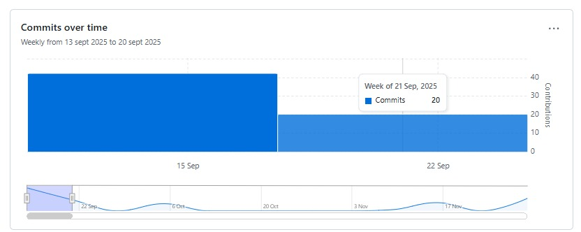
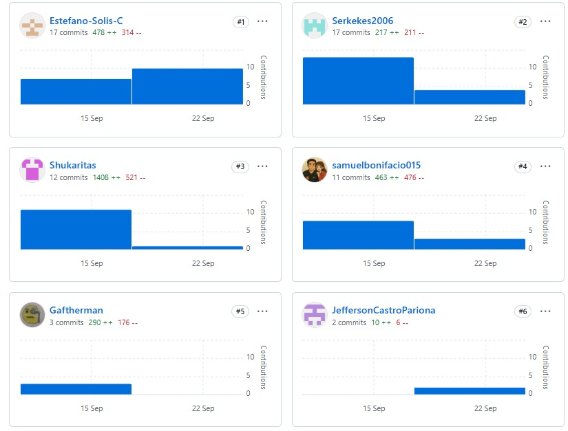

**TP1**

Para el desarrollo del informe perteneciente a la entrega del TP1, se dividió la implementación de secciones de la siguiente forma para cada integrante del equipo:

<table>
  <thead>
    <tr>
      <th> Integrantes</th>
      <th> Tarea Asignada</th>
    </tr>
  </thead>
  <tbody>
    <tr>
      <th> Landa Ortiz, Sergio Javier</th>
      <th> Realizacion del campo "Dashboard"</th>
    </tr>
    <tr>
      <th> Solis Campos, Estefano Sebastian</th>
      <th> Setup Inicial, realizacion del campo "Profile", enrutamiento de secciones y fusionar funcionalidades del proyecto</th>
    </tr>
    <tr>
      <th> Via Luna, Bruce</th>
      <th> Realizacion del campo "My Fields" y fusionar las funcionalidades del proyecto</th>
    </tr>
    <tr>
      <th> Castro Pariona, Jefferson Ernesto</th>
      <th>Realizacion del campo "Crops", apoyo en la documentación y creación de diapositivas</th>
    </tr>
    <tr>
      <th> Bonifacio Jaramillo, Samuel Jesus</th>
      <th> Bounded Contexts de Tasks,Community & Autenticación de usuario en LP </th>
    </tr>
  </tbody>
</table>

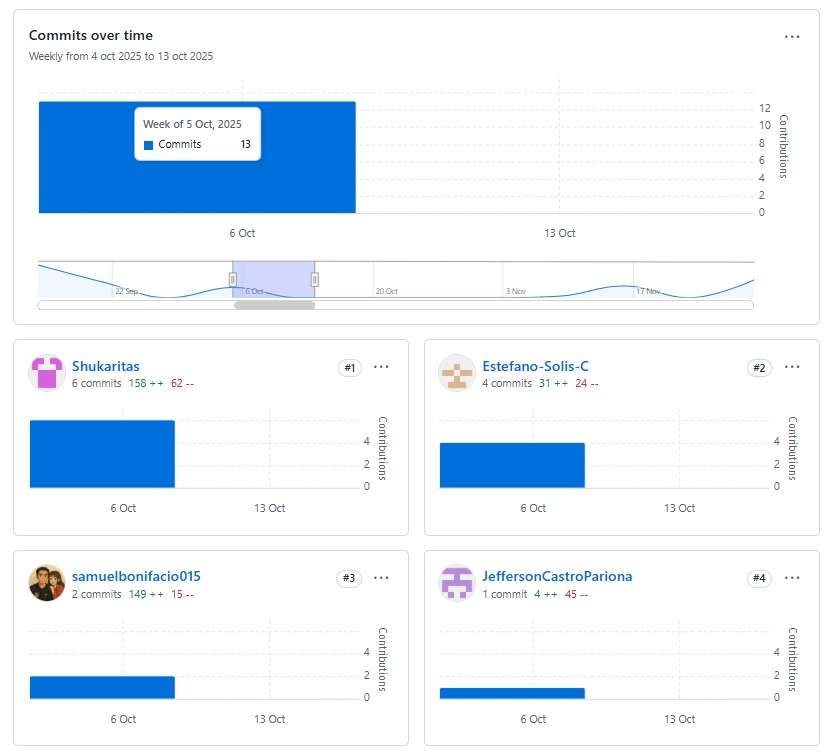

**TB2**

Para el desarrollo del informe perteneciente a la entrega del TB2, se dividió la implementación de secciones de la siguiente forma para cada integrante del equipo:

<table>
  <thead>
    <tr>
      <th> Integrantes</th>
      <th> Tarea Asignada</th>
    </tr>
  </thead>
  <tbody>
    <tr>
      <th> Landa Ortiz, Sergio Javier</th>
      <th> Desarrollo de documentacion</th>
    </tr>
    <tr>
      <th> Solis Campos, Estefano Sebastian</th>
      <th> Desarrollo del Bounded Context Users</th>
    </tr>
    <tr>
      <th> Via Luna, Bruce</th>
      <th> Desarrollo del Bounded Context Field y Crops</th>
    </tr>
    <tr>
      <th> Castro Pariona, Jefferson Ernesto</th>
      <th>Desarrollo del Bounded Context Tasks</th>
    </tr>
    <tr>
      <th> Bonifacio Jaramillo, Samuel Jesus</th>
      <th> Desarrollo del Bounded Context CommunityRecommendations </th>
    </tr>
  </tbody>
</table>

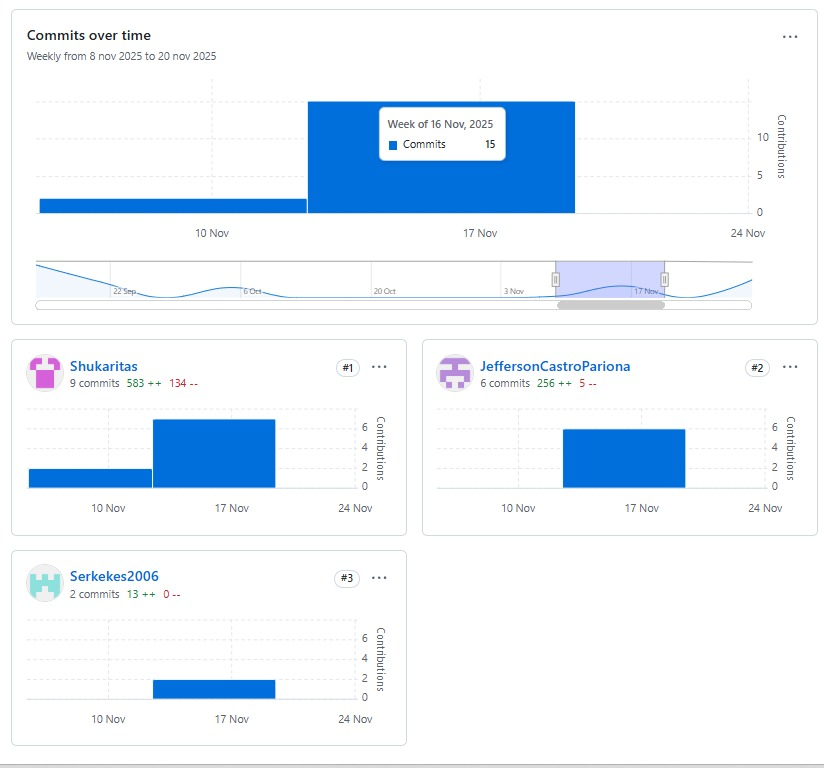

**TF**

Para el desarrollo del informe perteneciente a la entrega del TF, se dividió la implementación de secciones de la siguiente forma para cada integrante del equipo:

<table>
  <thead>
    <tr>
      <th> Integrantes</th>
      <th> Tarea Asignada</th>
    </tr>
  </thead>
  <tbody>
    <tr>
      <th> Landa Ortiz, Sergio Javier</th>
      <th> Integración de Frontend con Backend y conexión</th>
    </tr>
    <tr>
      <th> Solis Campos, Estefano Sebastian</th>
      <th> Integración de Frontend con Backend y conexión</th>
    </tr>
    <tr>
      <th> Via Luna, Bruce</th>
      <th> Integración de Frontend con Backend y conexión</th>
    </tr>
    <tr>
      <th> Castro Pariona, Jefferson Ernesto</th>
      <th> Documentación de Sprint 4</th>
    </tr>
    <tr>
      <th> Bonifacio Jaramillo, Samuel Jesus</th>
      <th> Documentación de Sprint 4 </th>
    </tr>
  </tbody>
</table>


# Contenido

1. [Capítulo I: Introducción](#capítulo-i-introducción)<br>
   1.1. [Startup Profile](#11-startup-profile)<br>
   1.1.1. [Descripción de la Startup](#111-descripción-de-la-startup)<br>
   1.1.2. [Perfiles de integrantes del equipo](#112-perfiles-de-integrantes-del-equipo)<br>
   1.2. [Solution Profile](#12-solution-profile)<br>
   1.2.1 [Antecedentes y problemática](#121-antecedentes-y-problemática)<br>
   1.2.2 [Lean UX Process](#122-lean-ux-process)<br>
   1.2.2.1. [Lean UX Problem Statements](#1221-lean-ux-problem-statements)<br>
   1.2.2.2. [Lean UX Assumptions](#1222-lean-ux-assumptions)<br>
   1.2.2.3. [Lean UX Hypothesis Statements](#1223-lean-ux-hypothesis-statements)<br>
   1.2.2.4. [Lean UX Canvas](#1224-lean-ux-canvas)<br>
   1.3. [Segmentos objetivo](#13-segmentos-objetivo)<br>
2. [Capítulo II: Requirements Elicitation & Analysis](#capítulo-ii-requirements-elicitation--analysis)<br>
   2.1. [Competidores](#21-competidores)<br>
   2.1.1. [Análisis competitivo](#211-análisis-competitivo)<br>
   2.1.2. [Estrategias y tácticas frente a competidores](#212-estrategias-y-tácticas-frente-a-competidores)<br>
   2.2. [Entrevistas](#22-entrevistas)<br>
   2.2.1. [Diseño de entrevistas](#221-diseño-de-entrevistas)<br>
   2.2.2. [Registro de entrevistas](#222-registro-de-entrevistas)<br>
   2.2.3. [Análisis de entrevistas](#223-análisis-de-entrevistas)<br>
   2.3. [Needfinding](#23-needfinding)<br>
   2.3.1. [User Personas](#231-user-personas)<br>
   2.3.2. [User Task Matrix](#232-user-task-matrix)<br>
   2.3.3. [User Journey Mapping](#232-user-task-matrix)<br>
   2.3.4. [Empathy Mapping](#234-empathy-mapping)<br>
   2.4. [Big Picture Event Storming](#24-big-picture-event-storming)<br>
   2.5. [Ubiquitous Language](#25-ubiquitous-language)<br>
3. [Capítulo III: Requirements Specification](#capítulo-iii-requirements-specification)<br>
   3.1. [To-Be Scenario Mapping](#31-to-be-scenario-mapping)<br>
   3.2. [User Stories](#32-user-stories)<br>
   3.3. [Impact Mapping](#33-impact-mapping)<br>
   3.4. [Product Backlog](#34-product-backlog)<br>
4. [Capítulo IV: Product Design](#capítulo-iv-product-design)<br>
   4.1. [Style Guidelines](#41-style-guidelines)<br>
   4.1.1. [General Style Guidelines](#411-general-style-guidelines)<br>
   4.1.2. [Web Style Guidelines](#412-web-style-guidelines)<br>
   4.2. [Information Architecture](#42-information-architecture)<br>
   4.2.1. [Organization Systems](#421-organization-systems)<br>
   4.2.2. [Labeling Systems](#422-labeling-systems)<br>
   4.2.3. [SEO Tags and Meta Tags](#423-seo-tags-and-meta-tags)<br>
   4.2.4. [Searching Systems](#424-searching-systems)<br>
   4.2.5. [Navigation Systems](#425-navigation-systems)<br>
   4.3. [Landing Page UI Design](#43-landing-page-ui-design)<br>
   4.3.1. [Landing Page Wireframe](#431-landing-page-wireframe)<br>
   4.3.2. [Landing Page Mock-up](#432-landing-page-mock-up)<br>
   4.4. [Web Applications UX/UI Design](#44-web-applications-uxui-design)<br>
   4.4.1. [Web Applications Wireframes](#441-web-applications-wireframes)<br>
   4.4.2. [Web Applications Wireflow Diagrams](#442-web-applications-wireflow-diagrams)<br>
   4.4.2. [Web Applications Mock-ups](#442-web-applications-mock-ups)<br>
   4.4.3. [Web Applications User Flow Diagrams](#443-web-applications-user-flow-diagrams)<br>
   4.5. [Web Applications Prototyping](#45-web-applications-prototyping)<br>
   4.6. [Domain-Driven Software Architecture](#46-domain-driven-software-architecture)<br>
   4.6.1. [Design-Level Event Storming](#461-design-level-event-storming)<br>
   4.6.2. [Software Architecture Context Diagram](#462-software-architecture-context-diagram)<br>
   4.6.3. [Software Architecture Container Diagrams](#463-software-architecture-container-diagrams)<br>
   4.6.4. [Software Architecture Components Diagrams](#464-software-architecture-components-diagrams)<br>
   4.7. [Software Object-Oriented Design](#47-software-object-oriented-design)<br>
   4.7.1. [Class Diagrams](#471-class-diagrams)<br>
   4.7.2. [Class Dictionary](#472-class-dictionary)<br>
   4.8. [Database Design](#48-database-design)<br>
   4.8.1. [Database Diagram](#481-database-diagram)<br>
5. [Capítulo V: Product Implementation, Validation & Deployment](#capítulo-v-product-implementation-validation--deployment)<br>
   5.1. [Software Configuration Management](#51-software-configuration-management)<br>
   5.1.1. [Software Development Environment Configuration](#511-software-development-environment-configuration)<br>
   5.1.2. [Source Code Management](#512-source-code-management)<br>
   5.1.3. [Source Code Style Guide & Conventions](#513-source-code-style-guide--conventions)<br>
   5.1.4. [Software Deployment Configuration](#514-software-deployment-configuration)<br>
   5.2. [Landing Page, Services & Applications Implementation](#52-landing-page-services--applications-implementation)<br>
   5.2.1. [Sprint 1](#521-sprint-1)<br>
   5.2.1.1. [Sprint Planning 1](#5211-sprint-planning-1)<br>
   5.2.1.2. [Aspect Leaders and Collaborators](#5212-aspect-leaders-and-collaborators)<br>
   5.2.1.3. [Sprint Backlog 1](#5213-sprint-backlog-1)<br>
   5.2.1.4. [Development Evidence for Sprint Review](#5214-development-evidence-for-sprint-review)<br>
   5.2.1.5. [Execution Evidence for Sprint Review](#5215-execution-evidence-for-sprint-review)<br>
   5.2.1.6. [Services Documentation Evidence for Sprint Review](#5216-services-documentation-evidence-for-sprint-review)<br>
   5.2.1.7. [Software Deployment Evidence for Sprint Review](#5217-software-deployment-evidence-for-sprint-review)<br>
   5.2.1.8. [Team Collaboration Insights during Sprint](#5218-team-collaboration-insights-during-sprint)<br>
   5.2.2. [Sprint 2](#522-sprint-2)<br>
   5.2.2.1. [Sprint Planning 2](#5221-sprint-planning-2)<br>
   5.2.2.2. [Aspect Leaders and Collaborators](#5222-aspect-leaders-and-collaborators)<br>
   5.2.2.3. [Sprint Backlog 2](#5223-sprint-backlog-2)<br>
   5.2.2.4. [Development Evidence for Sprint Review](#5224-development-evidence-for-sprint-review)<br>
   5.2.2.5. [Execution Evidence for Sprint Review](#5225-execution-evidence-for-sprint-review)<br>
   5.2.2.6. [Services Documentation Evidence for Sprint Review](#5226-services-documentation-evidence-for-sprint-review)<br>
   5.2.2.7. [Software Deployment Evidence for Sprint Review](#5227-software-deployment-evidence-for-sprint-review)<br>
   5.2.2.8. [Team Collaboration Insights during Sprint](#5228-team-collaboration-insights-during-sprint)<br>
   5.2.3. [Sprint 3](#523-sprint-3)<br>
   5.2.3.1. [Sprint Planning 3](#5231-sprint-planning-3)<br>
   5.2.3.2. [Aspect Leaders and Collaborators](#5232-aspect-leaders-and-collaborators)<br>
   5.2.3.3. [Sprint Backlog 3](#5233-sprint-backlog-3)<br>
   5.2.3.4. [Development Evidence for Sprint Review](#5234-development-evidence-for-sprint-review)<br>
   5.2.3.5. [Execution Evidence for Sprint Review](#5235-execution-evidence-for-sprint-review)<br>
   5.2.3.6. [Services Documentation Evidence for Sprint Review](#5236-services-documentation-evidence-for-sprint-review)<br>
   5.2.3.7. [Software Deployment Evidence for Sprint Review](#5237-software-deployment-evidence-for-sprint-review)<br>
   5.2.3.8. [Team Collaboration Insights during Sprint](#5238-team-collaboration-insights-during-sprint)<br>
   5.2.4. [Sprint 4](#543-sprint-4)<br>
   5.2.4.1. [Sprint Planning 4](#5241-sprint-planning-4)<br>
   5.2.4.2. [Aspect Leaders and Collaborators](#5242-aspect-leaders-and-collaborators)<br>
   5.2.4.3. [Sprint Backlog 4](#5243-sprint-backlog-3)<br>
   5.2.4.4. [Development Evidence for Sprint Review](#5244-development-evidence-for-sprint-review)<br>
   5.2.4.5. [Execution Evidence for Sprint Review](#5245-execution-evidence-for-sprint-review)<br>
   5.2.4.6. [Services Documentation Evidence for Sprint Review](#5246-services-documentation-evidence-for-sprint-review)<br>
   5.2.4.7. [Software Deployment Evidence for Sprint Review](#5247-software-deployment-evidence-for-sprint-review)<br>
   5.2.4.8. [Team Collaboration Insights during Sprint](#5248-team-collaboration-insights-during-sprint)
6. [Conclusiones](#conclusiones)<br>
   6.1 [Conclusiones y recomendaciones](#61-conclusiones-y-recomendaciones)<br>
7. [Bibliografía](#bibliografía)<br>
8. [Anexos](#anexos)<br>

# Student Outcome

<table border="1">
  <thead>
    <tr>
      <th>Criterio específico</th>
      <th>Acciones realizadas</th>
      <th>Conclusión general</th>
    </tr>
  </thead>
  <tbody>
    <tr>
      <td>5.c1. Trabaja en equipo para proporcionar liderazgo en forma conjunta</td>
      <td>
      
  <p><strong>Landa Ortiz, Sergio Javier</strong><br>
  TB1: Lideró la redacción del Capítulo I (introducción, startup profile y estructura del informe).</p>
  <p>TP1: Coordinó la edición final del informe, armonizó estilo y referencias, y validó coherencia entre artefactos (user personas, hipótesis y backlog).</p>
  <p>TB2: Realización del bounded context CommunityRecommendations</p>
  <p>TF: Integración de Frontend con Backend y conexión de funcionalidades principales.</p>
  
  <p><strong>Solis Campos, Estefano Sebastian</strong><br>
  TB1: Diseñó y ejecutó guiones de entrevista para el Capítulo II; recopiló y organizó evidencias.</p>
  <p>TP1: Profundizó el análisis cualitativo, redactó el Needfinding y las User Personas, y presentó hallazgos con evidencia citada.</p>
  <p>TB2: Implementación de los endpoints de UserRecommendations y ejecución del deploy del proyecto junto con la base de datos en la plataforma Railway.</p>
  <p>TF: Coordinación general del sprint, integración de módulos y supervisión del despliegue final.</p>
  
  <p><strong>Via Luna, Bruce</strong><br>
  TB1: Redactó las user stories y entregó los primeros diagramas del Capítulo III; identificó entidades y relaciones.</p>
  <p>TP1: Refinó los diagramas C4 y de clases, modeló la base de datos y documentó decisiones técnicas para futuras implementaciones.</p>
  <p>TB2: Implementación de los endpoints de Field y CropField</p>
  <p>TF: Desarrollo de pruebas de integración y validación de conexiones entre servicios.</p>
  
  <p><strong>Castro Pariona, Jefferson Ernesto</strong><br>
  TB1: Diseñó la guía visual del Capítulo IV y los wireframes iniciales de la landing.</p>
  <p>TP1: Creó prototipos interactivos en Figma, generó assets y definió pautas de estilo para implementación frontend.</p>
  <p>TB2: Distribución de actividades de manera equitativa. Desarrollar el trabajo en equipo nos permitió desarrollar habilidades de liderazgo y desarrollo de habilidades blandas.</p>
  <p>TF: Documentación de Sprint 4 y elaboración de diapositivas de presentación.</p>
  
  <p><strong>Bonifacio Jaramillo, Samuel Jesus</strong><br>
  TB1: Contribuyó en el desarrollo del landing y las secciones técnicas del Capítulo V.</p>
  <p>TP1: Implementó la estructura inicial del frontend, realizó commits organizados, desplegó en GitHub Pages y documentó pasos de despliegue.</p>
  <p>TB2: Desarrollo del endpoint de CommunityRecommendations.</p>
  <p>TF: Documentación técnica de servicios y elaboración de guías de implementación.</p>
</td>
<td><p><strong>TB1:</strong> El equipo demostró capacidad de liderazgo compartido: integró investigación, diseño y trabajo técnico para orientar el proyecto y consolidar un entregable coherente.</p><p><strong>TP1:</strong> El equipo avanzó significativamente en la materialización del producto. Se logró transitar desde conceptos y wireframes a un frontend funcional desplegado en línea.</p><p><strong>TB2:</strong> Se logró la validación con usuarios reales  para el despliegue del backend e integración de API.</p><p><strong>TF:</strong> Se logró con éxito la integración entre ambos servicios (Frontend y Backend) a través del trabajo en equipo y coordinación de tareas</p></td>
    </tr>
    <tr>
      <td>5.c2. Crea un entorno colaborativo e inclusivo, establece metas, planifica tareas y cumple objetivos</td>
      <td>
        <p><strong>Landa Ortiz, Sergio Javier</strong><br>
        TB1: Definió la fecha de entrega y objetivos iniciales; facilitó coordinación de reuniones.</p>
        <p>TP1: Supervisó la planificación de entregables, verificó cumplimiento de hitos y gestionó ajustes de alcance.</p>
        <p>TB2: Establecimiento y ejecucion del desarrollo del endpoint estimado dentro del tiempo limite.</p>
        
  <p><strong>Solis Campos, Estefano Sebastian</strong><br>
  TB1: Organizó el equipo para ejecutar entrevistas de campo y validación.</p>
  <p>TP1: Documentó y consolidó la evidencia de entrevistas, generó resúmenes ejecutivos y orientó la priorización de hallazgos.</p>
  <p>TB2: Lideró la unificación y combinación de los módulos del backend para garantizar la operatividad del sistema y la integridad de la base de datos.</p>
  
  <p><strong>Via Luna, Bruce</strong><br>
  TB1: Diseñó el Product Backlog y priorizó historias para el Sprint 1.</p>
  <p>TP1: Mantuvo y refinó el backlog, asignó historias y facilitó la planificación y seguimiento del sprint.</p>
  <p>TB2: Organizo y unifico los commits iniciales para iniciar el desarrollo final.</p>
  <p>TF: Elabore reuniones y llamadas para verificar avances o comprobar que el equipo necesitaba ayuda durante el desarrollo de este</p>
  
  <p><strong>Castro Pariona, Jefferson Ernesto</strong><br>
  TB1: Configuró el entorno de diseño en Figma y coordinó la colaboración visual.</p>
  <p>TP1: Lideró la creación de prototipos y estableció las guías de interacción necesarias para el equipo de frontend.</p>
  <p>TB2: Desarrollo de bounded context Tasks, prueba de conectividad con las apis Edit, Get, Put de Tasks. Apoyo en el desarrollo de la documentación correspondiente a la TB2, desarrollo de diapositivas KeyNote de este entregable.</p>
  
  <p><strong>Bonifacio Jaramillo, Samuel Jesus</strong><br>
  TB1: Coordinó la estructura del repositorio y fomentó contribuciones al código.</p>
  <p>TP1: Implementó componentes iniciales, aplicó estilos globales, verificó despliegues y documentó el proceso para replicación.</p>
  <p>TB2: Contribuyó en el desarrollo del backend y las secciones técnicas del Capítulo V.</p>
</td>
<td><p><strong>TB1:</strong> El equipo estableció un entorno colaborativo desde el inicio, definiendo metas claras de investigación, diseño y desarrollo técnico.</p><p><strong>TP1:</strong>El equipo estableció metas de desarrollo del frontend, cumpliendo los objetivos gracias a una coordinación efectiva.</p><p><strong>TB2:</strong> El equipo mantuvo un entorno colaborativo durante el desarrollo del backend, planificando de forma conjunta la integración de API y estableciendo metas de validación con usuarios reales.</p><p><strong>TF:</strong> Se consolidó un ambiente colaborativo e inclusivo que permitió establecer metas claras de integración entre Frontend y Backend.</p></td>
</tr>
  </tbody>
</table>

# Capítulo I: Introducción

## 1.1. Startup Profile: FruTech

### 1.1.1. Descripción de la Startup

**FruTech es una startup de base tecnológica (FruTech) de origen peruano, concebida para abordar los** desafíos estructurales que enfrenta el sector agrícola del país. Fundada por un equipo multidisciplinario de estudiantes universitarios, FruTech nace de la convicción de que la tecnología puede y debe ser un catalizador para el desarrollo sostenible, especialmente para los pequeños y medianos agricultores que constituyen la columna vertebral de la seguridad alimentaria nacional. La propuesta de valor de FruTech se centra en la democratización del acceso a herramientas de agricultura de precisión, transformando datos complejos en decisiones simples y accionables.

El producto insignia de la startup, CultivApp, es una plataforma integral de software y hardware (IoT) diseñada para optimizar el manejo de cultivos. A través de sensores de humedad y actuadores de riego inteligentes, la aplicación web permite a los agricultores monitorear sus parcelas en tiempo real, automatizar el riego y acceder a recomendaciones personalizadas, todo desde un dispositivo móvil. Este enfoque no solo busca mejorar la eficiencia en el uso de recursos críticos como el agua, sino también aumentar la rentabilidad y resiliencia de las operaciones agrícolas frente a la incertidumbre climática y económica.

**Misión:** Impulsar la transformación digital del sector agrícola brindando a los agricultores herramientas tecnológicas accesibles e inteligentes, que les permitan optimizar el rendimiento de sus cultivos mediante recomendaciones personalizadas, integración con IoT y un enfoque sostenible orientado a mejorar su calidad de vida.

**Visión:** Ser la plataforma líder en soluciones digitales agrícolas en Latinoamérica, reconocida por democratizar el acceso a la tecnología en el campo y contribuir a la seguridad alimentaria a través de la innovación, la sostenibilidad y el fortalecimiento de los pequeños y medianos agricultores.

### 1.1.2. Perfiles de integrantes del equipo

| Foto de integrantes | Nombre y Apellidos | Código de estudiante | Conocimiento técnicos y habilidades |
|---------------------|--------------------|----------------------|-------------------------------------|
|      |    Landa Ortiz, Sergio Javier                |        u202311086              |   Soy un estudiante de software, cursando actualmente el 5to ciclo, la carrera me interesa mucho ya que siempre aprendo cosas nuevas cada dia, las tecnologias son tantas que nunca te aburres, me considero una persona responsable y me gusta trabajar en equipo.                                  |
|                     |    Solis Campos, Estefano Sebastian                |      u202314354                |       Soy un estudiante apasionado de la carrera de Ingeniería de Software, actualmente en el quinto ciclo. Me entusiasma aplicar mis conocimientos en el desarrollo de soluciones innovadoras y estoy siempre buscando nuevas oportunidades para aprender y crecer en el mundo de la tecnología.                              |
|  |Via Luna, Bruce|U20231403|Mi nombre es Bruce Via, tengo 20 años y soy estudiante de la carrera de ingenieria de Software. Me considero uan persona que muestra un interes desmedido cuando lo que hago resulta agradable, dispuesto a aprender nuevos conocimientos incluso si no es necesario, ademas de siempre intentar mejorar en lo que hago demostrando iniciativo|
|                     |   Castro Pariona, Jefferson Ernesto                 |    u201822823                    |    Estudiante de la carrera de Ingeniería de Software y me gustaría trabajar para grandes empresas y tener mi propio negocio. Soy motivador y me gusta trabajar en equipo.                               |
|                     |   Bonifacio Jaramillo, Samuel Jesus       |   u202317269     |       Estudiante de ingeniería de software. Actualmente en 5to ciclo. Cuento con experiencia desarrollando aplicaciones en Javascript, C++, Typescript, React entre otros. Me apasiona la inteligencia artificial, música y fútbol.                              |

## 1.2. Solution Profile

### 1.2.1. Antecedentes y problemática

El sector agrícola peruano, a pesar de su resiliencia y crecimiento en agroexportaciones, enfrenta profundos desafíos estructurales que afectan desproporcionadamente a los pequeños y medianos productores. Estos agricultores, que son responsables de más del 70% del abastecimiento de alimentos para las ciudades, operan en un entorno de alta vulnerabilidad marcado por la ineficiencia en el uso de recursos, la falta de acceso a tecnología y la creciente presión del cambio climático. Para comprender la magnitud del problema y delimitar el alcance de la solución, se ha aplicado el marco de análisis de las 5 W's y 2 H's.

- **What (Qué) - ¿Cuál es el problema?**  
  El problema central es la gestión ineficiente y precaria de los recursos hídricos en la agricultura de pequeña y mediana escala en el Perú. Esta ineficiencia se manifiesta en el riego por inundación o por turnos, basado en la intuición o en calendarios fijos que no responden a las necesidades reales del cultivo ni a las condiciones del suelo. Como consecuencia, se produce un desperdicio masivo de agua —se estima que hasta un 45% del agua se pierde por canales en mal estado y técnicas inadecuadas— y se generan condiciones de estrés hídrico en los cultivos (exceso o déficit), lo que reduce directamente la productividad, la calidad de la cosecha y la rentabilidad del agricultor.

- **Who (Quién) - ¿Quiénes son los afectados?**  
  Los principales afectados son dos segmentos de agricultores peruanos:

  1. **Agricultores de pequeña escala (subsistencia):** Con terrenos menores a 5 hectáreas, que constituyen el 66.3% de las   unidades agropecuarias del país. Su principal objetivo es la seguridad alimentaria de sus familias y la venta de excedentes en mercados locales.
  2. **Agricultores de mediana escala (comercial):** Con terrenos de 5 a 20 hectáreas, orientados a mercados regionales y cadenas de supermercados. Su objetivo es la rentabilidad y la competitividad.

  Ambos grupos carecen de acceso a las herramientas de agricultura de precisión que les permitirían optimizar sus procesos y competir en mejores condiciones.

- **Where (Dónde) - ¿Dónde surge el problema?**  
  El problema es endémico en todo el territorio agrícola peruano, pero se agudiza en zonas con alta dependencia del riego. En la costa, donde se concentra la agricultura comercial, la escasez de agua es crítica. En la sierra, a pesar de la presencia de lluvias estacionales, la falta de infraestructura de riego adecuada (el 64% de la superficie agrícola del país carece de ella) limita la producción a una sola campaña anual, perpetuando la vulnerabilidad.

- **When (Cuando) - ¿Cuándo sucede el problema?**  
  El problema ocurre de forma continua durante todo el ciclo de cultivo. Los momentos más críticos son durante las etapas de crecimiento vegetativo y floración, cuando el estrés hídrico puede causar daños irreversibles en el rendimiento. La incertidumbre se agrava por la variabilidad climática, con sequías cada vez más frecuentes e intensas que hacen que las prácticas tradicionales de riego sean insuficientes y riesgosas.

- **Why (Por qué) - ¿Cuál es la causa del problema?**  
  Las causas son multifactoriales y estructurales:

  - **Brecha de infraestructura:** La infraestructura de riego es obsoleta o inexistente en gran parte del país.
  - **Falta de acceso a capital:** Los pequeños agricultores carecen de acceso a financiamiento para invertir en tecnología, como sistemas de riego tecnificado.
  - **Limitada asistencia técnica:** Existe una escasez de programas de capacitación que enseñen prácticas de riego eficiente y el uso de nuevas tecnologías.
  - **Baja adopción tecnológica:** Aunque existen tecnologías como sensores y drones, su adopción se concentra en la gran agroindustria debido a su alto costo y complejidad, dejando fuera a la mayoría de los productores.

- **How (Cómo) - ¿Cómo se utilizará el producto?**  
  CultivApp será una plataforma web accesible desde cualquier smartphone, que se conectará a un kit de hardware de bajo costo (sensor de humedad y actuador de riego) instalado en la parcela del agricultor. El agricultor utilizará la aplicación para:

  - Visualizar en tiempo real y de forma sencilla (con gráficos e iconos) la humedad de su suelo.
  - Recibir alertas y notificaciones cuando el cultivo necesite agua.
  - Activar el riego de forma remota con un solo botón (modo manual) o programar riegos automáticos basados en umbrales de humedad óptimos para su tipo de cultivo (modo automatizado).
  - Consultar un historial de riegos y datos de humedad para entender mejor el comportamiento de su cultivo.

- **How Much (Cuánto) - ¿Cuánto costará implementar la solución?**  
  El desarrollo inicial de la solución (MVP) se estima con un presupuesto enfocado en la accesibilidad, siguiendo un modelo similar al presentado en los informes de referencia.

  - **Desarrollo de Software:**
    - Diseño y desarrollo de la aplicación web: S/ 8,000 - S/ 12,000
    - Backend y API RESTful para IoT: S/ 6,000 - S/ 10,000
    - Dominio y hosting en la nube (anual): S/ 1,500 - S/ 2,500

  - **Desarrollo de Hardware (Prototipos):**
    - Compra de sensores, microcontroladores y actuadores: S/ 3,000 - S/ 5,000

  - **Marketing y Lanzamiento Piloto:**
    - Campañas digitales y talleres con cooperativas: S/ 2,000 - S/ 4,000
    - **Total Estimado: S/ 20,500 - S/ 33,500**

### 1.2.2. Lean UX Process

Para traducir la problemática identificada en una solución viable y centrada en el usuario, se ha aplicado el Lean UX Process. Este enfoque iterativo permite validar supuestos y construir un producto que realmente resuelva las necesidades del mercado.

#### 1.2.2.1. Lean UX Problem Statements

El propósito de CultivApp es empoderar a los pequeños y medianos agricultores del Perú con una herramienta de agricultura de precisión asequible y fácil de usar, que transforme la gestión del riego de una práctica basada en la intuición y la incertidumbre a una decisión basada en datos concretos y en tiempo real.

El problema se manifiesta cuando los agricultores, debido a la falta de información precisa sobre la humedad del suelo y las necesidades hídricas de sus cultivos, toman decisiones de riego subóptimas. Actualmente, dependen de métodos tradicionales (observación visual, tacto del suelo) o calendarios fijos que no se adaptan a las variaciones climáticas ni a las especificidades de cada parcela.

Hemos observado que esta situación conduce a un ciclo vicioso: el riego ineficiente no solo desperdicia un recurso escaso y costoso como el agua, sino que también limita el potencial de rendimiento de los cultivos, afectando directamente los ingresos del agricultor. Esta baja rentabilidad, a su vez, les impide invertir en tecnologías que podrían romper dicho ciclo. Ante esta problemática, surge la pregunta: ¿Cómo podríamos proporcionar a los agricultores una forma sencilla y **económica de saber exactamente cuándo y cuánto regar, permitiéndoles tomar el control de uno de los factores más críticos para el éxito de su cosecha?**

- **Domain:** Agricultura de Precisión (Precision Agriculture), FruTech, Internet de las Cosas (IoT).
- **Customer Segments:** Agricultores de pequeña y mediana escala en el Perú.
- **Pain Points:** Desperdicio de agua, altos costos de energía para bombeo, baja productividad de cultivos, incertidumbre y estrés por factores climáticos, falta de acceso a tecnología.
- **Gap:** No existe en el mercado peruano una solución integral de hardware y software para el monitoreo y automatización del riego que esté diseñada específicamente para ser accesible, asequible y fácil de usar por agricultores con recursos limitados y baja alfabetización digital.
- **Vision/Strategy:** Crear un ecosistema tecnológico que democratice el acceso a la agricultura de precisión, comenzando con la optimización del riego, para mejorar la sostenibilidad y rentabilidad de la agricultura familiar en el Perú.
- **Initial Segment:** Agricultores de mediana escala en la costa peruana (ej. valles de Ica y La Libertad), ya que tienen una mayor orientación al mercado y una mayor disposición a adoptar tecnología para mejorar su productividad.

#### 1.2.2.2. Lean UX Assumptions

**Business Assumptions:**

1. Creemos que existe una necesidad insatisfecha en los agricultores peruanos de soluciones tecnológicas para optimizar el riego.
2. Creemos que los agricultores estarán dispuestos a pagar una suscripción mensual por el servicio si el ahorro en agua y el aumento en la producción superan el costo de la misma.
3. Nuestros clientes iniciales serán agricultores de cultivos de alto valor (ej. uva, palta) que son más sensibles a la gestión del riego.
4. El valor más importante que un cliente quiere de nuestro servicio es la tranquilidad y el control sobre su producción.
5. Adquiriremos a nuestros primeros clientes a través de alianzas con cooperativas agrícolas y distribuidores de insumos.
6. Nuestra principal ventaja competitiva será un modelo de negocio de bajo costo (hardware subsidiado por la suscripción) y una interfaz de usuario radicalmente simple.
7. El mayor riesgo del negocio es la barrera cultural y la desconfianza hacia la tecnología en el sector rural.

**User Assumptions:**

1. **¿Quién es el usuario?** Un agricultor de entre 30 y 55 años, con experiencia en el campo pero con limitada familiaridad con aplicaciones digitales complejas. Valora la practicidad y los resultados tangibles.
2. **¿Dónde encaja nuestro producto en su vida?** Se integra en su rutina diaria de trabajo en el campo, convirtiéndose en una herramienta de consulta rápida antes de tomar decisiones de riego.
3. **¿Qué problemas resuelve nuestro producto?** Elimina la duda de "cuándo regar", reduce el trabajo manual de verificar el campo y ayuda a prevenir pérdidas de cosecha por mal riego.
4. **¿Cuándo y cómo se usa nuestro producto?** Lo usará principalmente en las mañanas para revisar el estado de sus parcelas y en cualquier momento que reciba una alerta de la aplicación en su smartphone.
5. **¿Qué características son importantes?** La visualización del nivel de humedad, el botón para activar/desactivar el riego y las notificaciones de alerta.
6. **¿Cómo debería lucir y comportarse el producto?** Debe ser visual, con iconos grandes, pocos textos, y colores intuitivos (verde para "bien", rojo para "alerta"). La navegación debe ser mínima y directa.

**Feature Assumptions:**

1. Creemos que una interfaz con un único indicador visual del estado de humedad por parcela será suficiente para la toma de decisiones.
2. Creemos que las notificaciones push son el canal más efectivo para alertar a los agricultores.
3. Creemos que la capacidad de activar el riego remotamente es una funcionalidad de alto valor percibido.
4. Creemos que un historial simple de riegos será útil para que el agricultor observe patrones a lo largo del tiempo.

#### 1.2.2.3. Lean UX Hypothesis Statements

1. **Hypothesis Statement 01:** Creemos que al proporcionar a los agricultores de mediana escala acceso a datos de humedad del suelo en tiempo real, lograremos que reduzcan su consumo de agua en al menos un 25%. Sabremos que hemos tenido éxito cuando, tras una campaña agrícola, las métricas de nuestra plataforma y las entrevistas con los usuarios confirmen este nivel de ahorro.

2. **Hypothesis Statement 02:** Creemos que una interfaz diseñada con iconos grandes y un flujo de un solo clic para activar el riego será adoptada por el 90% de nuestros usuarios iniciales, independientemente de su nivel de alfabetización digital. Sabremos que hemos tenido éxito si la tasa de uso diario de la función de riego manual se mantiene por encima del 75% durante el primer mes.

3. **Hypothesis Statement 03:** Creemos que al ofrecer un kit de IoT a un costo inicial bajo (modelo de suscripción), superaremos la barrera de entrada económica para la adopción de tecnología. **Sabremos que hemos tenido éxito si alcanzamos nuestra meta de 100 agricultores suscritos en los primeros 6 meses del piloto.**

#### 1.2.2.4. Lean UX Canvas

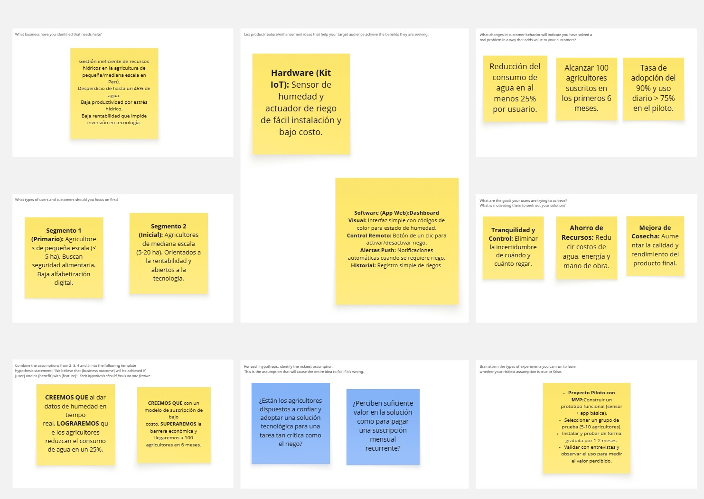

## 1.3. Segmentos objetivo

La solución CultivApp está diseñada para atender las necesidades específicas de dos grupos fundamentales del sector agrícola peruano. La caracterización detallada de estos segmentos es crucial para el diseño de un producto relevante y efectivo.

### Segmento objetivo #1: Agricultores de pequeña escala (subsistencia y autoconsumo)

Agricultores con terrenos menores a 5 hectáreas, generalmente familiares, que producen para autoconsumo y venta local en mercados. Este grupo representa la base de la agricultura familiar en el Perú, constituyendo el 66.3% de todas las unidades agropecuarias del país. A pesar de su importancia para el abastecimiento local, enfrentan severas limitaciones de acceso a recursos y tecnología.

- **Aspectos Demográficos:**
  - Rango de edad: 22 a 50 años.
  - Sexo: Hombres y mujeres (con ligera predominancia masculina en roles de decisión en zonas rurales).
  - Nivel socioeconómico: Bajo y medio-bajo. Sus ingresos dependen directamente de la variabilidad de sus cosechas y los precios en mercados locales.

- **Aspectos Geográficos:**
  - Nacionalidad: Peruana.
  - Zona geográfica de residencia: Rural y periurbana.
  - Departamento: Principalmente en la Sierra (Ayacucho, Cusco, Cajamarca, Puno) y en zonas de la Selva (San Martín, Ucayali).

- **Aspectos Psicográficos:**
  - Valoración de la tierra como principal fuente de sustento y herencia familiar.
  - Orientados al autoconsumo y a la venta en ferias o mercados locales.
  - Limitada experiencia en el uso de aplicaciones digitales; la confianza en la tecnología es baja y debe ser construida a través de resultados demostrables.
  - Buscan soluciones prácticas, fáciles de entender, de bajo costo y alta durabilidad. La aversión al riesgo es alta debido a sus limitados márgenes económicos.
  - **Uso tecnológico:** Acceso limitado a smartphones de gama media y conectividad 3G/4G, a menudo intermitente.

### Segmento objetivo #2: Agricultores de mediana escala (producción comercial local y regional)

Agricultores con terrenos entre 5 y 20 hectáreas que producen cultivos para abastecer mercados regionales o cadenas de supermercados. Este segmento, aunque más pequeño en número, tiene un impacto significativo en la cadena de suministro formal y muestra una mayor tendencia hacia la modernización para mantener la competitividad.

#### Aspectos Demográficos:
- **Rango de edad:** 30 a 55 años.
- **Sexo:** Hombres y mujeres, con tendencia masculina en roles de decisión.
- **Nivel socioeconómico:** Medio y medio-alto dentro del sector agrícola.

#### Aspectos Geográficos:
- **Nacionalidad:** Peruana.
- **Zona geográfica de residencia:** Zonas rurales y valles interandinos con acceso a mercados regionales.
- **Departamento:** Principalmente en la Costa (La Libertad, Ica, Lambayeque, Piura) y valles de la Sierra (Arequipa, Junín), donde se concentra la agricultura comercial.

#### Aspectos Psicográficos:
- Mayor orientación a la productividad, la eficiencia y el mercado.
- Buscan activamente optimizar el rendimiento de sus cultivos y reducir pérdidas para maximizar la rentabilidad.
- Tienen más apertura al uso de aplicaciones y tecnología digital como una inversión para mejorar su negocio.
- Interés en herramientas que les permitan organizar datos y tomar decisiones basadas en información precisa, no solo en la intuición.
- **Uso tecnológico:** Mayor acceso a dispositivos móviles modernos y disposición a usar aplicaciones para mejorar la productividad. Existe una conciencia creciente sobre los beneficios de la FruTech.

# Capítulo II: Requirements Elicitation & Analysis

## 2.1. Competidores

Para posicionar a FruTech y su producto CultivApp de manera efectiva, es imperativo realizar un análisis exhaustivo del entorno competitivo. Si bien el mercado de FruTech en Perú para pequeños agricultores es incipiente, existen actores relevantes en Latinoamérica cuyas soluciones, estrategias y modelos de negocio ofrecen valiosas lecciones. El objetivo de este análisis es identificar un nicho de mercado desatendido y definir una propuesta de valor única y diferenciada.

### 2.1.1. Análisis competitivo

Se ha desarrollado un "Competitive Analysis Landscape" para contrastar a CultivApp con tres competidores clave en la región: Space AG (Perú), SIMA (Argentina) y InstaCrops (Chile).

| | FruTech (CultivApp) | Space AG (Perú) | SIMA (Argentina) | InstaCrops (Chile) |
| :--- | :--- | :--- | :--- | :--- |
| **Overview** | Plataforma web y hardware IoT de bajo costo enfocada en el monitoreo y automatización del riego para pequeños y medianos agricultores en Perú. | Software modular para la digitalización de operaciones agrícolas en cultivos de alto valor, integrando datos de drones, sensores y satélites. | Sistema de agricultura inteligente que permite monitorear lotes, geolocalizar datos y generar órdenes de aplicación desde un smartphone. Fuerte enfoque en la recolección de datos en campo. | Asesor agrícola virtual que combina sensores IoT, IA y datos satelitales para dar recomendaciones en tiempo real sobre riego, nutrición y plagas. |
| **Ventaja competitiva** | **Hiper-accesibilidad:** Modelo de negocio y tecnología diseñados para ser radicalmente asequibles y fáciles de usar por agricultores con bajos recursos y limitada alfabetización digital. | **Especialización en Agroexportación:** Soluciones robustas y personalizadas para grandes empresas agrícolas con cultivos de alto valor como arándanos y paltos. | **Comunidad y Datos en Campo:** Fuerte capacidad de recolección de datos offline y una comunidad de usuarios que genera inteligencia colectiva sobre adversidades en el campo. | **Inteligencia Artificial para Riego:** Potente asistente de IA (InstaDrop AI) que convierte datos complejos de sensores en recomendaciones de riego conversacionales y simples. |
| **Mercado Objetivo** | Agricultores de pequeña y mediana escala en Perú (subsistencia y mercado local/regional). | Grandes empresas agroexportadoras en Latinoamérica, enfocadas en la optimización de operaciones complejas. | Productores y asesores agrícolas en Latinoamérica que buscan digitalizar el monitoreo de sus campos de manera detallada. | Agricultores tecnificados en Latinoamérica que buscan maximizar la eficiencia en el uso de agua y recursos a través de la IA. |
| **Estrategias de Marketing**| Alianzas con cooperativas locales, programas gubernamentales (Agroideas) y marketing de base comunitaria. | Marketing B2B, casos de éxito con grandes corporaciones, alianzas estratégicas con empresas de tecnología (ej. Netafim). | Modelo freemium (10 lotes gratis), presencia en app stores, alianzas con empresas de insumos y software agrícola. | Fuerte presencia en medios, participación en eventos de startups (TechCrunch), marketing de contenidos enfocado en el ahorro y la eficiencia. |
| **Productos & Servicios** | - Monitoreo de humedad del suelo.<br>- Control de riego remoto (manual/automático).<br>- Alertas y notificaciones.<br>- Historial de riego. | - Módulos de Fitosanidad, Riego, Trabajadores, Packing y Fenología.<br>- Digitalización de formularios en campo.<br>- Reportes automáticos y KPIs. | - Monitoreo de plagas/malezas.<br>- Geolocalización de datos (waypoints).<br>- Imágenes satelitales (NDVI).<br>- Control de siembra y cosecha.<br>- App con funcionalidad offline. | - Asistente de riego por IA (InstaDrop).<br>- Predicción de rendimiento (InstaYield).<br>- Monitoreo de frutas (FruitTracker).<br>- Plataforma integral de sensores. |
| **Precios & Costos** | Modelo de suscripción mensual de bajo costo que subsidia el hardware inicial. | Cuota de implementación única + licencia mensual recurrente. El precio varía según módulos, hectáreas y usuarios. | Modelo freemium con 10 lotes gratis. Precios por licencia que incluye usuarios ilimitados, contactando a ventas para cotizar. | Modelo de suscripción. Ofrecen una prueba antes de suscribirse. El precio se basa en "zonas" de cultivo. |
| **Análisis SWOT** | **F:** Enfoque de nicho, bajo costo, simplicidad.<br>**D:** Marca no reconocida, menor cantidad de funcionalidades.<br>**O:** Gran mercado desatendido en Perú, programas de apoyo gubernamental.<br>**T:** Desconfianza tecnológica, baja conectividad rural. | **F:** Fuerte posicionamiento en el mercado de exportación, tecnología robusta.<br>**D:** Alto costo, alta complejidad, no apto para pequeños productores.<br>**O:** Expansión a nuevos cultivos de alto valor.<br>**T:** Nuevos competidores con soluciones más ágiles. | **F:** Excelente app móvil, funcionalidad offline, comunidad.<br>**D:** Menor enfoque en la automatización de acciones (más monitoreo).<br>**O:** Integrar IA para recomendaciones proactivas.<br>**T:** Competidores que ofrecen soluciones más integrales (monitoreo + acción). | **F:** Liderazgo en IA para riego, interfaz conversacional innovadora.<br>**D:** Alta dependencia de la conectividad de sensores.<br>**O:** Expandir su IA a otras áreas como fertilización y control de plagas.<br>**T:** El costo de la IA puede ser una barrera para mercados menos tecnificados. |

### 2.1.2. Estrategias y tácticas frente a competidores

El análisis competitivo revela una clara oportunidad de mercado: mientras los competidores se enfocan en la cúspide de la pirámide agrícola con soluciones complejas y costosas, la base compuesta por millones de pequeños y medianos agricultores permanece en gran medida desatendida. La estrategia de FruTech no será competir en funcionalidades, sino en accesibilidad y simplicidad.

**Afrontando las fortalezas de los competidores:**

-   **Fortalezas de competidores:** Tecnología avanzada (IA, drones), robustez de datos, fuerte posicionamiento en el segmento agroexportador.
-   **Nuestras fortalezas:** Enfoque de nicho, diseño centrado en la simplicidad, modelo de negocio de bajo costo.
-   **Estrategia:** Diferenciación por enfoque. En lugar de ofrecer una docena de módulos complejos, CultivApp se especializará en resolver un único problema de manera excepcional: el riego. Nos posicionaremos como la herramienta más fácil y rentable para empezar a digitalizar el campo.
-   **Tácticas:**
    1.  **Comunicación Directa:** El marketing no hablará de "KPIs" o "NDVI", sino de "ahorrar agua" y "no perder la cosecha".
    2.  **Producto Mínimo Viable (MVP) Enfocado:** El desarrollo inicial se centrará exclusivamente en el monitoreo de humedad y el control del riego, asegurando que esta funcionalidad sea impecable y fácil de entender.

**Aprovechando las debilidades de los competidores:**

-   **Debilidades de competidores:** Alto costo de entrada, complejidad de uso que requiere capacitación, modelo de negocio no adaptado a la economía de la agricultura familiar.
-   **Nuestras oportunidades:** El 66.3% de las unidades agrícolas en Perú son menores a 5 hectáreas, un mercado que los competidores actuales no pueden atender de manera rentable con su modelo actual.
-   **Estrategia:** Liderazgo en costos y usabilidad. Romper la barrera de entrada económica y cognitiva que impide la adopción tecnológica en el segmento masivo.
-   **Tácticas:**
    1.  **Modelo Hardware-as-a-Service (HaaS):** Ofrecer el kit de sensores y actuadores sin costo inicial, integrando su valor en una suscripción mensual asequible. Esto elimina el principal obstáculo financiero para el agricultor.
    2.  **Diseño Inclusivo:** Desarrollar una interfaz que pueda ser operada por personas con baja alfabetización digital, utilizando iconos universales, códigos de color y un mínimo de texto.
    3.  **Canales de Distribución Locales:** Forjar alianzas con cooperativas agrarias y tiendas de insumos locales, que son canales de confianza para los agricultores, para la distribución y el soporte técnico de primer nivel. Esto aprovecha las redes existentes y genera confianza, un factor clave que la tecnología por sí sola no puede resolver.

## 2.2. Entrevistas

Para validar los supuestos y profundizar en las necesidades reales de los segmentos objetivo, se diseñó y ejecutó un proceso de entrevistas cualitativas.

### 2.2.1. Diseño de entrevistas

Para validar nuestras suposiciones y profundizar en las necesidades reales de nuestros segmentos objetivo, se diseñaron dos guiones de entrevista semi-estructurados.

**Preguntas para el Segmento 1: Agricultores de pequeña escala**
1.  Cuénteme sobre su chacra, ¿qué cultiva principalmente y desde cuándo se dedica a esto?
2.  ¿Cómo decide cuándo es el momento de regar sus cultivos? ¿Qué señales busca en la tierra o en la planta?
3.  ¿Cuál es el mayor desafío que enfrenta con el agua? ¿Le preocupa la falta de lluvia o el costo del riego?
4.  ¿Alguna vez ha perdido parte de su cosecha por problemas con el riego (mucha o poca agua)?
5.  ¿Usa un celular? ¿Para qué lo usa más en su día a día? (Llamadas, WhatsApp, Facebook, etc.)
6.  Si existiera una aplicación en su celular que le mostrara con un color (verde, amarillo o rojo) si su tierra está húmeda o seca, ¿le parecería útil? ¿Por qué?
7.  ¿Qué pensaría si con esa misma aplicación pudiera abrir y cerrar la llave de su riego sin tener que caminar hasta la parcela?
8.  ¿Cuánto cree que estaría dispuesto a pagar al mes por un servicio así, si le ayudara a ahorrar agua y a no preocuparse tanto?

**Preguntas para el Segmento 2: Agricultores de mediana escala**
1.  Describa su operación agrícola. ¿Cuáles son sus principales cultivos y a qué mercados se dirige?
2.  ¿Cómo gestiona actualmente el riego en sus diferentes parcelas? ¿Utiliza algún tipo de programación o es manual?
3.  ¿Cuáles son sus mayores costos operativos relacionados con el riego (agua, energía, mano de obra)?
4.  ¿Cómo mide la efectividad de su estrategia de riego? ¿Qué impacto tiene en la calidad y el rendimiento de su producto?
5.  ¿Qué tecnologías utiliza actualmente en su gestión agrícola (software, sensores, etc.)?
6.  Le presento una solución que le permite monitorear la humedad del suelo en tiempo real y automatizar el riego desde una app. ¿Qué ventajas inmediatas ve en esto?
7.  ¿Qué tipo de información o datos le gustaría ver en un tablero de control para tomar mejores decisiones de riego?
8.  Nuestro modelo de negocio se basa en una suscripción mensual que incluye el hardware. ¿Qué opina de este enfoque en comparación con una gran inversión inicial?

### 2.2.2. Registro de entrevistas

#### Segmento objetivo #1: Agricultores de pequeña escala (subsistencia y autoconsumo)

##### Datos del Entrevistado #1

- *Nombre completo:* Noelia Gómez Sánchez
- *Segmento Objetivo:* Agricultores de pequeña escala
- *Edad:* 25
- *Distrito:* Pueblo Libre, Perú
- *Inicio de la entrevista:* 0:15 min
- *Duración:* 30:01 min
- *Screenshot del cuadro de video:* 
- *URL del video (Google Drive):* [Entrevista 01](https://drive.google.com/file/d/1-mbqRhGOu-WmmgYshSOd4nyqkoY3nbnL/view?usp=drive_link)

*Resumen:*

- Noelia Gómez Sánchez, de 25 años, estudiante de la Universidad Agraria, relata su experiencia en la chacra de su familia, donde cultivan hortalizas. Explica que decide el momento del riego de forma visual, observando la sequedad de la tierra o las hojas de las plantas, y que su mayor desafío es la presión inconstante del agua del canal, lo que le ha causado pérdidas de cosecha en el pasado. Le parece muy útil la idea de una aplicación que indique la humedad del suelo para saber el momento exacto en que debe regar, y considera que poder controlar el riego a distancia desde el celular sería increíble para ahorrarle tiempo, por lo cual estaría dispuesta a pagar entre 30 y 50 soles al mes.

##### Datos del Entrevistado #2

- *Nombre completo:* Carmen Díaz
- *Segmento Objetivo:* Agricultores de pequeña escala
- *Edad:* 28 años
- *Distrito:* Cercado de Lima, Perú
- *Inicio de la entrevista:* 3:37 min
- *Duración:* 30:01 min
- *Screenshot del cuadro de video:* 
- *URL del video (Google Drive):* [Entrevista 02](https://drive.google.com/file/d/1-mbqRhGOu-WmmgYshSOd4nyqkoY3nbnL/view?usp=drive_link)

*Resumen:*

- Carmen Díaz, de 28 años, cuenta como quiere mejorar su salud incluyendo alimentos cultivados por ella misma a su dieta diaria. Mencionacomo mucha de la informacion que usa es de internet pero que no esta segura si se adapta al entorno de su ciudad. Nunca antes habia practicado la agricultura, pensando que solo era a gran escala en cultivos de hectarias de longitud, le interesa que la aplicacion le proporcione ayudas como fechas de regado o cambios de productos para un mejor cuidado y una cosecha mas productiva a futuro.

##### Datos del Entrevistado #3

- *Nombre completo:* Alejandro Jacinto
- *Segmento Objetivo:* Agricultores de pequeña escala
- *Edad:* 25 años
- *Distrito:* Puente Piedra, Lima
- *Inicio de la entrevista:* 8:14 min
- *Duración:* 30:01 min
- *Screenshot del cuadro de video:* 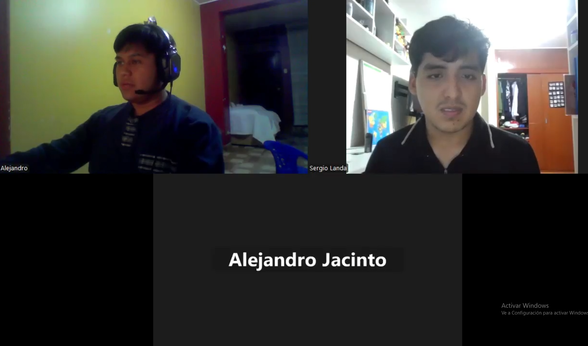
- *URL del video (Google Drive):* [Entrevista 03](https://drive.google.com/file/d/1-mbqRhGOu-WmmgYshSOd4nyqkoY3nbnL/view?usp=drive_link)

*Resumen:*

Alejandro, un joven aficionado a la agricultura y residente cerca de Lima, comentó que cultiva principalmente maíz, papa y algunas hortalizas como lechuga y tomate para el consumo familiar. Explicó que el riego lo realiza de forma intuitiva, observando la tierra y el estado de las hojas, mientras que la fertilización la maneja con compost casero preparado con restos de comida y hojas secas, aplicándolo de manera esporádica. Entre las principales dificultades que enfrenta mencionó la falta de agua y la presencia de plagas como pulgones y hormigas. Mostró interés en una aplicación que le brinde recomendaciones basadas en datos como tipo de suelo, agua o luz solar, además de recibir alertas prácticas sobre riego o nutrientes y recordatorios, ya que suele olvidar algunas tareas de cuidado. Finalmente, señaló que aunque no es experto en tecnología, se siente cómodo usando aplicaciones sencillas como WhatsApp, Facebook o Instagram, y que estaría dispuesto a dedicar solo unos minutos al día para registrar información sobre sus cultivos.


### Segmento objetivo #2: Agricultores de mediana escala (producción comercial local y regional)

##### Datos del Entrevistado #1

- *Nombre completo:* Walter Sanchez
- *Segmento Objetivo:* Agricultor de mediana escala
- *Edad:* 52 años
- *Distrito:* Caraz, Ancash, Perú
- *Inicio de la entrevista:* 12:03 min
- *Duración:* 30:01 min
- *Screenshot del cuadro de video:* 
- *URL del video (Google Drive):* [Entrevista 01](https://drive.google.com/file/d/1-mbqRhGOu-WmmgYshSOd4nyqkoY3nbnL/view?usp=drive_link)

*Resumen:*

- Walter Sanchez, de 52 años, ingeniero agronomo al cuidado de diferentes cultivos de diferentes empresas, principalmente productoras de arandanos y sugar pees, menciona como su mayor problema es que mantener un registro de los diferentes cultivos en diferentes fechas resulta complicado debido a que no se suele manejar registros organizados, siendo muchas veces registros porco ortodoxos o informales lo cual desemboca en cosechas menos productivas. Sobre todo menciona como quisiera que esta posible aplicacion sea facil e intuitiva de usar para los agricultores, ya que un problema de trabajar en provincia, en sus palabras, es que la automatizacion resulta dificil debido a la falta de profesionales.

##### Datos del Entrevistado #2

- *Nombre completo:* Georgette Revolledo
- *Segmento Objetivo:* Agricultor de mediana escala
- *Edad:* 35 años
- *Distrito:* Caraz, Ancash, Perú
- *Inicio de la entrevista:* 18:35 min
- *Duración:* 30:01 min
- *Screenshot del cuadro de video:* 
- *URL del video (Google Drive):* [Entrevista 02](https://drive.google.com/file/d/1-mbqRhGOu-WmmgYshSOd4nyqkoY3nbnL/view?usp=drive_link)

*Resumen:* Georgette Revolledo, de 35 años, administradora de las parcelas agrícolas de su familia, cultiva hortalizas de ciclo corto como lechugas, espinacas y fresas. Explica que el riego en sus parcelas es completamente manual y se decide basado en la experiencia y la observación directa en el campo, siendo su mayor costo operativo la mano de obra necesaria para esta supervisión. Considera que una solución para automatizar el riego le permitiría optimizar costos y tiempo, y le parece fundamental poder recibir alertas de humedad en su celular. En lugar de una gran inversión inicial, ve el modelo de suscripción mensual como una opción "mucho más adecuada y moderna".


##### Datos del Entrevistado #3

- *Nombre completo:* Javier Leon
- *Segmento Objetivo:* Agricultor de mediana escala
- *Edad:* 50 años
- *Distrito:* Caraz, Ancash, Perú
- *Inicio de la entrevista:* 23:30
- *Duración:* 30:01 min
- *Screenshot del cuadro de video:* 
- *URL del video (Google Drive):* [Entrevista 03](https://drive.google.com/file/d/1-mbqRhGOu-WmmgYshSOd4nyqkoY3nbnL/view?usp=drive_link)

*Resumen:* Javier León, un agricultor de 50 años dedicado a la producción comercial en una extensión de aproximadamente 3,000 metros cuadrados en la que cultiva yuca, plátano, manzana, palta y algunos cítricos, explicó que actualmente controla el riego y los nutrientes basándose en la memoria, ajustando la frecuencia según el clima, y utilizando fertilizantes o abono cada 15 días o un mes. Para registrar la información recurre únicamente a su memoria o a una pizarra en el campo, lo que en ocasiones le genera problemas al olvidar fechas importantes de riego o fertilización. Entre las principales dificultades señaló la falta de un sistema confiable para llevar el control de sus labores agrícolas. Manifestó que le sería de gran utilidad recibir recomendaciones clasificadas por riesgo, generar reportes básicos de consumo de agua o rendimiento esperado, y contar con alertas preventivas que le recuerden tareas como riego, fertilización o fumigación. Indicó que estaría dispuesto a ingresar datos en la aplicación de forma interdiaria, valorando especialmente la inclusión de un calendario de tareas agrícolas. Finalmente, expresó que consideraría pagar una suscripción para acceder a reportes y recomendaciones avanzadas, ya que la tecnología le permitiría estar más ordenado y planificar mejor el manejo de sus cultivos.


### 2.2.3. Análisis de entrevistas

**Análisis del Segmento 1 (Pequeña Escala):**

**Hallazgos:**

El 100% de los entrevistados basa sus decisiones de riego en métodos visuales y tradicionales, mostrando una alta dependencia de factores externos incontrolables (clima, turnos de agua). El principal punto de dolor es el riesgo de pérdida de cosecha y los costos directos (combustible, agua comprada). Existe un 100% de escepticismo inicial hacia la tecnología, combinado con curiosidad. La barrera principal es el costo percibido y la durabilidad del equipo. La simplicidad no es un deseo, es un requisito indispensable. La propuesta de valor más resonante es la reducción del riesgo y el ahorro directo.

**Análisis del Segmento 2 (Mediana Escala):**

**Hallazgos:**s
El 100% de los entrevistados ya utiliza alguna forma de riego tecnificado, pero carece de herramientas de monitoreo y automatización de datos. Los puntos de dolor clave son la optimización de costos (mano de obra, energía) y la mejora de la calidad del producto final para cumplir con los estándares del mercado. Hay un 100% de apertura a la tecnología como una inversión estratégica. Valoran los datos, los reportes y la capacidad de gestionar la operación de forma más eficiente y remota. La propuesta de valor más atractiva es la optimización de la rentabilidad y la eficiencia operativa. El modelo de suscripción es bien recibido.

## 2.3. Needfinding

A partir del análisis de las entrevistas, se procede a la construcción de artefactos centrados en el usuario para guiar el diseño del producto.

### 2.3.1. User Personas

Se han desarrollado dos arquetipos que representan a los usuarios clave de CultivApp.

#### User Persona 1: Javier Quispe, Agricultor de Subsistencia

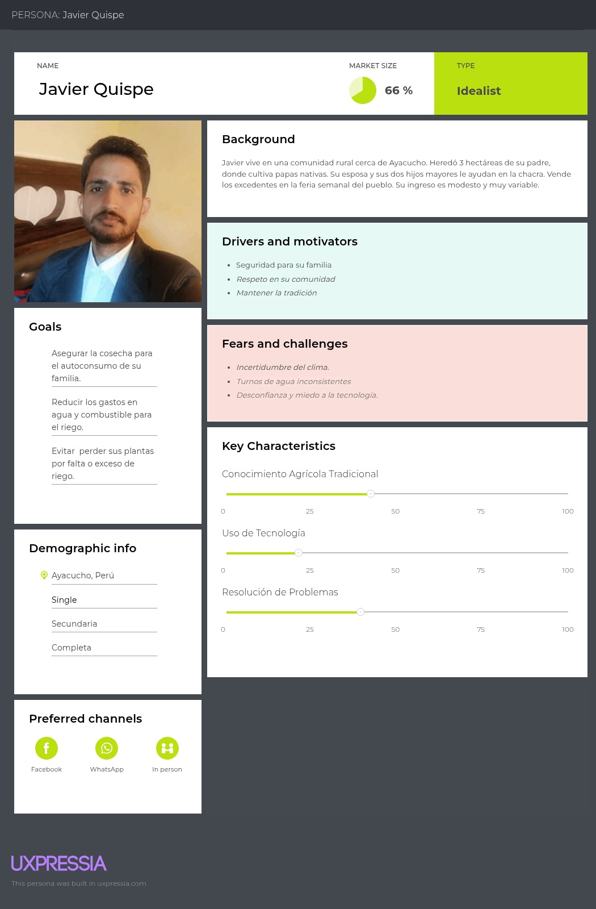

#### User Persona 2: Mariela Vargas, Agricultora Comercial

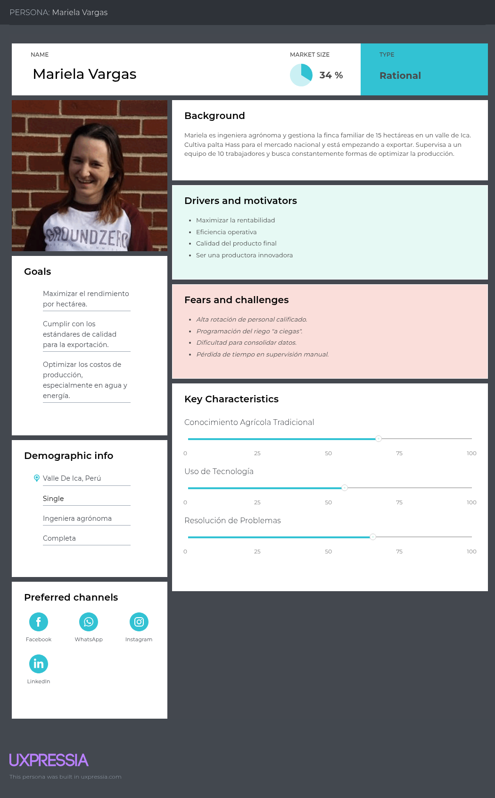

### 2.3.2. User Task Matrix

En este apartado se realizará la User Task Matrix tomando en cuenta los dos segmentos definidos y relacionados a nuestras User Personas: Javier Quispe, un agricultor de subsistencia con recursos limitados, y Mariela Vargas, una agricultora comercial enfocada en la optimización y la exportación.

| TASK | FREQUENCY (Javier Quispe) | IMPORTANCE (Javier Quispe) | FREQUENCY (Mariela Vargas) | IMPORTANCE (Mariela Vargas) |
| :--- | :--- | :--- | :--- | :--- |
| **Consultar estado de humedad del suelo** | Often | High | Often | High |
| **Recibir alertas de riego necesario** | Sometimes | High | Sometimes | High |
| **Activar o detener el riego manualmente** | Often | High | Sometimes | Medium |
| **Programar o ajustar riegos automáticos** | Rarely | Low | Often | High |
| **Revisar el historial de riegos** | Rarely | Medium | Often | High |
| **Analizar datos y comparar parcelas** | Never | Low | Often | High |
| **Descargar reportes de consumo o costos** | Never | Low | Sometimes | High |
| **Configurar nuevas parcelas o sensores** | Rarely | Medium | Sometimes | Medium |

Tomando en cuenta este recuadro podemos apreciar ciertos detalles sobre las actividades de nuestros User Personas:

-   Tanto Javier (agricultor de subsistencia) como Mariela (agricultora comercial) consideran fundamental consultar el estado de la humedad y recibir alertas. Estas son las tareas más importantes para ambos, ya que les permiten conocer la necesidad principal de sus cultivos.
-   Mientras que Javier enfoca su uso en acciones inmediatas y de alto impacto para su supervivencia, como activar el riego manualmente para salvar su cosecha, Mariela emplea su tiempo en actividades de gestión y optimización.
-   Para ella, tareas como programar riegos automáticos, analizar datos y descargar reportes son cruciales para mejorar la eficiencia y rentabilidad de su negocio, actividades que no son prioritarias para el agricultor de subsistencia.

### 2.3.3. User Journey Mapping

En esta sección se elaboran los User Journey Maps para cada User Persona definido en el proyecto: Javier Quispe (Agricultor de Subsistencia) y Mariela Vargas (Agricultora Comercial). Estos mapas ilustran el recorrido de extremo a extremo que cada usuario experimenta en la situación actual (As-Is), es decir, sin la existencia de la solución 'CultivApp'. El objetivo es visualizar sus acciones, pensamientos y emociones para identificar los puntos de dolor más críticos y las oportunidades de mejora.

#### User Journey Map: Javier Quispe (As-Is)

Este mapa de recorrido está vinculado al User Persona Javier Quispe.
**Escenario:** "Enfrentando una semana sin lluvia"

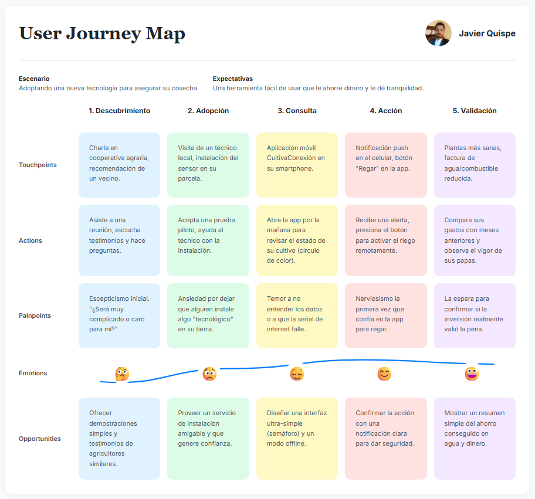

**Resumen del Recorrido:**
-   **Fases:** El viaje de Javier se divide en cinco fases emocionales y de acción: Preocupación, Verificación Manual, Decisión Difícil, Riego Costoso e Incertidumbre.
-   **Acciones:** Sus acciones son puramente físicas y reactivas, desde mirar el cielo y caminar a la chacra hasta comprar combustible y operar una motobomba.
-   **Pensamientos:** Sus pensamientos reflejan una profunda incertidumbre y estrés financiero: "¿Lloverá?", "¿Me alcanzará el dinero?", "¿Habré regado lo suficiente?".
-   **Sentimientos:** La montaña rusa emocional de Javier va desde la ansiedad y el cansancio hasta la duda y una frágil esperanza.
-   **Oportunidad para CultivApp:** Existe una clara oportunidad para proporcionar datos objetivos que eliminen la duda, permitan un uso más eficiente de recursos costosos (agua, combustible) y, sobre todo, brinden tranquilidad al agricultor.

#### User Journey Map: Mariela Vargas (As-Is)

Este mapa de recorrido está vinculado al User Persona Mariela Vargas.
**Escenario:** "Programando el riego semanal"

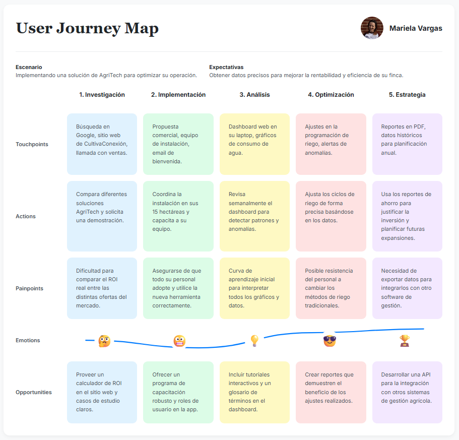


**Resumen del Recorrido:**
-   **Fases:** El recorrido de Mariela es un ciclo de gestión: Planificación, Delegación, Supervisión, Verificación y Ajuste.
-   **Acciones:** Sus acciones combinan herramientas digitales básicas (Excel) con una intensa supervisión manual y comunicación constante (llamadas, visitas a las parcelas).
-   **Pensamientos:** Sus pensamientos están centrados en la eficiencia y el riesgo: "¿Se entendieron las instrucciones?", "¿Por qué esta parcela necesita más agua?", "Este error me costará en calidad", "Pierdo demasiado tiempo en esto".
-   **Sentimientos:** Su estado emocional fluctúa desde la confianza inicial hasta la frustración y la preocupación al detectar ineficiencias, terminando con una sensación de resolución.
-   **Oportunidad para CultivApp:** La oportunidad clave es automatizar los ciclos de delegación y supervisión, proporcionando datos precisos por parcela para permitir ajustes en tiempo real y liberar su tiempo para tareas más estratégicas y de mayor valor.

### 2.3.4. Empathy Mapping

#### Empathy Map: Javier Quispe

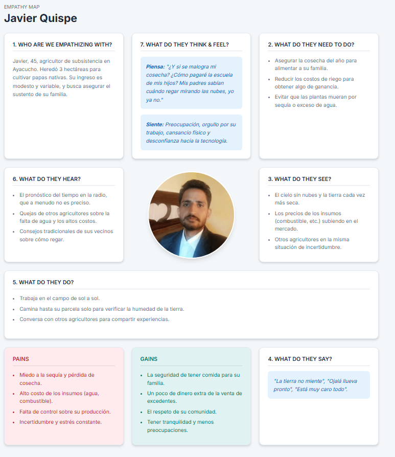

#### Empathy Map: Mariela Vargas

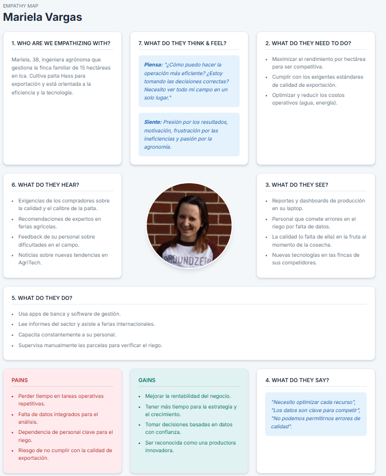

## 2.4. Big Picture EventStorming

En una sesión colaborativa, el equipo mapeó los eventos clave del dominio agrícola desde la perspectiva del agricultor para visualizar el flujo de trabajo completo e identificar los puntos de dolor y las oportunidades de intervención.


Este ejercicio visual confirmó que el ciclo de detección de necesidad de riego y ejecución es un subdominio crítico, repetitivo y lleno de incertidumbre, validando que es el punto de partida ideal para la solución CultivApp.


## 2.5. Ubiquitous Language

Para asegurar una comunicación clara y sin ambigüedades entre los desarrolladores, los stakeholders y, eventualmente, los usuarios, se establece el siguiente glosario de términos del dominio.

<table>
  <thead>
    <tr>
      <th> Término (Ingles)</th>
      <th> Término (Español)</th>
      <th> Descripción (Español)</th>
    </tr>
  </thead>
  <tbody>
    <tr>
      <th> Farmers</th>
      <th> Agricultores </th>
      <th> Persona que se dedica o trabaja en el ambito de plantar, cuidar y cultivar alimentos </th>
    </tr>
    <tr>
      <th> Crop</th>
      <th> Cultivo </th>
      <th> Area de trabajo de los agricultores donde realizan su labor de plantar y cosechar sus alimentos </th>
    </tr>
    <tr>
      <th> Cultivation cycle</th>
      <th> Ciclo de Cultivo </th>
      <th> Eventos durante del proceso de un cultivo desde la siembra hasta la cosecha de este mismo </th>
    </tr>
    <tr>
      <th> Organizations</th>
      <th> Organizaciones </th>
      <th> Empresas interesadas en brindar sus servicios dentro de la aplicacion teniendo una paga de por medio. </th>
    </tr>
    <tr>
      <th> Harvest</th>
      <th> Cosecha </th>
      <th> Producto de extraccion de un cultivo en el momento indicado. </th>
    </tr>
    <tr>
      <th> Sustainability</th>
      <th> Sostenibilidad </th>
      <th> Capacidad de gastar menos recursos de los que se generan para el bien ambiental del cultivo. </th>
    </tr>
    <tr>
      <th> Cultivation history</th>
      <th> Historial de cultivo </th>
      <th> Registro actualizado que guarda la informacion de los estados y cuidados del cultivo. </th>
    </tr>
    <tr>
      <th> Adviser</th>
      <th> Asesor </th>
      <th> Persona enviada por la empresa a evaluar los cultivos registrado en el momento que es necesario. </th>
    </tr>
    <tr>
      <th> Payment gateway</th>
      <th> Pasarela de pago </th>
      <th> Proceso de verificacion que presta su servicio para transacciones dentro de la aplicacion. </th>
    </tr>
    <tr>
      <th> Platform</th>
      <th> Plataforma </th>
      <th> Sistema digital donde los agricultores y asesores interactúan y  comparten información. </th>
    </tr>
    <tr>
      <th> Alert system</th>
      <th> Sistema de alertas </th>
      <th> Mecanismo digital de notificaciones que recuerdan el estado y necesidades del cultivo. </th>
    </tr>
    <tr>
      <th> Cultivation status</th>
      <th> Estado de cultivo </th>
      <th> Mecanismo digital de notificaciones que recuerdan el estado y necesidades del cultivo. </th>
    </tr>
    <tr>
      <th> Resources</th>
      <th> Recursos </th>
      <th> Medios fisicos que sirven para el mantenimiento correcto de un cultivo. </th>
    </tr>
    <tr>
      <th> Crop evaluation</th>
      <th> Evaluacion de cultivo </th>
      <th> Evaluacion de expertos que muestra el estado del cultivo y si es necesario modificar sus caracteristicas. </th>
    </tr>
    <tr>
      <th> Irrigation schedule</th>
      <th> Calendario de riego </th>
      <th> Recordatorio apropiado de la cantidad de dias que faltan para que un cultivo sea regado. </th>
    </tr>
    <tr>
      <th> Cultivation area </th>
      <th> Area de cultivo </th>
      <th> Limites medidos del cultivo para su evaluacion y delimitacion.</th>
    </tr>
    <tr>
      <th> Performance reports</th>
      <th> Reportes de rendimiento</th>
      <th> Analisis documentados de todo la cosecha del cultivo y como puede mejorar. </th>
    </tr>
    <tr>
      <th> Digital Profile</th>
      <th> Perfil digital</th>
      <th> Perfil publico en la aplicacion con la informacion del agricultor, caracteristicas, fotos, cultivos registrados visibles para los usuarios. </th>
    </tr>
  </tbody>
</table>

# Capítulo III: Requirements Specification

## 3.1. To-Be Scenario Mapping

**To-Be Scenario Mapping segmento objetivo 1**

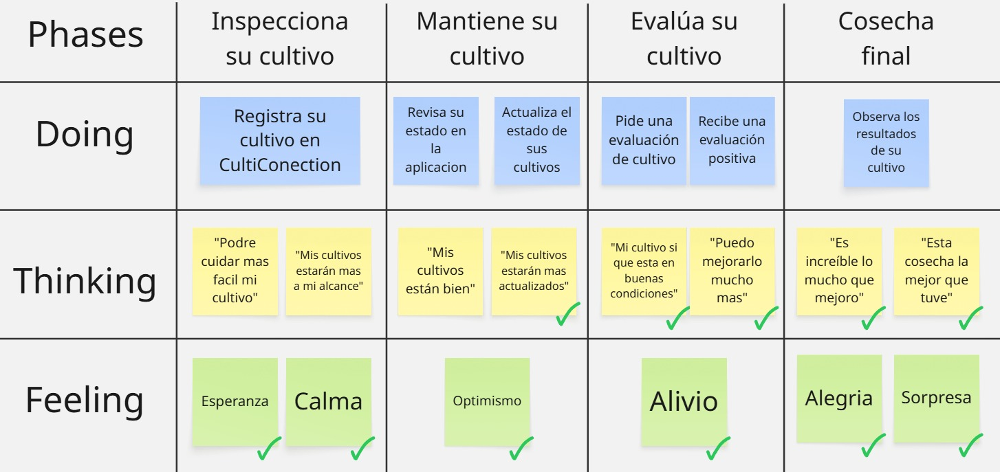

**To-Be Scenario Mapping segmento objetivo 2**

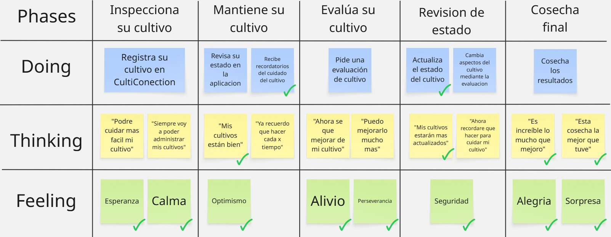

## 3.2. User Stories

**Epicas para CultivApp**

<table>
  <thead>
    <tr>
      <th> EPIC (ID)</th>
      <th> Titulo</th>
      <th> Descripción</th>
    </tr>
  </thead>
  <tbody>
    <tr>
      <th> 01</th>
      <th> Gestion de usuarios </th>
      <th> Como usuario de CultivApp, quiero crear un perfil, modificarlo, abrir y cerrar sension en cualquier dispositivo y recuperar la contraseña de mi cuenta para crear mi identidad dentro de la aplicacion y acceder a sus funcionalidades. </th>
    </tr>
    <tr>
      <th> 02</th>
      <th> Publicacion de Cultivos </th>
      <th> Como usuario de CultivApp, quier crear, eliminar y editar cultivos para tener un control de ellos en tiempo real y actualizado usando las funcionalidades de CultivApp.  </th>
    </tr>
    <tr>
      <th> 03</th>
      <th> Evaluaciones de cultivos </th>
      <th> Como usuario a CultivApp, quiero pedir y recibir evaluaciones de los cultivos que sienta que puedan mejorar para evitar perdidas o una posible muerte de los cultivos por un mal cuidado del que no sepa. </th>
    </tr>
    <tr>
      <th> 04</th>
      <th> Mantenimiento de cultivos </th>
      <th> Como usuario de CultivApp, quiero señalar y recibir señales de datos que necesiten mantenimiento en mi cultivo para asi enfocarme en mejorar y revisar evitando perdidas. </th>
    </tr>
    <tr>
      <th> 05</th>
      <th> Notificaciones de estado del cultivo</th>
      <th> Como usuario de CultivApp, quiero recibir notificaciones personalizadas y adaptadas a mis cultivos para no olvidar los cuidados o si muchos de sus datos estan desactualizados antes de perdir una evaluacion. </th>
    </tr>
    <tr>
      <th> 06</th>
      <th> Seguridad de informacion </th>
      <th> Como administrador de CultivApp, quiero gestionar y cuidar el perfil de mis usuario, para asegurar su estadia dentro de la aplicacion y no sientan un riesgo de ssu datos al navegar dentro de ella. </th>
    </tr>
    <tr>
      <th> 07</th>
      <th> Historial de cultivo </th>
      <th> Como usuario de CultivApp, quiero tener un historial actualizado de los cambios y modificaciones que pueda hacerle a mi cultivo, para saber en que paso pudo cambiar el rendimiento de mi cultivo. </th>
    </tr>
    <tr>
      <th> 08</th>
      <th> Verificacion de identidad </th>
      <th> Como administrador de CultivApp, quiero un sistema de verificacion de identidades de mis usuarios, para asegurarme de que no existan cuentas duplicadas o falsificadores de identidad. </th>
    </tr>
    <tr>
      <th> 09</th>
      <th> Accesibilidad  </th>
      <th> Como usuario de CultivApp, quiero funcionalidades que ayuden a que la aplicacion sea mas accesible en aspectos como color, configuracion y optimizacion para no tener problemas durante su uso. </th>
    </tr>
    <tr>
      <th> 10</th>
      <th> User Experience en la Landing Page </th>
      <th> Como usuario de CultivApp, quiero navegar por una Landing Page con una experiencia de usuario fluida y agil, para verificar y experimentar sus funcionalidades y el acceso a la informacion util del producto. </th>
    </tr>
  </tbody>
</table>

**Historias de Usuario para CultivApp**


<table>
  <thead>
    <tr>
      <th> Storie ID</th>
      <th> Titulo</th>
      <th> Descripción</th>
      <th> Acceptance Criteria</th> 
      <th> Epic ID</th>
    </tr>
  </thead>
  <tbody>
    <tr>
      <th> 01</th>
      <th> Registro de cuenta </th>
      <th> Como usuario, quiero registrarme en la aplicacion, para acceder a sus funciones</th>
      <th> Scenario 1: Registro correcto <br>
      Given el usuario ha ingresado los datos <br>
      When el usuario presiona el boton "Create Account" <br>
      Then la cuenta es creada exitosamente y se accede a la aplicacion <br>
      <br>
      Scenario 2: Registro incorrecto<br>
      Given el usuario no ha ingresado ningun dato <br>
      When el usuario presiona el boton "Create Account" <br>
      Then el sistema muestra un mensaje de campos incompletos <br> 
      </th>
      <th>01</th>
    </tr>
    <tr>
      <th> 02</th>
      <th> Inicio de Sesión </th>
      <th> Como usuario, quiero iniciar sesion, para acceder a mi cuenta</th>
      <th> Scenario 1: Login Exitoso <br>
      Given el usuario ingrese sus datos de cuenta correctamente<br>
      When el usuario presione el boton "Iniciar Sesión" <br>
      Then el sistema abrira la sesion del usuario con sus datos <br>
      <br>
      Scenario 2: Login Fallido <br>
      Given el usuario ingrese datos incorrectos <br>
      When el usuario presione el boton "Inciar Sesion"<br>
      Then el sistema negara el acceso e indicara un mensaje de datos erroneos<br><br>
      Scenario 3: Cerrar sesion<br>
      Given el usuario ingrese a su perfil<br>
      When el usuario presione el boton "Cerrar Sesion"<br>
      Then el sistema cerrar la sesion del usuario
      <th>01</th>
      </th>
    </tr>
    <tr>
      <th> 03</th>
      <th> Recuperar Contraseña </th>
      <th> Como usuario, quiero recuperar la contraseña de mi cuenta, para recuperar el acceso a ella en caso se me olvide </th>
      <th>Scenario 1: Pedir contraseña <br>
      Given el usuario no recuerde la contraseña de su cuenta<br>
      When el usuario presione el boton de "Recuperar contraseña"<br>
      Then el sustema iniciaria el proceso para recuperar o reemplazar su anterior contraseña<br>
      </th>
      <th>01</th>
    </tr>
    <tr>
      <th> 04</th>
      <th> Editar perfil </th>
      <th> Como usuario, quiero modificar mi perfil, para mantenerlo actualizado todo el tiempo </th>
      <th>Scenario 1: Acceso a la ediion<br>
      Given el usuario esta en al seccion "Mi Perfil"<br>
      When el usuario presione el boton "Editar Perfil"<br>
      Then el sistema iniciara el formulario de datos editables del perfil de usuario<br><br>
      Scenario 2: Edicion de Perfil<br>
      Given el usuario esta en el formulario de editar perfil<br>
      When el usuario modifique los datos que desee<br>
      Then el sistema lo actualizara y su perfil mostrara los nuevos datos<br>
      </th>
      <th>01</th>
    </tr>
    <tr>
      <th> 05</th>
      <th> Registrar cultivos</th>
      <th> Como agricultor, quiero registrar diferentes cultivos, para mantener un registro a mi alcance </th>
      <th>Scenario 1: Registrar cultivo<br>
      Given el agricultor quiere registrar un ultivo en la aplicacion <br>
      When el agricultor seleccione el boton "Agregar Cultivo"<br>
      Then el sistema abrira un formulario para llenar con los datos de su cultivo<br>
      </th>
      <th>02</th>
    </tr>
    <tr>
      <th> 06</th>
      <th> Eliminar cultivos</th>
      <th> Como agricultor, quiero eliminar los cultivos que desee, para mantener un registro actualizado </th>
      <th>Scenario 1: Eliminar cultivo<br>
      Given el agricultor desee eliminar un ultivo previamente registrado <br>
      When el agricultor este en el cultivo que desee eliminar<br>
      When el agricultor presione el boton "Elimar Cultivo"<br>
      Then el sistema eliminara el registro del cultivo con toda su informacion<br>
      </th>
      <th>02</th>
    <tr>
      <th> 07</th>
      <th> Editar cultivos</th>
      <th> Como agricultor, quiero editar los cultivos que tenga registrados, para asegurarme que siempre esten actualizados </th>
      <th>Scenario 1: Formulario de edicion<br>
      Given el agricultor se encuentre en el registro del cultivo deseado <br>
      When el agricultor presione el boton "Editar Cultivo"<br>
      Then el sistema abrira un registro para editar datos del cultivo<br>
      <br>
      Scenario 2: Edicion de cultivo
      Given el agricultor se encuentre en el formulario de edicion <br>
      When el agricultor cambie los datos que desee<br>
      When el agricultor presione el boton "Actualizar Cultivo"
      Then el sistema actualizara los datos<br>
      </th>
      <th>02</th>
    </tr>
    <tr>
      <th> 08</th>
      <th> Registro de campo </th>
      <th> Como agricultor, quiero agregar un campo de cultivo, para registrar y actualizar los datos de mis cultivos sin confusion </th>
      <th>Scenario 1: Registro de campo<br>
      Given el agricultor este en la seccion "Mis Campos"
When el agricultor presione el boton "Añadir campo"
Then el sistema iniciara una proceso de creacion de campo de cultivo
      </th>
      <th>03</th>
    <tr>
      <th> 09</th>
      <th> Publicar Campo </th>
      <th> Como agricultor, quiero publicar mis campos de cultivo, para vincularlos facilmente a los cultivos</th>
      <th>Scenario 1: Publicacion de campo
Given el usuario lleno en formulario para crear un campo
When el usuario presione el boton de "Guardar"
Then el sistema creara un campo para su uso
      </th>
      <th>03</th>
    </tr>
    <tr>
      <th>10</th>
      <th> Vincular con cultivos </th>
      <th> Como usuario, quiero vincular mis cultivos con los campos, para organizarlos y mantener un registro ordenado </th>
      <th>Scenario 1: Vinculacion
Given el usuario lleno los datos del cultivo
When el usuario presione el campo al que va a pertenecer
Then el sistema vinculara los datos para su que se muestre completamente
      </th>
      <th>03</th>
    </tr>
    <tr>
      <th> 11</th>
      <th> Señalaciones </th>
      <th> Como agricultor, quiero ver la señalaciones en mis cultivos, para saber si algo puede estar mal</th>
      <th>Scenario 1: Visualizacion de señales<br>
      Given el usuario ya recibio una evaluacion de su cultivo<br>
      When el usuario acceda a su cultivo<br>
      Then el sistema mostrara señalaciones en partes de su registro que puedan necesitar cambios
      </th>
      <th>04</th>
    </tr>
    <tr>
      <th> 12</th>
      <th> Datos adicionales </th>
      <th> Como agricultor, quiero señalar si mi cultivo tiene caracteristias adicionales, para recibir mejor informacion </th>
      <th>Scenario 1: Señalar datos <br>
      Given el agricultor esta registrando su cultivo<br>
      When el agriculto presione el boton "Cuidados Adicionales"<br>
      Then el sistema abrira una formulario que permita señalar nuevos datos<br>
      <br>
      Scenario 2: Eleccion de datos<br>
      Given el agriculto señalo la opcion "Cuidados adicionales"<br>
      When el sistema muestre formularios adiionales<br>
      Then el agriultor podra señalar que cuidados necesitara<br>
      </th>
      <th>04</th>
    </tr>
    <tr>
      <th> 13</th>
      <th> Notificacion de riego </th>
      <th> Como agricultor, quiero recibir recordatorios en forma de mensajes, para saber cuando regar mis cultivos </th>
      <th>Scenario 1: Activar recordatorios<br>
      Given el agricultor registro en los datos los dias de cultivo<br>
      When el sistema detecte el dia de riego<br>
      Then el sistema mandara recordatorios mediante señalando el dia de riego<br>
      <br>
      Scenario 2: Desactivar recordatorios<br>
      Given el agricultor registro en los datos los dias de cultivo<br>
      When el usuario no quiera recibir recordatorios<br>
      And el usuario marque la opcion "No recibir recordatorio"<br>
      Then el sistema no enviara recordatorios<br>
      </th>
      <th>05</th>
    </tr>
    <tr>
      <th> 14</th>
      <th> Recordatorio de datos del cultivo</th>
      <th> Como agricultor, quiero recibir recordatorios de los datos de mi cultivo, en caso necesite actualizarlos </th>
      <th>Scenario 1: Recordatorio de datos<br>
      Given el usuario ya registro su cultivo<br>
      When el sistema detecte que ha pasado demasiado tiempo<br>
      Then el sistema enviara un recordatorio sobre los datos del cultivo en caso necesiten un cambio<br>
      </th>
      <th>05</th>
    </tr>
    <tr>
      <th> 15</th>
      <th> Gestionar usuarios </th>
      <th> Como administrador, quiero verifiar y gestionar a los usuarios registrados, para una correcta administracion de la aplicacion </th>
      <th>Scenario 1: Acceso a gestion<br>
      Given el adminitrador ingrese al sistema <br>
      And el administrador inicie la sesion<br>
      When el administrador entre al modulo de gestion de usuarios<br>
      Then el sistema mostrara una lista de todos los usuarios registrados<br>
      </th>
      <th>06</th>
    </tr>
    <tr>
      <th> 16</th>
      <th> Bloqueo de cuenta </th>
      <th> Como administrador, quiero asegurar el acceso al perfil de los usuarios, para mantener su informacion segura </th>
      <th>Scenario 1: Acceso bloqueado<br>
      Given el sistema detecta un ingreso fallido a una cuenta<br>
      When el sistema detecte mas de 10 intentos fallidos de aeder a una cuenta<br>
      Then el sistema bloqueara el acceso a la cuenta por un tiempo definido<br>
      </th>
      <th>06</th>
    </tr>
    <tr>
      <th> 17</th>
      <th> Creacion de historial </th>
      <th> Como agricultor, quiero acceder a un historial de los cambios del cultivo para mantener un registro detallado </th>
      <th>Scenario 1: Historial creado<br>
      Given el agricultor realizo una edicion de su cultivo en la aplicacion<br>
      When el agricultor este por guardar el cambio <br>
      Then el sistema creara un historial y lo enviara al agricultor
      </th>
      <th>07</th>
    </tr>
    <tr>
      <th> 18</th>
      <th> Atajos sencillos </th>
      <th> Como usuario, quiero tener acceso a atajos de organización para
      una mejor navegación dentro de la aplicacion </th>
      <th>Scenario 1: Regreso al inicio<br>
      Given el usuario quiere regresar a la sección de “Inicio”<br>
      When el usuario presione el logo del producto<br>
      Then se regresará a la sección de “Inicio” nuevamente cargada<br>
      </th>
      <th>09</th>
    </tr>
    <tr>
      <th> 19</th>
      <th> Disponibilidad de sistema </th>
      <th> Como usuario, quiero un sistema que esté disponible en cualquier
      hora para acceder cuando quiero sin problema de disponibilidad o
      mantenimiento</th>
      <th>Scenario 1: Uso del sistema<br>
      Given el usuario necesite usar el sistema<br>
      When el usuario ingrese a la página del producto<br>
      Then entrara con normalidad sin problemas de coneccion o
      soporte<br>
      </th>
      <th>09</th>
    </tr>
    <tr>
      <th> 20</th>
      <th> Visualizar página de inicio </th>
      <th> Como usuario, quiero visualizar una página de inicio clara para
      comprender rápidamente de qué trata CultivApp. </th>
      <th>Scenario 1: Acceso a la página principal<br>
      Given  el usuario accede al landing page de CultivApp<br>
      When el sistema cargue la página <br>
      Then el sistema mostrara el nombre del producto, una descripción
      breve y una pagina correctamente diseñada.<br>
      </th>
      <th>10</th>
    </tr>
    <tr>
      <th> 21</th>
      <th> Navegación desde el footer </th>
      <th> Como usuario, quiero acceder a enlaces de navegación en el footer
      para moverme entre secciones fácilmente </th>
      <th>Scenario 1: Acceso a secciones desde el footer<br>
      Given el usuario está visualizando el footer<br>
      When haga clic en un enlace de sección (Inicio, Características, etc)<br>
      Then será desplazado automáticamente a la sección correspondiente del landing.
      </th>
      <th>10</th>
    </tr>
  </tbody>
</table>

## 3.3. Impact Mapping.

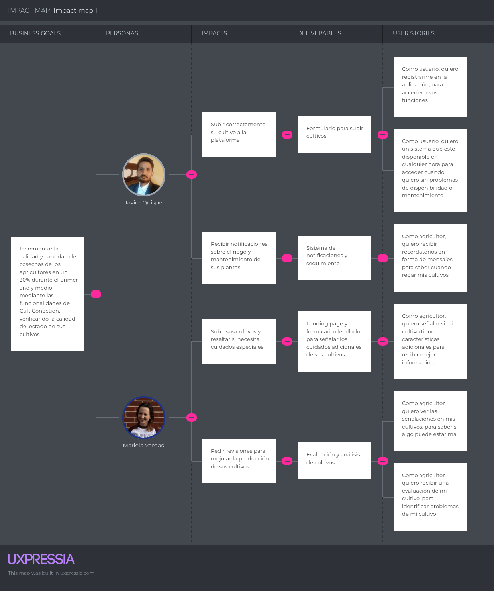

## 3.4. Product Backlog.

<table>
  <thead>
    <tr>
      <th> #Orden</th>
      <th> User Story ID</th>
      <th> Título</th>
      <th> Descripción</th>
      <th> Story Points (1/2/3/5/8)</th>
      <th> Epic ID</th>
    </tr>
  </thead>
  <tbody>
    <tr>
      <th> EP01</th>
      <th> Gestion de usuarios </th>
      <th></th>
      <th>Como usuario de CultivApp, quiero crear un perfil, modificarlo, abrir y cerrar sension en cualquier dispositivo y recuperar la contraseña de mi cuenta para crear mi identidad dentro de la aplicacion y acceder a sus funcionalidades.</th>
      <th></th>
      <th>01</th>
    </tr>
    <tr>
      <th> 1</th>
      <th> US01 </th>
      <th>Registro de cuenta</th>
      <th>Como usuario, quiero registrarme en la aplicacion, para acceder a sus funciones</th>
      <th>2</th>
      <th>01</th>
    </tr>
    <tr>
      <th> 2</th>
      <th> US02 </th>
      <th>Inicio de Sesión</th>
      <th>Como usuario, quiero iniciar sesion, para acceder a mi cuenta</th>
      <th>1</th>
      <th>01</th>
    </tr>
    <tr>
      <th> 3</th>
      <th> US03 </th>
      <th>Recuperar Contraseña</th>
      <th>Como usuario, quiero recuperar la contraseña de mi cuenta, para recuperar el acceso a ella en caso se me olvide</th>
      <th>3</th>
      <th>01</th>
    </tr>
    <tr>
      <th> 4</th>
      <th> US04 </th>
      <th>Editar perfil</th>
      <th>Como usuario, quiero modificar mi perfil, para mantenerlo actualizado todo el tiempo</th>
      <th>1</th>
      <th>01</th>
    </tr>
    <tr>
      <th> EP02</th>
      <th> Publicacion de Cultivos </th>
      <th></th>
      <th> Como usuario de CultivApp, quier crear, eliminar y editar cultivos para tener un control de ellos en tiempo real y actualizado usando las funcionalidades de CultivApp.  </th>
      <th></th>
      <th>02</th>
    </tr>
    <tr>
      <th> 5</th>
      <th> US05 </th>
      <th>Registrar cultivos</th>
      <th>Como agricultor, quiero registrar diferentes cultivos, para mantener un registro a mi alcance</th>
      <th>3</th>
      <th>02</th>
    </tr>
    <tr>
      <th> 6</th>
      <th> US06 </th>
      <th>Eliminar cultivos</th>
      <th>Como agricultor, quiero eliminar los cultivos que desee, para mantener un registro actualizado</th>
      <th>2</th>
      <th>02</th>
    </tr>
    <tr>
      <th> 7</th>
      <th> US07 </th>
      <th>Editar cultivos</th>
      <th>Como agricultor, quiero editar los cultivos que tenga registrados, para asegurarme que siempre esten actualizados</th>
      <th>1</th>
      <th>02</th>
    </tr>
    <tr>
      <th> EP03</th>
      <th> Publicacion de Campo de Cultivo </th>
      <th></th>
      <th> Como usuario a CultivApp, quiero pedir y recibir evaluaciones de los cultivos que sienta que puedan mejorar para evitar perdidas o una posible muerte de los cultivos por un mal cuidado del que no sepa. </th>
      <th></th>
      <th>03</th>
    </tr>
    <tr>
      <th> 8</th>
      <th> US08 </th>
      <th>Registro de campo</th>
      <th>Como agricultor, quiero agregar un campo de cultivo, para registrar y actualizar los datos de mis cultivos sin confusion</th>
      <th>3</th>
      <th>03</th>
    </tr>
    <tr>
      <th> 9</th>
      <th> US09 </th>
      <th>Publicar Campo</th>
      <th>Como agricultor, quiero publicar mis campos de cultivo, para vincularlos fácilmente a los cultivos</th>
      <th>5</th>
      <th>03</th>
    </tr>
    <tr>
      <th> 10</th>
      <th> US10 </th>
      <th>Vincular con cultivos</th>
      <th>Como usuario, quiero vincular mis cultivos con los campos, para organizarlos y mantener un registro ordenado</th>
      <th>5</th>
      <th>03</th>
    </tr>
    <tr>
      <th> EP04</th>
      <th> Mantenimiento de cultivos </th>
      <th></th>
      <th> Como usuario de CultivApp, quiero señalar y recibir señales de datos que necesiten mantenimiento en mi cultivo para asi enfocarme en mejorar y revisar evitando perdidas. </th>
      <th></th>
      <th>04</th>
    </tr>
    <tr>
      <th> 11</th>
      <th> US11 </th>
      <th>Señalaciones</th>
      <th>Como agricultor, quiero ver la señalaciones en mis cultivos, para saber si algo puede estar mal</th>
      <th>2</th>
      <th>04</th>
    </tr>
      <th> 12</th>
      <th> US12 </th>
      <th>Datos adicionales</th>
      <th>Como agricultor, quiero señalar si mi cultivo tiene características adicionales, para recibir mejor informacion</th>
      <th>2</th>
      <th>04</th>
    </tr>
    <tr>
      <th> EP05</th>
      <th> Notificaciones de estado del cultivo</th>
      <th></th>
      <th> Como usuario de CultivApp, quiero recibir notificaciones personalizadas y adaptadas a mis cultivos para no olvidar los cuidados o si muchos de sus datos estan desactualizados antes de perdir una evaluacion. </th>
      <th></th>
      <th>05</th>
    </tr>
    </tr>
      <th> 13</th>
      <th> US13 </th>
      <th>Notificacion de riego</th>
      <th>Como agriultor, quiero reibir recordatorios en forma de mensajes, para saber cuando regar mis cultivos</th>
      <th>1</th>
      <th>05</th>
    </tr>
    </tr>
      <th> 14</th>
      <th> US14 </th>
      <th>Recordatorio de datos del cultivo</th>
      <th>Como agricultor, quiero recibir recordatios de los datos de mi cultivo, en caso necesite actualizarlos</th>
      <th>2</th>
      <th>05</th>
    </tr>
    <tr>
      <th> EP06</th>
      <th> Seguridad de informacion </th>
      <th></th>
      <th> Como administrador de CultivApp, quiero gestionar y cuidar el perfil de mis usuario, para asegurar su estadia dentro de la aplicacion y no sientan un riesgo de ssu datos al navegar dentro de ella. </th>
      <th></th>
      <th>06</th>
    </tr>
    </tr>
      <th> 15</th>
      <th> US15 </th>
      <th>Gestionar usuarios</th>
      <th>Como administrador, quiero verificar y gestionar a los usuarios registrados, para una correcta administracion de la aplicacion</th>
      <th>5</th>
      <th>06</th>
    </tr>
    </tr>
      <th> 16</th>
      <th> US16 </th>
      <th>Bloqueo de cuenta</th>
      <th>Como administrador, quiero asegurar el acceso al perfil de los usuarios, para mantener su informacion segura</th>
      <th>3</th>
      <th>06</th>
    </tr>
    <tr>
      <th> EP07</th>
      <th> Historial de cultivo </th>
      <th></th>
      <th> Como usuario de CultivApp, quiero tener un historial actualizado de los cambios y modificaciones que pueda hacerle a mi cultivo, para saber en que paso pudo cambiar el rendimiento de mi cultivo. </th>
      <th></th>
      <th>07</th>
    </tr>
    </tr>
      <th> 17</th>
      <th> US17 </th>
      <th>Creacion de historial</th>
      <th>Como agricultor, quiero acceder a un historial de los cambios del cultivo para mantener un registro detallado</th>
      <th>3</th>
      <th>07</th>
    </tr>
    <tr>
      <th> EP09</th>
      <th> Accesibilidad  </th>
      <th></th>
      <th> Como usuario de CultivApp, quiero funcionalidades que ayuden a que la aplicacion sea mas accesible en aspectos como color, configuracion y optimizacion para no tener problemas durante su uso. </th>
      <th></th>
      <th>09</th>
    </tr>
    </tr>
      <th> 18</th>
      <th> US18 </th>
      <th>Atajos sencillos</th>
      <th>Como usuario, quiero tener acceso a atajos de organización para
      una mejor navegación dentro de la aplicacion</th>
      <th>2</th>
      <th>09</th>
    </tr>
    </tr>
      <th> 19</th>
      <th> US19 </th>
      <th>Disponibilidad de sistema</th>
      <th>Como usuario, quiero un sistema que esté disponible en cualquier
      hora para acceder cuando quiero sin problema de disponibilidad o
      mantenimiento</th>
      <th>1</th>
      <th>09</th>
    </tr>
    <tr>
      <th> EP10</th>
      <th> User Experience en la Landing Page </th>
      <th></th>
      <th> Como usuario de CultivApp, quiero navegar por una Landing Page con una experiencia de usuario fluida y agil, para verificar y experimentar sus funcionalidades y el acceso a la informacion util del producto. </th>
      <th></th>
      <th>10</th>
    </tr>
    </tr>
      <th> 20</th>
      <th> US20 </th>
      <th>Visualizar página de inicio</th>
      <th>Como usuario, quiero visualizar una página de inicio clara para
      comprender rápidamente de qué trata CultivApp</th>
      <th>3</th>
      <th>10</th>
    </tr>
    </tr>
      <th> 21</th>
      <th> US21 </th>
      <th>Navegación desde el footer</th>
      <th>Como usuario, quiero acceder a enlaces de navegación en el footer
      para moverme entre secciones fácilmente</th>
      <th>2</th>
      <th>10</th>
    </tr>
  </tbody>
</table>

# Capítulo IV: Product Design

## 4.1. Style Guidelines.

### 4.1.1. General Style Guidelines.

<h3>Branding</h3>

El logo de CultivApp refleja de manera elegante y minimalista la propuesta de valor de la marca en el sector agrícola. Su diseño, basado en una tipografía negra sobre fondo blanco, transmite sobriedad, confianza y profesionalismo, garantizando una excelente legibilidad en cualquier soporte, ya sea digital o físico.

En la parte superior, la figura estilizada de una planta representa la innovación y sostenibilidad, valores fundamentales de la experiencia que CultivApp busca ofrecer.

La composición mantiene un equilibrio armonioso entre modernidad y simplicidad, ideal para una plataforma tecnológica orientada a conectar personas con soluciones agrícolas accesibles, rápidas y ecológicas. La elección de una paleta monocromática refuerza la seriedad de la propuesta.

Con este logo, CultivApp se posiciona como una marca confiable, eficiente y comprometida con la transformación del sector agrícola, adaptándose a las necesidades de estudiantes, profesionales y empresas.

***Logo original***

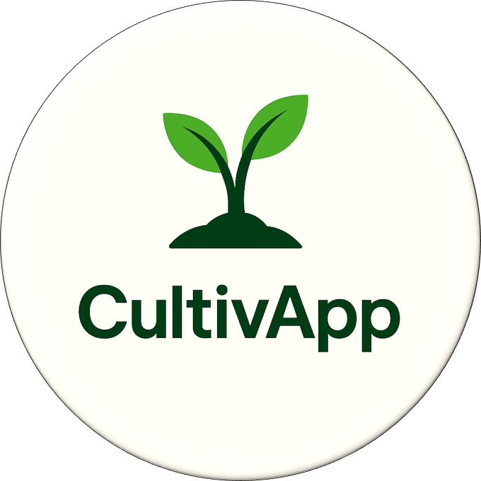

<h3>Typography</h3>

La tipografía de nuestra app  refleja dinamismo, innovación y accesibilidad, alineándose con los valores de sostenibilidad y movilidad inteligente que representamos.

La fuente principal será "Montserrat", que por su diseño minimalista y esbelto permite que los usuarios puedan consultar información rápida mientras se desplazan.

Para lograr una jerarquía visual clara, los títulos y subtítulos tendrán un tamaño más prominente que el cuerpo del texto. Los títulos (H1, H2) enfatizan energía y movimiento, mientras que los textos secundarios mantienen un tono amigable y sencillo.

El cuerpo del texto usará un tamaño base adaptable, que garantice lectura sin esfuerzo tanto en pantallas pequeñas (smartphones) como en tablets. Se mantendrá un interlineado aireado y márgenes equilibrados para no saturar la interfaz.

El lenguaje será directo y motivador, usando un tono casual que inspire confianza y fomente la adopción de alternativas de transporte sostenible.

<h3>Colors</h3>

La paleta de colores de nuestra app  fue diseñada para reforzar el impacto visual del logo y proyectar dinamismo, sostenibilidad y confianza. El blanco se mantiene como base, representando simplicidad, limpieza y espacios abiertos, facilitando que los elementos clave destaquen sin saturar la vista.

El negro profundo del logo se utiliza en tipografía principal y elementos estructurales, comunicando seriedad y profesionalismo. Para transmitir energía y movimiento, incorporamos un verde lima brillante (#18FA3A) como color de acento, ideal para botones de acción (reservar, iniciar viaje) y mensajes de confirmación. Este tono evoca sostenibilidad y vitalidad, conectando con la misión de promover transporte limpio.

Un gris color (#EEEEEE) complementa la paleta y refuerza la percepción tecnológica de la plataforma, utilizado en íconos interactivos y estados activos. Además, tonos gris claro (#EAEAEA) y gris oscuro (#4F4F4F) equilibran la interfaz, mejorando la legibilidad y jerarquizando la información.

---

#### Paleta de colores - CultivApp

| **Color**        | **Uso**                                                                 | **Código Hex** |
|------------------|-------------------------------------------------------------------------|---------------|
| Blanco           | Fondo principal de la interfaz, espacios vacíos, sensación de limpieza y orden. | `#FFFFFF`     |
| Negro profundo   | Logo, textos principales, íconos y elementos estructurales.              | `#000000`     |
| Verde energía    | Botones de acción (reservar, iniciar viaje), confirmaciones y mensajes de éxito. | `#18FA3A`     |
| Gris claro       | Fondos secundarios, separadores, tarjetas de información.                | `#D9D9D9`     |
| Gris medio       | Texto secundario, íconos inactivos, descripciones y estados deshabilitados. | `#A6A6A6`     |


### 4.1.2. Web Style Guidelines.

## 4.2. Information Architecture.

### 4.2.1. Organization Systems.

Para la **landing page** de CultivApp, se ha optado por una estructura jerárquica para ambos segmentos de usuarios, ya que se cuenta con una barra de navegación superior que dirige a diferentes secciones, cada una encapsulando información relevante y relacionada.

Para el proceso de inicio de sesión o creación de cuenta, se utiliza una organización lineal, permitiendo que el usuario avance paso a paso a medida que completa los datos requeridos hasta finalizar el registro o acceso.

Dentro de la aplicación principal, se mantiene una organización jerárquica para separar y encapsular las distintas funcionalidades, independientemente del tipo de usuario. Esto asegura que, aunque los usuarios tengan diferentes necesidades y accesos, la estructura de la aplicación sea coherente y fácil de navegar.

#### Agricultor:
Para los **agricultores**, la funcionalidad principal es la gestión de cultivos y parcelas. Por ello, la organización jerárquica permite agrupar subfuncionalidades como ***el registro de nuevos cultivos, monitoreo de parcelas, historial de actividades y notificaciones***, todas relacionadas con la gestión agrícola.

#### Asociación o Empresa:
En el caso de **asociaciones o empresas agrícolas**, también se emplea una organización jerárquica para gestionar múltiples parcelas, usuarios y reportes. Además, se pueden acceder a funcionalidades específicas como ***la supervisión de cultivos, generación de informes y administración de usuarios asociados***.

Finalmente, para funcionalidades comunes como la edición de perfil, gestión de notificaciones o cierre de sesión, se mantiene la organización jerárquica, asegurando que todas estas opciones estén claramente segmentadas y accesibles para todos los usuarios.

### 4.2.2. Labeling Systems.

### 4.2.3. SEO Tags and Meta Tags

**Titulo:**
```html
<title>CultivApp</title>
```

**Codificación de carácteres:**
```html
<meta charset="utf-8">
```

**Descripción:**
```html
<meta name="description" content="CultivApp is a web application focused on Advanced IoT technology for smart crop monitoring.">
```

**Autor y Derechos de Autor:**
```html
<meta name="author" content="CultivApp">
<meta name="copyright" content="Copyright CultivApp team" />
```


### 4.2.4. Searching Systems.

El sistema integral de CultivApp contará con un **módulo de búsqueda y localización en tiempo real**, que permitirá a los usuarios identificar la ubicación y el estado de sus cultivos, parcelas y recursos agrícolas de manera eficiente. Este sistema se basa en las siguientes características:

**Geolocalización en tiempo real:**  
Cada parcela o cultivo podrá estar asociada a dispositivos GPS o sensores IoT, que enviarán información actualizada sobre su ubicación y condiciones directamente a la plataforma central.

**Mapa interactivo en la aplicación web y móvil:**  
La aplicación mostrará un mapa donde los usuarios podrán visualizar la ubicación exacta de sus cultivos, áreas de riego, sensores y otros recursos, diferenciados por tipo y estado.

**Filtros de búsqueda avanzada:**  
Los usuarios podrán buscar y filtrar información según:

- Tipo de cultivo o recurso.
- Estado de crecimiento o condición del cultivo.
- Ubicación geográfica dentro del terreno.
- Necesidades específicas (riego, fertilización, cosecha, etc.).

**Acciones inmediatas:**  
Una vez identificado un cultivo o recurso, el usuario podrá acceder rápidamente a su ficha técnica, registrar actividades (riego, fertilización, monitoreo), o programar alertas y recordatorios.

**Optimización para asociaciones y empresas agrícolas:**  
En el caso de usuarios corporativos, el sistema de búsqueda permitirá visualizar y gestionar múltiples parcelas o cultivos distribuidos en diferentes ubicaciones, facilitando la supervisión y toma de decisiones a gran escala.

Con este enfoque, el sistema de búsqueda de CultivApp se convierte en un **componente esencial para la experiencia del usuario**, asegurando eficiencia en la gestión agrícola y optimizando el uso de los recursos disponibles.

### 4.2.5. Navigation Systems.

El sistema integral de CultivApp contará con un **módulo de navegación inteligente** que facilitará a los usuarios la gestión y supervisión de sus cultivos, parcelas y recursos agrícolas, optimizando el monitoreo y la toma de decisiones en campo. Este módulo se estructura en las siguientes funciones:

**Guía hacia la parcela o recurso seleccionado:**  
Una vez seleccionado un cultivo, parcela o recurso en la aplicación, el sistema mostrará la ruta más eficiente desde la ubicación actual del usuario hasta el destino dentro del terreno agrícola, utilizando mapas interactivos en tiempo real.

**Navegación durante el recorrido:**  
El sistema proporcionará indicaciones para que el usuario se desplace de manera eficiente dentro de la finca o campo, evitando zonas restringidas o de difícil acceso. Para ello, se integrarán APIs de mapas inteligentes como ***Google Maps o Mapbox***, adaptadas a entornos agrícolas.

**Seguridad y recomendaciones en la navegación:**  
- Alertas sobre zonas de riesgo, áreas en mantenimiento o condiciones adversas (por ejemplo, inundaciones o suelos inestables).
- Recomendaciones de rutas seguras y óptimas para maquinaria agrícola, personal o vehículos de campo.
- Opciones de personalización (ruta más corta, más segura o que pase por puntos de interés como sensores o estaciones de riego).

**Gestión de puntos clave y recursos:**  
La navegación incluirá la localización de puntos estratégicos como almacenes, estaciones de riego, sensores IoT, áreas de carga y descarga, o zonas de acopio, facilitando la logística y el control de recursos.

**Soporte para asociaciones y empresas agrícolas:**  
En el caso de usuarios corporativos, el sistema de navegación permitirá sugerir rutas entre diferentes parcelas, campos o instalaciones, optimizando la supervisión y el desplazamiento del personal.

En conjunto, este módulo no solo ofrece orientación geográfica en tiempo real, sino que también optimiza la experiencia de gestión agrícola, mejorando la seguridad y eficiencia de las operaciones en campo y reduciendo la incertidumbre en la toma de decisiones.

## 4.3. Landing Page UI Design.


### 4.3.1. Landing Page Wireframe.

- Navbar  

- Hero  

- About Us Section.  

- Features Section.  

- Pricing Section.

- Sponsors Section.

- Footer Section.  

  

### 4.3.2. Landing Page Mock-up.

- Navbar  

- Hero  

- About Us Section.  

- Features Section.  

- Pricing Section.

- Sponsors Section.

- Footer Section.  


## 4.4. Web Applications UX/UI Design.

### 4.4.1. Web Applications Wireframes.

Diseño para visualizar la edición de perfil y cuentas de usuario.


Servicios de la aplicación.


### 4.4.2. Web Applications Wireflow Diagrams.

A continuación se presentan los diagramas de flujo de usuario (wireflow diagrams) que ilustran las interacciones y navegación dentro de la aplicación web CultivApp.


### 4.4.2. Web Applications Mock-ups.


### 4.4.3. Web Applications User Flow Diagrams.

These are diagrams that visually represent the path a user takes within a web application — from the first interaction to completing a specific goal (for example, signing up, purchasing, or submitting a form).


## 4.5. Web Applications Prototyping.

Web Applications Prototyping es una metodología esencial en el desarrollo de aplicaciones web, que implica la creación de bocetos visuales o modelos preliminares de una aplicación antes de su implementación completa. 

* HU01: 


* HU02:


* HU03:


* HU04:


* HU05:


* HU06:


[Ver video de Landing Page en Google Drive](https://drive.google.com/file/d/1qCTM9e2YOJkWyPt9eAu8up6ohTb8QGHl/view?usp=sharing)

## 4.6. Domain-Driven Software Architecture.

Esta parte se expone la arquitectura de software del proyecto CultivApp. La propuesta fue elaborada con un enfoque orientado al dominio, de manera que los elementos más relevantes de la plataforma estén correctamente representados y respondan a los requerimientos de los usuarios. Seguidamente, se incluyen diagramas esenciales que ilustran la interacción entre los distintos componentes del sistema y los actores externos.

### 4.6.1. Design-Level Event Storming.

En esta sección, presentamos el Design Level Event Storming desarrollado para nuestro proyecto CultivApp. Esta actividad nos permitió profundizar en los detalles del dominio, definiendo de manera clara los eventos, comandos, agregados y políticas que guían el comportamiento del sistema. El objetivo fue transformar la visión general en un diseño más estructurado, asegurando que los límites contextuales y las interacciones entre componentes quedaran bien definidos

- Bounded Context User Management 


- Bounded Context Cultivos Management


- Bounded Context Area Management


- Bounded Context Evaluation Management


### 4.6.2. Software Architecture Context Diagram.

El diagrama de contexto de CultivApp ofrece una visión global de las interacciones principales entre el sistema central y los actores externos que lo rodean. La plataforma está orientada a simplificar la gestión y supervisión de cultivos por parte de los usuarios. En este nivel, se identifican actores clave como el Agricultor, encargado de registrar y administrar sus cultivos, y la Asociación, que envía las evaluaciones correspondientes. Asimismo, se muestran las integraciones externas más relevantes: la Pasarela de Pago para procesar transacciones con las asociaciones, el Servicio de Mapas para visualizar la ubicación de los cultivos y las Redes Sociales para compartir información de manera pública. Esta representación de alto nivel permite entender de manera clara cómo CultivApp se relaciona y coopera con su ecosistema digital y humano.

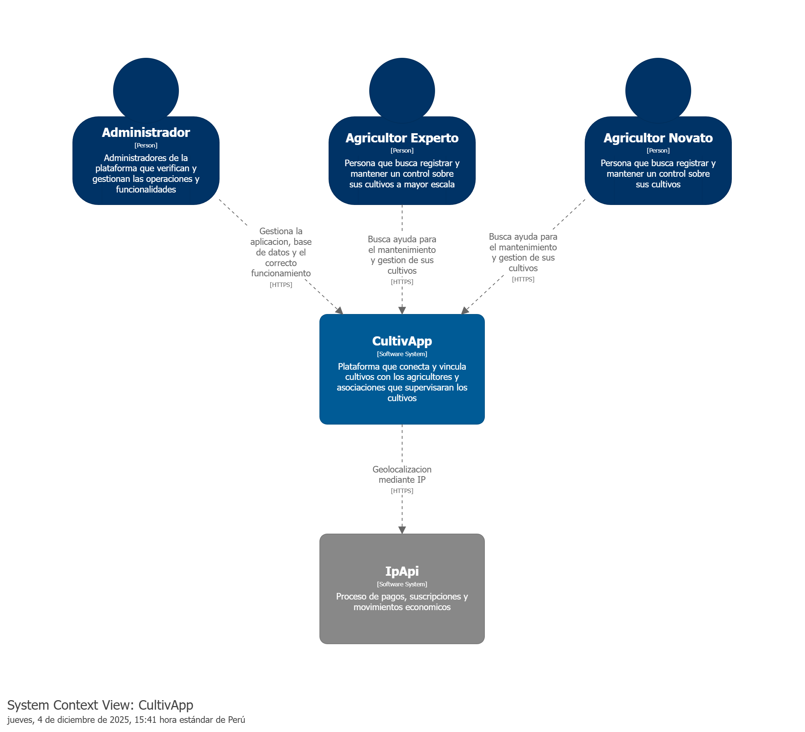

### 4.6.3. Software Architecture Container Diagrams.

El diagrama de contenedores detalla la organización interna de CultivApp, mostrando cómo los diferentes componentes de software trabajan en conjunto para brindar la funcionalidad de la plataforma. La Aplicación Web, implementada en React, sirve como punto de interacción donde los usuarios pueden registrar y gestionar sus cultivos. Esta interfaz se conecta con una API en Node.js, que cumple el rol de enlace entre la capa de presentación y los servicios del backend. La información esencial de usuarios, cultivos, registros, evaluaciones y pagos se almacena en una Base de Datos PostgreSQL. Asimismo, se integran contenedores adicionales como el Servicio de Mapas (basado en Google Maps API) para la visualización de ubicaciones y la Pasarela de Pago (Stripe), destinada a la gestión de transacciones. En conjunto, este nivel del modelo permite comprender cómo se estructuran y comunican las partes técnicas del sistema.

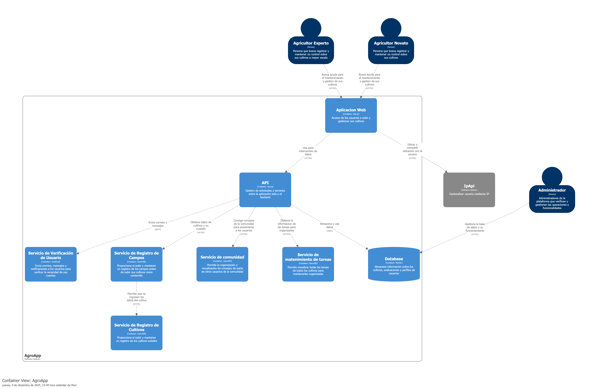

### 4.6.4. Software Architecture Components Diagrams.

El diagrama de componentes pone el foco en la arquitectura interna de la API de CultivApp, encargada de coordinar la lógica de negocio central de la plataforma. Esta API, desarrollada en Node.js, se organiza en distintos componentes especializados, cada uno orientado a un dominio concreto. El Componente de Gestión de Usuarios administra la autenticación y los perfiles; Gestión de Cultivos permite realizar operaciones sobre los cultivos registrados; Control de Cultivos abarca el ciclo completo de cuidado de cada cultivo; Ubicaciones y Terrenos gestiona la localización de los cultivos registrados; y Reporte de Evaluaciones procesa tanto los informes como los pagos asociados a dichas evaluaciones. La interacción entre estos módulos sigue un flujo funcional definido: los agricultores administran cultivos, estos se asocian a cuentas y pueden ser evaluados. Esta separación de responsabilidades refleja un diseño guiado por el dominio, donde cada componente encapsula una función específica y colabora con los demás para dar soporte integral a la plataforma junto a los Bounded Countext desarrollados que explicacion de forma aun mas detallada la funcionalidad de cada componente existente de la plataforma CultivApp.

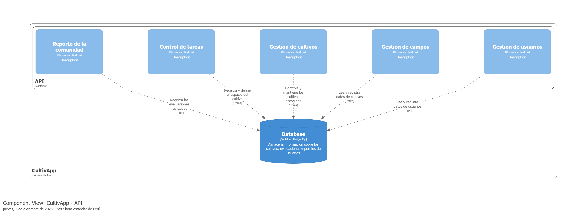

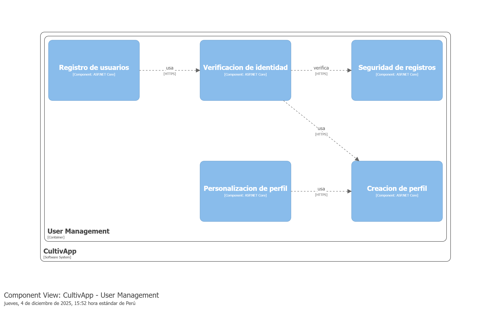

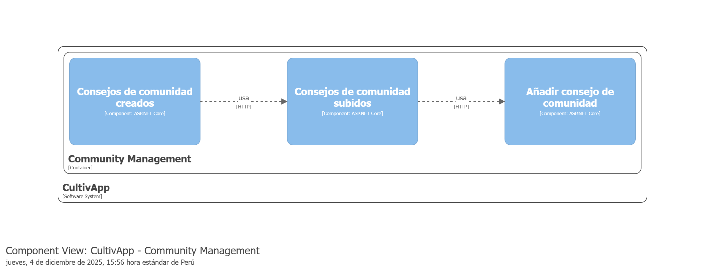

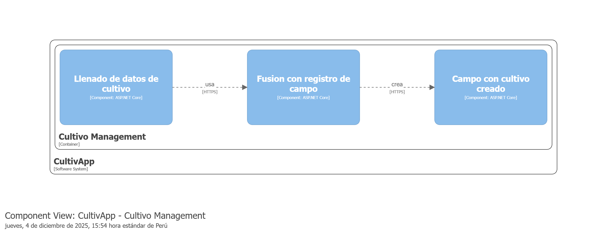

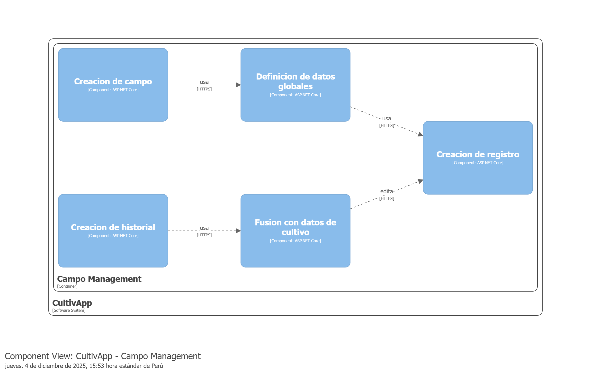

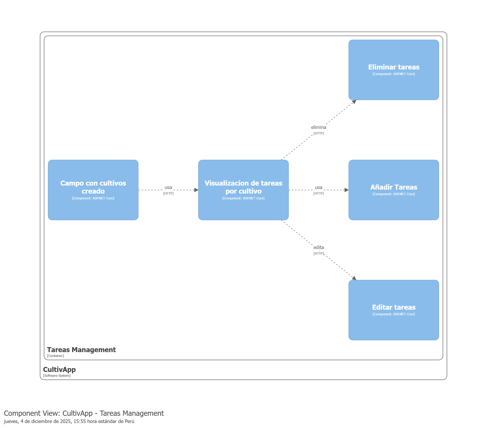

## 4.7. Software Object-Oriented Design.

El diagrama de clases nos ayuda a definir la funcionalidad de el producto de CultivApp mediante los atributos y funcionalidades de las clases de nuestras entidades relacionadas al funcionamiento del producto, desde interfaces, clases y atributos.

### 4.7.1. Class Diagrams.

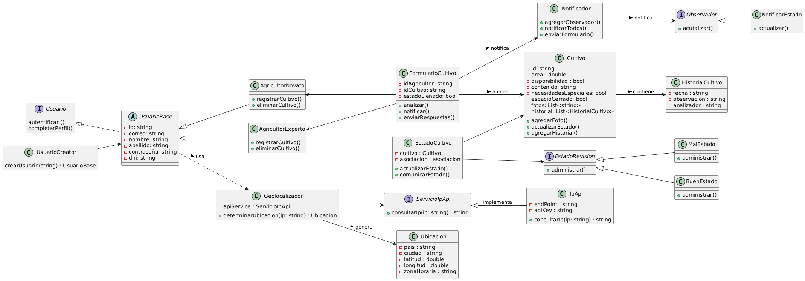

## 4.8. Database Design.

El diagrama de base de datos nos ayudara a la correcta definicion de entidades dentro de la base de datos funcional de CultivApp, definiendo que entidades se vinculan mediante las id's principales para la correcta organizacion y manejo de informacion.

### 4.8.1. Database Diagrams.

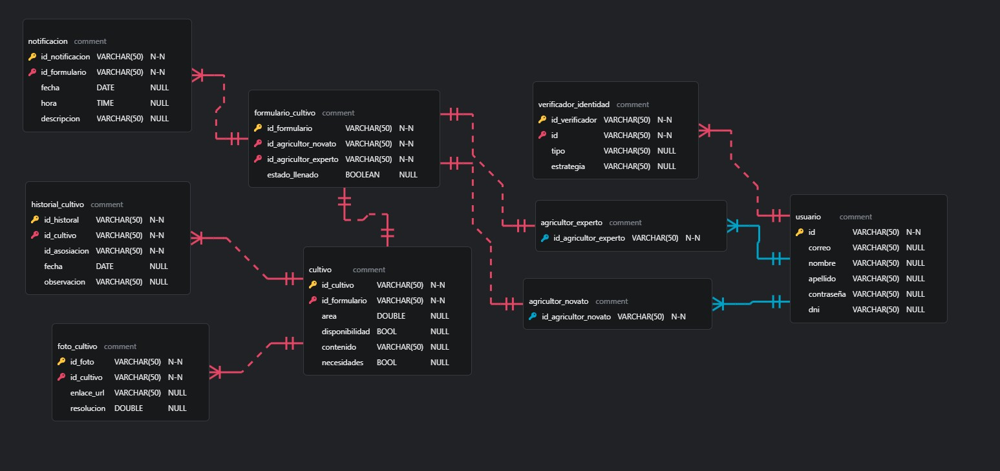

# Capítulo V: Product Implementation, Validation & Deployment.
## 5.1. Software Configuration Management.

Esta guía define las decisiones y acuerdos fundamentales para el desarrollo, mantenimiento y despliegue de la aplicación **CultivApp**, que gestiona el alquiler de vehículos. El objetivo es asegurar la coherencia, eficiencia y calidad a lo largo del ciclo de vida del proyecto.

---

### 5.1.1. Software Development Environment Configuration.

<table border="1">

  <tr>
    <td>Project Management</td>
    <td><h4>Github</h4>Plataforma en línea que permite almacenar código fuente en repositorios. Gracias a la tecnología de control de versiones de Git se puede organizar el código y llevar un mejor trabajo en conjunto.</td>
  </tr>
  <tr>
    <td></td>
    <td><h4>Whatsapp</h4>Red Social destinada a la comunicación donde se realizaron acuerdos y recordatorios de las reuniones.</td>
  </tr>
  <tr>
    <td></td>
    <td><h4>Trello</h4>Software de administración y gestión de proyectos que se utilizó para establecer y designar las tareas</td>
  </tr>
  <tr>
    <td>Requirements Management</td>
    <td><h4>Miro</h4>Plataforma en línea de gestión de requisitos que permite colaborar y organizar proyectos de forma visual y representativa.
</td>
  </tr>
  <tr>
    <td>Product UX/UI Design</td>
    <td><h4>Figma</h4>Aplicación que permite el diseño libre de interfaces a través de las múltiples herramientas que ofrece. Permitiendo la creación de prototipos interactivos que simulan la experiencia de usuario.
</td>
  </tr>
  <tr>
    <td>Software Development</td>
    <td><h4>Git</h4>Es un software de control de versiones para los trabajos en equipos y confiabilidad del desarrollo.</td>
  </tr>
  <tr>
    <td></td>
    <td><h4>Node.js</h4>Node.js es un entorno de ejecución de JavaScript del lado del servidor, que permite desarrollar aplicaciones web escalables y de alto rendimiento fuera del navegador.</td>
  </tr>
  <tr>
    <td></td>
    <td><h4>HTML</h4>Lenguaje de etiquetas, utilizado para la estructuración y la presentación de contenido.</td>
  </tr>
  <tr>
    <td></td>
    <td><h4>CSS</h4>CSS es un lenguaje utilizado para estilizar y dar formato a documentos HTML.</td>
  </tr>
  <tr>
    <td></td>
    <td><h4>JavaScript</h4>JavaScript es un lenguaje de programación de alto nivel, interpretado y multi-paradigma, utilizado para crear interactividad en páginas web.</td>
  </tr>
  <tr>
    <td></td>
    <td><h4>VSCode</h4>Es un editor de código fuente con extensiones que ayudan al desarrollo.</td>
  </tr>
    <tr>
    <td></td>
    <td><h4>WebStorm</h4>Es un IDE centrado en el desarrollo frontend, por su variedad de herramientas que agilizan el proceso de desarrollo.</td>
  </tr>
  <tr>
    <td></td>
    <td><h4>Vue.js</h4>Framework basado en Single Page Applications para el desarrollo de frontend</td>
  </tr>
  <tr>
    <td></td>
    <td><h4>C#</h4>Lenguaje de programación orientado a objetos desarrollado por Microsoft, utilizado para el desarrollo de aplicaciones en diversas plataformas.</td>
  </tr>
  <tr>
    <td></td>
    <td><h4>.NET</h4>Plataforma de desarrollo de software creada por Microsoft que permite construir y ejecutar aplicaciones en diferentes sistemas operativos.</td>
  </tr>
  <tr>
    <td></td>
    <td><h4>Rider</h4>Entorno de desarrollo integrado (IDE) para .NET y C# desarrollado por JetBrains, que ofrece herramientas avanzadas para el desarrollo de aplicaciones.</td>
  </tr>
  <tr>
    <td>Software Deployment</td>
    <td><h4>Github Pages</h4>Plataforma que nos permite realizar el despliegue de nuestro landing page.</td>
  </tr>
</table>

---

### 5.1.2. Source Code Management.

Hemos optado por crear un repositorio en GitHub para nuestro proyecto, tanto para el informe como para la landing page. Esto facilitó la colaboración entre los miembros del equipo,aprovechando las herramientas útiles que esta plataforma ofrece para el manejo del código fuente y sus versiones.


- URL del repositorio Report en GitHub: https://github.com/Apps-Web-Grupo-4-FruTech/ReportFinalProject
- URL del repositorio Landing Page en GitHub: https://github.com/Apps-Web-Grupo-4-FruTech/Landing-Page
- URL del repositorio Frontend en GitHub: https://github.com/Apps-Web-Grupo-4-FruTech/Frontend-FruTech

---


### 5.1.3. Source Code Style Guide & Conventions.

Para "**CultivApp**", hemos utilizado "**HTML y CSS**". Para estructurar el contenido usamos etiquetas de section y divisiones para contenido específico de cada una de las secciones. Además, hemos empleado atributos como ***HTML Style*** para personalizar el aspecto visual, definiendo propiedades como color, tamaño de fuente y tipo de letra.

Para resaltar elementos importantes, hemos aplicado ***HTML Text Formatting***, incluyendo etiquetas como b para negrita, strong para resaltado y del para mostrar cambios de precios. En cuanto a la navegación, hemos implementado una barra de navegación horizontal utilizando **CSS** para mejorar la experiencia del usuario al explorar el contenido.

Los formularios, creados con **CSS**, permiten a los usuarios ingresar información relevante, como detalles de inicio de sesión, información de pago y dirección de envío. Para añadir interactividad, hemos agregado botones con efectos hover utilizando CSS y paginación CSS para facilitar la navegación entre las diferentes páginas de productos.

Finalmente, en el **footer**, hemos incluido enlaces a las redes sociales de la organización para brindar a los usuarios una forma adicional de conectarse y seguir nuestras actualizaciones.

### 5.1.4. Software Deployment Configuration.

Utilizaremos GitHub Pages para alojar nuestra Landing Page. Para lograrlo, subiremos los archivos esenciales (HTML, CSS, etc.) a un repositorio público en GitHub. De
esta manera, nuestra página estará disponible en línea y accesible para todos los usuarios.


## 5.2. Landing Page, Services & Applications Implementation.


### 5.2.1. Sprint 1
#### 5.2.1.1. Sprint Planning 1.

En esta sección se detalla la reunion de planificación para iniciar con el desarrollo de la Landing Page de CultivApp.

<table border="1">
  <tr>
    <th>Sprint #</th>
    <th>Sprint 1</th>
  </tr>
  <tr>
    <td>Date</td>
    <td>2025-09-15</td>
  </tr>
  <tr>
    <td>Time</td>
    <td>9:00 PM</td>
  </tr>
  <tr>
    <td>Location</td>
    <td>Virtual (Google Meet)</td>
  </tr>
  <tr>
    <td>Prepared By</td>
    <td>Via Luna, Bruce</td>
  </tr>
  <tr>
    <td>Attendees (to planning meeting)</td>
    <td>Samuel Bonifacio<br>Jefferson Castro<br>Bruce Via<br>Estefano Solis<br>Sergio Landa</td>
  </tr>
  <tr>
    <td>Sprint n – 1 Review Summary</td>
    <td>No aplica por ser primer Sprint</td>
  </tr>
  <tr>
    <td>Sprint n – 1 Retrospective Summary</td>
    <td>No aplica por ser primer Sprint</td>
  </tr>
  <tr>
    <td colspan="2">Sprint Goal & User Stories</td>
  </tr>
  <tr>
    <td>Sprint n Goal </td>
    <td>El objetivo es desarrollar el Landing Page de CultivApp. Además de implementar la estructura con HTML, CSS y JavaScript. Junto a la documentación respectiva. Creemos que nuestro producto llamará la atención de nuestros a usuarios objetivos. </td>
  </tr>
  <tr>
    <td>Sprint n Velocity</td>
    <td>6 Story Points</td>
  </tr>
  <tr>
    <td>Sum of Story Points</td>
    <td>6</td>
  </tr>
</table>

---

#### 5.2.1.2. Aspect Leaders and Collaborators.

<table border="1">
  <tr>
    <th>Team Member (Last Name, First Name)</th>
    <th>GitHub Username</th>
    <th>Visualizar página de inicio (L) / Collaborator (C)</th>
    <th>Navegación desde el footer Leader (L) / Collaborator (C)</th>
  </tr>
  <tr>
    <td>Bonifacio Jaramillo, Samuel Jesus</td>
    <td>samuelbonifacio015</td>
    <td>L</td>
    <td>L</td>
  </tr>
  <tr>
    <td>Castro Pariona, Jefferson Ernesto</td>
    <td>JeffersonCastroPariona</td>
    <td>C</td>
    <td>C</td>
  </tr>
  <tr>
    <td>Via Luna, Bruce</td>
    <td>Shukaritas</td>
    <td>C</td>
    <td>C</td>
  </tr>
  <tr>
    <td>Solis Campos, Estefano Sebastian</td>
    <td>Estefano-Solis-C</td>
    <td>C</td>
    <td>C</td>
  </tr>
  <tr>
    <td>Landa Ortiz, Sergio Javier</td>
    <td>Serkekes2006</td>
    <td>C</td>
    <td>C</td>
  </tr>
</table>

---

#### 5.2.1.3. Sprint Backlog 1.

<table border="1">
  <tr>
    <th colspan="8">Sprint # Sprint 1</th>
  </tr>
  <tr>
    <th colspan="2">User Story</th>
    <th colspan="6">Work-Item/Task</th>
  </tr>
  <tr>
    <th>Id</th>
    <th>Title</th>
    <th>Id</th>
    <th>Description</th>
    <th>Estimation (Hours)</th>
    <th>Assigned To</th>
    <th>Status (To-do/In-Process/To-Review/Done)</th>
  </tr>
  <tr>
    <td>US-20</td>
    <td>Visualizar página de inicio	</td>
    <td>01</td>
    <td>Como usuario, quiero visualizar una página de inicio clara para comprender rápidamente de qué trata CultivApp.</td>
    <td>4</td>
    <td>Samuel</td>
    <td>Done</td>
  </tr>
  <tr>
    <td>US-21</td>
    <td>Navegación desde el footer	</td>
    <td>02</td>
    <td>Como usuario, quiero acceder a enlaces de navegación en el footer para moverme entre secciones fácilmente</td>
    <td>2</td>
    <td>Jefferson</td>
    <td>Done</td>
  </tr>
</table>

#### 5.2.1.4. Development Evidence for Sprint Review.

|Commit ID| Author | Commit Message| Date|
|---------|--------|---------------|-----|
| 744b2a3 | samuelbonifacio015 | feat: completed auth functionality | 2025-10-07 |
| c7a66d4 | samuelbonifacio015 | chore: debug for auth functionality | 2025-10-07 |
| f0ea551 | samuelbonifacio015 | feat: testing register & login with alerts | 2025-10-07 |
| fddb888 | samuelbonifacio015 | feat: auth function | 2025-10-07 |
| 7f7ea0a | samuelbonifacio015 | fix: en lang improved | 2025-09-21 |
| 2620a08 | samuelbonifacio015 | fix: arranged style overflow | 2025-09-21 |
| f566e98 | JeffersonCastroPariona | Merge branch 'develop' | 2025-09-21 |
| d46d4e6 | JeffersonCastroPariona | feat: save my changes lastest in landing | 2025-09-21 |
| eb15b2a | JeffersonCastroPariona | feat: standarize the writing lang | 2025-09-21 |
| 85b4f48 | JeffersonCastroPariona | Merge branch 'develop' | 2025-09-21 |
| cc67c03 | JeffersonCastroPariona | feat: standarize the writing lang | 2025-09-21 |
| 090adfc | JeffersonCastroPariona | Merge branch 'develop' | 2025-09-21 |
| 02c29f2 | JeffersonCastroPariona | feat: charger images | 2025-09-21 |
| 7f790b1 | JeffersonCastroPariona | feat: standarize the landing & artifacts language and styles | 2025-09-21 |
| 81a8945 | samuelbonifacio015 | fix: fixed sections & syntax | 2025-09-20 |
| cb28e86 | JeffersonCastroPariona | chore: add .gitignore to ignore .DS_Store | 2025-09-20 |
| 59183d9 | JeffersonCastroPariona | feat: add design descriptions text and logotype startup | 2025-09-20 |
| 42af56e | JeffersonCastroPariona | feat: add images folder and update index.html | 2025-09-20 |
| 5eb6b3f | JeffersonCastroPariona | feat: add images folder and update index.html | 2025-09-20 |
| 457c4a0 | samuelbonifacio015 | chore: SEO and Meta tags added | 2025-09-20 |
| 626b448 | samuelbonifacio015 | feat: merged sections & responsive | 2025-09-20 |
| c14157e | samuelbonifacio015 | chore: updated logo & index | 2025-09-20 |
| 879b814 | samuelbonifacio015 | feat: added features & purchase sections | 2025-09-20 |
| 6b06fef | samuelbonifacio015 | feat: added responsive hamburger menu | 2025-09-20 |
| c911dca | samuelbonifacio015 | feat: merged initial setup | 2025-09-20 |
| 31de6c2 | samuelbonifacio015 | feat: initial setup for landing page | 2025-09-20 |

---

#### 5.2.1.5. Execution Evidence for Sprint Review.

En esta entrega, nos centramos en el desarrollo completo de la Landing Page para nuestra plataforma de educación en línea. Nuestro objetivo es desplegar una página web atractiva y efectiva que actúe como el punto de entrada para nuestros usuarios. 

Es por ello que se comparte las evidencias de ambos repositorios para corroborar el trabajo hecho por cada uno de los participantes.

* Hero: 
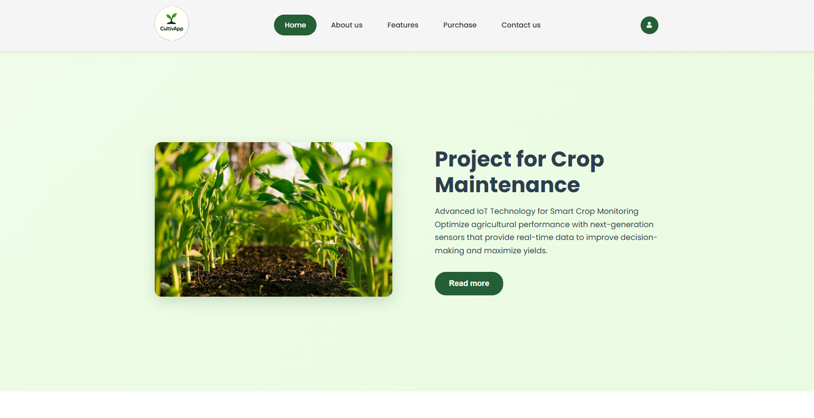
* About Us:
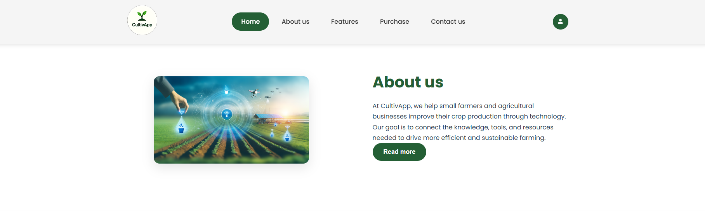
* Features:
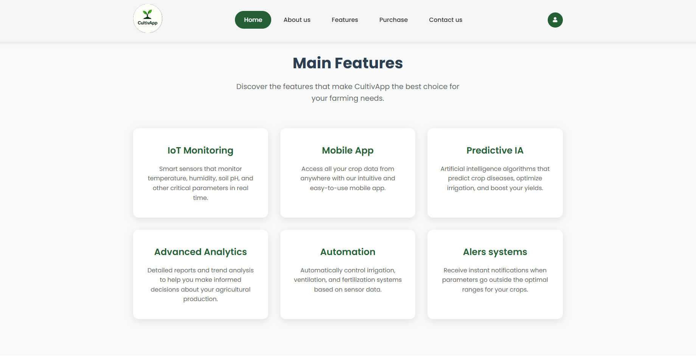
* Pricing:
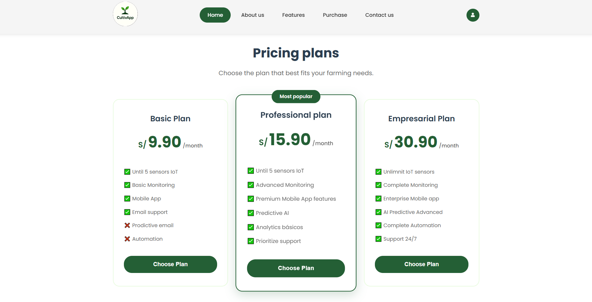
* Sponsors:
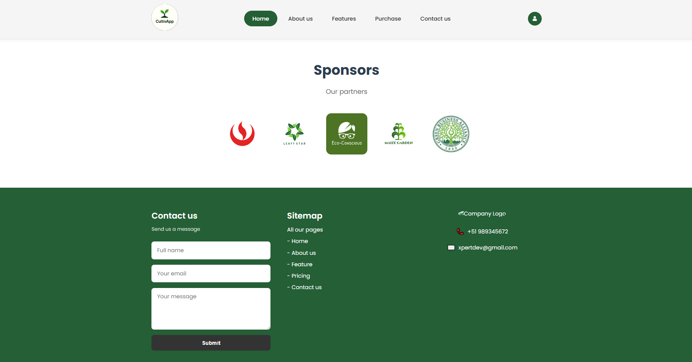

#### 5.2.1.6. Services Documentation Evidence for Sprint Review.

Para esta primera entrega no hubo implementación de APIs, pues solo se realizó la Landing Page.

Url del repositorio de Landing Page desplegada:
https://apps-web-grupo-4-frutech.github.io/Landing-Page/

----
**GitHub Proyecto CultivApp Web Service (Planeado para sprint 3)**
> URL estimada del repositorio del frontend (Sprint 2) <br>
>https://github.com/Apps-Web-Grupo-4-FruTech/Frontend-FruTech

#### 5.2.1.7. Software Deployment Evidence for Sprint Review.

El objetivo del primer Sprint fue el desarrollo e implementación de la Landing Page. Para eso, utilizamos GitHub y GitHub Pages. El proceso del desarrollo fue el siguiente:

1. Se creó una organización en GitHub y, dentro de ella, se crearon dos repositorios. Uno para el informe del trabajo y otro para la Landing Page 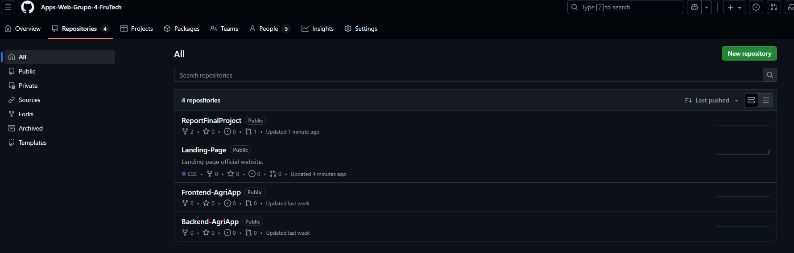
2. Luego, a través de los commits, el equipo fue editando los archivos index.html y styles.css, además de ir añadiendo imágenes a utilizar en el directorio images. 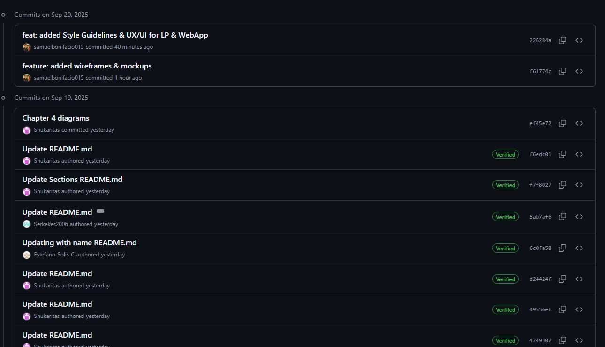
3. Finalmente, se implementó GitHub Pages en el repositorio de GitHub y se desplegó la Landing Page, la que se puede visitar en el siguiente link: https://apps-web-grupo-4-frutech.github.io/Landing-Page/

#### 5.2.1.8. Team Collaboration Insights during Sprint.

| Integrante | Acciones realizadas durante el Sprint 1 |
|------------|----------------------------------------|
| Todo el equipo | - Desarrollo de Mockups y Landing Page<br>- Documentación de Sprint 1<br>- Subida al repositorio y despliegue |

A continuación, se adjuntan las capturas de evidencia de los insights de los repositorios del informe y Landing Page para evidenciar la participación de todos los miembros:

**Reporte de commits:**


- Insight Landing Page:


- Insight Report
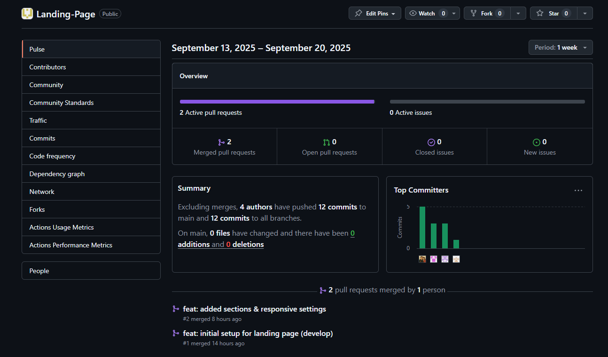

---

## 5.2.2. Sprint 2
#### 5.2.2.1. Sprint Planning 2.

En esta sección se detalla la planificación del Frontend Web Application de CultivApp.

<table border="1">
  <tr>
    <th>Sprint #</th>
    <th>Sprint 2</th>
  </tr>
  <tr>
    <td>Date</td>
    <td>2025-10-12</td>
  </tr>
  <tr>
    <td>Time</td>
    <td>11:40 PM</td>
  </tr>
  <tr>
    <td>Location</td>
    <td>Virtual (Discord)</td>
  </tr>
  <tr>
    <td>Prepared By</td>
    <td>Via Luna, Bruce</td>
  </tr>
  <tr>
    <td>Attendees (to planning meeting)</td>
    <td>Samuel Bonifacio<br>Jefferson Castro<br>Bruce Via<br>Estefano Solis<br>Sergio Landa</td>
  </tr>
  <tr>
    <td>Sprint n – 2 Review Summary</td>
    <td>Se completó el frontend en Vue (Dashboard, My Crops, My Fields, My Tasks y Community), routing, internacionalización con i18n, entre otros.</td>
  </tr>
  <tr>
    <td>Sprint n – 2 Retrospective Summary</td>
    <td>Positivo: organización de código correcta y contribuciones repartidas. </br> A mejorar: estandarizar commits y nombres de ramas. </br> Acción: aplicar Git Flow y buenas prácticas de Vue.</td>
  </tr>
  <tr>
    <td colspan="2">Sprint Goal & User Stories</td>
  </tr>
  <tr>
    <td>Sprint n Goal </td>
    <td>Desplegar la primera versión de Frontend Web Application utilizando el fake API JSON-Server para validar las primeras funcionalidades. </td>
  </tr>
  <tr>
    <td>Sprint n Velocity</td>
    <td>19 Story Points</td>
  </tr>
  <tr>
    <td>Sum of Story Points</td>
    <td>25 (Sprint Anterior)</td>
  </tr>
</table>

---

### 5.2.2.2. Aspect Leaders and Collaborators

<table border="1">
  <tr>
    <th>Team Member (Last Name, First Name)</th>
    <th>GitHub Username</th>
    <th>db.json Leader (L) / Collaborator (C)</th>
    <th>Vue Project Setup Leader (L) / Collaborator (C)</th>
    <th>BC (Task & Community) Leader (L) / Collaborator (C)</th>
    <th>BC (Crops, Dashboard & Fields) Leader (L) / Collaborator (C)</th>
  </tr>
  <tr>
    <td>Bonifacio Jaramillo, Samuel Jesus</td>
    <td>samuelbonifacio015</td>
    <td>C</td>
    <td>L</td>
    <td>C</td>
    <td>L</td>
  </tr>
  <tr>
    <td>Castro Pariona, Jefferson Ernesto</td>
    <td>JeffersonCastroPariona</td>
    <td>C</td>
    <td>C</td>
    <td>C</td>
    <td>L</td>
  </tr>
  <tr>
    <td>Via Luna, Bruce</td>
    <td>Shukaritas</td>
    <td>L</td>
    <td>L</td>
    <td>L</td>
    <td>L</td>
  </tr>
  <tr>
    <td>Solis Campos, Estefano Sebastian</td>
    <td>Estefano-Solis-C</td>
    <td>L</td>
    <td>L</td>
    <td>L</td>
    <td>L</td>
  </tr>
  <tr>
    <td>Landa Ortiz, Sergio Javier</td>
    <td>Serkekes2006</td>
    <td>L</td>
    <td>L</td>
    <td>C</td>
    <td>L</td>
  </tr>
</table>

---

### 5.2.2.3. Sprint Backlog 2

<table border="1">
  <tr>
    <th colspan="8">Sprint # Sprint 2</th>
  </tr>
  <tr>
    <th colspan="2">User Story</th>
    <th colspan="6">Work-Item/Task</th>
  </tr>
  <tr>
    <th>Id</th>
    <th>Title</th>
    <th>Id</th>
    <th>Description</th>
    <th>Estimation (Hours)</th>
    <th>Assigned To</th>
    <th>Status (To-do/In-Process/To-Review/Done)</th>
  </tr>
  <tr>
    <td>US-01</td>
    <td>Registro de cuenta</td>
    <td>03</td>
    <td>Como usuario, quiero registrarme en la aplicacion, para acceder a sus funciones</td>
    <td>3</td>
    <td>Samuel</td>
    <td>Done</td>
  </tr>
  <tr>
    <td>US-02</td>
    <td>Inicio de Sesión</td>
    <td>04</td>
    <td>Como usuario, quiero iniciar sesion, para acceder a mi cuenta</td>
    <td>2</td>
    <td>Jefferson</td>
    <td>Done</td>
  </tr>
  <tr>
    <td>US-03</td>
    <td>Recuperar Contraseña</td>
    <td>05</td>
    <td>Como usuario, quiero recuperar la contraseña de mi cuenta, para recuperar el acceso a ella en caso se me olvide</td>
    <td>4</td>
    <td>Sergio</td>
    <td>Done</td>
  </tr>
  <tr>
    <td>US-04</td>
    <td>Editar perfil</td>
    <td>06</td>
    <td>Como usuario, quiero modificar mi perfil, para mantenerlo actualizado todo el tiempo</td>
    <td>3</td>
    <td>Estefano</td>
    <td>Done</td>
  </tr>
  <tr>
    <td>US-05</td>
    <td>Registrar cultivos</td>
    <td>07</td>
    <td>Como agricultor, quiero registrar diferentes cultivos, para mantener un registro a mi alcance</td>
    <td>3</td>
    <td>Bruce</td>
    <td>Done</td>
  </tr>
  <tr>
    <td>US-06</td>
    <td>Eliminar cultivos</td>
    <td>08</td>
    <td>Como agricultor, quiero eliminar los cultivos que desee, para mantener un registro actualizado</td>
    <td>2</td>
    <td>Samuel</td>
    <td>Done</td>
  </tr>
  <tr>
    <td>US-07</td>
    <td>Editar cultivos</td>
    <td>09</td>
    <td>Como agricultor, quiero editar los cultivos que tenga registrados, para asegurarme que siempre esten actualizados</td>
    <td>2</td>
    <td>Bruce</td>
    <td>Done</td>
  </tr>
</table>

---

#### 5.2.2.4. Development Evidence for Sprint Review

- Commits del Frontend

|Commit ID| Author | Commit Message| Date|
|---------|--------|---------------|-----|
|3c7acf2| Shukaritas| Update index.js| 2025/10/10|
|29eae95| Shukaritas| feature: final commit| 2025/10/10|
|2db80c7| Shukaritas| commits: preview final changes| 2025/10/09|
|683228c| Shukaritas| Merge remote-tracking branch 'origin/main' into develop| 2025/10/09|
|c9cab99| Shukaritas| Update db.json| 2025/10/09|
|41d8990| Estefano-Solis-C| fixed db.json| 2025/10/08|
|aeaa6f0| Estefano-Solis-C| Merge remote-tracking branch 'origin/feature/fields' into develop| 2025/10/08|
|5167129| Estefano-Solis-C| Merge remote-tracking branch 'origin/tasks&comunity' into develop| 2025/10/08|
|e82e591| Estefano-Solis-C| Merge remote-tracking branch 'origin/feature/crops' into develop| 2025/10/08|
|f04a0be| Serkekes2006| fixture dashboard| 2025/10/08|
|fa78823| JeffersonCastroPariona| Add crop registration managment form| 2025/10/08|
|d1ebf4b| samuelbonifacio015| feat: community API response working| 2025/10/08|
|cf67542| samuelbonifacio015| feat: added community components| 2025/10/08|
|f6766dd| samuelbonifacio015| fix: update task handling| 2025/10/08|
|40b8f5d| samuelbonifacio015| fix: component lang & better comments| 2025/10/08|
|3c134a3| samuelbonifacio015| feat: added my-task component| 2025/10/08|
|245bee2| Shukaritas| feature: Modified and improve fields| 2025/10/08|
|c4bde32| Estefano-Solis-C| First update| 2025/10/07|
|e41ab39| Estefano-Solis-C| Initial commit| 2025/09/14|

- Commits de la Landing Page

|Commit ID| Author | Commit Message| Date|
|---------|--------|---------------|-----|
|59f741f| samuelbonifacio015| chore: merged redirection link| 2025/10/10|
|7976467| samuelbonifacio015| chroe: updated "Ir a CultivApp" to redirect to frontend| 2025/10/10|
|d675419| samuelbonifacio015| feat: merged auth funcionality| 2025/10/09|

### 5.2.2.5. Execution Evidence for Sprint Review

Durante este Sprint se desarrolló la aplicación web en el entorno de desarrollo WebStorm, siguiendo los principios de Domain-Driven Design (DDD) para organizar la estructura y responsabilidad del sistema.

Se implementaron con éxito las vistas principales y componentes funcionales, utilizando los datos de la Fake API con JSON-Server.

- US01 (Registro de cuenta): Se implementó el registro de usuario a través de la creación de cuenta en la Landing Page.

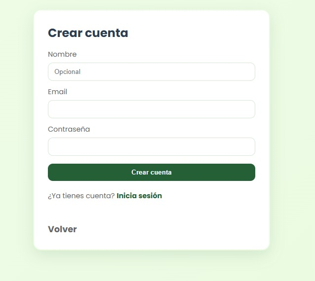

<br>

- US02 (Inicio de Sesión): Una vez el usuario está registrado, puede iniciar sesión usando sus credenciales y redirigirse a la WebApp.

<br>
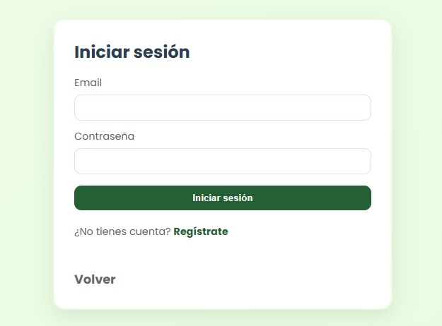

<br>

- US04 (Editar perfil): El usuario puede acceder a su perfil y modificar su información a gusto.

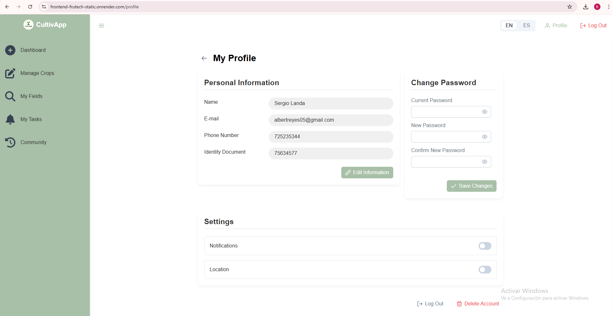

<br>

- US05 (Registrar cultivos): El usuario al acceder a "Manage Crops" puede registrar nuevos cultivos.

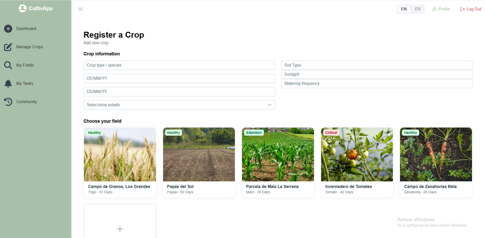

<br>

- US06 (Eliminar cultivos): El usuario puede eliminar un cultivo permanentemente.

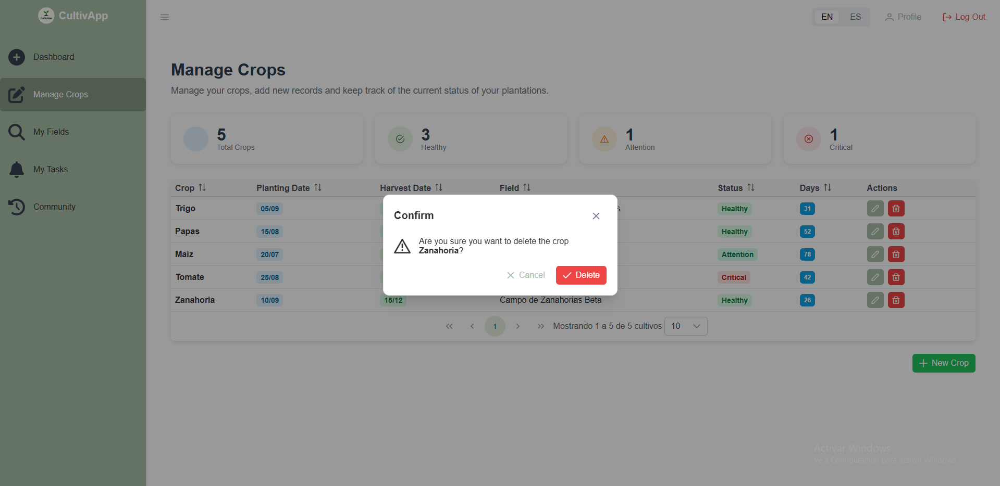

<br>

- US07 (Editar cultivos): El usuario puede modificar los datos de un cultivo a placer.

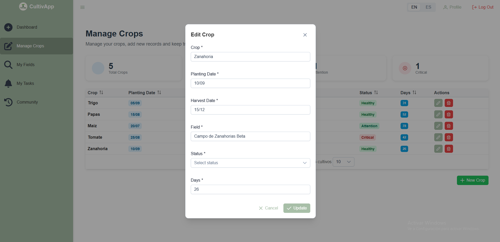

### 5.2.2.6. Services Documentation Evidence for Sprint Review

En este Sprint, el enfoque principal ha sido el desarrollo completo del FrontEnd, registro de cultivos, campos y el manejo de informacion de estos. Debido a que aún no se ha implementado un backend ni servicios web, no se cuenta con endpoints
documentados ni documentación OpenAPI en esta fase. <br>
La prioridad fue lograr una experiencia de usuario funcional desde el cliente. En futuras iteraciones se documentarán las
rutas necesarias para la gestión de campos en tiempo real con su informacion, usando OpenAPI como herramienta de especificación.

----
**GitHub Proyecto CultivApp Web Service (Planeado para sprint 3)**
> URL estimada del repositorio del backend (Sprint 3) <br>
>https://github.com/Apps-Web-Grupo-4-FruTech/Backend-FruTech

### 5.2.2.7. Software Deployment Evidence for Sprint Review
Durante este Sprint, se realizó el despliegue del frontend del sistema CultivApp, incluyendo la Landing Page, el dashboard principal junto con sus secciones principales para el nuestros usuarios, lo cual permitió acceder
fácilmente al desarrollo desde cualquier navegador, facilitando las pruebas funcionales, demostraciones internas y la
recolección de feedback en tiempo real.

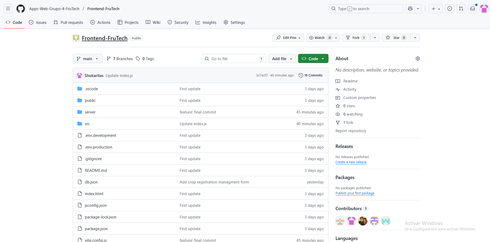

- URL del repositorio: https://github.com/Apps-Web-Grupo-4-FruTech/Frontend-FruTech

> URL del despliegue <br>
> https://frontend-frutech.vercel.app/

**Responsable**

**- Estefano Sebastian Solis Campos:** Configuracion principal del repositorio, estructura de despliegue


### 5.2.2.8. Team Collaboration Insights during Sprint

Durante el Sprint 2, la totalidad del trabajo de implementación fue realizada por todo el equipo, quienes asumimos todas
las funciones de diseño, codificación, validación y despliegue de la solución.

| Integrante  | Acciones realizadas durante el Sprint 2                                    |
|-----|---------------------------------------------------------------------------------------------|
| Estefano Sebastian Solis Campos   | Desarrollo de la interfaz principal, rutas y perfil de usuario  |
| Bruce Via Luna   | Desarrollo de la seccion "My Fields" con sus funcionalidades                  |
| Samuel Jesus Bonifacio Jaramillo   | Desarrollo de la seccion "My Tasks" "Community" con sus funcionalidades y fusion con el landing page     |
| Jefferson Ernesto Castro Pariona   | Desarrollo de la seccion "My Crops" con sus funcionalidades   |
| Sergio Javier Landa Ortiz   | Desarrollo de la seccion "Dashboard" con sus funcionalidades         |

<br>

* Evidencia de commits en el Frontend

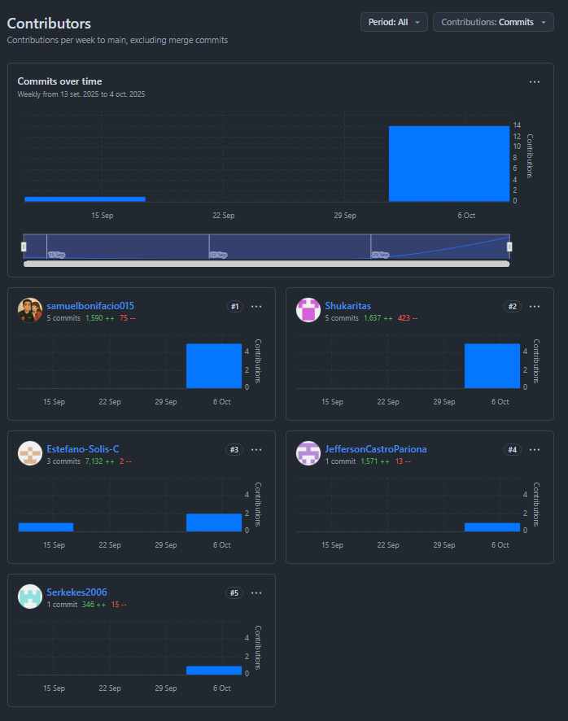

<br>

* Evidencia de commits en la Landing Page

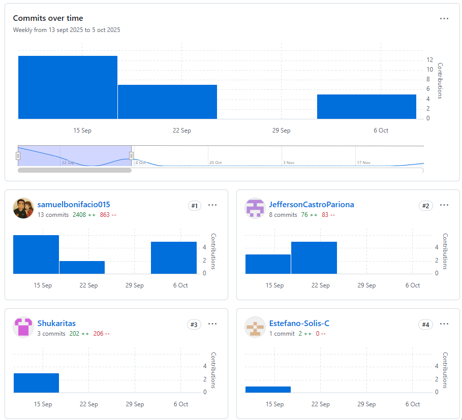

--- 

## 5.2.3. Sprint 3

### 5.2.3.1. Sprint Planning 3

<p>En esta sección se detalla la planificación del Backend Application de CultivApp.</p>

<table border="1">
  <tr>
    <th width="30%">Sprint #</th>
    <th>Sprint 3</th>
  </tr>
  <tr>
    <td>Date</td>
    <td>2025-10-14</td>
  </tr>
  <tr>
    <td>Time</td>
    <td>15:40 PM</td>
  </tr>
  <tr>
    <td>Location</td>
    <td>Virtual (Google Meet)</td>
  </tr>
  <tr>
    <td>Prepared By</td>
    <td>Via Luna, Bruce</td>
  </tr>
  <tr>
    <td>Attendees (to planning meeting)</td>
    <td>Landa Ortiz, Sergio Javier<br>Solis Campos, Estefano Sebastián<br>Via Luna, Bruce<br>Castro Pariona, Jefferson Ernesto<br>Bonifacio Jaramillo, Samuel Jesus</td>
  </tr>
  <tr>
    <td>Sprint n – 3 Review Summary</td>
    <td>Se completó el backend en Rider (Get, Post, Push, Update), conexión a una base de datos MySQL en una real API.</td>
  </tr>
  <tr>
    <td>Sprint n – 3 Retrospective Summary</td>
    <td>Positivo: Mejor coordinación y tiempos de desarrollo. <br> A mejorar: Declaración de Commits y métodos shared. <br> Acción: Aplicar desarrollo backend y guía de endpoints.</td>
  </tr>
  <tr>
    <td colspan="2">Sprint Goal & User Stories</td>
  </tr>
  <tr>
    <td>Sprint n Goal </td>
    <td>Consolidar la app integrando completamente el CRUD con la real API, creando esta misma y desplegándola para tener un funcionamiento a una api subida en la nube y próxima conexión con el Front-end.</td>
  </tr>
  <tr>
    <td>Sprint n Velocity</td>
    <td>25 Story Points</td>
  </tr>
  <tr>
    <td>Sum of Story Points</td>
    <td>50 (Sprint Anterior)</td>
  </tr>
</table>

### 5.2.3.2. Aspect Leaders and Collaborators

<table border="1">
    <thead>
        <tr>
            <th>Team Member</th>
            <th>GitHub Username</th>
            <th>Endpoints Development</th>
            <th>Swagger Documentation</th>
            <th>Deploy</th>
        </tr>
    </thead>
    <tbody>
        <tr>
            <td>Bonifacio, Samuel</td>
            <td>samuelbonifacio015</td>
            <td>L</td>
            <td>L</td>
            <td>C</td>
        </tr>
        <tr>
            <td>Castro, Jefferson</td>
            <td>JeffersonCastroPariona</td>
            <td>L</td>
            <td>L</td>
            <td>C</td>
        </tr>
        <tr>
            <td>Via, Bruce</td>
            <td>Shukaritas</td>
            <td>L</td>
            <td>L</td>
            <td>L</td>
        </tr>
        <tr>
            <td>Solis, Estefano</td>
            <td>Estefano-Solis-C</td>
            <td>L</td>
            <td>L</td>
            <td>L</td>
        </tr>
        <tr>
            <td>Landa, Sergio</td>
            <td>Serkekes2006</td>
            <td>L</td>
            <td>L</td>
            <td>L</td>
        </tr>
    </tbody>
</table>

### 5.2.3.3. Sprint Backlog 3

<table border="1">
    <thead>
        <tr>
            <th colspan="7" style="font-size: 1.1em; text-transform: uppercase;">Sprint # Sprint 3</th>
        </tr>
        <tr>
            <th colspan="2">User Story</th>
            <th colspan="5">Work-Item/Task</th>
        </tr>
        <tr>
            <th>Id</th>
            <th>Title</th>
            <th>Id</th>
            <th>Description</th>
            <th>Estimation (Hours)</th>
            <th>Assigned To</th>
            <th>Status (To-do/In-Process/To-Review/Done)</th>
        </tr>
    </thead>
    <tbody>
        <tr>
            <td>US08</td>
            <td>Registro de campo</td>
            <td>10</td>
            <td>Implementar endpoint POST /fields y formulario frontend</td>
            <td>3</td>
            <td>Estefano-Solis-C</td>
            <td>Done</td>
        </tr>
        <tr>
            <td>US09</td>
            <td>Publicar Campo</td>
            <td>11</td>
            <td>Crear lógica de visibilidad (PATCH /publish)</td>
            <td>3</td>
            <td>Serkekes2006</td>
            <td>Done</td>
        </tr>
        <tr>
            <td>US10</td>
            <td>Vincular con cultivos</td>
            <td>12</td>
            <td>Desarrollar relación Many-to-One en DB y API</td>
            <td>2</td>
            <td>samuelbonifacio015</td>
            <td>Done</td>
        </tr>
        <tr>
            <td>US11</td>
            <td>Señalaciones</td>
            <td>13</td>
            <td>Diseñar sistema de alertas visuales en Dashboard</td>
            <td>4</td>
            <td>JeffersonCastroPariona</td>
            <td>In-Process</td>
        </tr>
        <tr>
            <td>US12</td>
            <td>Datos adicionales</td>
            <td>14</td>
            <td>Extender modelo de datos para condiciones del suelo</td>
            <td>3</td>
            <td>Serkekes2006</td>
            <td>Done</td>
        </tr>
        <tr>
            <td>US13</td>
            <td>Notificación de riego</td>
            <td>15</td>
            <td>Configurar servicio de notificaciones Push/Email</td>
            <td>4</td>
            <td>Shukaritas</td>
            <td>In-Process</td>
        </tr>
        <tr>
            <td>US14</td>
            <td>Recordatorio de datos</td>
            <td>16</td>
            <td>Implementar cron jobs para verificar antigüedad de datos</td>
            <td>3</td>
            <td>Estefano-Solis-C</td>
            <td>In-Process</td>
        </tr>
        <tr>
            <td>US15</td>
            <td>Gestionar usuarios</td>
            <td>17</td>
            <td>Crear panel de admin y validación de duplicados</td>
            <td>3</td>
            <td>Estefano-Solis-C</td>
            <td>Done</td>
        </tr>
    </tbody>
</table>

### 5.2.3.4.	Development Evidence for Sprint Review.

|Commit ID| Author | Commit Message| Date|
|---------|--------|---------------|-----|
|a022b6d| Shukaritas| feat: final pre develop| 2025/11/16|
|eefbf08| Shukaritas| feat: pre-deploy| 2025/11/16|
|06da246| Estefano-Solis-C| Disable forced port| 2025/11/16|
|92a8d2c| Estefano-Solis-C| Enabled all ports in all context| 2025/11/16|
|82af78e| Estefano-Solis-C| Dockerfile| 2025/11/16|
|ed54d60| Serkekes2006| feat-updated-bakend| 2025/11/16|
|fbf9d5e| Gaftherman| Final Update| 2025/11/15|
|c125e4b| Gaftherman| Files Updated| 2025/11/15|
|3c12701| Gaftherman| Files Updated| 2025/11/15|
|152b483| Gaftherman| Merge branch 'Jefferson' into develop| 2025/11/15|
|368cc81| Gaftherman| Updated files compatibilty| 2025/11/15|
|294c145| Gaftherman| Merge branch 'feature/community' into develop| 2025/11/15|
|6bcb3e8| Gaftherman| Delete idk| 2025/11/15|
|c6ead0c| Gaftherman| Merge branch 'profileandupcomingtask' into develop| 2025/11/15|
|b0fe82a| Gaftherman| Fixed commit message| 2025/11/15|
|2b5cb7e| Gaftherman| Merge branch 'fields' into develop| 2025/11/15|
|d58613e| Gaftherman| Deleting Unused Files| 2025/11/15|
|7f3b65f| Gaftherman| Deleting Unused Files| 2025/11/15|
|b5e2195| Gaftherman| Deleting Unused Files| 2025/11/15|
|3c6128d| Gaftherman| Deleting Unused Files| 2025/11/15|
|dd31074| Gaftherman| Deleting Unused Files| 2025/11/15|
|8fd3532| Gaftherman| Deleteing unused files| 2025/11/15|
|c615492| samuelbonifacio015| chore: name fix| 2025/11/15|
|16ac9ac| samuelbonifacio015| feat: main program config| 2025/11/15|
|b7d610a| samuelbonifacio015| feat: add CR QueryService| 2025/11/15|
|d9b8418| samuelbonifacio015| feat: update CRController| 2025/11/15|
|f723ba7| samuelbonifacio015| feat: add implement CR command service| 2025/11/15|
|eb50473| samuelbonifacio015| fix: mminor fixes| 2025/11/15|
|fdb4522| samuelbonifacio015| feat: add CR application/internal| 2025/11/15|
|752db64| samuelbonifacio015| feat: add CR REST interfaces| 2025/11/15|
|36025ed| samuelbonifacio015| feat: add CR infrastructure| 2025/11/15|
|a3671db| samuelbonifacio015| feat: add CR repositories & services| 2025/11/15|
|d9df421| samuelbonifacio015| feat: CR domain update| 2025/11/15|
|4eab47b| JeffersonCastroPariona| Update Tasks JeffersonCastro| 2025/11/14|
|aca777f| Gaftherman| feat: endpoint user and upcoming task| 2025/11/14|
|01c7290| Shukaritas| feat: Fields and CropFields| 2025/11/14|
|c0457f2| JeffersonCastroPariona| Tasks:JeffCastro| 2025/11/14|
|371cd66| JeffersonCastroPariona| bounded_context:Tasks-JeffersonCastro| 2025/11/14|
|3038219| JeffersonCastroPariona| tasksv1| 2025/11/14|
|da16e71| Shukaritas| Feat: Shared Content & Bounded Context| 2025/11/11|
|73a8d6f| Estefano-Solis-C| Initial commit| 2025/09/14|

### 5.2.3.5.	Execution Evidence for Sprint Review.

En esta entrega, nos centramos en el desarrollo completo de los Web Services. Como objetivo principal, implementamos endpoints REST para cubrir las funcionalidades definidas en las Historias de Usuario. Estos servicios permiten la gestión de usuarios, cultivos y campos, integrándose con una base de datos MySQL para persistencia de datos.

- **Módulo de Gestión de Campos** (US08, US09, US10, US12, US15)  
  - Registrar campos (US08).  
  - Publicar campos para visibilidad (US09).  
  - Vincular campos con cultivos (US10).  
  - Extensión del modelo de datos para incluir condiciones/problemas del campo (US12).

Es por ello que se comparte las evidencias de para corroborar el trabajo hecho por cada uno de los participantes:

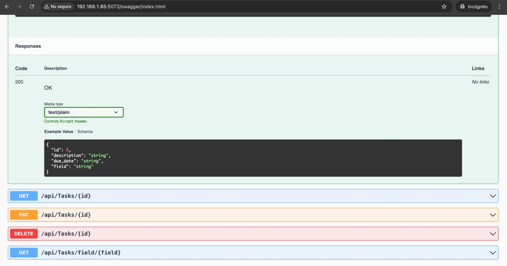

Además, se implementó un endpoint de health check para monitorear la disponibilidad del sistema (US19). Todos los servicios de backend planificados para este sprint están funcionales y listos para ser consumidos por el frontend y otras integraciones.

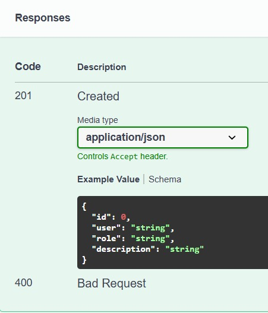


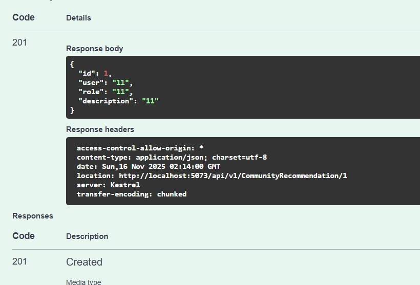


### 5.2.3.6.	Services Documentation Evidence for Sprint Review.

En esta sección se presenta la documentación de los Web Services (API) implementada durante el Sprint 3. Todos los 13 endpoints desarrollados para las Historias de Usuario han sido documentados siguiendo el estándar OpenAPI 3.0. La documentación se generó mediante anotaciones Swagger en el backend, garantizando sincronía entre implementación y documentación. 

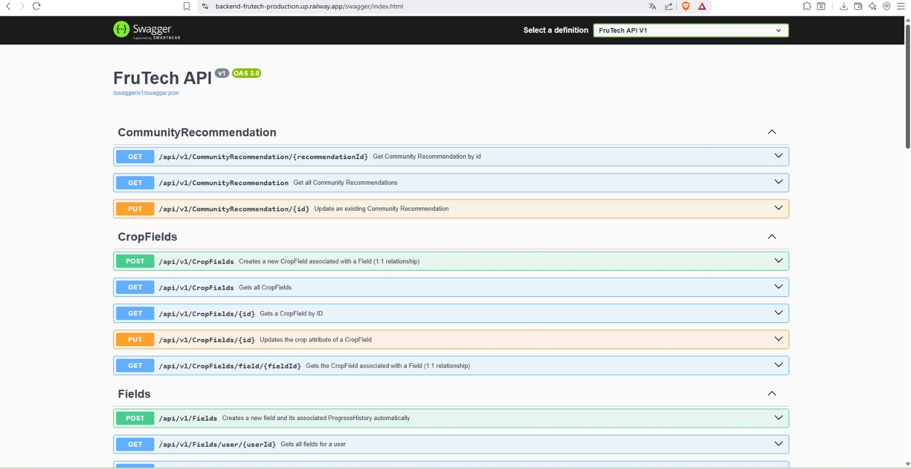

Repositorio principal del backend:
- https://github.com/Apps-Web-Grupo-4-FruTech/Backend-FruTech

### 5.2.3.7.	Software Deployment Evidence for Sprint Review.

#### Software Deployment Evidence — Pasos y evidencia

A continuación se detallan los pasos realizados y la evidencia correspondiente.

1. Actividad: Selección de proveedor y creación de recursos  
   - Explicación: Se eligió un proveedor de nube (ej. Render, Vercel, Railway, Heroku) por su integración con GitHub y capa gratuita para proyectos Node.js. Se creó la cuenta del equipo y se configuró el proyecto "FruTech" para alojar los servicios backend.  


2. Actividad: Configuración del servicio web (API)  
   - Explicación: Se creó un servicio web vinculado al repositorio Apps-Web-Grupo-4-FruTech/Backend-FruTech y se seleccionó la rama (main o develop) para despliegue automático (CI/CD). Se definió el comando de inicio (por ejemplo `npm start` o `node dist/index.js`).  


3. Actividad: Aprovisionamiento de la base de datos en la nube  
   - Explicación: Se aprovisionó una base de datos gestionada (PostgreSQL o MySQL) en la nube (ej. Neon, PlanetScale o el servicio gestionado del proveedor). Se obtuvo la connection string que la API usará en producción.  


4. Actividad: Configuración de variables de entorno  
   - Explicación: Para seguridad y configuración, se añadieron variables de entorno en el panel del servicio (por ejemplo DATABASE_URL, JWT_SECRET, NODE_ENV). La API lee estas variables en tiempo de ejecución en lugar de tener secretos en el código.  

5. Actividad: Verificación del despliegue (exitosa)  
   - Explicación: Se ejecutó el primer despliegue automático. El proveedor clonó el repo, instaló dependencias (npm install) y ejecutó el start script. El servicio quedó en línea y el endpoint de health check (/health) devolvió 200 OK.  

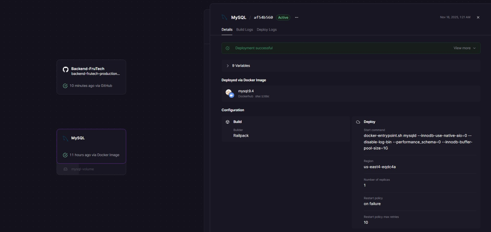

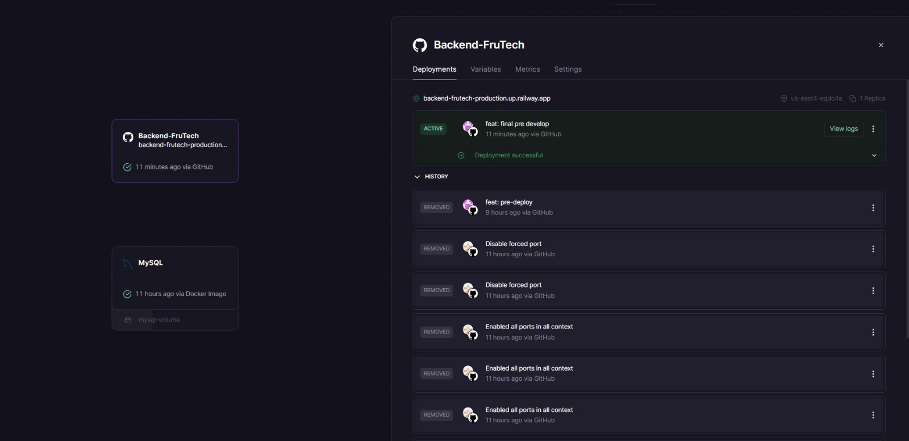


**Url del depliegue:** https://backend-frutech.onrender.com/swagger/index.html  

### 5.2.3.8.	Team Collaboration Insights during Sprint.

Durante el Sprint 3, la totalidad del trabajo de implementación fue realizada por todo el equipo, quienes asumimos todas
las decisiones de funcionalidad del Backend, union y despliegue.

| Integrante | Acciones realizadas durante el Sprint 3 |
|------------|----------------------------------------|
| Todo el equipo | - Desarrollo de diferentes Bounded Contexts<br>- Estructura de carpetas y componentes<br>- Subida al repositorio y despliegue |

**Evidencia de colaboración en GitHub (Sprint 3)**

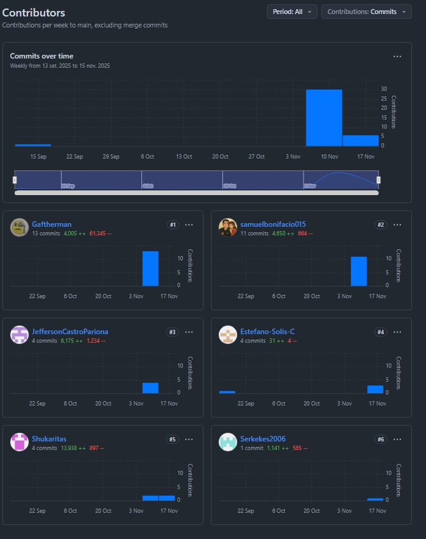

---

## 5.2.4. Sprint 4

### 5.2.4.1. Sprint Planning 4

En esta sección se detalla la planificación de la fase final: Seguridad, Auditoría y Optimización de CultivApp.

<table border="1"">
  <tr>
    <th width="30%">Sprint #</th>
    <th>Sprint 4</th>
  </tr>
  <tr>
    <td>Date</td>
    <td>2025-11-17</td>
  </tr>
  <tr>
    <td>Time</td>
    <td>20:00 PM</td>
  </tr>
  <tr>
    <td>Location</td>
    <td>Virtual (Google Meet)</td>
  </tr>
  <tr>
    <td>Prepared By</td>
    <td>Via Luna, Bruce</td>
  </tr>
  <tr>
    <td>Attendees</td>
    <td>Landa Ortiz, Sergio Javier<br>Solis Campos, Estefano Sebastián<br>Via Luna, Bruce<br>Castro Pariona, Jefferson Ernesto<br>Bonifacio Jaramillo, Samuel Jesus</td>
  </tr>
  <tr>
    <td>Sprint n – 4 Review Summary</td>
    <td>Se cerraron todas las tareas pendientes del Sprint 3 y se realizó la conexión entre Frontend y Backend justo a la conexión respectiva</td>
  </tr>
  <tr>
    <td>Sprint n – 4 Retrospective Summary</td>
    <td>Positivo: despliegue final de servicios. <br> A mejorar: documentación y comunicación en equipo. <br> Acción: realizar las pruebas unitarias para validar despliegues y funcionamiento correcto.</td>
  </tr>
  <tr>
    <td colspan="2">Sprint Goal & User Stories</td>
  </tr>
  <tr>
    <td>Sprint n Goal </td>
    <td>Desplegar ambos servicios con la conexión necesaria. Asegurar que todo funciona correctamente y culminar con items en To-Do</td>
  </tr>
  <tr>
    <td>Sprint n Velocity</td>
    <td>26 Story Points</td>
  </tr>
  <tr>
    <td>Sum of Story Points</td>
    <td>76 (Sprint Anterior)</td>
  </tr>
</table>


### 5.2.4.2. Aspect Leaders and Collaborators.

<table>
  <tr>
    <th>Team Member (Last Name, First Name)</th>
    <th>GitHub Username</th>
    <th>Deploy de Frontend Leader (L) / Collaborator (C)</th>
    <th>Deploy de Backend Leader (L) / Collaborator (C)</th>
    <th>Conexión de Endpoints Leader (L) / Collaborator (C)</th>
    <th>Documentación de Servicios Leader (L) / Collaborator (C)</th>
    <th>Pruebas de Integración Leader (L) / Collaborator (C)</th>
  </tr>
  <tr>
    <td>Bonifacio, Samuel</td>
    <td>samuelbonifacio015</td>
    <td>C</td>
    <td>C</td>
    <td>C</td>
    <td>L</td>
    <td>L</td>
  </tr>
  <tr>
    <td>Castro, Jefferson</td>
    <td>JeffersonCastroPariona</td>
    <td>C</td>
    <td>C</td>
    <td>L</td>
    <td>L</td>
    <td>L</td>
  </tr>
  <tr>
    <td>Landa, Sergio</td>
    <td>Serkekes2006</td>
    <td>C</td>
    <td>C</td>
    <td>L</td>
    <td>C</td>
    <td>L</td>
  </tr>
  <tr>
    <td>Solis, Estefano</td>
    <td>Estefano-Solis-C</td>
    <td>L</td>
    <td>C</td>
    <td>C</td>
    <td>C</td>
    <td>C</td>
  </tr>
  <tr>
    <td>Via, Bruce</td>
    <td>Shukaritas</td>
    <td>L</td>
    <td>L</td>
    <td>L</td>
    <td>C</td>
    <td>C</td>
  </tr>
</table>

---
### 5.2.4.3.Sprint Backlog 4.

<table border="1">
    <thead>
        <tr>
            <th colspan="7" style="font-size: 1.1em; text-transform: uppercase;">Sprint # Sprint 4</th>
        </tr>
        <tr>
            <th colspan="2">User Story</th>
            <th colspan="5">Work-Item/Task</th>
        </tr>
        <tr>
            <th>Id</th>
            <th>Title</th>
            <th>Id</th>
            <th>Description</th>
            <th>Estimation (Hours)</th>
            <th>Assigned To</th>
            <th>Status (To-do/In-Process/To-Review/Done)</th>
        </tr>
    </thead>
    <tbody>
        <tr>
            <td>US16</td>
            <td>Bloqueo de cuenta</td>
            <td>18</td>
            <td>Implementar middleware de Rate Limiting y bloqueo tras 10 intentos</td>
            <td>5</td>
            <td>Serkekes2006</td>
            <td>Done</td>
        </tr>
        <tr>
            <td>US17</td>
            <td>Creación de historial</td>
            <td>19</td>
            <td>Diseñar entidad AuditLog e implementar interceptores en Entity Framework</td>
            <td>5</td>
            <td>samuelbonifacio015</td>
            <td>Done</td>
        </tr>
        <tr>
            <td>US18</td>
            <td>Atajos sencillos</td>
            <td>20</td>
            <td>Implementar breadcrumbs dinámicos y optimización de rutas en Frontend</td>
            <td>3</td>
            <td>JeffersonCastroPariona</td>
            <td>Done</td>
        </tr>
        <tr>
            <td>US19</td>
            <td>Disponibilidad de sistema</td>
            <td>21</td>
            <td>Configurar Health Check endpoint (/health) y dashboard de uptime</td>
            <td>2</td>
            <td>Shukaritas</td>
            <td>Done</td>
        </tr>
        <tr>
            <td>US11</td>
            <td>Señalaciones</td>
            <td>13</td>
            <td>Integración final de alertas visuales en UI y validación de estados</td>
            <td>4</td>
            <td>JeffersonCastroPariona</td>
            <td>Done</td>
        </tr>
        <tr>
            <td>US13</td>
            <td>Notificación de riego</td>
            <td>15</td>
            <td>Despliegue de servicio Worker para notificaciones Push/Email</td>
            <td>4</td>
            <td>Shukaritas</td>
            <td>Done</td>
        </tr>
        <tr>
            <td>US14</td>
            <td>Recordatorio de datos</td>
            <td>16</td>
            <td>Optimización de Cron Jobs para verificación de datos obsoletos</td>
            <td>3</td>
            <td>Estefano-Solis-C</td>
            <td>Done</td>
        </tr>
    </tbody>
</table>

### 5.2.4.4. Development Evidence for Sprint Review

* Commits en Backend: 

|Commit ID| Author | Commit Message| Date|
|---------|--------|---------------|-----|
|9fa52d5| Shukaritas| feat: Updated Methods to Deploy| 2025/12/04|
|5f0f67d| Estefano-Solis-C| feat: user bounded context added| 2025/12/04|
|f8b05ad| JeffersonCastroPariona| git: add tasks| 2025/12/04|
|349e102| samuelbonifacio015| feat: improve CR| 2025/12/04|
|f6d798b| Serkekes2006| feed dashboard comit| 2025/12/03|
|0b054b9| Shukaritas| feat: updating crop field methods to shared| 2025/12/03|
|9767219| Shukaritas| feat: improved methods for frontend| 2025/12/03|
|a022b6d| Shukaritas| feat: final pre develop| 2025/11/16|
|eefbf08| Shukaritas| feat: pre-deploy| 2025/11/16|
|06da246| Estefano-Solis-C| Disable forced port| 2025/11/16|
|92a8d2c| Estefano-Solis-C| Enabled all ports in all context| 2025/11/16|
|82af78e| Estefano-Solis-C| Dockerfile| 2025/11/16|
|ed54d60| Serkekes2006| feat-updated-bakend| 2025/11/16|
|fbf9d5e| Gaftherman| Final Update| 2025/11/15|
|c125e4b| Gaftherman| Files Updated| 2025/11/15|
|3c12701| Gaftherman| Files Updated| 2025/11/15|
|152b483| Gaftherman| Merge branch 'Jefferson' into develop| 2025/11/15|
|368cc81| Gaftherman| Updated files compatibilty| 2025/11/15|
|294c145| Gaftherman| Merge branch 'feature/community' into develop| 2025/11/15|
|6bcb3e8| Gaftherman| Delete idk| 2025/11/15|
|c6ead0c| Gaftherman| Merge branch 'profileandupcomingtask' into develop| 2025/11/15|
|b0fe82a| Gaftherman| Fixed commit message| 2025/11/15|
|2b5cb7e| Gaftherman| Merge branch 'fields' into develop| 2025/11/15|
|d58613e| Gaftherman| Deleting Unused Files| 2025/11/15|
|7f3b65f| Gaftherman| Deleting Unused Files| 2025/11/15|
|b5e2195| Gaftherman| Deleting Unused Files| 2025/11/15|
|3c6128d| Gaftherman| Deleting Unused Files| 2025/11/15|
|dd31074| Gaftherman| Deleting Unused Files| 2025/11/15|
|8fd3532| Gaftherman| Deleteing unused files| 2025/11/15|
|c615492| samuelbonifacio015| chore: name fix| 2025/11/15|
|16ac9ac| samuelbonifacio015| feat: main program config| 2025/11/15|
|b7d610a| samuelbonifacio015| feat: add CR QueryService| 2025/11/15|
|d9b8418| samuelbonifacio015| feat: update CRController| 2025/11/15|
|f723ba7| samuelbonifacio015| feat: add implement CR command service| 2025/11/15|
|eb50473| samuelbonifacio015| fix: mminor fixes| 2025/11/15|
|fdb4522| samuelbonifacio015| feat: add CR application/internal| 2025/11/15|
|752db64| samuelbonifacio015| feat: add CR REST interfaces| 2025/11/15|
|36025ed| samuelbonifacio015| feat: add CR infrastructure| 2025/11/15|
|a3671db| samuelbonifacio015| feat: add CR repositories & services| 2025/11/15|
|d9df421| samuelbonifacio015| feat: CR domain update| 2025/11/15|
|4eab47b| JeffersonCastroPariona| Update Tasks JeffersonCastro| 2025/11/14|
|aca777f| Gaftherman| feat: endpoint user and upcoming task| 2025/11/14|
|01c7290| Shukaritas| feat: Fields and CropFields| 2025/11/14|
|c0457f2| JeffersonCastroPariona| Tasks:JeffCastro| 2025/11/14|
|371cd66| JeffersonCastroPariona| bounded_context:Tasks-JeffersonCastro| 2025/11/14|
|3038219| JeffersonCastroPariona| tasksv1| 2025/11/14|
|da16e71| Shukaritas| Feat: Shared Content & Bounded Context| 2025/11/11|
|73a8d6f| Estefano-Solis-C| Initial commit| 2025/09/14|

* Commits en Frontend: 

|Commit ID| Author | Commit Message| Date|
|---------|--------|---------------|-----|
|182ee02| Shukaritas| Deployment Details| 2025/12/04|
|2f23605| Shukaritas| commit: Deployment Methods| 2025/12/04|
|06fec7c| Estefano-Solis-C| feat: implementation of new iam| 2025/12/04|
|759559b| JeffersonCastroPariona| git: add: bc my-tasks| 2025/12/04|
|add730f| samuelbonifacio015| feat: improve CR| 2025/12/04|
|05147c4| Serkekes2006| feed comit| 2025/12/03|
|5f47e18| Shukaritas| feat: login and profile management| 2025/12/03|
|3c7acf2| Shukaritas| Update index.js| 2025/10/10|
|29eae95| Shukaritas| feature: final commit| 2025/10/10|
|2db80c7| Shukaritas| commits: preview final changes| 2025/10/09|
|683228c| Shukaritas| Merge remote-tracking branch 'origin/main' into develop| 2025/10/09|
|c9cab99| Shukaritas| Update db.json| 2025/10/09|
|41d8990| Estefano-Solis-C| fixed db.json| 2025/10/08|
|aeaa6f0| Estefano-Solis-C| Merge remote-tracking branch 'origin/feature/fields' into develop| 2025/10/08|
|5167129| Estefano-Solis-C| Merge remote-tracking branch 'origin/tasks&comunity' into develop| 2025/10/08|
|e82e591| Estefano-Solis-C| Merge remote-tracking branch 'origin/feature/crops' into develop| 2025/10/08|
|f04a0be| Serkekes2006| fixture dashboard| 2025/10/08|
|fa78823| JeffersonCastroPariona| Add crop registration managment form| 2025/10/08|
|d1ebf4b| samuelbonifacio015| feat: community API response working| 2025/10/08|
|cf67542| samuelbonifacio015| feat: added community components| 2025/10/08|
|f6766dd| samuelbonifacio015| fix: update task handling| 2025/10/08|
|40b8f5d| samuelbonifacio015| fix: component lang & better comments| 2025/10/08|
|3c134a3| samuelbonifacio015| feat: added my-task component| 2025/10/08|
|245bee2| Shukaritas| feature: Modified and improve fields| 2025/10/08|
|c4bde32| Estefano-Solis-C| First update| 2025/10/07|
|e41ab39| Estefano-Solis-C| Initial commit| 2025/09/14|

* Commits en Lading Page:

|Commit ID| Author | Commit Message| Date|
|---------|--------|---------------|-----|
|462483e| samuelbonifacio015| feat: merge video section & delete auth| 2025/12/04|
|9cb7037| samuelbonifacio015| refactor: update frontend button & deleted auth| 2025/12/04|
|7d2eddc| samuelbonifacio015| feat: add videos| 2025/12/04|
| 744b2a3 | samuelbonifacio015 | feat: completed auth functionality | 2025-10-07 |
| c7a66d4 | samuelbonifacio015 | chore: debug for auth functionality | 2025-10-07 |
| f0ea551 | samuelbonifacio015 | feat: testing register & login with alerts | 2025-10-07 |
| fddb888 | samuelbonifacio015 | feat: auth function | 2025-10-07 |
| 7f7ea0a | samuelbonifacio015 | fix: en lang improved | 2025-09-21 |
| 2620a08 | samuelbonifacio015 | fix: arranged style overflow | 2025-09-21 |
| f566e98 | JeffersonCastroPariona | Merge branch 'develop' | 2025-09-21 |
| d46d4e6 | JeffersonCastroPariona | feat: save my changes lastest in landing | 2025-09-21 |
| eb15b2a | JeffersonCastroPariona | feat: standarize the writing lang | 2025-09-21 |
| 85b4f48 | JeffersonCastroPariona | Merge branch 'develop' | 2025-09-21 |
| cc67c03 | JeffersonCastroPariona | feat: standarize the writing lang | 2025-09-21 |
| 090adfc | JeffersonCastroPariona | Merge branch 'develop' | 2025-09-21 |
| 02c29f2 | JeffersonCastroPariona | feat: charger images | 2025-09-21 |
| 7f790b1 | JeffersonCastroPariona | feat: standarize the landing & artifacts language and styles | 2025-09-21 |
| 81a8945 | samuelbonifacio015 | fix: fixed sections & syntax | 2025-09-20 |
| cb28e86 | JeffersonCastroPariona | chore: add .gitignore to ignore .DS_Store | 2025-09-20 |
| 59183d9 | JeffersonCastroPariona | feat: add design descriptions text and logotype startup | 2025-09-20 |
| 42af56e | JeffersonCastroPariona | feat: add images folder and update index.html | 2025-09-20 |
| 5eb6b3f | JeffersonCastroPariona | feat: add images folder and update index.html | 2025-09-20 |
| 457c4a0 | samuelbonifacio015 | chore: SEO and Meta tags added | 2025-09-20 |
| 626b448 | samuelbonifacio015 | feat: merged sections & responsive | 2025-09-20 |
| c14157e | samuelbonifacio015 | chore: updated logo & index | 2025-09-20 |
| 879b814 | samuelbonifacio015 | feat: added features & purchase sections | 2025-09-20 |
| 6b06fef | samuelbonifacio015 | feat: added responsive hamburger menu | 2025-09-20 |
| c911dca | samuelbonifacio015 | feat: merged initial setup | 2025-09-20 |
| 31de6c2 | samuelbonifacio015 | feat: initial setup for landing page | 2025-09-20 |

### 5.2.4.5.Execution Evidence for Sprint Review.

Durante el Sprint 4, se logró un progreso significativo en la fusion e integracion del backend con el frontend usando los múltiples endpoints en Swagger que permiten la gestión de entidades clave como campos, cultivos y tareas.

Todo el código fue desarrollado siguiendo principios de arquitectura limpia, con especial énfasis en la separación de capas y la persistencia adecuada de datos.

* Bounded Context registrados en la base de datos
<div align=center>

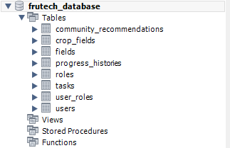
</div>

* Bounded Context Field (Core) en la base de datos
<div align=center>

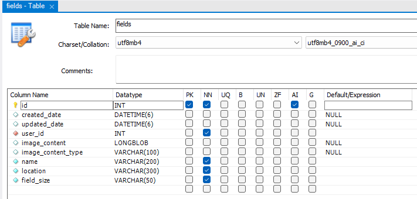
</div>

Dentro de la ejecución de este sprint tambien se debio añadira y modificar partes del Frontend para que coincida con la logica de negocios establecidas en el inicio, como pueba de esto se añadieron 2 nuevas secciones, el "Log in" o "Iniciar sesion" y "Register" o "Registrarse" siendo partes fundamentales para la ejecucion correcta

* Inicio de sesion en el Frontend
<div align=center>

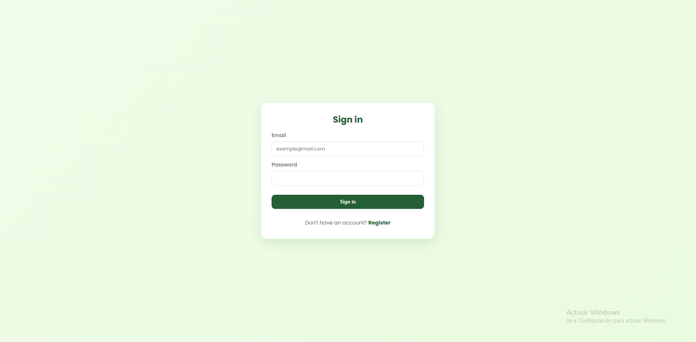
</div>


* Registro de usuario en el Frontend
<div align=center>

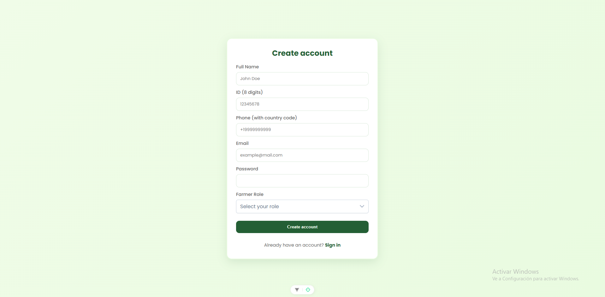
</div>

* Capturas del Backend reestructurado y ejecutandose
<div align=center>

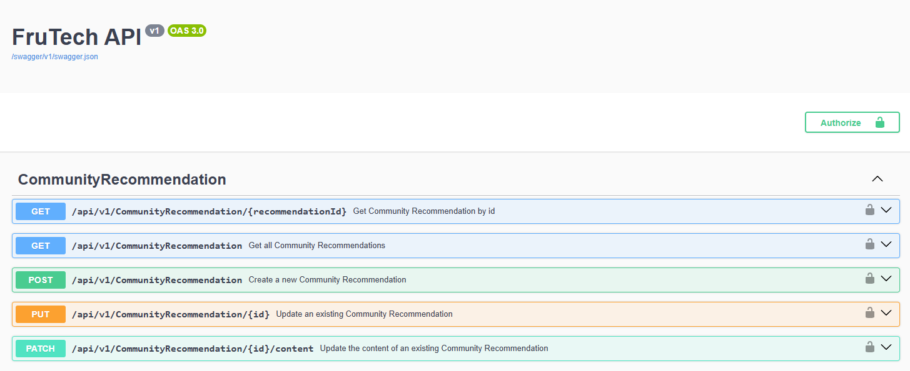
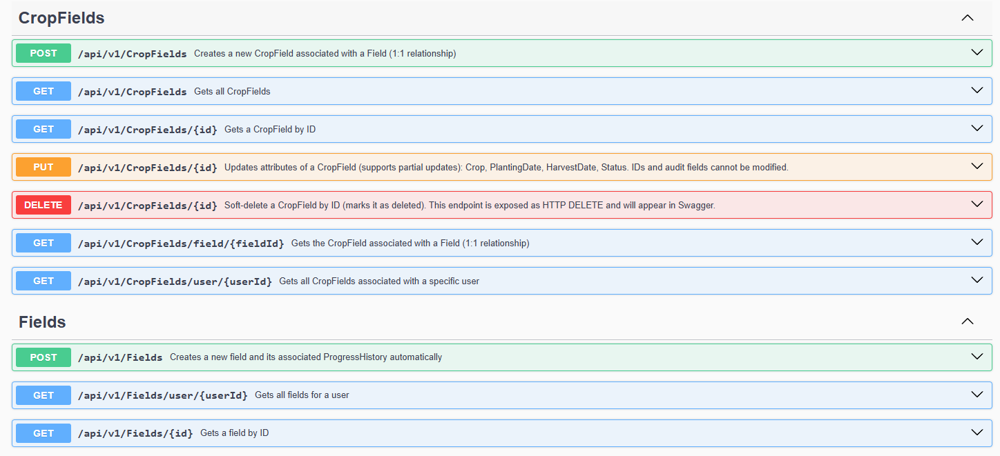
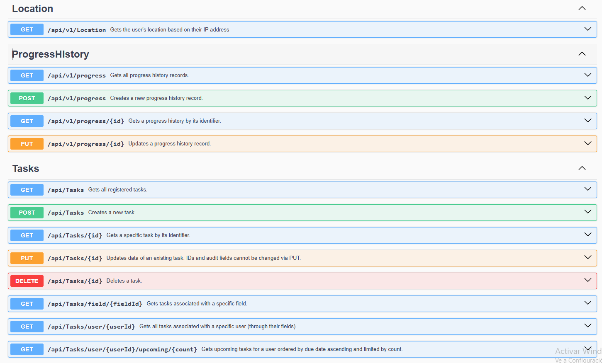
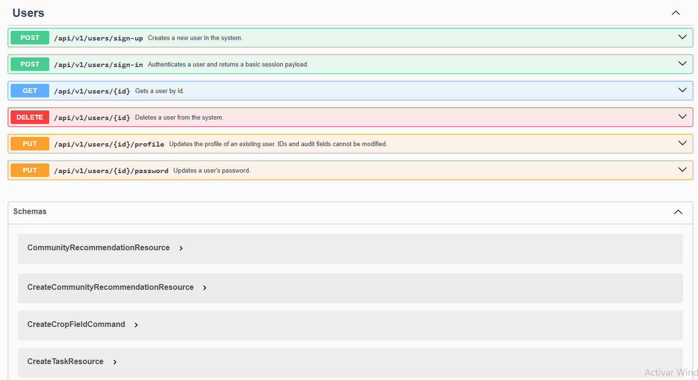
</div>

### 5.2.4.6. Services Documentation Evidence for Sprint Review

Durante este Sprint se realizó la conexión de ambos servicios (Frontend y Backend) y se realizaron las pruebas unitarias para validar su funcionamiento.

A continuación se presenta la documentación de ambos servicios:

**Backend en Rider**

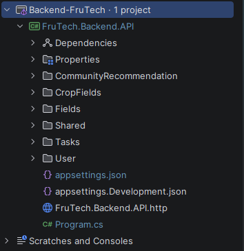
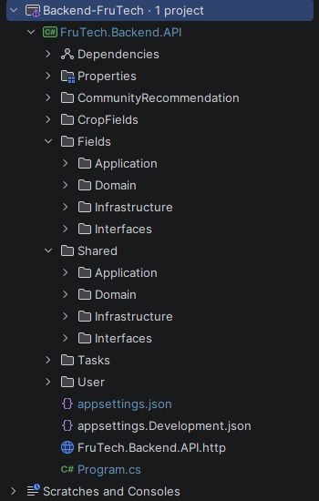

**Frontend en WebStorm**

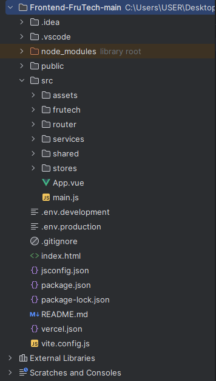
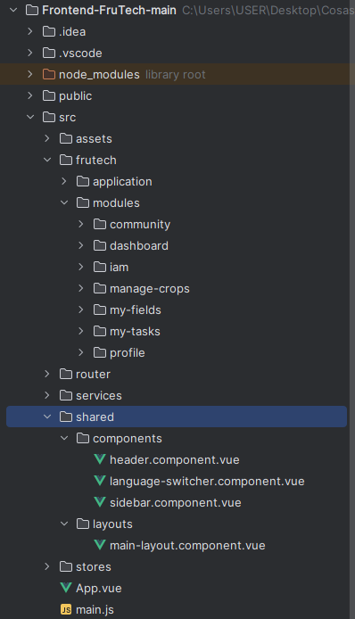

**API**

Todos los endpoints están organizados siguiendo la convención RESTful bajo la ruta /api/v1/ y están documentados según
contexto.

<br>

* Gestión de Usuarios (Users)

| HTTP Verb| Endpoint | Operation Id| Summary |
|----------|----------|-------------|---------|
| POST | /sign-up | SignUp | Creates a new user in the system. |
| POST | /sign-in | SignIn | Authenticates a user and returns a basic session payload. |
| GET | /{id} | GetUserById | Gets a user by id. |
| PUT | /{id}/profile | UpdateProfile | Updates the profile of an existing user. |
| PUT | /{id}/password | UpdatePassword | Updates a user's password. |
| DELETE | /{id} | Delete | Deletes a user from the system. |

* Recomendaciones de la Comunidad (Community Recommendation)

| HTTP Verb| Endpoint | Operation Id| Summary |
|----------|----------|-------------|---------|
| GET | /{recommendationId} | GetCommunityRecommendationById | Get Community Recommendation By Id. |
| GET | / | GetAllCommunityRecommendations | Get All Community Recommendations. |
| POST | / | CreateCommunityRecommendation | Create Community Recommendation. |
| PUT | /{id} | UpdateCommunityRecommendation | Update Community Recommendation. |
| PATCH | /{id}/content | UpdateCommunityRecommendationContent | Update Community Recommendation Content. |

* Gestión de Campos (Fields)

| HTTP Verb| Endpoint | Operation Id| Summary |
|----------|----------|-------------|---------|
| POST | / | CreateField | Creates a new field and its associated ProgressHistory automatically. |
| GET | /user/{userId} | GetFieldsByUserId | Gets all fields for a user. |
| GET | /{id} | GetFieldById | Gets a field by ID. |

* Cultivos en Campos (Crop Fields)

| HTTP Verb| Endpoint | Operation Id| Summary |
|----------|----------|-------------|---------|
| POST | / | CreateCropField | Creates a new CropField associated with a Field. |
| GET | / | GetAllCropFields | Gets all CropFields. |
| GET | /{id} | GetCropFieldById | Gets a CropField by ID. |
| GET | /field/{fieldId} | GetCropFieldByFieldId | Gets the CropField associated with a Field. |
| GET | /user/{userId} | GetCropFieldsByUserId | Gets all CropFields associated with a specific user. |
| PUT | /{id} | UpdateCropField | Updates attributes of a CropField. |
| DELETE | /{id} | DeleteCropField | Soft-delete a CropField by ID. |

* Historial de Progreso (Progress History)

| HTTP Verb| Endpoint | Operation Id| Summary |
|----------|----------|-------------|---------|
| GET | / | GetAll | Gets all progress history records. |
| GET | /{id} | GetById | Gets a progress history by its identifier. |
| POST | / | Create | Creates a new progress history record. |
| PUT | /{id} | Update | Updates a progress history record. |

* Tareas (Tasks)

| HTTP Verb| Endpoint | Operation Id| Summary |
|----------|----------|-------------|---------|
| GET | / | GetAllTasks | Gets all registered tasks. |
| GET | /{id} | GetTaskById | Gets a specific task by its identifier. |
| GET | /field/{fieldId} | GetTasksByField | Gets tasks associated with a specific field. |
| GET | /user/{userId} | GetTasksByUserId | Gets all tasks associated with a specific user. |
| GET | /user/{userId}/upcoming/{count} | GetUpcomingTasksByUser | Gets upcoming tasks for a user. |
| POST | / | CreateTask | Creates a new task. |
| PUT | /{id} | UpdateTask | Updates data of an existing task. |
| DELETE | /{id} | DeleteTask | Deletes a task. |

* Geolocalización (Location)

| HTTP Verb| Endpoint | Operation Id| Summary |
|----------|----------|-------------|---------|
| GET | / | GetLocation | Gets the user's location based on their IP address. |

### 5.2.4.7. Software Deployment Evidence for Sprint Review

Durante el Sprint 4, se logró desplegar exitosamente la API del Backend y el Frontend del proyecto CultivApp permitiendo el acceso público a los endpoints implementados y documentados.

Esta acción asegura que las funcionalidades desarrolladas estén accesibles para pruebas externas y validación del producto en un entorno de staging.

El despliegue incluye una instancia de servidor corriendo la aplicación .NET y una base de datos MySQL desplegada. 

Finalmente, luego de fusionar correctamente los metodos, se re-desplegó el frontend.

Archivos de configuracion clave

* Dockerfile: Utilizado para construir la imagen personalizada de la aplicación y facilitar el despliegue en Render.

Ahora se evidenciara el despliegue de todas las secciones del proyecto

* Despliegue de la base de datos realcional (MySQL) en TiDB

<div align=center>

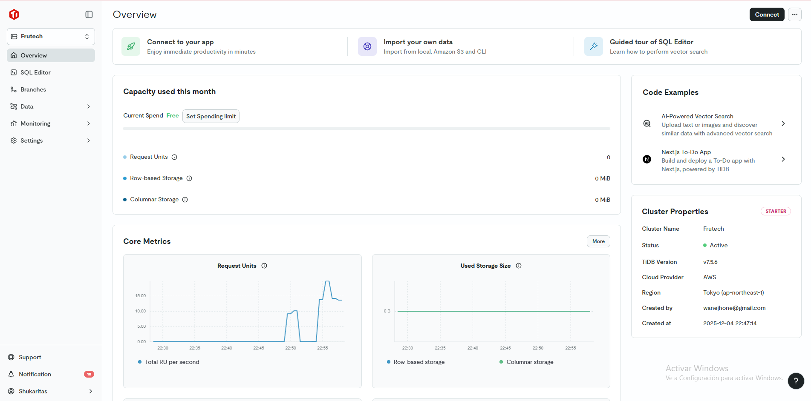
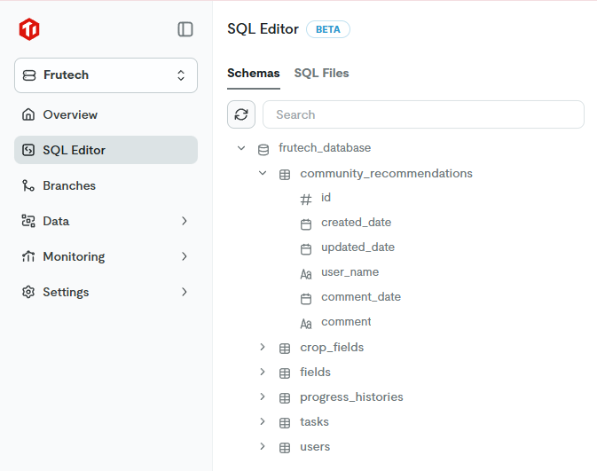
</div>

* Despliegue del Backend en Render

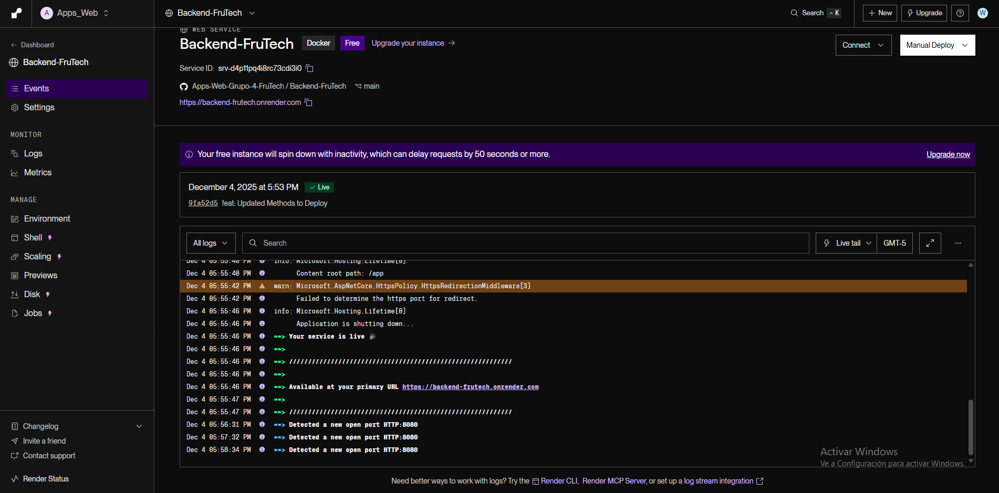


* Despliegue del Frontend en Vercel

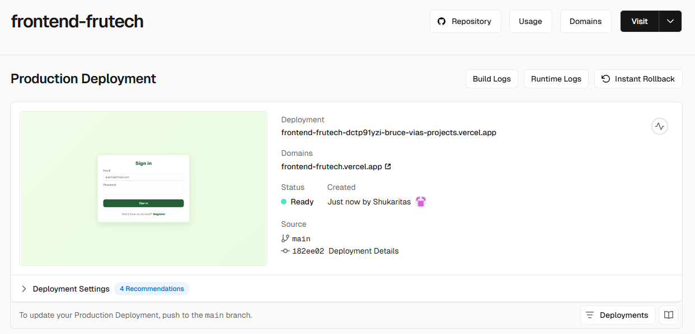

* Despliegue de la Landing Page

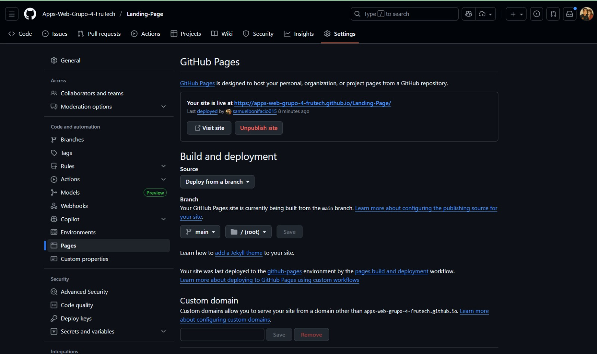

>Url de Desppliegue del Backend: https://backend-frutech.onrender.com/swagger/index.html 

>Url de Desppliegue del Frontend: https://frontend-frutech.vercel.app/ 

>Url de Desppliegue de la Landing Page: https://apps-web-grupo-4-frutech.github.io/Landing-Page/

### 5.2.4.8.Team Collaboration Insights during Sprint.
A continuación, se adjuntan las capturas de evidencia de los insights de los repositorios del informe y Landing Page para evidenciar la participación de todos los miembros:

* Colaboracion en el Backend

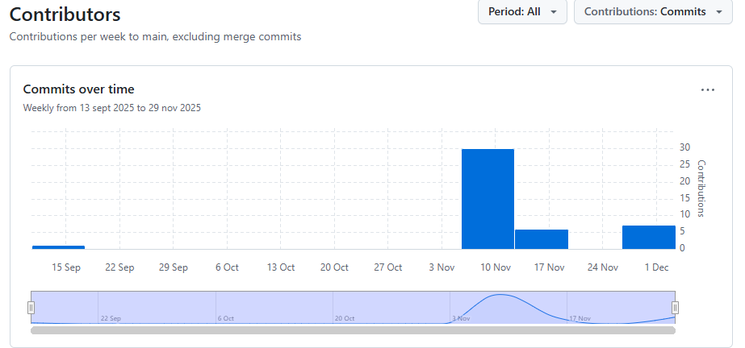
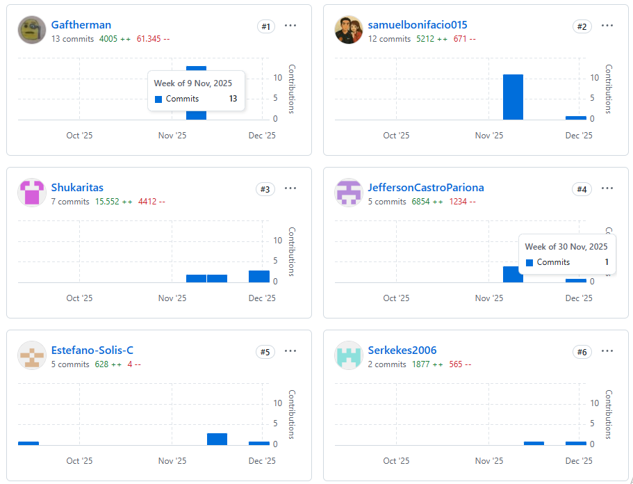

* Colaboracion en el Frontend

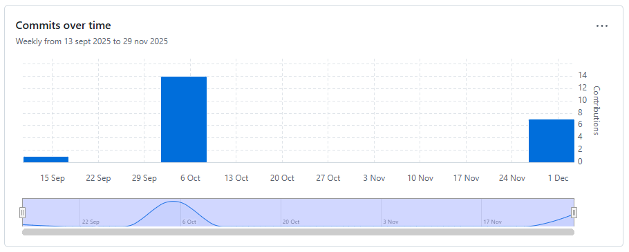
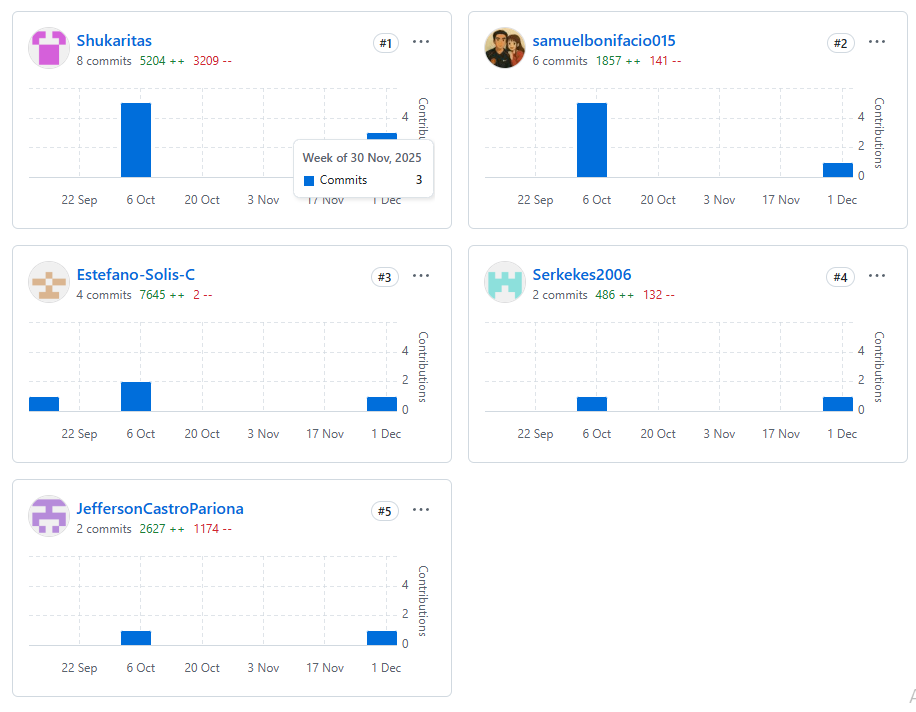

* Colaboracion en la Landing Page

# 5.3. Validation Interviews.

## 5.3.1. Diseño de Entrevistas.

**Preguntas para el Segmento #1: Agricultores de Pequeña Escala**

Estas preguntas se centran en la facilidad de uso, el valor inmediato y la barrera tecnológica, asumiendo que el usuario tiene acceso limitado a la tecnología y un enfoque en la producción familiar.

**Módulo: Primeras Impresiones y Panel de Control (Dashboard)**

- Al ver esta pantalla principal, ¿qué es lo más importante para usted? ¿Ver sus campos, sus tareas o las recomendaciones?

- ¿Le parece útil que la aplicación le muestre "Traeas proximas" o "Ultimas recomendaciones"? ¿Cómo manejaria este contenido?

- ¿Le parece fácil de entender esta pantalla, o ve demasiada información?

- ¿Qué tan importante es para usted poder cambiar el idioma de la aplicación entre inglés y español?

**Módulo: "Mis Campos" y "Gestionar Cultivos"**

- ¿Usted suele organizar su chacra por "campos" o la ve como una sola unidad?

- Al registrar un nuevo campo, ¿le parece útil añadir una foto, nombre y ubicación? ¿Sabe usted el tamaño exacto de su terreno (en hectáreas o m²)?

- Al ver los detalles de su campo, ¿qué datos le interesan más? ¿El "Tipo de Suelo", la "Luz solar" o la "Frecuencia de riego"? ¿Son datos que usted ya conoce?

- ¿Le ayudaría tener un registro de sus cultivos con sus fechas de siembra y cosecha? ¿Suele anotar esta información en algún lugar?

- La aplicación clasifica sus cultivos como "Saludable", "Atención" o "Crítico". ¿Le parece útil esta clasificación? ¿Qué haría usted si viera un cultivo en estado "Crítico"?

**Módulo: "Mis Tareas"**

- ¿Le gustaría recibir recordatorios en su celular para tareas como regar, fertilizar o revisar sus cultivos?

- ¿Le parece sencillo entrar aquí y marcar una tarea como "completada"?

- ¿Qué tipo de tareas le gustaría que la aplicación le recuerde?

**Módulo: "Comunidad"**

- ¿Usted suele pedir consejos a otros agricultores, vecinos o a un agrónomo?

- En esta sección, otros expertos (como "Científicos de Suelo" o "Especialistas en Riego") dan consejos. ¿Confiaría en estos consejos para aplicarlos en su chacra?

- ¿Le gustaría poder hacer preguntas y que otros agricultores o expertos le respondan?

**Módulo: "Perfil" y Configuración**

- Al crear su perfil, ¿le parece bien ingresar su nombre y número de celular? ¿Se sentiría cómodo ingresando su número de DNI?

**Preguntas para el Segmento #2: Agricultores de Mediana Escala (Comercial)**

Estas preguntas se centran en la eficiencia, la gestión de múltiples parcelas, la organización del trabajo y el valor comercial, asumiendo que el usuario maneja una operación más grande y tecnificada.

**Módulo: Primeras Impresiones y Panel de Control (Dashboard)**

- Al ver el "Panel de Control", ¿la información que se muestra (campos, tareas, recomendaciones) es suficiente para que usted planifique su día de trabajo?

- ¿Qué métrica o dato clave le gustaría ver en este panel que no está presente? (Ej. ¿Precios de mercado, resumen de costos, clima?)

- Vemos que el panel muestra "Tareas Próximas". ¿Esto es más valioso para usted o para sus trabajadores?

**Módulo: "Mis Campos" y "Gestionar Cultivos"**

- ¿Qué tan valioso es para usted poder ver todos sus campos en un mapa o lista, cada uno con su estado de salud (Saludable, Atención, Crítico)?

- Al registrar un nuevo campo, ¿qué tan importante es diferenciar "Ubicación" y "Tamaño del campo" para su gestión?

- En la página de "Detalle del Campo", ¿usa usted datos como "Tipo de Suelo", "frecuencia de riego (en litros)" y "horas de luz solar" para tomar decisiones?

- ¿Le gustaría poder añadir un historial de "Progreso" (riego, fertilización, pestes) más detallado? ¿Quizás con costos asociados?

- Al "Gestionar Cultivos", ¿la vista de tabla es la mejor forma de ver sus cultivos, o preferiría un calendario?

- ¿La información que se pide al registrar un nuevo cultivo (nombre, fechas, campo, estado) es suficiente para su control comercial? ¿Le faltaría registrar "Variedad", "Rendimiento esperado" o "Costo de siembra"?

**Módulo: "Mis Tareas"** 

- ¿Cómo gestiona actualmente las tareas de sus trabajadores? ¿Usa cuadernos, WhatsApp, o algún otro método?

- ¿Usaría esta sección de "Mis Tareas" para organizar el trabajo de su equipo?

- ¿Qué le faltaría a esta sección para serle realmente útil? (Ej. ¿Poder asignar una tarea a un trabajador específico? ¿Marcar una tarea como "Urgente"?)

**Módulo: "Comunidad"**

- ¿De dónde obtiene sus recomendaciones técnicas actualmente (proveedores de insumos, agrónomo privado, juntas de regantes)?

- Esta sección de "Comunidad" ofrece consejos de expertos. ¿Le parecen consejos generales o información técnica valiosa que podría aplicar para mejorar su rentabilidad?

- ¿Preferiría un foro público o un servicio de chat directo para consultar a un "Especialista en Riego" o un "Consultor de Plagas"?

**Módulo: "Perfil" y Configuración**

- En la sección "Perfil", ¿qué tan importante es para usted poder cambiar su contraseña y ver su información personal?

## 5.3.2. Registro de Entrevistas.

**User Persona del segmento objetivo #1: Agricultores de pequeña escala**

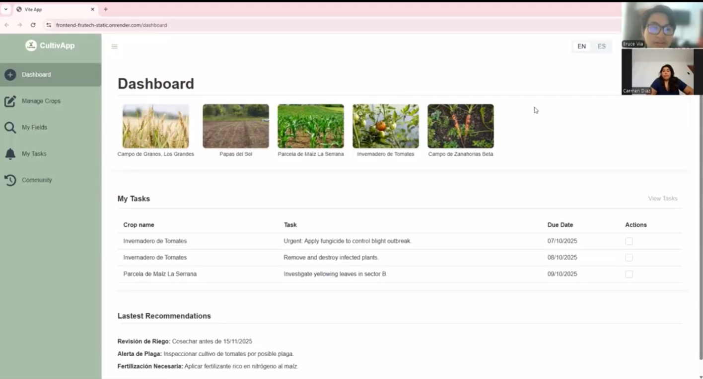

**Entrevistado(a):** Carmen Diaz

**Genero:** Femenino

**Edad:** 28 años

**Enlace de la entrevista (Drive):** [Enlace Entrevista 1](https://drive.google.com/file/d/1iGH5VZRln1pIRpLhEr5JzbHavKCWaZp-/view?usp=sharing)

**Resumen:** Carmen Diaz es una agriculta de nivel intermedio que simbra mayormente en su casa, fue entrevistada previamente para pensar en la idea de una startup como la que se le presentara a continuacion. Se destaco siemopre por intentar ver por el bienestar de sus cultivos en una zona como la ciudad y señalo como gracias a nustra aplicacion esto sera mucho mas facil y sobre todo tranquilo gracias a las funcionalidades que esta tiene.

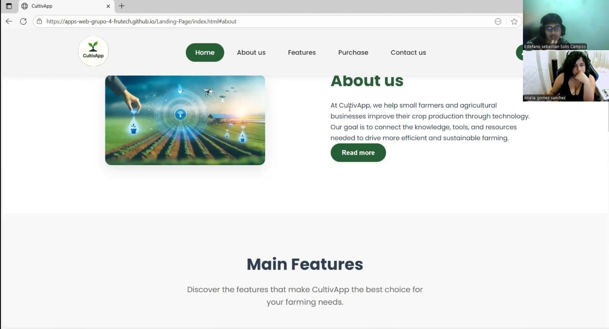

**Entrevistado(a):** Noelia Gómez Sánchez

**Genero:** Femenino

**Edad:** 25 años

**Enlace de la entrevista (Drive):** [Enlace Entrevista 2](https://drive.google.com/file/d/1UGsyV85vfoeMcjRewXvfqN1JweqLEJyJ/view?usp=sharing)

**Resumen:** Durante la demostración de "CultivApp", Noelia valida la utilidad del panel de control, destacando que el sistema de alertas y el semáforo de estados (Crítico/Saludable) son vitales para priorizar urgencias sin estar físicamente en el campo, aunque enfatiza que la interfaz debe estar en español para que su familia y trabajadores la entiendan. En cuanto a la gestión de terrenos, sugiere mejoras clave como el cálculo automático de insumos basado en las hectáreas exactas y valora la creación de un historial digital organizado por lotes que reemplace a los cuadernos físicos y hojas de cálculo, facilitando así el análisis de rentabilidad.

En cuanto a la operatividad diaria y la confianza, Noelia considera indispensable que las notificaciones de tareas se sincronicen con Google Calendar y solicita la función de adjuntar fotos al completar actividades (como evidencias de fumigación) para llevar un mejor control de costos. Muestra disposición para participar en la comunidad de la app siempre que la información provenga de agrónomos certificados y datos científicos, prefiriendo esto sobre consejos empíricos. Finalmente, expresa una fuerte preocupación por la privacidad al notar que el perfil solicita su DNI, indicando que desconfía de entregar datos sensibles en aplicaciones gratuitas a menos que sea estrictamente necesario para facturación formal.


**User Persona del Segmento objetivo #2: Agricultores de mediana escala**

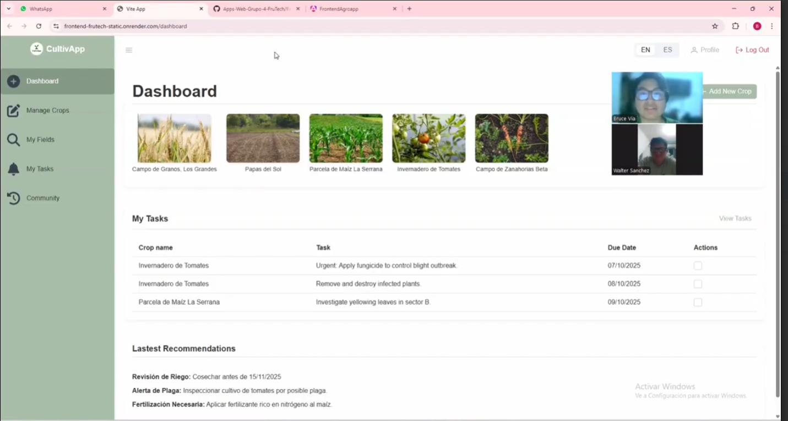

**Entrevistado(a):** Walter Sanchez

**Genero:** Masculino

**Edad:** 52 años

**Enlace de la entrevista (Drive):** [Enlace Entrevista 1](https://drive.google.com/file/d/1zY895AOneKp07yA6Zz3DYqjk7uhfcfh4/view?usp=sharing)

**Resumen:** Walter Sanchez es ya un agricultor titulado y trabajador desde mas de 20 años, entrevistado previamente para presentarle la idea, hoy la prueba mediante nuestra aplicacion, permitiendole registrar cultivos y campos de cultivo para su trabajo. Se destaca en ser un referente en su area y como el trabajar en esto, pese a ser algo que le gusta tambien resulta ser dificil debido a que muchos procesos son obsoletos, lentos o simplemente tedioso luego de repetirse y señala como con la aplicacion al menos traera la digitalizacion de procesos y el como muchos trabjos que le costaban tiempo y esfuerzo seran mas faciles con nuestro producto.

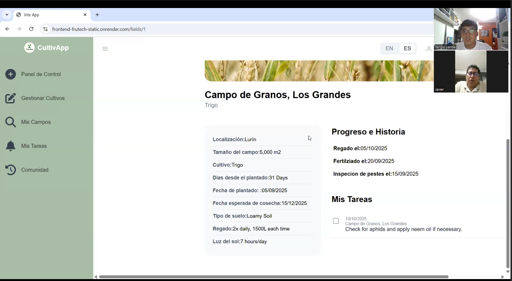

**Entrevistado(a):** Javier Landa

**Genero:** Masculino

**Edad:** 55 años

**Enlace de la entrevista (Drive):** [Enlace Entrevista 2](https://drive.google.com/file/d/1fjCNb1DV1eAWvgIRaIHvrII7yc1g-lOJ/view?usp=sharing)

**Resumen:** Este video presenta a Javier, un participante entrevistado previamente, mientras prueba la aplicación web "CultiApp" como parte del "segmento 2" de un proyecto final. La mayor parte del video es una demostración silenciosa de la aplicación, mostrando su "Panel de Control", la gestión de cultivos, los campos y las tareas. Esta grabación de pantalla sirve como contexto para la entrevista formal que comienza justo al final, donde el entrevistador, Sergio Landa, explica que el objetivo es evaluar la eficiencia de la aplicación y su valor comercial para un usuario que maneja una operación agrícola tecnificada.


## 5.3.3. Evaluaciones según heurísticas.

## **Site o App a evaluar**
**Nombre:** PlantE

*Objetivo:*  Detectar qué tan fácil o difícil resulta usar el sistema web de monitoreo y control de equipos de refrigeración, evaluándolo con las heurísticas de Nielsen para identificar fallas de usabilidad.

**Tareas a evaluar**

1. Ambigüedad en la terminología y las unidades de las temperaturas máximas.
2. Falta de retroalimentación visual prominente al seleccionar un elemento en el menú lateral.
3. La acción "Acknowledge (ACK)" aparece en alertas cuyo estado ya es "Resolved" o "Closed".
4. Etiquetado "5 puntos" en el filtro del gráfico de temperatura es poco claro.
5. Botones de acción principal (ej. "Equipment detail") están mal etiquetados, no indican la acción de creación.
6. Uso de identificadores internos ("e1", "s1", "t2") en las tablas principales de activos y alertas.
7. Las fechas y horas en los detalles de equipos se muestran en formato UTC/Z sin conversión a hora local.
8. Confusión visual entre campos editables y no editables en la sección de información de usuario.
9. Redundancia o falta de claridad en los filtros de la sección "My Service Requests".

**Problema Detectado**

| *\#* | *Problema* | *Escala de severidad* | *Heurística/Principio violada(o)* |
| :---- | :---- | :---- | :---- |
| ***1*** | *Ambigüedad en la terminología y las unidades de las temperaturas máximas.* | *3* | ***Visibility of System Status** / **Consistency and Standards*** |
| ***2*** | *Falta de retroalimentación visual prominente al seleccionar un elemento en el menú lateral.* | *2* | ***Visibility of System Status*** |
| ***3*** | *La acción "Acknowledge (ACK)" aparece en alertas cuyo estado ya es "Resolved" o "Closed".* | *3* | ***Error Prevention** / **Consistency and Standards*** |
| ***4*** | *Etiquetado "5 puntos" en el filtro del gráfico de temperatura es poco claro.* | *2* | ***Recognition Rather Than Recall** / **Aesthetic and Minimalist Design*** |
| ***5*** | *Botones de acción principal (ej. "Equipment detail") están mal etiquetados, no indican la acción de creación.* | *3* | ***Consistency and Standards** / **Match Between System and the Real World*** |
| ***6*** | *Uso de identificadores internos ("e1", "s1", "t2") en las tablas principales de alertas.* | *3* | ***Recognition Rather Than Recall** / **Match Between System and the Real World*** |
| ***7*** | *Las fechas y horas en los detalles de equipos se muestran en formato UTC/Z sin conversión a hora local.* | *4* | ***Match Between System and the Real World*** |
| ***8*** | *Confusión visual entre campos editables y no editables en la sección de información de usuario.* | *3* | ***Visibility of System Status** / **Aesthetic and Minimalist Design*** |
| ***9*** | *Redundancia o falta de claridad en los filtros de la sección "My Service Requests".* | *2* | ***Aesthetic and Minimalist Design** / **Flexibility and Efficiency of Use*** |

## **DESCRIPCIÓN DE PROBLEMAS:**

### **PROBLEMA \#1: Ambigüedad en la terminología y las unidades de las temperaturas máximas.**

---

**Severidad: 3 Heurística violada: Visibility of System Status / Consistency and Standards**

Problema: En el Dashboard, la sección superior derecha muestra "Max: 3.8°" y "Max: 4.3°". No hay una etiqueta que explique si estos son límites preconfigurados, los máximos históricos, o los máximos registrados en las últimas 24h. Esta falta de contexto clave impide al usuario entender el significado de estas métricas. Además, la unidad de temperatura usa ° en estos máximos, mientras que el promedio usa °C, mostrando una inconsistencia.

Recomendación: Etiquetar claramente los valores, por ejemplo, "Límite Alto" o "Máximo Histórico". Unificar el símbolo de temperatura a °C en toda la interfaz.

### **PROBLEMA \#2: Falta de retroalimentación visual prominente al seleccionar un elemento en el menú lateral.**

---

**Severidad: 2 Heurística violada: Visibility of System Status**

Problema: El elemento del menú lateral activo ("Equipments" en su vista) se indica con un sutil color de fondo azul que podría no ser lo suficientemente visible o contrastante para algunos usuarios. Esto dificulta la confirmación instantánea de la ubicación actual del usuario en la aplicación.

Recomendación: Reforzar la indicación del elemento activo. Sugerencia: Añadir un borde vertical (ej. una línea gruesa azul) al lado izquierdo del elemento seleccionado para un contraste más fuerte.

### **PROBLEMA \#3: La acción "Acknowledge (ACK)" aparece en alertas cuyo estado ya es "Resolved" o "Closed".**

**Severidad: 3 Heurística violada: Error Prevention / Consistency and Standards**

---

Problema: En la tabla "Recent Alerts" del Dashboard, se ofrece la acción "Acknowledge (ACK)" para alertas que ya tienen un estado de "Resolved" o "Closed". Lógicamente, no se requiere o no debería ser posible "reconocer" una alerta que el sistema ya considera finalizada. Esto genera confusión e impulsa acciones innecesarias.

Recomendación: Hacer que la columna ACTION sea contextual: debe desaparecer o cambiar a una opción como "View Log" o "View Details" cuando el Status sea finalizado.

### **PROBLEMA \#4: Etiquetado "5 puntos" en el filtro del gráfico de temperatura es poco claro.**

---

**Severidad: 2 Heurística violada: Recognition Rather Than Recall / Aesthetic and Minimalist Design**

Problema: El texto "5 pontos" sobre el gráfico de temperatura es técnico o está mal traducido/etiquetado. El usuario no puede saber fácilmente si se refiere a 5 sensores, 5 días, o la granularidad de los datos. Esto obliga al usuario a recordar su significado.

Recomendación: Utilizar una etiqueta clara y orientada al usuario, como "5 Sensores", "Granularidad" o el parámetro real que se esté filtrando.

### **PROBLEMA \#5: Botones de acción principal (ej. "Equipment detail") están mal etiquetados, no indican la acción de creación.**

---

**Severidad: 3 Heurística violada: Consistency and Standards / Match Between System and the Real World**

Problema: En las vistas de listas de activos (Sites y Equipments), el botón azul global en la esquina superior derecha está etiquetado como "Site detail" o "Equipment detail". Este etiquetado sugiere que llevará al detalle de un elemento seleccionado, cuando lo más probable es que su función principal sea agregar un nuevo activo. Esto es inconsistente con el estándar de UX de usar verbos de acción.

Recomendación: Cambiar la etiqueta del botón por un texto que indique la acción de creación, como "+ New Site" o "+ New Equipment". Si su función es realmente ver el detalle, esta acción debe estar en la fila del activo o deshabilitada si no hay selección.

### **PROBLEMA \#6: Uso de identificadores internos ("e1", "s1", "t2") en las tablas principales de activos y alertas.**

---

**Severidad: 3 Heurística violada: Recognition Rather Than Recall / Match Between System and the Real World**

Problema: La tabla de Alerts utiliza IDs del sistema como e1 (Equipment), s1 (Site) y t2 (Tenant). Estos IDs no son significativos para el usuario, obligándolo a recordar o consultar constantemente su significado. Esta abstracción aumenta la carga cognitiva y reduce la velocidad de comprensión del estado del sistema.

Recomendación: Reemplazar los IDs en las vistas de lista con los nombres reales de los activos (mostrar "Minimarket San Miguel" en lugar de s1, y el "Model" del equipo en lugar de e1).

### **PROBLEMA \#7: Las fechas y horas en los detalles de equipos se muestran en formato UTC/Z sin conversión a hora local.**

---

**Severidad: 4 Heurística violada: Match Between System and the Real World**

Problema: En la vista "Equipment detail", las fechas como 2025-09-21T14:10:00Z están en formato UTC. En un sistema de monitoreo, donde el tiempo es crítico, obligar al usuario a calcular la diferencia horaria manualmente para correlacionar eventos con la hora local es un error crítico que puede llevar a errores operacionales.

Recomendación: Implementar la conversión automática de todas las marcas de tiempo a la zona horaria local del usuario y mostrarlas en un formato legible (ej. DD/MM/AAAA HH:MM:SS).

### **PROBLEMA \#8: Confusión visual entre campos editables y no editables en la sección de información de usuario.**

---

**Severidad: 3 Heurística violada: Visibility of System Status / Aesthetic and Minimalist Design**

Problema: En la sección "User information" (Admin), la información de solo lectura (ej. Email, Register Date, Plans) se presenta dentro de cajas de texto de color gris, que visualmente son demasiado similares a los campos editables (cajas blancas). Esto añade desorden visual y hace que el usuario se pregunte qué campos puede modificar y cuáles no.

Recomendación: Los datos de sólo lectura deben mostrarse como texto plano (sin bordes ni sombreado de caja) para una clara diferenciación visual.

### **PROBLEMA \#9: Redundancia o falta de claridad en los filtros de la sección "My Service Requests".**

---

**Severidad: 2 Heurística violada: Aesthetic and Minimalist Design / Flexibility and Efficiency of Use**

Problema: En la sección "My Service Requests", los filtros están agrupados de forma redundante ("Filter by: ALL | Pending | Assigned | In progress | Done" y luego "ALL | Repair (Corrective) | Maintenance (Preventive)"). El doble uso de "ALL" es confuso. Además, el primer conjunto de filtros parece enfocarse en el Status, y el segundo en el Type, pero la repetición de "ALL" no es eficiente.

Recomendación: Fusionar los filtros en un único conjunto que permita seleccionar una opción de Status Y una opción de Type, o unificar el botón "ALL" si es un reset general de ambos filtros.


# 5.4. Video About-the-Product.

En esta sección, el equipo presenta un resumen de los aspectos más relevantes del video "About The Product –CultivApp". El video muestra en detalle las características principales de la aplicación, enfocándose en cómo cada funcionalidad ha sido diseñada para responder a las necesidades reales de los usuarios interesados en el cuidado de sus cultivos a mayor o menor escala.

A lo largo del video, se presentan demostraciones visuales de la aplicación en funcionamiento, incluyendo flujos clave como la creracion de los campos, la creacion de los cultivos, la vinculacion de estos y la creacion de tareas.

La narración guía al espectador a través de la experiencia del usuario, mientras que testimonios reales aportan valor, reflejando el impacto positivo que CultivApp ha tenido tanto en agricultores pequeños como en agricultores a mayor escala. Estos relatos destacan la facilidad de uso y el beneficiendo y mejorando el cuidado de los agricultores a sus cultivos.

Este video no solo presenta el producto, sino que lo contextualiza como una solución digital efectiva para un problema social, demostrando su utilidad, usabilidad e impacto.

**Cuadro Representativo del Video**


**Url del video:** https://drive.google.com/file/d/1HbL1P0xfdrvprUTJO9YlcpjOW9l0H1Cg/view?usp=sharing 

## Conclusion

- El desarrollo de CultivApp representa mucho más que un logro técnico; es el resultado de un esfuerzo colaborativo y riguroso por acercar la tecnología a las necesidades reales del sector agrícola peruano. A lo largo del proyecto, el equipo demostró madurez al integrar la investigación profunda de los usuarios con una ejecución ágil, logrando transformar una problemática compleja en una solución digital accesible, funcional y bien estructurada. Este trabajo final no solo evidencia la solidez de la arquitectura y el código implementado, sino que destaca la capacidad del grupo para trabajar con visión estratégica y compromiso social, entregando un producto que tiene el potencial real de generar un impacto positivo y sostenible en la comunidad.
---

### Video About-the-Team

En esta sección presentamos el video About The Team. Este documenta el proceso de desarrollo de la aplicación, mostrando imágenes y clips de sesiones reales de trabajo colaborativo entre los integrantes del equipo.

A través de una narración fluida, se explican las distintas etapas del proyecto: desde la ideación inicial de FruTech, pasando por las fases de diseño y desarrollo, hasta llegar a su implementación. Los testimonios de los miembros del equipo enriquecen la experiencia, detallando las tareas que cada uno desempeñó, los desafíos que enfrentaron y las soluciones implementadas.

Además, se destacan los logros alcanzados, como la integración de funcionalidades clave para facilitar la creacion de campos de cultivo, la colaboración con agricultores locales y la creación de una interfaz intuitiva y accesible para todos los usuarios.

**Cuadro Representativo del Video**

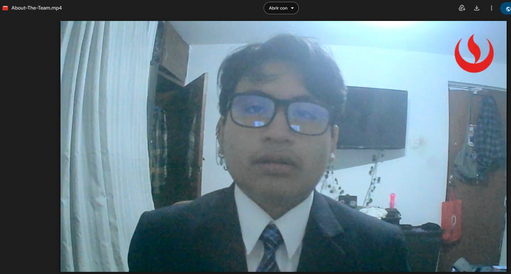

**Url del video:**

https://drive.google.com/file/d/1l6CxCV-PC2i4gESPqRtwXc3gITI3b6SV/view

---

## Bibliografía

1. **GitHub Inc.** (2024). *GitHub: Where the world builds software*. Recuperado de https://github.com/

2. **Node.js Foundation** (2024). *Node.js: JavaScript runtime built on Chrome's V8 JavaScript engine*. Recuperado de https://nodejs.org/

3. **Vue.js Team** (2024). *Vue.js - The Progressive JavaScript Framework*. Recuperado de https://vuejs.org/

4. **Microsoft Corporation** (2024). *Visual Studio Code: Code editing. Redefined*. Recuperado de https://code.visualstudio.com/

5. **JetBrains s.r.o.** (2024). *WebStorm: The smartest JavaScript IDE*. Recuperado de https://www.jetbrains.com/webstorm/

6. **Schwaber, K., & Sutherland, J.** (2020). *The Scrum Guide: The Definitive Guide to Scrum*. Recuperado de https://scrumguides.org/

7. **Beck, K., et al.** (2001). *Manifesto for Agile Software Development*. Recuperado de https://agilemanifesto.org/

8. **Atlassian Corporation** (2024). *Trello: Organize anything, together*. Recuperado de https://trello.com/

9. **Figma Inc.** (2024). *Figma: The collaborative interface design tool*. Recuperado de https://www.figma.com/

10. **Miro** (2024). *Miro: The visual workspace for innovation*. Recuperado de https://miro.com/


## Anexos

Repositorio de Github - CultivApp (FruTech) - Documento: 

https://github.com/Apps-Web-Grupo-4-FruTech/ReportFinalProject

Repositorio de Github - CultivApp (FruTech) - Landing Page:

https://github.com/Apps-Web-Grupo-4-FruTech/Landing-Page

Despliegue de Landing Page:

https://apps-web-grupo-4-frutech.github.io/Landing-Page/

Repositorio de Github - CultivApp (FruTech) - Frontend:

https://github.com/Apps-Web-Grupo-4-FruTech/Frontend-FruTech

Despliegue de Frontend:

https://frontend-frutech.vercel.app/

Repositorio de Github - CultivApp (FruTech) - Backend:

https://github.com/Apps-Web-Grupo-4-FruTech/Backend-FruTech

Despliegue de Backend:

https://backend-frutech.onrender.com/swagger/index.html

Documento de Presentacion - FruTech:

https://www.canva.com/design/DAG1W9lWTt4/7FePKDPl-tod08DSHVJt-Q/edit?utm_content=DAG1W9lWTt4&utm_campaign=designshare&utm_medium=link2&utm_source=sharebutton

Enlace Video About the Team:

https://drive.google.com/file/d/1l6CxCV-PC2i4gESPqRtwXc3gITI3b6SV/view?usp=drive_link 

Enlace Video About the Product:

https://drive.google.com/file/d/1HbL1P0xfdrvprUTJO9YlcpjOW9l0H1Cg/view?usp=sharing

Enlace de Api Externa:

https://ip-api.com/ 